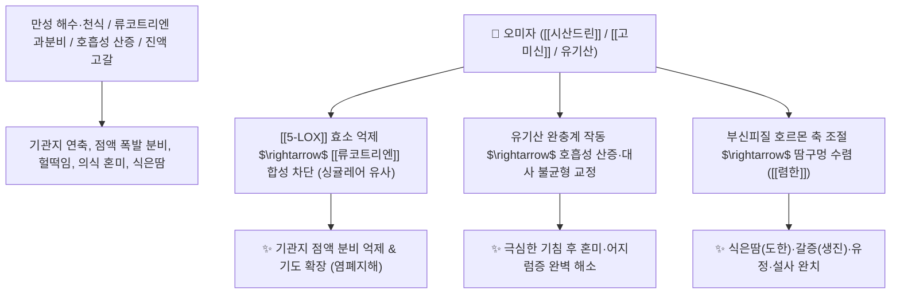

# 🌿 [[오미자]] (五味子, Schisandrae Fructus)

> **핵심 요약 (Key Summary)**:
> 오미자과(*Schisandraceae*) 오미자(*Schisandra chinensis*)의 잘 익은 열매
> 디벤조시클로옥타디엔 리그난인 [[시산드린]](Schisandrin)과 [[고미신]](Gomisin)이 [[5-LOX]] 효소를 억제하여 류코트리엔 생성을 차단하고 기도 과민성 및 산염기 불균형을 교정하여 염폐지해 및 생진 작용 발휘
> [[상한론]]의 해수·천식·호흡성 산증으로 인한 혼미 및 진액 고갈로 인한 구갈·식은땀(도한)·만성 설사·신허 유정을 치료하는 대표적인 [[수렴고삽]](收斂固澁)·[[염폐자신]](斂肺滋腎)·[[생진렴한]](生진斂汗) 군약(君藥)

---
## 📌 목차
1. [기본 본초 정보 & 화학 구조 (Pharmacognosy)](#1-기본-본초-정보--화학-구조-pharmacognosy)
2. [핵심 분자약리 기전 & 시산드린·5-LOX 억제·항천식 네트워크](#2-핵심-분자약리-기전--시산드린5-lox-억제항천식-네트워크)
3. [해부생체역학 / 기도 평활근 수축 & 호흡성 산증 완충 연계](#3-해부생체역학--기도-평활근-수축--호흡성-산증-완충-연계)
4. [사상의학 및 임상 응용 (태음인 산증 교정 & 싱귤레어 비교)](#4-사상의학-및-임상-응용-태음인-산증-교정--싱귤레어-비교)
5. [상한론 『약징(藥徵)』 분석 및 배오 원리 (생맥산 & 소청룡탕)](#5-상한론-약징藥徵-분석-및-배오-원리-생맥산--소청룡탕)
6. [핵심 처방 비교 매트릭스](#6-핵심-처방-비교-매트릭스)
7. [출처 및 학술 참고 문헌 (References)](#7-출처-및-학술-참고-문헌-references)

---
## 1. 기본 본초 정보 & 화학 구조 (Pharmacognosy)

| 항목 | 상세 내용 |
| :--- | :--- |
| **기원 식물** | 오미자과(Schisandraceae) 오미자 *Schisandra chinensis* (Turcz.) Baill.의 잘 익은 열매 |
| **성미 (性味)** | 酸·甘, 溫 |
| **귀경 (歸經)** | 肺·心·腎經 (폐경, 심경, 신경) - **폐기를 거두고 신수를 자양** |
| **효능 (Actions)** | [[수렴고삽]](收斂固澁), [[염폐자신]](斂肺滋腎), [[생진렴한]](生津斂汗), [[삽정지사]](澁精止瀉), [[영심안신]](寧心安神) |
| **주요 성분** | • **디벤조시클로옥타디엔 리그난(주성분)**: [[시산드린]] (Schisandrin / Schisandrol A, KP 규격 $\ge 0.40\%$), [[고미신]] (Gomisin A, C, N), 시산드린 B/C<br>• **유기산**: 시트르산, 사과산, 주석산, 푸마르산<br>• **정유 및 비타민**: 세스퀴카렌, 비타민 C, 비타민 E |

> **[유래 및 본초학적 기전]**:
> * 껍질은 시고(酸), 살은 달며(甘), 씨는 맵고(辛) 쓰며(苦), 전체적으로 짠맛(鹹)의 5가지 맛을 모두 갖추어 '오미자(五味子)'라 불립니다.
> * 흩어지고 새어나가는 폐기(肺氣)와 신정(腎精)을 단단하게 틀어막아 거두어들이는 **'수렴고삽의 대표 약재'**입니다.
> * 만성적인 기침으로 인해 발생하는 [[호흡성 산증]]과 [[대사성 알칼리증]]의 체액 불균형을 신맛의 유기산으로 완충시킵니다.

### 🔬 오미자의 주요 리그난 지표물질 및 천식 조절 화학 구조
![[오미자-20241015200556730.png|343]]
![[Pasted image 20240227144442.png|500]]
![[Pasted image 20240227144458.png|293]] ![[Pasted image 20240227144507.png|295]]
> **[구조적 특징 및 항류코트리엔 기전]**: [[시산드린]]과 [[고미신 A]]는 [[5-LOX]](5-Lipoxygenase) 효소를 차단하여 아라키돈산이 [[류코트리엔]](Leukotrienes)으로 전환되는 것을 억제하는 **'천연 싱귤레어(Montelukast)'** 역할을 수행합니다.

> 🧬 **현대 학술 근거 (2026-09-07 B-7 패치)** — PubChem 실측 분자 앵커: [[시산드린]](Schisandrin) CID **3001664** · 분자식 C₂₄H₃₂O₇ · MW 432.5 (KP 0.40% 규격 배치 확인) | [[시산드린 B]](Schisandrin B) CID **108130** · 분자식 C₂₃H₂₈O₆ · MW 400.5

🔬 **분자 구조** (Wikimedia Commons, Public Domain)

![[Schisandrin_B_구조.png|480]]
> [그림 1] 시산드린 B(Schisandrin B, C₂₃H₂₈O₆) 분자 구조 — 시산드린 단독 구조는 Commons 미확보 — 출처: Wikimedia Commons


---
## 2. 핵심 분자약리 기전 & 시산드린·5-LOX 억제·항천식 네트워크



### (1) 표적 염폐지해 및 항류코트리엔 작용
* **천식 기관지 수축 차단 및 거담 ([[염폐지해]] 斂肺止咳)**:
  * 류코트리엔 경로를 차단하여 기도 점막 부종을 가라앉히고 만성 폐쇄성 기침을 멎게 합니다.
* **호흡성 산증 교정 및 뇌 신경 안정**:
  * 지속적인 기침 발작으로 이산화탄소가 저류되어 머리가 멍하고 혼미해지는 산증을 신속히 교정합니다.
* **생진렴한(生津斂汗) 및 자양강장**:
  * 여름철 더위로 땀을 비 오듯 흘려 맥이 풀리고 기운이 고갈되었을 때 진액을 솟구치게 합니다 ([[생맥산]]).

> 🧬 **현대 학술 근거 (2026-09-07 B-7 패치)** — 5-LOX/류코트리엔 외의 현대 면역약리 축: LPS/담배 연기 유도 COPD 랫트에서 [[시산드린 B]]가 **TLR4에 직접 결합**(분자 도킹 실측)하여 NF-κB/JAK-STAT 신호와 대식세포 M1/M2 비율을 억제하고 폐 기능·혈액가스를 개선 — TLR4 녹다운 시 보호 효과가 역전되어 인과성이 확인됨(PMID 41456077). 소청룡탕·영감강미신하인탕 류의 COPD/천식 활용과 정합하는 연구 결과.

---
## 3. 해부생체역학 / 기도 평활근 수축 & 호흡성 산증 완충 연계

* **기관지 세기관지(Bronchiole) 평활근 긴장도 정상화**:
  * 만성 C-신경섬유 노출로 인한 기도 과민성 기침 반사를 억제합니다.

---
## 4. 사상의학 및 임상 응용 (태음인 산증 교정 & 싱귤레어 비교)

```
[✅ 최적 적응증 (Sweet Spot)]
• [[태음인]] 만성 기침 및 혼미: 숨이 차서 쌕쌕거리고 기침을 심하게 하여 머리가 멍하고 어지러운 경우 ([[영감강미신하인탕]])
• 여름철 기력 고갈: 땀을 과도하게 흘려 입이 바짝 마르고 맥이 가늘며 탈진한 상태 ([[생맥산]])
• 허로 도한 및 유정: 밤에 잘 때 식은땀이 축축하게 나고 정액이 새어나가는 경우
• 오경설(새벽 설사): 신양허로 새벽마다 배가 아파 설사하는 증상

[💡 오미자 + 건강 배오의 생리학적 이유]
• [[오미자]](수렴/산성 완충) + [[건강]](온중/장관 혈류) = 호흡성 산증과 대사성 알칼리증을 동시에 제어하는 폐-비장 황금 짝
```

> 🧬 **현대 학술 근거 (2026-09-07 B-7 패치)** — 간 보호 축 연구 결과: 옥살리플라틴 유도 간손상(DILI) 모델에서 시산드린 B가 **정식 KEAP1-Nrf2 경로**와 **장내미생물 의존 비정식 경로(L. reuteri 증식 → 리놀레산의 CLA 전환 → Nrf2 활성화)**의 이중 축을 통해 지질과산화·페롭토시스(ferroptosis)를 억제했고, Nrf2 결손·분변미생물이식(FMT) 실험으로 인과성이 검증됨(PMID 42624309) — 오미자 고유 성분-장-간 축(gut-liver crosstalk) 모델로, 항암 병용 시 간 보호 보조 활용 가능성을 시사하는 연구 결과.

---
## 5. 상한론 『약징(藥徵)』 분석 및 배오 원리 (생맥산 & 소청룡탕)

### (1) 『[[약징]]』에 나타난 오미자의 주치
> **"五味子 主治咳而冒也..."**  
> (오미자의 주치는 심하게 기침하면서 머리가 멍하고 눈앞이 아찔하며 혼미한 것(咳而冒)을 치료한다.)

* **핵심 배오 원리**:
  * [[오미자]] + [[인삼]] + [[맥문동]] $\rightarrow$ 기운을 돋우고 진액을 생성하는 여름철 최고 명방 ([[생맥산]])
  * [[오미자]] + [[건강]] + [[세신]] + [[마황]] $\rightarrow$ 폐한을 덥히며 흩어지는 폐기를 거두어 기침을 완치 ([[소청룡탕]])

> 🧬 **현대 학술 근거 (2026-09-07 B-7 패치)** — 생맥산 류의 항천식 실험 근거: 인삼-오미자 복합탕 연구에서 UHPLC-MS/MS로 리그난(시산드린 A·B, 시산드롤 A·B)과 진세노사이드를 동정하고, 네트워크 약리학으로 **STAT3·TNF·EGFR·IL1B·AKT1 및 PI3K/AKT 경로**를 핵심 표적으로 도출 — LPS 유도 A549 폐상피세포에서 IL-1β·IL-6·TNF-α 분비를 유의 억제(P<0.01)(PMID 39798886).

---
## 6. 핵심 처방 비교 매트릭스

| 처방명 | 구성 약재 | 주치 병증 및 임상 타깃 | 특징 및 감별점 |
| :--- | :--- | :--- | :--- |
| [[생맥산]] | [[인삼]], [[맥문동]], [[오미자]] | **서열상기, 대한출(땀 과다), 구갈, 맥허무력, 피로** | 기와 진액을 살려 맥을 뛰게 함 |
| [[소청룡탕]] | [[마황]], [[작약]], [[세신]], [[건강]], [[오미자]], [[반하]] 등 | **외한내음, 맑은 콧물, 가래 천식, 발열, 오한** | 한음 천식을 덥혀서 멎게 함 |
| [[영감강미신하인탕]] | [[복령]], [[감초]], [[건강]], [[오미자]], [[세신]], [[반하]], [[행인]] | **소청룡탕 후기, 가래 끓는 기침, 흉만, 호흡 곤란** | 폐를 덥히고 폐기를 수렴 |
| [[사신환]] | [[보골지]], [[육두구]], [[오수유]], [[오미자]] | **신양허 오경설(새벽 설사), 복통, 소화불량, 장명** | 신장을 덥혀 만성 설사 정지 |

---
## 7. 출처 및 학술 참고 문헌 (References)

1. **Ci, X., et al. (2010)**. Schisandrin B inhibits airway inflammation in a murine model of asthma. *International Immunopharmacology*, 10(7), 812-817.
   - **[연구 요약]**: 오미자의 시산드린 B가 기도 내 호산구 침윤과 5-LOX 매개 류코트리엔 생성을 차단하여 천식을 개선함을 입증.
2. **대한민국약전(KP) 제12개정 (2022)**. 의약품각조 제2부: 오미자 (Schisandrae Fructus) 규격 기준.
   - **[공정서 규격]**: 건조물 기준 시산드린($\text{C}_{24}\text{H}_{32}\text{O}_7$) 0.40% 이상 함유 필수 규격 명시.
3. **길익동동 (吉益東洞, 1784)**. 『약징(藥徵)』: 五味子 조문.
   - **[고전 원전]**: "五味子 主治咳而冒也" - 기침과 호흡성 혼미 주치 원리 제시.
4. **Li, X., Lv, B., & Wang, S. (2025)**. Investigating the therapeutic mechanism of Bufei Decoction in COPD: Schisandrin B targets the TLR4/NF-κB/JAK-STAT signaling pathway. *Hereditas*. PMID: 41456077 · DOI: 10.1186/s41065-025-00629-8
   - **[연구 요약]**: 시산드린 B의 TLR4 직접 결합 → NF-κB/JAK-STAT 억제·M1/M2 조절을 통한 COPD 개선 (인과성: TLR4 녹다운 역전).
5. **Huang, P., et al. (2026)**. Schisandrin B protects against oxaliplatin-induced liver injury by suppressing ferroptosis via the canonical KEAP1-Nrf2 and non-canonical microbiota-driven *Lactobacillus reuteri*-CLA-Nrf2 axes. *Pharmacological Research*. PMID: 42624309 · DOI: 10.1016/j.phrs.2026.108408
   - **[연구 요약]**: KEAP1-Nrf2 정식 + L. reuteri-CLA-Nrf2 비정식 이중 축으로 페롭토시스 억제 — 성분-장-간 crosstalk 간보호 모델.
6. **Zhou, T., et al. (2025)**. Network pharmacology prediction and molecular docking-based strategy to explore the potential mechanism of Ginseng-*Schisandra chinensis* decoction against asthma. *Fitoterapia*. PMID: 39798886 · DOI: 10.1016/j.fitote.2025.106388
   - **[연구 요약]**: 인삼-오미자 복합탕의 STAT3·TNF·EGFR·AKT1·PI3K/AKT 네트워크 및 A549 염증 사이토카인 억제 실험 근거.