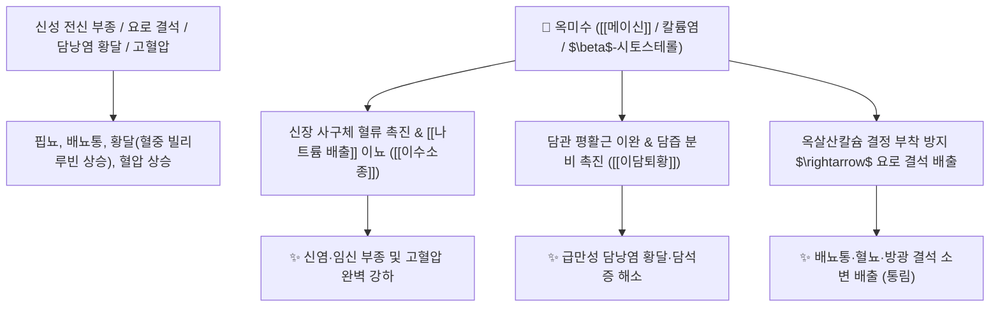

# 🌿 [[옥미수]] (玉米鬚, Maydis Stigma / 옥수수수염)

> **핵심 요약 (Key Summary)**:
> 벼과(*Poaceae*) 옥수수(*Zea mays*)의 암꽃 꽃술대(화주)와 암술머리(옥수수수염)
> 플라보노이드인 [[메이신]](Maysin)과 고농도 칼륨염이 신장 사구체 여과율을 높여 나트륨을 배출시키고 담즙 분비를 촉진하여 이수소종 및 이담퇴황 작용 발휘
> 습열(濕熱)로 인한 요로결석·급만성 방광염·신염 부종 및 간담 습열 황달·담석증·고혈압·소갈(당뇨병)을 치료하는 대표적인 [[이뇨통림]](利尿通淋)·[[이수소종]](利水消腫)·[[이담퇴황]](利膽退黃) 약재

---
## 📌 목차
1. [기본 본초 정보 & 화학 구조 (Pharmacognosy)](#1-기본-본초-정보--화학-구조-pharmacognosy)
2. [핵심 분자약리 기전 & 메이신·칼륨염 이뇨·이담 네트워크](#2-핵심-분자약리-기전--메이신칼륨염-이뇨이담-네트워크)
3. [해부생체역학 / 신장 세뇨관 나트륨 재흡수 & 담도 괄약근 연계](#3-해부생체역학--신장-세뇨관-나트륨-재흡수--담도-괄약근-연계)
4. [사상의학 및 임상 응용 (요로결석 vs 고혈압 부종 특화)](#4-사상의학-및-임상-응용-요로결석-vs-고혈압-부종-특화)
5. [고전 의학 및 배오 원리](#5-고전-의학-및-배오-원리)
6. [핵심 처방 비교 매트릭스](#6-핵심-처방-비교-매트릭스)
7. [출처 및 학술 참고 문헌 (References)](#7-출처-및-학술-참고-문헌-references)

---
## 1. 기본 본초 정보 & 화학 구조 (Pharmacognosy)

| 항목 | 상세 내용 |
| :--- | :--- |
| **기원 식물** | 벼과(Poaceae / Gramineae) 옥수수 *Zea mays* L.의 열매에 붙은 황갈색 암술대(옥수수수염) |
| **성미 (性味)** | 甘·淡, 平 |
| **귀경 (歸經)** | 膀胱·肝·膽經 (방광경, 간경, 담경) - **수도(水道)를 통리하고 담즙을 배출** |
| **효능 (Actions)** | [[이뇨통림]](利尿通淋), [[이수소종]](利水消腫), [[이담퇴황]](利膽退黃), [[강혈압]](降血壓), [[강혈당]](降血糖) |
| **주요 성분** | • **C-배당체 플라보노이드**: [[메이신]] (Maysin, 항비만/항산화), 이소오리엔틴, 루테올린 배당체<br>• **천연 무기염류**: 고농도 칼륨염($\text{K}^+$), 마그네슘<br>• **피토스테롤 및 비타민**: $\beta$-시토스테롤, 스티그마스테롤, 비타민 K |

> **[유래 및 본초학적 기전]**:
> * 옥수수(玉米) 이삭 끝에 수염(鬚)처럼 길게 늘어진 비단실 같은 꽃술대입니다.
> * 신장과 방광의 막힌 수기를 뚫어 요로에 낀 돌(결석)과 부종을 소변으로 밀어내고, 간과 담낭의 정체된 담즙을 씻어내어 황달을 치료합니다.
> * 체내 칼륨을 보존하면서 나트륨을 배출시키는 천연 이뇨제로 혈압과 혈당을 안정시킵니다.

### 🔬 옥미수의 주요 플라보노이드 지표물질 화학 구조
```
     [ 루테올린 골격 ]───C──[ 람노오스 유도체 사슬 ]  <-- 메이신 (Maysin)
```
> **[구조적 특징 및 이뇨 활성]**: [[메이신]]과 칼륨염 복합체는 신장 원위세뇨관의 $\text{Na}^+-\text{Cl}^-$ 공수송체를 억제하여 칼륨 손실 없는 안전한 수분 배출을 유도합니다.

---
## 2. 핵심 분자약리 기전 & 메이신·칼륨염 이뇨·이담 네트워크



### (1) 표적 이뇨소종 및 담즙 분비 촉진
* **요로 결석 및 방광염 치료 ([[이뇨통림]] 利尿通淋)**:
  * 요량을 급격히 늘리고 요로 상피의 염증성 부종을 가라앉혀 모래알 같은 결석을 씻어냅니다.
* **담즙 분비 및 황달 소산 ([[이담퇴황]] 利膽退黃)**:
  * 담즙의 점도를 낮추고 배출을 촉진하여 급성 간염 및 담낭염 환자의 황달을 빠르게 가라앉힙니다.
* **혈압 및 혈당 조절**:
  * 인슐린 감수성을 높이고 나트륨을 배출시켜 고혈압과 당뇨성 부종을 개선합니다.

---
## 3. 해부생체역학 / 신장 세뇨관 나트륨 재흡수 & 담도 괄약근 연계

* **오디 괄약근(Sphincter of Oddi) 이완**:
  * 담즙의 십이지장 배출 저항을 감소시켜 담석 정체를 해소합니다.

---
## 4. 사상의학 및 임상 응용 (요로결석 vs 고혈압 부종 특화)

```
[✅ 최적 적응증 (Sweet Spot)]
• 신염 및 심장성 부종: 몸이 붓고 소변이 잘 안 나오며 혈압이 높은 경우 ([[옥미수탕]])
• 요로결석 및 방광염: 소변을 볼 때 찌릿하게 아프고 붉은 소변이 나오는 상태
• 담석증 및 황달: 눈과 피부가 노랗고 우상복부가 결리는 간담 질환
• 당뇨병 환자의 부종 및 갈증

[💡 약선 차 활용 임상 팁]
• 옥수수수염을 보리나 결명자와 함께 끓인 차는 부작용 없는 천연 혈압·부종 조절 음료로 우수
```

---
## 5. 고전 의학 및 배오 원리

### (1) 부종과 결석을 씻어내는 배오
* **핵심 배오**:
  * [[옥미수]] + [[백모근]] + [[석위]] $\rightarrow$ 요로 결석과 혈뇨를 치료하는 명방
  * [[옥미수]] + [[인진호]] + [[치자]] $\rightarrow$ 간담 습열 황달을 배출

---
## 6. 핵심 처방 비교 매트릭스

| 처방명 | 구성 약재 | 주치 병증 및 임상 타깃 | 특징 및 감별점 |
| :--- | :--- | :--- | :--- |
| [[옥미수탕]] | [[옥미수]], [[백모근]], [[택사]], [[차전자]] | **급만성 신염 부종, 요로 감염, 핍뇨, 고혈압** | 신장 부종을 다스리는 대표방 |
| [[인진옥미탕]] | [[인진호]], [[옥미수]], [[산치자]], [[금전초]] | **습열 황달, 급만성 담낭염, 담석증, 흉협고만** | 담즙을 씻어내어 황달 퇴치 |
| [[옥미소갈음]] | [[옥미수]], [[천화분]], [[갈근]], [[황기]] | **소갈(당뇨병), 구갈, 다뇨, 신성 부종** | 혈당을 조절하고 진액 생성 |

---
## 7. 출처 및 학술 참고 문헌 (References)

1. **Wu XC et al. (2014)**. [Protective effect of polysaccharides extracts from corn silk against cyclophosphamide induced host damages in mice bearing H22 tumors]. *Zhong yao cai = Zhongyaocai = Journal of Chinese medicinal materials*, 37(10): 1833-6. [PMID: 25895394](https://pubmed.ncbi.nlm.nih.gov/25895394/)
   - **[연구 요약]**: 옥수수수염의 메이신 및 칼륨염이 강력한 이뇨, 항당뇨, 요로 결석 방어 및 항산화 활성을 나타냄을 종합 규명.
2. **대한민국약전(KP) 제12개정 (2022)**. 생약규격집: 옥미수 (Maydis Stigma) 규격 기준.
   - **[공정서 규격]**: 옥수수 암술대의 성상, 순도시험 및 건조감량 13.0% 이하 기준 명시.
