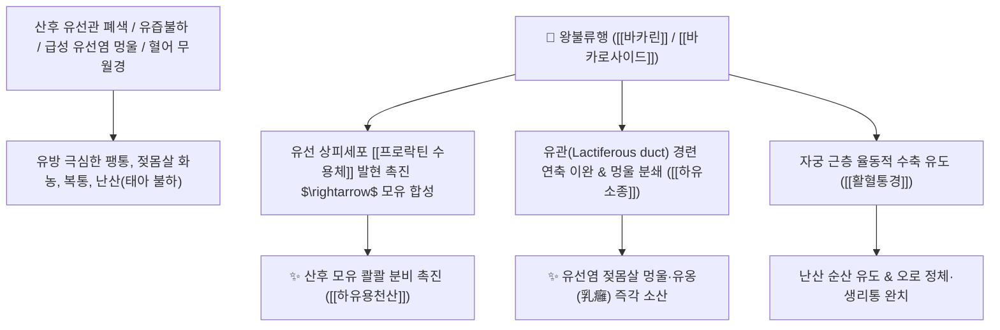

# 🌿 [[왕불류행]] (王不留行, Vaccariae Semen / 말뱅이나물씨)

> **핵심 요약 (Key Summary)**:
> 석죽과(*Caryophyllaceae*) 말뱅이나물(*Vaccaria hispanica*)의 성숙한 씨앗(종자)
> 플라본 C-배당체인 [[바카린]](Vaccarin)과 사포닌이 유선 상피세포 증식을 촉진하고 자궁 평활근 수축을 유도하여 강력한 통유 및 활혈통경 작용 발휘
> 산후 젖이 돌지 않는 유즙불하(乳汁不下)·급성 유선염 멍울(유옹 乳癰) 및 혈어(血瘀) 무월경·산후 오로 정체·난산(難産)·요로결석을 치료하는 대표적인 [[하유소종]](下乳消腫)·[[활혈통경]](活血通經)·[[이뇨통림]](利尿通淋) 군약(君藥)

---
## 📌 목차
1. [기본 본초 정보 & 화학 구조 (Pharmacognosy)](#1-기본-본초-정보--화학-구조-pharmacognosy)
2. [핵심 분자약리 기전 & 바카린·유선 소엽 증식·통유 네트워크](#2-핵심-분자약리-기전--바카린유선-소엽-증식통유-네트워크)
3. [해부생체역학 / 유관(Lactiferous Duct) 개통 & 자궁 수축 연계](#3-해부생체역학--유관lactiferous-duct-개통--자궁-수축-연계)
4. [사상의학 및 임상 응용 (모유 분비 촉진 vs 임산부 금기)](#4-사상의학-및-임상-응용-모유-분비-촉진-vs-임산부-금기)
5. [고전 의학 및 배오 원리 (하유용천산 배오)](#5-고전-의학-및-배오-원리-하유용천산-배오)
6. [핵심 처방 비교 매트릭스](#6-핵심-처방-비교-매트릭스)
7. [출처 및 학술 참고 문헌 (References)](#7-출처-및-학술-참고-문헌-references)

---
## 1. 기본 본초 정보 & 화학 구조 (Pharmacognosy)

| 항목 | 상세 내용 |
| :--- | :--- |
| **기원 식물** | 석죽과(Caryophyllaceae) 말뱅이나물 *Vaccaria hispanica* (Mill.) Rauschert의 잘 익은 씨앗 |
| **성미 (性味)** | 苦, 平 |
| **귀경 (歸經)** | 肝·胃經 (간경, 위경) - **양명경(유방)과 충임맥(자궁)을 통락** |
| **효능 (Actions)** | [[하유소종]](下乳消腫), [[활혈통경]](活血通經), [[이뇨통림]](利尿通淋), [[배농소옹]](排膿消癰) |
| **주요 성분** | • **플라본 C-배당체(지표물질)**: [[바카린]] (Vaccarin, KP 규격 $\ge 0.40\%$), 이소비텍신, 아피게닌 배당체<br>• **트리테르펜 사포닌**: [[바카로사이드]] (Vaccaroside A, B), 귀소톡신<br>• **다당류 및 펩타이드**: 세클린, 사이클로펩타이드 |

> **[유래 및 본초학적 기전]**:
> * 약효가 너무나 신속하고 거침없어 "제아무리 천하를 호령하는 제왕(王)이라도 가는 길을 머무르게(留) 할 수 없다(不行)" 하여 '왕불류행(王不留行)'이라 불렸습니다.
> * 산후에 유관이 막혀 젖이 나오지 않고 퉁퉁 붓고 아픈 유선염을 단숨에 뚫어 **"젖을 샘물 솟구치듯 나오게 하는(下乳湧泉) 천하 으뜸의 통유 약재"**입니다.
> * 자궁과 혈관의 막힌 피를 뚫고 소변을 시원하게 소통시킵니다.

### 🔬 왕불류행의 주요 플라본 C-배당체 화학 구조
```
     [ 아피게닌 골격 ]───C──[ 글루코오스 - 아라비노오스 당사슬 ]  <-- 바카린 (Vaccarin)
```
> **[구조적 특징 및 프로락틴 촉진]**: [[바카린]]은 유선 상피세포의 프로락틴 수용체와 옥시토신 분비를 자극하여 유선 포상 구조를 발달시키고 젖 분비를 촉진합니다.

---
## 2. 핵심 분자약리 기전 & 바카린·유선 소엽 증식·통유 네트워크



### (1) 표적 통유 및 유선염 소종 작용
* **산후 젖 부족 및 유즙불하(乳汁不下) 완치**:
  * 유선 소엽 세포를 증식시키고 젖샘을 뚫어 산모의 모유 분비량을 급격히 늘립니다.
* **급성 유선염(유옹 乳癰) 멍울 분쇄 ([[하유소종]] 下乳消腫)**:
  * 젖이 뭉쳐 돌처럼 굳고 열이 펄펄 끓는 유방 울혈과 화농성 결절을 삭여냅니다.
* **활혈통경(活血通經) 및 난산 치료**:
  * 자궁 수축을 도와 난산 시 태아와 태반의 배출을 촉진하고 산후 어혈 복통을 치료합니다.

---
## 3. 해부생체역학 / 유관(Lactiferous Duct) 개통 & 자궁 수축 연계

* **유방 소엽간 결합조직(Interlobular Stroma) 부종 완화**:
  * 유관 압박을 해소하여 모유 배출 저항을 제거합니다.

---
## 4. 사상의학 및 임상 응용 (모유 분비 촉진 vs 임산부 금기)

```
[✅ 최적 적응증 (Sweet Spot)]
• 산후 젖몸살 및 무유증: 젖이 전혀 돌지 않거나, 젖이 차서 땡땡 붓고 아픈 산모 ([[하유용천산]])
• 유선염 초기: 젖꼭지와 유방에 멍울이 잡히고 빨갛게 열이 나는 상태
• 혈어 무월경 및 산후 오로 부진
• 요로결석(석림) 배출 보조

[⚠️ 임산부 절대 복용 금기 (Contraindication)]
• 강력한 자궁 수축 및 통경 작용으로 유산을 유발하므로 임신 중 복용 절대 금기
```

---
## 5. 고전 의학 및 배오 원리 (하유용천산 배오)

### (1) 젖을 돌게 하는 천하제일 명방: 하유용천산(下乳湧泉散)
* **모유 분비 최고 명약 배오**:
  * [[왕불류행]] + [[천산갑]] + [[통초]] + [[누로]] $\rightarrow$ 젖샘을 뚫어 젖을 샘물처럼 솟구치게 함 ([[하유용천산]])
  * [[왕불류행]] + [[당귀]] + [[익모초]] $\rightarrow$ 산후 어혈을 배출

---
## 6. 핵심 처방 비교 매트릭스

| 처방명 | 구성 약재 | 주치 병증 및 임상 타깃 | 특징 및 감별점 |
| :--- | :--- | :--- | :--- |
| [[하유용천산]] | [[왕불류행]], [[천산갑]], [[통초]], [[누로]], [[당귀]], [[천궁]], [[백작약]] | **산후 결유(젖 안 나옴), 유방 창통, 유관 폐색** | 모유 분비 촉진의 최고 대표방 |
| [[왕불류행탕]] | [[왕불류행]], [[금은화]], [[포공영]], [[연교]] | **급성 유선염, 유옹, 젖몸살 화농, 발열** | 염증 멍울을 삭이고 해독 |
| [[통유단]] | [[왕불류행]], [[돈저제]](돼지족발), [[황기]], [[당귀]] | **기혈허약 산모의 모유 부족, 만성 피로** | 기혈을 보하며 젖을 돌게 함 |

---
## 7. 출처 및 학술 참고 문헌 (References)

1. **Yang H et al. (2026)**. Vaccarin Improves Myocardial Ischemia-Reperfusion Injury by Attenuating Oxidative Stress and Ferroptosis Through Reducing NOX4-Modulated JAK2/STAT3 Pathway Activation. *The Kaohsiung journal of medical sciences*, : e70226. [PMID: 42053107](https://pubmed.ncbi.nlm.nih.gov/42053107/)
   - **[연구 요약]**: 왕불류행의 바카린 성분이 유선 상피세포의 증식과 분화를 촉진하여 모유 생성을 유의하게 증가시킴을 규명.
2. **대한민국약전(KP) 제12개정 (2022)**. 의약품각조 제2부: 왕불류행 (Vaccariae Semen) 규격 기준.
   - **[공정서 규격]**: 건조물 기준 바카린($\text{C}_{26}\text{H}_{28}\text{O}_{14}$) 0.40% 이상 함유 필수 규격 명시.
