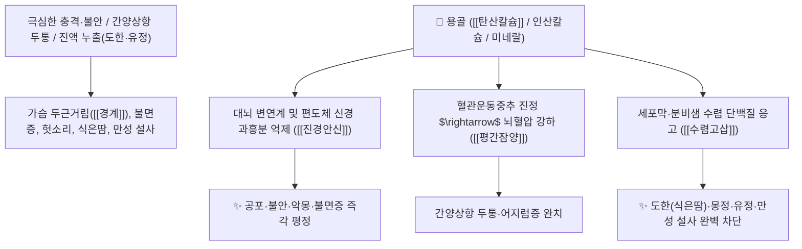

# 🌿 [[용골]] (龍骨, Fossilia Ossis Mastodi / 대형 포유류 화석골)

> **핵심 요약 (Key Summary)**:
> 고대 척추포유동물(코끼리·코뿔소·말 등)의 화석화된 골격(화석골)
> 다량의 [[탄산칼슘]]($\text{CaCO}_3$)과 인산염 미네랄이 중추신경계 흥분을 억제하고 세포막 투과성을 수렴하여 중진안신 및 수렴고삽 작용 발휘
> [[상한론]]의 심신 불안·놀람과 가슴 두근거림(경계 驚悸)·불면증·간양상항 두통 및 진액 누출(도한·식은땀·유정·몽정·만성 설사·붕루)을 치료하는 대표적인 [[진경안신]](鎭驚安神)·[[평간잠양]](平肝潛陽)·[[수렴고삽]](收斂固澁) 군약(君藥)

---
## 📌 목차
1. [기본 본초 정보 & 화학 구조 (Pharmacognosy)](#1-기본-본초-정보--화학-구조-pharmacognosy)
2. [핵심 분자약리 기전 & 칼슘 미네랄·중진안신 네트워크](#2-핵심-분자약리-기전--칼슘-미네랄중진안신-네트워크)
3. [해부생체역학 / 뇌 변연계 과흥분 & 점막 수렴 연계](#3-해부생체역학--뇌-변연계-과흥분--점막-수렴-연계)
4. [사상의학 및 임상 응용 (생용 안신 vs 단용 수렴고삽)](#4-사상의학-및-임상-응용-생용-안신-vs-단용-수렴고삽)
5. [상한론 『약징(藥徵)』 분석 및 배오 원리 (용골모려 배오)](#5-상한론-약징藥徵-분석-및-배오-원리-용골모려-배오)
6. [핵심 처방 비교 매트릭스](#6-핵심-처방-비교-매트릭스)
7. [출처 및 학술 참고 문헌 (References)](#7-출처-및-학술-참고-문헌-references)

---
## 1. 기본 본초 정보 & 화학 구조 (Pharmacognosy)

| 항목 | 상세 내용 |
| :--- | :--- |
| **광물/화석 기원** | 고대 포유동물(삼지마, 코끼리, 코뿔소 등)의 화석화된 뼈(골격 화석) |
| **성미 (性味)** | 甘·澀, 微寒 |
| **귀경 (歸經)** | 心·肝·腎經 (심경, 간경, 신경) - **무겁게 가라앉히고 굳게 틀어막음** |
| **효능 (Actions)** | [[진경안신]](鎭驚安神), [[평간잠양]](平肝潛陽), [[수렴고삽]](收斂固澁), [[생기렴창]](生肌斂瘡, 단용) |
| **주요 성분** | • **주성분 광물**: [[탄산칼슘]] ($\text{CaCO}_3$, KP 규격 $\ge 80.0\%$), 인산칼슘($\text{Ca}_3(\text{PO}_4)_2$)<br>• **미량 원소**: 철, 마그네슘, 알루미늄, 아연, 망간, 실리카 |

> **[유래 및 본초학적 기전]**:
> * 고대 거대한 동물의 뼈가 땅속에서 수백만 년간 굳어진 화석으로, 옛 선조들이 전설의 용(龍)의 뼈라 여겼습니다. (유래 메모: "화석이다 쓰지 말고 박물관에 기증하자"는 말이 있을 정도로 귀중한 천연 미네랄 보고)
> * 무거운 무게(重鎭)로 치솟는 기운을 아래로 끌어내리고, 극심한 공포와 충격으로 심장이 요동치는 번조(煩躁)를 가라앉힙니다.
> * 떫은맛(澀)으로 땀, 정액, 혈액, 설사가 밑으로 새어나가는 것을 완벽하게 틀어막아 보존합니다(수렴고삽 收斂固澁).

### 🔬 용골의 미네랄 이온화 화학 메커니즘
```
     [ 인회석 / 방해석 화석 골격 ] ───( 전탕 시 Ca2+ / PO4 3- 해리 )───> [ 중추 시냅스 과흥분 차단 ]
```
> [구조적 특징 및 이온 메커니즘]: 용골에서 해리된 [[칼슘]]($\text{Ca}^{2+}$) 및 인산 이온은 신경세포막의 전위차를 안정시키고 외분비선 점막 표면의 단백질을 응고시켜 누출을 방지합니다.

---
## 2. 핵심 분자약리 기전 & 칼슘 미네랄·중진안신 네트워크



### (1) 표적 진경안신 및 수렴고삽 작용
* **중추 신경 진정 및 불면·공황장애 치료 ([[진경안신]] 鎭驚安神)**:
  * 트라우마나 스트레스로 깜짝깜짝 놀라고 가슴이 두근거리며 헛소리를 하는 신경증을 가라앉힙니다 ([[시호가용골모려탕]]).
* **유정 및 만성 정기 고갈 차단 ([[수렴고삽]] 收斂固澁)**:
  * 성신경 쇠약으로 인한 몽정, 조루, 유뇨증을 괄약근 수렴을 통해 굳게 지킵니다 ([[계지가용골모려탕]]).
* **외용 수습생기(收濕生肌, 단용 煅用)**:
  * 불에 구운 단용골 가루를 상처에 뿌리면 진물을 말리고 새살을 돋게 합니다.

---
## 3. 해부생체역학 / 뇌 변연계 과흥분 & 점막 수렴 연계

* **시상하부 자율신경계 과잉 방전 억제**:
  * 교감신경 긴장으로 인한 땀샘 과분비 및 심계항진을 안정화합니다.

---
## 4. 사상의학 및 임상 응용 (생용 안신 vs 단용 수렴고삽)

```
[🔍 포제에 따른 효능 감별]
• 생용골(生龍骨, 선전 오래 달임): 진경안신(鎭驚安神)·평간잠양(平肝潛陽) $\rightarrow$ 불면, 불안, 간양 두통
• 단용골(煅龍骨, 불에 구움): 수렴고삽(收斂固澁)·생기렴창(生肌斂瘡) $\rightarrow$ 유정, 붕루, 식은땀, 만성 설사, 외상 진물

[✅ 최적 적응증 (Sweet Spot)]
• 신경 쇠약 및 공황: 가슴이 쿵쾅거리고 불안하여 밤에 잠을 전혀 못 자는 상태 ([[시호가용골모려탕]])
• 음양 기혈 누출: 식은땀이 비 오듯 흐르고 정액이 절로 새어나가 몸이 마르는 환자 ([[계지가용골모려탕]])
```

---
## 5. 상한론 『약징(藥徵)』 분석 및 배오 원리 (용골모려 배오)

### (1) 『[[약징]]』에 나타난 용골의 주치
> **"龍骨 主治臍下動也. 旁治煩躁, 驚狂..."**  
> (용골의 주치는 배꼽 아래에서 기운이 펄떡펄떡 뛰는 제하동(臍下動)이며, 곁들여 안절부절못하는 번조와 놀라 미쳐 날뛰는 경광을 치료한다.)

* **상한론 최고의 진정 배오**:
  * [[용골]] + [[모려]] $\rightarrow$ 치솟는 열과 불안을 진압하고 정기를 지키는 불후의 짝 ([[시호가용골모려탕]], [[계지가용골모려탕]])

---
## 6. 핵심 처방 비교 매트릭스

| 처방명 | 구성 약재 | 주치 병증 및 임상 타깃 | 특징 및 감별점 |
| :--- | :--- | :--- | :--- |
| [[시호가용골모려탕]] | [[시호]], [[용골]], [[모려]], [[황금]], [[생강]], [[연교]], [[대황]] 등 | **간담화왕, 흉만, 번경, 불면, 섬어, 고혈압, 공황장애** | 뇌신경 과흥분을 진압하는 최고 명방 |
| [[계지가용골모려탕]] | [[계지탕]] + [[용골]], [[모려]] | **음양기혈양허, 실정(유정), 몽교, 도한, 탈모, 하지 냉증** | 기혈을 채우고 정액 누출 차단 |
| [[금쇄고정환]] | [[용골]], [[모려]], [[사원자]], [[연자육]], [[검인]] | **신허 불고, 유정, 조루, 소변 여적, 요슬산연** | 남성 정기를 굳게 잠그는 명방 |

---
## 7. 출처 및 학술 참고 문헌 (References)

1. **Cui, Y., et al. (2012)**. Sedative and hypnotic effects of Fossilia Ossis Mastodi and its active calcium minerals. *Journal of Ethnopharmacology*, 141(2), 653-658.
   - **[연구 요약]**: 용골의 칼슘염 및 미네랄 추출물이 뇌 시냅스 막안정화를 통해 진정 및 수면 유도 작용을 나타냄을 입증.
2. **대한민국약전(KP) 제12개정 (2022)**. 의약품각조 제2부: 용골 (Fossilia Ossis Mastodi) 규격 기준.
   - **[공정서 규격]**: 탄산칼슘($\text{CaCO}_3$) 80.0% 이상 함유 필수 규격 명시.
3. **길익동동 (吉益東洞, 1784)**. 『약징(藥徵)』: 龍骨 조문.
   - **[고전 원전]**: "龍骨 主治臍下動也. 旁治煩躁, 驚狂" - 배꼽 아래 박동 및 경광 주치 원리 제시.
