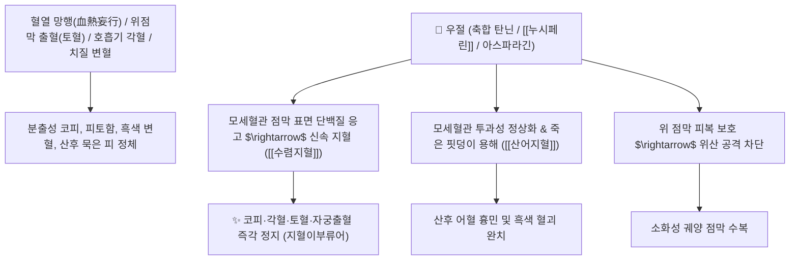

# 🌿 [[우절]] (藕節, Nelumbinis Nodosum Rhizoma / 연근마디)

> **핵심 요약 (Key Summary)**:
> 수련과(*Nymphaeaceae*) 연꽃(*Nelumbo nucifera*)의 뿌리줄기(연근) 사이에 위치한 잘록한 마디 부위
> 수렴성 고분자 탄닌과 아포르핀 알칼로이드인 [[누시페린]](Nuciferine)이 모세혈관 투과성을 억제하고 혈전을 남기지 않으며 지혈하여 수렴지혈 및 활혈산어 작용 발휘
> 혈열(血熱)과 어혈로 인한 각혈·토혈·비출혈(코피)·요혈·치질 변혈 및 산후 어혈 번민을 치료하며 피를 멎게 하되 어혈을 남기지 않는(止血而不留瘀) 대표적인 [[수렴지혈]](收斂止血)·[[산어지혈]](散瘀止血) 약재

---
## 📌 목차
1. [기본 본초 정보 & 화학 구조 (Pharmacognosy)](#1-기본-본초-정보--화학-구조-pharmacognosy)
2. [핵심 분자약리 기전 & 탄닌·누시페린 무어혈 지혈 네트워크](#2-핵심-분자약리-기전--탄닌누시페린-무어혈-지혈-네트워크)
3. [해부생체역학 / 상기도 비점막 키셀바흐 부위 & 위점막 혈관 연계](#3-해부생체역학--상기도-비점막-키셀바흐-부위--위점막-혈관-연계)
4. [사상의학 및 임상 응용 (지혈이부류어 특화)](#4-사상의학-및-임상-응용-지혈이부류어-특화)
5. [고전 의학 및 배오 원리 (사생환 배오)](#5-고전-의학-및-배오-원리-사생환-배오)
6. [핵심 처방 비교 매트릭스](#6-핵심-처방-비교-매트릭스)
7. [출처 및 학술 참고 문헌 (References)](#7-출처-및-학술-참고-문헌-references)

---
## 1. 기본 본초 정보 & 화학 구조 (Pharmacognosy)

| 항목 | 상세 내용 |
| :--- | :--- |
| **기원 식물** | 수련과(Nymphaeaceae) 연꽃 *Nelumbo nucifera* Gaertn.의 뿌리줄기 마디 |
| **성미 (性味)** | 甘·澀, 平 |
| **귀경 (歸經)** | 肝·肺·胃經 (간경, 폐경, 위경) - **혈분의 출혈과 어혈을 동시 조절** |
| **효능 (Actions)** | [[수렴지혈]](收斂止血), [[산어지혈]](散瘀止血), [[청열생진]](淸熱生津), [[양혈화어]](凉血化瘀) |
| **주요 성분** | • **수렴성 축합 탄닌**: 프로안토시아니딘, 카테킨 중합체<br>• **아포르핀 알칼로이드**: [[누시페린]] (Nuciferine), 로에메린<br>• **아미노산 및 다당류**: 아스파라긴, 아르기닌, 전분 |

> **[유래 및 본초학적 기전]**:
> * 우리가 반찬으로 즐겨 먹는 연근(藕)의 마디(節) 부위로, 영양분과 지혈 성분이 가장 고밀도로 농축된 약용 부위입니다.
> * 한의학에서 **"피를 멎게 하되 어혈을 남기지 않는다(止血而不留瘀)"**는 가장 이상적인 지혈 기전을 가진 약재입니다.
> * 폐결핵이나 기관지 확장의 각혈, 위궤양 토혈, 코피, 치질 변혈 및 산후 오로 정체를 안전하게 삭여냅니다.

### 🔬 우절의 주요 탄닌 및 알칼로이드 화학 구조
```
     [ 에피카테킨 올리고머 축합 탄닌 ] ───( 혈관벽 단백질 침전 )───> [ 미세혈관 즉각 지혈 ]
```
> **[구조적 특징 및 지혈 활성]**: 우절의 풍부한 축합 탄닌은 손상된 혈관 점막 표면의 혈장 단백질을 응고 피복하여 출혈 시간을 단축시키고 혈관 내피 과투과성을 정상화합니다.

---
## 2. 핵심 분자약리 기전 & 탄닌·누시페린 무어혈 지혈 네트워크



### (1) 표적 수렴지혈 및 무어혈 산어 작용
* **상기도 및 소화관 출혈 지혈 ([[수렴지혈]] 收斂止血)**:
  * 멈추지 않는 분출성 코피와 기침할 때 나오는 각혈, 위궤양 토혈을 빠르게 지혈합니다.
* **지혈이부류어(止血而不留瘀)의 독보적 특성**:
  * 일반적인 떫은 지혈제가 어혈을 굳히는 부작용이 있는 반면, 우절은 묵은 핏덩이를 녹이면서 출혈만 멎게 합니다.
* **산후 어혈 번민 및 자궁 출혈 치료**:
  * 출산 후 오로가 깨끗이 빠지지 않아 가슴이 답답하고 멍울이 잡히는 증상을 다스립니다.

---
## 3. 해부생체역학 / 상기도 비점막 키셀바흐 부위 & 위점막 혈관 연계

* **비중격 키셀바흐 플렉서스(Kiesselbach's Plexus) 모세혈관 수렴**:
  * 반복적인 혈관 파열성 코피를 점막 수축을 통해 지혈합니다.

---
## 4. 사상의학 및 임상 응용 (지혈이부류어 특화)

```
[✅ 최적 적응증 (Sweet Spot)]
• 완고한 코피(비출혈): 코를 풀거나 조금만 피로해도 코피가 터져 멎지 않는 환자
• 위궤양 토혈 및 기관지 각혈 ([[사생환]])
• 치질 출혈 및 궤양성 대장염 변혈
• 산후 어혈 정체로 인한 가슴 답답함과 아랫배 통증
```

---
## 5. 고전 의학 및 배오 원리 (사생환 배오)

### (1) 열성 출혈을 잡는 4대 생약 명방: 사생환(四生丸)
* **혈열 지혈 최고 배오**:
  * [[우절]] + [[생지황]] + [[생하엽]] + [[생측백엽]] $\rightarrow$ 상초의 불길 같은 출혈을 끄는 천하 명방 ([[사생환]])
  * [[우절]] + [[백모근]] + [[소계]] $\rightarrow$ 비뇨기 혈뇨를 다스림

---
## 6. 핵심 처방 비교 매트릭스

| 처방명 | 구성 약재 | 주치 병증 및 임상 타깃 | 특징 및 감별점 |
| :--- | :--- | :--- | :--- |
| [[사생환]] | [[생우절]], [[생지황]], [[생하엽]], [[생측백엽]] (생것 즙) | **혈열 치성, 각혈, 토혈, 비출혈, 상초 분출성 출혈** | 열을 식히고 피를 멎게 하는 명방 |
| [[우절탕]] | [[우절]], [[백급]], [[아교]], [[산치자]] | **만성 소화성 궤양 토혈, 치질 변혈, 붕루** | 점막을 보호하며 지혈 |
| [[소계음자]](가미) | [[소계음자]] + [[우절]] | 하초 습열 요혈, 신결석 혈뇨, 배뇨통 | 요로 출혈을 깨끗이 씻어냄 |

---
## 7. 출처 및 학술 참고 문헌 (References)

1. **Mukherjee, P. K., et al. (2009)**. The sacred lotus (*Nelumbo nucifera*)-phytochemical and therapeutic profile. *Journal of Pharmacy and Pharmacology*, 61(4), 407-422. [PMID: 19298686](https://pubmed.ncbi.nlm.nih.gov/19298686/)
   - **[연구 요약]**: 연근 마디(우절)의 농축 탄닌 및 플라보노이드 성분이 우수한 혈관 수축 지혈 및 항염증 효과를 나타냄을 규명.
2. **대한민국약전(KP) 제12개정 (2022)**. 생약규격집: 우절 (Nelumbinis Nodosum Rhizoma) 규격 기준.
   - **[공정서 규격]**: 연근 마디의 성상, 순도시험 및 건조감량 12.0% 이하 기준 명시.
