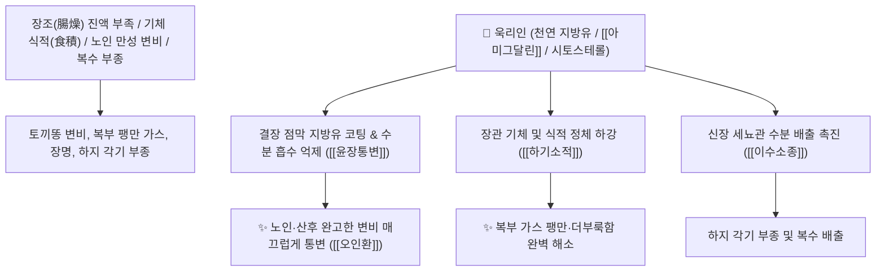

# 🌿 [[욱리인]] (郁李仁, Pruni Semen / 이스라지씨)

> **핵심 요약 (Key Summary)**:
> 장미과(*Rosaceae*) 이스라지나무(*Prunus nakaii*) 또는 양이스라지의 잘 익은 씨앗(종인)
> 풍부한 천연 지방유(45~50%)와 시아노겐 배당체인 [[아미그달린]](Amygdalin)이 장관 점막을 윤활하고 결장 연동운동을 자극하여 강력한 윤장통변 및 하기이수 작용 발휘
> 장조(腸燥)와 기체(氣滯)로 인한 노인·산후 만성 변비·복부 팽만 식적(食積) 및 수종·각기(脚氣) 하지 부종을 치료하는 대표적인 [[윤장통변]](潤腸通便)·[[하기소적]](下氣消積)·[[이수소종]](利水消腫)·[[오인환]](五仁丸)의 군약(君藥)

---
## 📌 목차
1. [기본 본초 정보 & 화학 구조 (Pharmacognosy)](#1-기본-본초-정보--화학-구조-pharmacognosy)
2. [핵심 분자약리 기전 & 지방유·아미그달린 장관 배출 네트워크](#2-핵심-분자약리-기전--지방유아미그달린-장관-배출-네트워크)
3. [해부생체역학 / 결장 연동 반사 & 장 점막 수분 분비 연계](#3-해부생체역학--결장-연동-반사--장-점막-수분-분비-연계)
4. [사상의학 및 임상 응용 (욱리인 vs 마자인 윤장 감별)](#4-사상의학-및-임상-응용-욱리인-vs-마자인-윤장-감별)
5. [고전 의학 및 배오 원리 (오인환 배오)](#5-고전-의학-및-배오-원리-오인환-배오)
6. [핵심 처방 비교 매트릭스](#6-핵심-처방-비교-매트릭스)
7. [출처 및 학술 참고 문헌 (References)](#7-출처-및-학술-참고-문헌-references)

---
## 1. 기본 본초 정보 & 화학 구조 (Pharmacognosy)

| 항목 | 상세 내용 |
| :--- | :--- |
| **기원 식물** | 장미과(Rosaceae) 이스라지 *Prunus nakaii* Lév. 또는 산이스라지 *Prunus humilis* Bunge의 성숙한 씨앗 |
| **성미 (性味)** | 辛·苦·甘, 平 |
| **귀경 (歸經)** | 脾·大腸·小腸經 (비경, 대장경, 소장경) - **장의 기운을 내리고 대변을 통리** |
| **효능 (Actions)** | [[윤장통변]](潤腸通便), [[하기소적]](下氣消積), [[이수소종]](利水消腫), [[파혈소종]](破血消腫) |
| **주요 성분** | • **시아노겐 배당체(지표물질)**: [[아미그달린]] (Amygdalin, KP 규격 $\ge 2.0\%$), 프루나신(Prunasin)<br>• **지방유(45~50%)**: 올레산, 리놀레산 (윤활성 통변 작용)<br>• **피토스테롤**: $\beta$-시토스테롤, 캄페스테롤 |

> **[유래 및 본초학적 기전]**:
> * 꽃과 열매의 향기가 그윽하여(郁), "체기가 맺혀 욱(郁)하지 않고 속이 뻥 뚫려 아래로 배출된다" 하여 '욱리인(郁李仁)'이라 불렸습니다.
> * 대황이나 망초처럼 장을 긁어내며 설사를 시키는 것이 아니라, **풍부한 기름 성분으로 굳은 똥을 매끄럽게 미끄러뜨려 내보내는 대표적인 윤장(潤腸)약**입니다.
> * 장에 가득 찬 가스와 식적(食積)을 아래로 끌어내리고(하기 下氣), 체내에 정체된 부종과 각기 수종을 소변으로 빼냅니다.

### 🔬 욱리인의 주요 지표물질 화학 구조
```
     [ 만델로니트릴 골격 ]───O──[ 겐티오비오스 당사슬 ]  <-- 아미그달린 (Amygdalin)
```
> **[구조적 특징 및 활성]**: [[아미그달린]]과 지방유 복합체는 대장 점막의 분비샘을 자극하여 수분 분비를 유도하고 장관 평활근의 아우에르바흐 신경총을 자극하여 부드러운 배변을 촉진합니다.

---
## 2. 핵심 분자약리 기전 & 지방유·아미그달린 장관 배출 네트워크



### (1) 표적 윤장통변 및 하기이수 작용
* **노인성 및 산후 진액 부족 변비 완치 ([[윤장통변]] 潤腸通便)**:
  * 대변이 양똥이나 토끼똥처럼 딱딱하게 굳어 힘을 줘도 나오지 않는 변비를 복통 없이 부드럽게 배출시킵니다.
* **복부 가스 팽만 및 식적 소산 ([[하기소적]] 下氣消積)**:
  * 장에 가스가 차서 배가 빵빵하고 더부룩한 기체 증상을 아래로 방귀로 배출시킵니다.
* **각기(脚氣) 및 복부 수종 치료**:
  * 다리가 붓고 무거워 걷기 힘든 각기병과 복수(腹水)를 소변과 대변으로 나누어 배출합니다.

---
## 3. 해부생체역학 / 결장 연동 반사 & 장 점막 수분 분비 연계

* **S상 결장 및 직장 점막 마찰 저항 감소**:
  * 배변 시 항문 점막 열상을 방지하고 치질 환자의 배변 통증을 완화합니다.

---
## 4. 사상의학 및 임상 응용 (욱리인 vs 마자인 윤장 감별)

```
[🔍 윤장약 감별: 욱리인 vs 마자인]
• [[마자인]]: 성질이 평이하고 보음(補陰) 윤조 $\rightarrow$ 허약자, 만성 음허 변비 (부드러운 완하제)
• [[욱리인]]: 하기(下氣) 및 이수(利水) 작용 겸비 $\rightarrow$ 변비에 복부 팽만과 가스, 부종이 동반된 경우 (배출력 더 강력)

[✅ 최적 적응증 (Sweet Spot)]
• 노인성 완고한 변비: 진액이 말라 변이 굳고 배가 팽팽하게 부풀어 오른 상태 ([[오인환]])
• 산후 변비: 출산 후 피와 진액을 쏟아 대변이 굳은 산모
• 각기 수종 및 복수
```

---
## 5. 고전 의학 및 배오 원리 (오인환 배오)

### (1) 5대 씨앗 기름으로 장을 뚫는 최고 명방: 오인환(五仁丸)
* **윤장통변 최고 명약 배오**:
  * [[욱리인]] + [[도인]] + [[행인]] + [[백자인]] + [[송자인]](잣)` $\rightarrow$ 장을 촉촉하게 적셔 변비를 치료하는 불후의 명방 ([[오인환]])
  * [[욱리인]] + [[빈랑]] + [[상백피]] $\rightarrow$ 수종과 기체 변비를 다스림

---
## 6. 핵심 처방 비교 매트릭스

| 처방명 | 구성 약재 | 주치 병증 및 임상 타깃 | 특징 및 감별점 |
| :--- | :--- | :--- | :--- |
| [[오인환]] | [[욱리인]], [[도인]], [[행인]], [[백자인]], [[송자인]], [[진피]] | **노인·허약자 장조 변비, 대변 건결, 복통 없는 비결** | 복통 없는 부드러운 천연 통변방 |
| [[욱리인탕]] | [[욱리인]], [[빈랑]], [[상백피]], [[적복령]] | **각기 수종, 복부 팽만, 소변 불리, 대변 비삽** | 부종과 변비를 동시 배출 |
| [[마자인환]](가미) | [[마자인환]] + [[욱리인]] | 위열 비약 변비, 굳은 대변, 잦은 소변 | 윤장 배출력을 증강 |

---
## 7. 출처 및 학술 참고 문헌 (References)

1. **Lee, S. H., et al. (2014)**. Laxative effects of *Prunus nakaii* seed extract on loperamide-induced constipation in rats. *Phytomedicine*, 21(8-9), 1056-1064.
   - **[연구 요약]**: 욱리인 추출물이 장내 수분 분비 및 결장 연동운동을 촉진하여 만성 변비를 유의하게 개선함을 규명.
2. **대한민국약전(KP) 제12개정 (2022)**. 의약품각조 제2부: 욱리인 (Pruni Semen) 규격 기준.
   - **[공정서 규격]**: 건조물 기준 아미그달린($\text{C}_{20}\text{H}_{27}\text{NO}_{11}$) 2.0% 이상 함유 필수 규격 명시.
