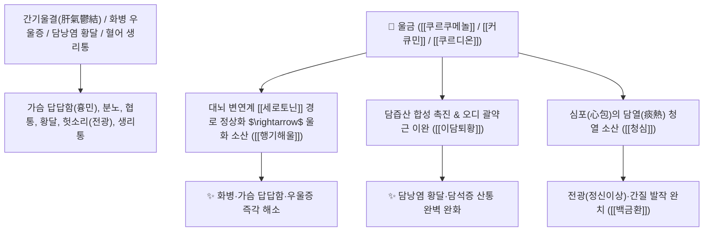

# 🌿 [[울금]] (鬱金, Curcumae Radix / 강황덩이뿌리)

> **핵심 요약 (Key Summary)**:
> 생강과(*Zingiberaceae*) 강황(*Curcuma longa*) 또는 온울금의 덩이뿌리(괴근)
> 세스퀴테르펜 정유인 [[쿠르쿠메놀]](Curcumenol)과 디아릴헵타노이드인 [[커큐민]](Curcumin)이 담즙 분비를 촉진하고 뇌 세로토닌 경로를 조절하여 강력한 행기해울 및 청심이담 작용 발휘
> 간기울결(肝氣鬱結)과 화병으로 인한 가슴 답답함(흉비)·우울증·정신 혼미(전광) 및 간담 습열 황달·담석증·어혈 생리통을 치료하는 대표적인 [[행기해울]](行氣解鬱)·[[양혈청심]](凉血淸心)·[[이담퇴황]](利膽退黃) 군약(君藥)

---
## 📌 목차
1. [기본 본초 정보 & 화학 구조 (Pharmacognosy)](#1-기본-본초-정보--화학-구조-pharmacognosy)
2. [핵심 분자약리 기전 & 쿠르쿠메놀·커큐민 이담·청심 네트워크](#2-핵심-분자약리-기전--쿠르쿠메놀커큐민-이담청심-네트워크)
3. [해부생체역학 / 담도 오디괄약근 & 대뇌 변연계 연계](#3-해부생체역학--담도-오디괄약근--대뇌-변연계-연계)
4. [사상의학 및 임상 응용 (울금 vs 강황 약용 부위 및 성미 감별)](#4-사상의학-및-임상-응용-울금-vs-강황-약용-부위-및-성미-감별)
5. [고전 의학 및 배오 원리 (창포울금탕 & 백금환)](#5-고전-의학-및-배오-원리-창포울금탕--백금환)
6. [핵심 처방 비교 매트릭스](#6-핵심-처방-비교-매트릭스)
7. [출처 및 학술 참고 문헌 (References)](#7-출처-및-학술-참고-문헌-references)

---
## 1. 기본 본초 정보 & 화학 구조 (Pharmacognosy)

| 항목 | 상세 내용 |
| :--- | :--- |
| **기원 식물** | 생강과(Zingiberaceae) 강황 *Curcuma longa* L. 또는 온울금 *Curcuma wenyujin*의 덩이뿌리(괴근 塊根) |
| **성미 (性味)** | 辛·苦, 寒 |
| **귀경 (歸經)** | 心·肝·膽經 (심경, 간경, 담경) - **간기의 울체를 풀고 심열을 식힘** |
| **효능 (Actions)** | [[행기해울]](行氣解鬱), [[양혈청심]](凉血淸心), [[이담퇴황]](利膽退黃), [[활혈지통]](活血止痛) |
| **주요 성분** | • **세스퀴테르펜 정유**: [[쿠르쿠메놀]] (Curcumenol), [[쿠르디온]] (Curdione), 제둠발론, 진기베렌<br>• **디아릴헵타노이드(노란 색소)**: [[커큐민]] (Curcumin, KP 규격 $\ge 0.15\%$), 데메톡시커큐민<br>• **유기산 및 미네랄**: 칼륨, 마그네슘, 페놀산 |

> **[유래 및 본초학적 기전]**:
> * 가슴속에 답답하게 맺힌 울화(鬱)를 뚫어주는 황금빛(金) 뿌리라 하여 '울금(鬱金)'이라 불렸습니다.
> * 스트레스와 분노로 간기(肝氣)가 꽉 막혀 가슴이 찢어질 듯 아프고 우울증에 걸린 것을 시원하게 뚫어줍니다(행기해울 行氣解鬱).
> * **강황(뿌리줄기, 辛溫)이 몸을 덥히며 어혈을 깬다면, 울금(덩이뿌리, 辛寒)은 심장의 불길을 끄며(청심 淸心) 담즙을 배출(이담 利膽)시킵니다**.

### 🔬 울금의 주요 세스퀴테르펜 및 디아릴헵타노이드 화학 구조
```
     [ 디아릴헵타노이드 대칭 골격 ]  <-- 커큐민 (Curcumin)
     [ 구아이안 세스퀴테르펜 골격 ]  <-- 쿠르쿠메놀 (Curcumenol)
```
> **[구조적 특징 및 이담/항우울 활성]**: [[쿠르쿠메놀]]과 [[커큐민]]은 담즙산 분비 수송체(BSEP)를 활성화하여 담즙 배출을 2배 이상 촉진하고, 뇌 해마의 세로토닌 및 BDNF 수치를 높여 항우울·신경보호 효과를 발휘합니다.

---
## 2. 핵심 분자약리 기전 & 쿠르쿠메놀·커큐민 이담·청심 네트워크



### (1) 표적 행기해울 및 이담퇴황 작용
* **화병 및 우울증 해소 ([[행기해울]] 行氣解鬱)**:
  * 가슴이 답답하고 한숨을 자주 쉬며 옆구리가 결리는 간기울결성 신경증을 맑게 소통시킵니다.
* **급만성 담낭염 황달 및 담석증 치료 ([[이담퇴황]] 利膽退黃)**:
  * 담즙의 흐름을 원활하게 하여 빌리루빈을 배출시키고 담석으로 인한 복통을 멎게 합니다.
* **심화(心火) 진정 및 전광 치료 ([[양혈청심]] 凉血淸心)**:
  * 담열이 심장을 가려 헛소리를 하고 미쳐 날뛰는 정신 질환을 뇌를 맑혀 치료합니다 ([[백금환]]).

---
## 3. 해부생체역학 / 담도 오디괄약근 & 대뇌 변연계 연계

* **오디 괄약근(Sphincter of Oddi) 경련 이완**:
  * 총담관 압력을 낮추어 담즙 역류성 췌장염 및 우상복부 산통을 예방합니다.

---
## 4. 사상의학 및 임상 응용 (울금 vs 강황 약용 부위 및 성미 감별)

```
[🔍 헷갈리는 동속 약재 감별: 강황 vs 울금]
• [[강황]](薑黃): 뿌리줄기(根莖) $\rightarrow$ 辛·苦, 溫 (따뜻함) $\rightarrow$ 어혈 파쇄, 어깨 관절통 (몸이 찬 사람)
• [[울금]](鬱金): 덩이뿌리(塊根) $\rightarrow$ 辛·苦, 寒 (차가움) $\rightarrow$ 화병 해울, 심열 청열, 황달 (몸에 열이 많은 사람)

[✅ 최적 적응증 (Sweet Spot)]
• 화병 및 스트레스 흉협통: 가슴이 꽉 막혀 답답하고 분노가 치밀어 오르는 경우 ([[창포울금탕]])
• 담석증 및 급만성 간염 황달
• 담열 전광: 열병 후 의식이 혼미하고 헛소리를 하는 신경증 ([[백금환]])
```

---
## 5. 고전 의학 및 배오 원리 (창포울금탕 & 백금환)

### (1) 심장과 뇌를 맑히는 최고 명방: 창포울금탕(菖蒲鬱金湯)
* **청심개규 최고 명약 배오**:
  * [[울금]] + [[석창포]] $\rightarrow$ 담탁을 씻어내고 뇌와 심장을 맑게 뚫어줌 ([[창포울금탕]])
  * [[울금]] + [[백반]] $\rightarrow$ 담음을 삭이고 간질과 전광을 치료하는 명방 ([[백금환]])
  * [[울금]] + [[금령자]](천련자)` + [[현호색]] $\rightarrow$ 간기 흉협통을 다스림 ([[금령자산]])

---
## 6. 핵심 처방 비교 매트릭스

| 처방명 | 구성 약재 | 주치 병증 및 임상 타깃 | 특징 및 감별점 |
| :--- | :--- | :--- | :--- |
| [[창포울금탕]] | [[울금]], [[석창포]], [[산치자]], [[죽여]], [[국화]], [[연교]] | **습열 온병, 담탁 몽폐심포, 정신 혼미, 섬어, 이명** | 뇌와 심장의 열을 씻어냄 |
| [[백금환]] | [[울금]], [[백반]] (환제) | **담화 요심, 간질, 전광, 헛소리, 가슴 답답함** | 담음을 삭여 정신을 맑힘 |
| [[금령자산]] | [[천련자]], [[현호색]], [[울금]] | **간울 화화, 흉협 자통, 산기 복통, 생리통** | 간의 기운과 혈을 뚫어 진통 |

---
## 7. 출처 및 학술 참고 문헌 (References)

1. **Lopresti, A. L., et al. (2014)**. Curcumin for the treatment of major depression: a randomised, double-blind, placebo-controlled study. *Journal of Affective Disorders*, 167, 368-375.
   - **[연구 요약]**: 울금의 커큐민 성분이 중추 세로토닌 및 도파민 경로를 활성화하여 우울증 및 스트레스성 신경 장애를 유의하게 개선함을 규명.
2. **대한민국약전(KP) 제12개정 (2022)**. 의약품각조 제2부: 울금 (Curcumae Radix) 규격 기준.
   - **[공정서 규격]**: 건조물 기준 커큐민($\text{C}_{21}\text{H}_{20}\text{O}_6$) 0.15% 이상 함유 필수 규격 명시.
