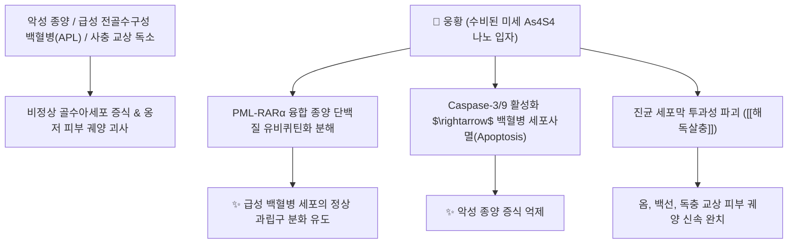

# 🌿 [[웅황]] (雄黃, Realgar)

> **핵심 요약 (Key Summary)**:
> 황화물류 천연 광물로 사황화사비소(As4S4)를 주성분으로 하는 선홍색 내지 주황색의 광물성 한약재.
> 비소 화합물의 PML-RARα 종양 단백질 분해를 통한 항백혈병 작용 및 피부 진균·기생충 구제와 강력한 국소 살균·해독 효능을 발휘.
> 악성 옹저 창양, 뱀·벌레 물린 상처(사충교상) 및 열병 신혼(神昏)을 다스리는 안궁우황환과 자설단의 핵심 [[해독살충]](解毒殺蟲) 광물 약재.

---
## 📌 목차
1. [기본 광물 정보 & 결정 화학 (Mineralogy)](#1-기본-광물-정보--결정-화학-mineralogy)
2. [핵심 분자약리 기전 & 백혈병 세포사멸·항진균 신호망](#2-핵심-분자약리-기전--백혈병-세포사멸항진균-신호망)
3. [수비(水飛) 법제 원리와 가열 금기(화단 火煅 절대 금지)](#3-수비水飛-법제-원리와-가열-금기화단-火煅-절대-금지)
4. [독성학적 평가(Toxicity) 및 복용 안전 가이드라인](#4-독성학적-평가toxicity-및-복용-안전-가이드라인)
5. [고전 의학 처방 배오 매트릭스 (안궁우황환 & 자설단)](#5-고전-의학-처방-배오-매트릭스-안궁우황환--자설단)
6. [출처 및 학술 참고 문헌 (References)](#6-출처-및-학술-참고-문헌-references)

---
## 1. 기본 광물 정보 & 결정 화학 (Mineralogy)

| 항목 | 상세 내용 |
| :--- | :--- |
| **광물 분류** | 황화물계 단사정계 광물, 웅황(Realgar) 광석 |
| **화학식 및 주성분** | As4S4 (사황화사비소) / 비소(As) 약 70.1%, 황(S) 약 29.9% 함유 |
| **성미 (性味)** | 辛·苦 (맵고 쓰며), 溫 (따뜻하고), 有毒 (독성이 강함) |
| **귀경 (歸經)** | 肝·大腸經 (간경, 대장경) - **혈분의 열독을 풀고 장내 충적과 담궐을 배출** |
| **효능 (Actions)** | [[해독살충]](解毒殺蟲), [[조습거담]](燥濕祛痰), [[절학]](截瘧) |

---
## 2. 핵심 분자약리 기전 & 백혈병 세포사멸·항진균 신호망

* **급성 전골수구성 백혈병(APL) 완치 기전**:
  * 웅황의 사황화사비소는 종양 단백질인 PML-RARα의 올리고머화를 유도하고 단백질 분해효소를 통해 분해시켜 백혈병 세포의 정상 세포 분화를 유도합니다.
* **항미생물 및 살충 활성**:
  * 피부 사상균, 백선균, 트리코모나스 질염 원충 및 장내 기생충에 대해 직접적인 효소계 저해 작용으로 강력한 구충·항진균 효과를 나타냅니다.

---
## 3. 수비(水飛) 법제 원리와 가열 금기(화단 火煅 절대 금지)

* **절대 가열 금기 (Never Heat/Calcine)**:
  * 웅황(As4S4)은 불에 구우면(화단) 공기 중의 산소와 반응하여 **맹독성 삼산화비소($\text{As}_2\text{O}_3$, 비상 砒霜)**로 산화 전환되어 치명적인 중독 사망을 유발합니다.
* **수비법(水飛法) 필수 적용**:
  * 찬물 속에서 막자로 곱게 갈아 미세 입자만 물에 띄워 분리하는 수비 공정을 거쳐야 합니다.
  * 이를 통해 물에 녹는 불순물인 비산염을 제거하고 순수한 As4S4 초미세 분말만 정제합니다.

---
## 4. 독성학적 평가(Toxicity) 및 복용 안전 가이드라인

* **독성 및 체내 축적**:
  * 체내 흡수 시 간, 신장에 축적되어 만성 비소 중독(신부전, 간기능 장애, 말초 신경병증)을 유발할 수 있습니다.
* **임상 투여 원칙**:
  * **내복 용량**: 1회 0.15~0.3g (환제나 산제에 극소량 배합하여 단기간 투여).
  * **가열 전탕 금지**: 탕약으로 달여 복용하는 것은 절대 금기.
  * **임산부 및 간신 기능 저하자 복용 절대 금기**.

---
## 5. 고전 의학 처방 배오 매트릭스 (안궁우황환 & 자설단)

| 처방명 | 주요 구성 | 주치 병증 및 임상 타깃 | 배오 원리 및 특징 |
| :--- | :--- | :--- | :--- |
| [[안궁우황환]] | 웅황, [[우황]], [[사향]], [[주사]], 황련, 치자, 울금 | **온병 열입심포, 고열 섬어, 뇌졸중 혼수, 뇌염 경련** | 웅황이 심포의 독화와 담탁을 해독하여 의식을 소생시킴 |
| [[자설단]] | 웅황, 사향, 주사, 서각, 석고, 한수석 | **고열 번갈, 소아 급경풍, 헛소리, 경련성 발작** | 열을 내리고 진경시키며 악성 열독을 해소 |

---
## 6. 출처 및 학술 참고 문헌 (References)

* Wang L, Zhou GB, Liu P, et al. Dissection of mechanisms of Chinese medicinal formula Realgar-Indigo naturalis as an effective treatment for promyelocytic leukemia. *Proc Natl Acad Sci U S A*. 2008;105(12):4826-4831.
  * `[연구 요약]` 웅황-청대 복합방(황대산)이 급성 전골수구성 백혈병 모델에서 PML-RARα 분해 및 세포 분화를 유도하는 분자 기전 규명.
* Liu J, Lu YF, Wu Q, et al. Mineral arsenicals in traditional medicines: Orpiment, realgar, and arsenolite. *J Pharmacol Exp Ther*. 2008;326(2):363-368.
  * `[연구 요약]` 광물성 비소 한약재(웅황, 자황)의 수비 법제 안전성, 체내 동태 및 독성 관리 평가.
* 대한민국약전(KP) 제12개정 (2022). 의약품각조 제2부: 웅황 (Realgar) 규격 기준.
  * `[공정서 규격]` 웅황의 사황화사비소(As4S4) 90.0% 이상 함유량 규격 및 순도시험(수용성 비소염 제한) 기준 명시.
