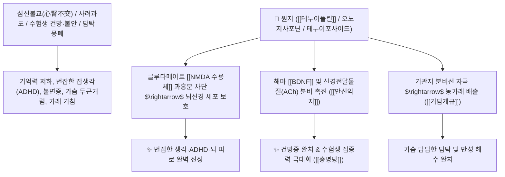

# 🌿 [[원지]] (遠志, Polygalae Radix / 원지뿌리)

> **핵심 요약 (Key Summary)**:
> 원지과(*Polygalaceae*) 원지(*Polygala tenuifolia*)의 건조한 뿌리
> 트리테르페노이드 사포닌인 [[테누이폴린]](Tenuifolin)과 올리고당 에스테르가 글루타메이트 [[NMDA 수용체]] 과흥분을 억제하고 뇌 유래 신경영양인자(BDNF)를 증가시켜 안신익지 및 거담개규 작용 발휘
> 심신불교(心腎不交)와 사려과도로 인한 건망증·수험생 ADHD·불면증·가슴 두근거림 및 담탁(痰濁)으로 막힌 정신 혼미·만성 가래 기침을 치료하는 대표적인 [[안신익지]](安神益智)·[[거담개규]](祛痰開竅)·[[총명탕]](聰明湯)의 군약(君藥)

---
## 📌 목차
1. [기본 본초 정보 & 화학 구조 (Pharmacognosy)](#1-기본-본초-정보--화학-구조-pharmacognosy)
2. [핵심 분자약리 기전 & 테누이폴린·NMDA 차단·뇌신경 재생 네트워크](#2-핵심-분자약리-기전--테누이폴린nmda-차단뇌신경-재생-네트워크)
3. [해부생체역학 / 뇌 해마 시냅스 가소성 & 기관지 점막 연계](#3-해부생체역학--뇌-해마-시냅스-가소성--기관지-점막-연계)
4. [사상의학 및 임상 응용 (태음인 신경증 vs 총명탕 수험생 특화)](#4-사상의학-및-임상-응용-태음인-신경증-vs-총명탕-수험생-특화)
5. [고전 의학 및 배오 원리 (총명탕 & 귀비탕 배오)](#5-고전-의학-및-배오-원리-총명탕--귀비탕-배오)
6. [핵심 처방 비교 매트릭스](#6-핵심-처방-비교-매트릭스)
7. [출처 및 학술 참고 문헌 (References)](#7-출처-및-학술-참고-문헌-references)

---
## 1. 기본 본초 정보 & 화학 구조 (Pharmacognosy)

| 항목 | 상세 내용 |
| :--- | :--- |
| **기원 식물** | 원지과(Polygalaceae) 원지 *Polygala tenuifolia* Willd.의 뿌리(목심을 제거한 것) |
| **성미 (性味)** | 苦·辛, 溫 (맵고 쓰며 역한 맛) |
| **귀경 (歸經)** | 心·腎·肺經 (심경, 신경, 폐경) - **심장과 신장을 소통시키고 뇌를 맑힘** |
| **효능 (Actions)** | [[안신익지]](安神益智), [[거담개규]](祛痰開竅), [[소옹소종]](消癰消腫), [[교태심신]](交泰心腎) |
| **주요 성분** | • **트리테르펜 사포닌(지표물질)**: [[테누이폴린]] (Tenuifolin, KP 규격 $\ge 1.0\%$), 오노지사포닌(Onjisaponin A~G)<br>• **페놀 배당체 및 에스테르**: 테누이포사이드(Tenuifoside A, B), 시나포산, 3,4,5-트리메톡시신남산<br>• **크산톤 화합물**: 폴리가락산톤 |

> **[유래 및 본초학적 기전]**:
> * 복용하면 "지혜가 생겨 뜻(志)을 멀리(遠) 세울 수 있다" 하여 '원지(遠志)'라 불렸습니다.
> * 심장과 신장이 서로 교류하지 못해(심신불교 心腎不交) 생각이 번잡하고 깜빡깜빡 잊어버리는 **건망증과 불면증, 수험생 잡생각(ADHD)을 다스리는 총명(聰明)의 대표 약재**입니다.
> * 가래(담음)가 뇌 신경의 구멍을 막아 멍해진 것을 뚫어주며(거담개규 祛痰開竅), 유방 종기와 옹종을 삭여냅니다.

### 🔬 원지의 주요 사포닌 지표물질 및 NMDA 수용체 차단 화학 구조
![[Pasted image 20250130174615-1.png|450]]
![[Pasted image 20240226002713.png|443]]
![[Pasted image 20250130175319-1.png|448]]
> [구조적 특징 및 신경 보호 기전]: [[테누이폴린]]은 과도한 글루타메이트에 의한 [[NMDA 수용체]] 과흥분을 차단하여 뇌 신경세포의 칼슘 독성을 막고, [[TNF-α]] 및 [[IL-1]] 염증성 발열 사이토카인을 억제하여 뇌 신경망을 보호합니다.

---
## 2. 핵심 분자약리 기전 & 테누이폴린·NMDA 차단·뇌신경 재생 네트워크



### (1) 표적 안신익지 및 거담개규 작용
* **건망증 치료 및 인지 기능 강화 ([[안신익지]] 安神益智)**:
  * 뇌 해마의 신경 시냅스를 강화하여 방금 들은 것도 돌아서면 잊어버리는 건망증과 치매 초기 증상을 개선합니다 ([[총명탕]]).
* **수험생 ADHD 및 번잡한 불면증 해소**:
  * 뇌 피질의 이상 흥분을 가라앉혀 생각이 너무 많아 잠을 못 자고 집중하지 못하는 상태를 평정합니다.
* **담탁(痰濁) 배출 및 기관지 청소 ([[거담개규]] 祛痰開竅)**:
  * 기관지 점막 분비를 촉진하여 끈적한 가래를 묽게 만들어 배출시키고 가슴의 답답함을 뚫어줍니다.

---
## 3. 해부생체역학 / 뇌 해마 시냅스 가소성 & 기관지 점막 연계

* **대뇌 변연계 해마(Hippocampus) 장기 강화(LTP) 촉진**:
  * 아세틸콜린 분해를 억제하여 단기 기억을 장기 기억으로 전환하는 능력을 극대화합니다.

---
## 4. 사상의학 및 임상 응용 (태음인 신경증 vs 총명탕 수험생 특화)

```
[✅ 체질별 적응증 (Sweet Spot)]
• [[태음인]] 신경증: 스트레스로 가슴이 답답하고 잠이 안 오며 머리가 멍하고 소화가 안 될 때 ([[조위승청탕]], [[청심연자탕]])
• 수험생 총명 처방: 머리가 맑지 못하고 공부에 집중이 안 되며 불안할 때 ([[총명탕]])
• 노인성 건망 및 허로 불면증 ([[귀비탕]], [[인삼양영탕]], [[자음건비탕]])

[⚠️ 포제 및 복용 수칙 (Safety)]
• 생원지는 인후를 자극하여 오심과 구토를 유발하므로 반드시 감초 달인 물에 담갔다가 볶아(감초수자 甘草水炙) 사용
• 맛이 대단히 역하므로 처방 구성 시 2g 내외로 조절하여 복약 순응도 유지
• 위궤양 및 위열(胃熱) 환자는 신중 투여
```

---
## 5. 고전 의학 및 배오 원리 (총명탕 & 귀비탕 배오)

### (1) 머리를 맑게 하는 천하제일 명방: 총명탕(聰明湯)
* **총명개규 최고 명약 배오**:
  * [[원지]] + [[석창포]] + [[백복신]] $\rightarrow$ 뇌의 막힌 구멍을 뚫고 기억력을 폭발시키는 불후의 명방 ([[총명탕]])
  * [[원지]] + [[산조인]] + [[용안육]] $\rightarrow$ 심비의 혈을 보하고 불면증을 완치 ([[귀비탕]])

---
## 6. 핵심 처방 비교 매트릭스

| 처방명 | 구성 약재 | 주치 병증 및 임상 타깃 | 특징 및 감별점 |
| :--- | :--- | :--- | :--- |
| [[총명탕]] | [[원지]], [[석창포]], [[백복신]] (동량) | **수험생 건망, 집중력 저하, 머리 무거움, 심계 불면** | 뇌 기능을 깨우는 대표 총명방 |
| [[귀비탕]] | [[원지]], [[용안육]], [[산조인]], [[인삼]], [[황기]], [[백출]], [[당귀]] | **사려과도, 심비양허, 불면, 건망, 식욕부진, 빈혈** | 정신과 신경 쇠약의 으뜸방 |
| [[조위승청탕]] | [[의이인]], [[건율]], [[나복자]], [[원지]], [[석창포]], [[산파두]] 등 | [[태음인]] **위완한증, 중풍 전조증, 건망, 흉민, 매핵기** | 태음인의 맑은 기운을 뇌로 올림 |
| [[인삼양영탕]] | [[사물탕]] + [[사군자탕]] + [[원지]], [[진피]], [[오미자]], [[육계]] | **대병 후 기혈양허, 만성 해수, 건망, 불면, 오한** | 노인성 허약과 수면 장애 보약 |

---
## 7. 출처 및 학술 참고 문헌 (References)

1. **Park, C. H., et al. (2012)**. Tenuifolin, an active constituent of *Polygala tenuifolia*, protects against neurotoxicity and improves memory. *Biomolecules & Therapeutics*, 20(3), 263-269.
   - **[연구 요약]**: 원지의 테누이폴린이 NMDA 매개 세포사멸을 억제하고 콜린성 신경망을 보호하여 인지 기능 및 기억력을 유의하게 향상시킴을 규명.
2. **대한민국약전(KP) 제12개정 (2022)**. 의약품각조 제2부: 원지 (Polygalae Radix) 규격 기준.
   - **[공정서 규격]**: 건조물 기준 테누이폴린($\text{C}_{36}\text{H}_{56}\text{O}_{12}$) 1.0% 이상 함유 필수 규격 명시.