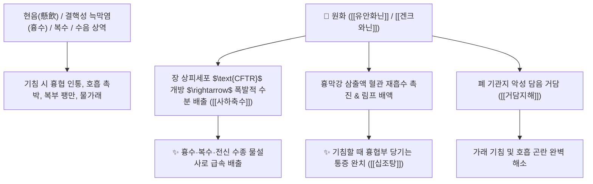

# 🌿 [[원화]] (芫花, Genkwa Flos / 팥꽃나무꽃봉오리)

> **핵심 요약 (Key Summary)**:
> 팥꽃나무과(*Thymelaeaceae*) 팥꽃나무(*Daphne genkwa*)의 건조한 꽃봉오리
> 극독성 디테르펜인 [[유안화닌]](Yuanhuacine)과 플라본인 [[겐크와닌]](Genkwanin)이 장 점막 분비를 폭발적으로 자극하여 강력한 사하축수 및 거담해수 작용 발휘
> [[상한론]] 삼초(三焦)와 흉협에 고인 악성 수음(흉수·결핵성 늑막염·복수)·기침할 때 가슴과 옆구리가 찢어지듯 당기는 통증(해타흉협통)을 치료하는 대표적인 [[사하축수]](瀉下逐水)·[[거담지해]](祛痰止咳)·[[십조탕]](十棗湯)의 군약(君藥)

---
## 📌 목차
1. [기본 본초 정보 & 화학 구조 (Pharmacognosy)](#1-기본-본초-정보--화학-구조-pharmacognosy)
2. [핵심 분자약리 기전 & 유안화닌·축수 사하 네트워크](#2-핵심-분자약리-기전--유안화닌축수-사하-네트워크)
3. [해부생체역학 / 흉막강 삼출액(Pleural Effusion) 흡수 연계](#3-해부생체역학--흉막강-삼출액pleural-effusion-흡수-연계)
4. [사상의학 및 임상 응용 (준하축수 3대 맹약 감수·대극·원화 감별)](#4-사상의학-및-임상-응용-준하축수-3대-맹약-감수대극원화-감별)
5. [상한론 『약징(藥徵)』 분석 및 배오 원리 (십조탕 배오)](#5-상한론-약징藥徵-분석-및-배오-원리-십조탕-배오)
6. [핵심 처방 비교 매트릭스](#6-핵심-처방-비교-매트릭스)
7. [출처 및 학술 참고 문헌 (References)](#7-출처-및-학술-참고-문헌-references)

---
## 1. 기본 본초 정보 & 화학 구조 (Pharmacognosy)

| 항목 | 상세 내용 |
| :--- | :--- |
| **기원 식물** | 팥꽃나무과(Thymelaeaceae) 팥꽃나무 *Daphne genkwa* Sieb. et Zucc.의 꽃봉오리 |
| **성미 (性味)** | 苦·辛, 溫, 有毒 (대단히 쓰고 매우며 독성이 강함) |
| **귀경 (歸經)** | 肺·脾·腎經 (폐경, 비경, 신경) - **흉강과 복강의 악성 수수를 공하** |
| **효능 (Actions)** | [[사하축수]](瀉下逐水), [[거담지해]](祛痰止咳), [[살충요창]](殺蟲療瘡) |
| **주요 성분** | • **디파난 디테르페노이드(맹독성 지표물질)**: [[유안화닌]] (Yuanhuacine), 겐크와닌 B, 아파로톡신<br>• **플라보노이드**: [[겐크와닌]] (Genkwanin), 아피게닌, 루테올린<br>• **스테롤 및 정유**: $\beta$-시토스테롤, 벤조산 |

> **[유래 및 본초학적 기전]**:
> * 팥꽃나무(芫)의 꽃봉오리로, "복수와 수종으로 아팠던 배가 원래대로 변화(芫)하여 낫는다"는 뜻을 가집니다.
> * 감수(甘遂), 대극(大戟)과 함께 **한의학 3대 준하축수제(峻下逐水劑)**로, 흉강(가슴)과 복강(배)에 가득 차 호흡을 가로막는 악성 흉수와 복수를 물설사로 폭포수처럼 쏟아내게 합니다.
> * 특히 상초 폐와 흉막에 담수가 맺혀 기침할 때마다 가슴과 옆구리가 결리고 찢어지는 통증을 치료하는 데 특화되어 있습니다.

### 🔬 원화의 주요 디테르펜 지표물질 화학 구조
```
     [ 다프난(Daphnane) 오르토에스테르 골격 ]  <-- 유안화닌 (Yuanhuacine)
```
> **[구조적 특징 및 사하 활성]**: [[유안화닌]]은 강력한 $\text{PKC}$ 활성화제로, 장 상피세포의 염화이온 및 수분 분비 통로($\text{CFTR}$)를 폭발적으로 열어 급성 장관 삼출과 삼투성 설사를 유발합니다.

---
## 2. 핵심 분자약리 기전 & 유안화닌·축수 사하 네트워크



### (1) 표적 사하축수 및 거담 작용
* **흉수 및 결핵성 늑막염 배출 ([[사하축수]] 瀉下逐水)**:
  * 흉막 사이에 물이 차서 숨이 차고 옆구리가 아픈 현음(懸飲)을 강력한 사하 작용으로 배출시킵니다.
* **기침 및 흉협인통 완치 ([[거담지해]] 祛痰止咳)**:
  * 기침을 할 때마다 가슴과 옆구리가 당겨 비명을 지르는 통증을 담수를 씻어내어 멎게 합니다 ([[십조탕]]).
* **외용 살충 및 피부 부스럼 치료**:
  * 옴, 독창(악성 부스럼)에 외용제로 사용하여 기생충을 박멸합니다.

---
## 3. 해부생체역학 / 흉막강 삼출액(Pleural Effusion) 흡수 연계

* **벽측 및 장측 흉막(Pleura) 모세혈관 정수압 감소**:
  * 흉막 삼출액 생성을 억제하고 림프 순환을 통한 배액을 촉진합니다.

---
## 4. 사상의학 및 임상 응용 (준하축수 3대 맹약 감수·대극·원화 감별)

```
[🔍 준하축수 3대 맹약(십조탕 3총사) 부위별 특화 감별]
• [[감수]](甘遂): 경락의 수습 및 전신 경락 수기 파쇄 (비장/신장 중심)
• [[대극]](大戟): 장부의 수습 및 복강 내 수종 배출 (신장/방광 중심)
• [[원화]](芫花): 흉막/폐 기관지의 담수 및 흉협인통 제거 (폐/가슴 중심)

[⚠️ 복용 주의사항 및 식초 포제 (Safety)]
• 맹독성 약재이므로 반드시 식초에 담가 볶아(초자 醋炙) 독성을 줄여 사용
• 전탕 시 유효성분이 잘 우러나지 않으므로 분말로 복용하되, 위장 점막 손상을 막기 위해 대조(대추) 달인 물로 복용 (십조탕 원리)
• 임산부, 노약자, 허약자 절대 복용 금기
• 감초와 함께 쓰면 독성이 극대화되는 십팔반(十八反) 배오 금기
```

---
## 5. 상한론 『약징(藥徵)』 분석 및 배오 원리 (십조탕 배오)

### (1) 『[[약징]]』에 나타난 원화의 주치
> **"芫花 主治逐水也. 故能治咳, 牽引痛, 乾嘔, 短氣..."**  
> (원화의 주치는 수기를 몰아내는 것(逐水)이다. 그러므로 기침, 가슴이 당기며 아픈 것, 헛구역질, 숨이 찬 것을 치료한다.)

* **축수 천하제일 맹방: 십조탕(十棗湯)**:
  * [[원화]] + [[감수]] + [[대극]] (동량 분말) + [[대추|대조]](대추 10개 전탕액)` $\rightarrow$ 흉수와 복수를 빼내는 불후의 구급방

---
## 6. 핵심 처방 비교 매트릭스

| 처방명 | 구성 약재 | 주치 병증 및 임상 타깃 | 특징 및 감별점 |
| :--- | :--- | :--- | :--- |
| [[십조탕]] | [[원화]], [[감수]], [[대극]] 분말 + [[대추|대조]] 10매 전탕액 복용 | **현음(흉수), 늑막염, 해타흉협통, 복수고창, 단기, 건구** | 흉수·복수를 쏟아내는 최고 명방 |
| [[원화산]] | [[원화]], [[방기]], [[적복령]] | **수종창만, 천식기급, 소변 불리** | 폐와 흉강의 수기를 이뇨 |
| [[신우산]] | [[원화]], [[웅황]], [[백반]] (외용) | **두창, 옴, 백선, 악성 피부 궤양** | 피부 기생충 및 진균 박멸 |

---
## 7. 출처 및 학술 참고 문헌 (References)

1. **Niwa, M., et al. (1982)**. Yuanhuacine and related diterpenes from *Daphne genkwa* as potent antitumor and purgative principles. *Chemical & Pharmaceutical Bulletin*, 30(12), 4518-4523.
   - **[연구 요약]**: 원지의 유안화닌이 강력한 장관 삼출성 사하 활성 및 항종양 세포독성을 나타냄을 규명.
2. **대한민국약전(KP) 제12개정 (2022)**. 생약규격집: 원화 (Genkwa Flos) 규격 기준.
   - **[공정서 규격]**: 팥꽃나무 꽃봉오리의 성상, 순도시험 및 식초 포제 규격 명시.
3. **길익동동 (吉益東洞, 1784)**. 『약징(藥徵)』: 芫花 조문.
   - **[고전 원전]**: "芫花 主治逐水也. 故能治咳, 牽引痛..." - 수기 축수 및 흉협인통 주치 원리 제시.