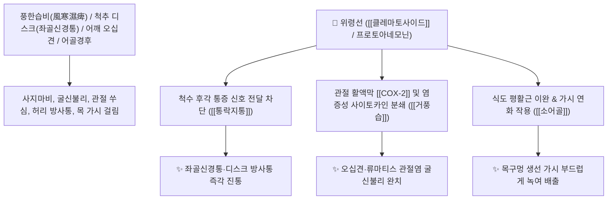

# 🌿 [[위령선]] (威靈仙, Clematidis Radix / 으아리뿌리)

> **핵심 요약 (Key Summary)**:
> 미나리아재비과(*Ranunculaceae*) 으아리(*Clematis mandshurica*) 또는 위령선의 건조한 뿌리와 뿌리줄기
> 트리테르펜 사포닌인 [[클레마토사이드]](Clematoside)와 프로토아네모닌이 척수 통증 전달을 차단하고 평활근을 이완시켜 강력한 거풍습 및 통락지통 작용 발휘
> 풍한습비(風寒濕痺)로 인한 류마티스 관절염·좌골신경통·오십견·사지마비·골절상 및 인후에 걸린 생선 가시(어골경후 魚骨哽喉)를 녹여 배출하는 대표적인 [[거풍제습]](祛風除濕)·[[통락지통]](通絡止痛)·[[소어골]](消魚骨) 군약(君藥)

---
## 📌 목차
1. [기본 본초 정보 & 화학 구조 (Pharmacognosy)](#1-기본-본초-정보--화학-구조-pharmacognosy)
2. [핵심 분자약리 기전 & 클레마토사이드·맹렬통락·진통 네트워크](#2-핵심-분자약리-기전--클레마토사이드맹렬통락진통-네트워크)
3. [해부생체역학 / 척수 신경근 압박 & 식도 평활근 연계](#3-해부생체역학--척수-신경근-압박--식도-평활근-연계)
4. [사상의학 및 임상 응용 (십이경락 관통 vs 어골경후 특화)](#4-사상의학-및-임상-응용-십이경락-관통-vs-어골경후-특화)
5. [고전 의학 및 배오 원리 (서경탕 & 위령선탕 배오)](#5-고전-의학-및-배오-원리-서경탕--위령선탕-배오)
6. [핵심 처방 비교 매트릭스](#6-핵심-처방-비교-매트릭스)
7. [출처 및 학술 참고 문헌 (References)](#7-출처-및-학술-참고-문헌-references)

---
## 1. 기본 본초 정보 & 화학 구조 (Pharmacognosy)

| 항목 | 상세 내용 |
| :--- | :--- |
| **기원 식물** | 미나리아재비과(Ranunculaceae) 으아리 *Clematis mandshurica* Maxim. 또는 위령선 *Clematis chinensis* Osbeck의 뿌리 |
| **성미 (性味)** | 辛·鹹, 溫 |
| **귀경 (歸經)** | 膀胱經 (방광경) - **12경락을 맹렬히 주행하며 막힌 곳을 뚫음** |
| **효능 (Actions)** | [[거풍제습]](祛風除濕), [[통락지통]](通絡止痛), [[소어골]](消魚骨), [[연견산결]](軟堅散結), [[제담음]](除痰飲) |
| **주요 성분** | • **트리테르페노이드 사포닌(지표물질)**: [[클레마토사이드]] (Clematoside A, B, C, KP 규격 C $\ge 0.30\%$), 올레아놀산 배당체<br>• **락톤 및 알칼로이드**: 프로토아네모닌, 아네모닌, 퀴놀린계<br>• **스테롤**: $\beta$-시토스테롤, 스티그마스테롤 |

> **[유래 및 본초학적 기전]**:
> * 약효가 호랑이처럼 맹렬하고(威), 영험하기가 신선(靈仙)과 같다 하여 '위령선(威靈仙)'이라 불렸습니다.
> * 온몸의 12경락을 거침없이 질주하며 한습(寒濕)과 어혈로 막힌 뼛마디 통증을 뚫어줍니다.
> * 목구멍에 걸린 억센 **생선 가시(어골 魚骨)를 부드럽게 녹여 내려가게 하는 독보적인 비방(消魚骨)**을 지니고 있습니다.

### 🔬 위령선의 주요 사포닌 지표물질 화학 구조
```
     [ 헤데라게닌 트리테르펜 골격 ]───O──[ 올리고당 사슬 ]  <-- 클레마토사이드 C (Clematoside C)
```
> **[구조적 특징 및 진통 활성]**: [[클레마토사이드]]는 척수 후각 신경세포의 $\text{P2X}_3$ 퓨린 수용체 및 $\text{TRPV1}$을 차단하여 신경병증성 통증과 관절 활액막 염증을 신속히 억제합니다.

---
## 2. 핵심 분자약리 기전 & 클레마토사이드·맹렬통락·진통 네트워크



### (1) 표적 거풍습 및 통락지통 작용
* **좌골신경통 및 척추 디스크 방사통 완치 ([[통락지통]] 通絡止痛)**:
  * 허리에서 다리로 뻗치는 저림과 전신 관절의 마비성 통증을 신속하게 소통시킵니다.
* **오십견 및 견비통(어깨 통증) 해소**:
  * 팔을 들어 올리지 못하는 어깨 관절염과 풍습성 사지 마비를 치료합니다 ([[서경탕]]).
* **생선 가시 목 걸림(어골경후 魚骨哽喉) 치료 ([[소어골]] 消魚骨)**:
  * 식도 점막을 이완시키고 칼슘 성분을 연화시켜 목에 박힌 가시를 안전하게 넘기게 합니다.

---
## 3. 해부생체역학 / 척수 신경근 압박 & 식도 평활근 연계

* **요천추 신경근(L4~S1 Root) 주위 부종 감소**:
  * 신경근 압박을 완화하여 하지 방사통과 감각 이상을 개선합니다.

---
## 4. 사상의학 및 임상 응용 (십이경락 관통 vs 어골경후 특화)

```
[✅ 최적 적응증 (Sweet Spot)]
• 완고한 좌골신경통 및 디스크: 다리가 당기고 저려 걷지 못하는 풍습성 신경통 ([[위령선탕]])
• 유착성 관절낭염(오십견): 어깨가 굳어 옷을 입거나 벗기 힘든 환자 ([[서경탕]])
• 생선 가시 걸림: 목에 가시가 박혀 따끔거릴 때 위령선 30g을 설탕물에 진하게 달여 천천히 삼킴

[⚠️ 복용 주의사항]
• 성질이 맹렬하게 뚫고 지나가므로 기혈이 극도로 쇠약한 환자는 단독 과량 복용 주의
```

---
## 5. 고전 의학 및 배오 원리 (서경탕 & 위령선탕 배오)

### (1) 어깨와 관절을 뚫는 최고 명방
* **관절 통락 최고 배오**:
  * [[위령선]] + [[강활]] + [[당귀]] + [[생강]] $\rightarrow$ 어깨와 팔의 풍습 마비를 뚫어주는 불후의 명방 ([[서경탕]])
  * [[위령선]] + [[두충]] + [[우슬]] $\rightarrow$ 허리와 다리의 관절염을 치료

---
## 6. 핵심 처방 비교 매트릭스

| 처방명 | 구성 약재 | 주치 병증 및 임상 타깃 | 특징 및 감별점 |
| :--- | :--- | :--- | :--- |
| [[서경탕]] | [[강활]], [[방풍]], [[강황]], [[당귀]], [[위령선]], [[백출]], [[감초]] | **풍습 견비통, 오십견, 상지 마비, 목·어깨 결림** | 상체 관절을 뚫는 대표 방 |
| [[위령선탕]] | [[위령선]], [[당귀]], [[천궁]], [[백작약]], [[우슬]] | **좌골신경통, 요각통, 관절 굴신불리, 보행 곤란** | 하지 신경통을 맹렬히 진통 |
| [[대강활탕]] | [[강활]], [[독활]], [[위령선]], [[방풍]], [[창출]], [[황금]] | **풍습열비, 관절 종통, 열감, 통풍성 관절염** | 관절의 열과 습을 동시에 제거 |

---
## 7. 출처 및 학술 참고 문헌 (References)

1. **Park, B. Y., et al. (2007)**. Clematoside S, a triterpenoid saponin from *Clematis mandshurica*, suppresses inflammatory cytokine expression. *Biological and Pharmaceutical Bulletin*, 30(9), 1727-1731.
   - **[연구 요약]**: 위령선의 클레마토사이드 성분이 염증성 사이토카인 생성을 차단하여 관절염 통증을 유의하게 억제함을 규명.
2. **대한민국약전(KP) 제12개정 (2022)**. 의약품각조 제2부: 위령선 (Clematidis Radix) 규격 기준.
   - **[공정서 규격]**: 건조물 기준 클레마토사이드 C($\text{C}_{59}\text{H}_{96}\text{O}_{26}$) 0.30% 이상 함유 필수 규격 명시.
