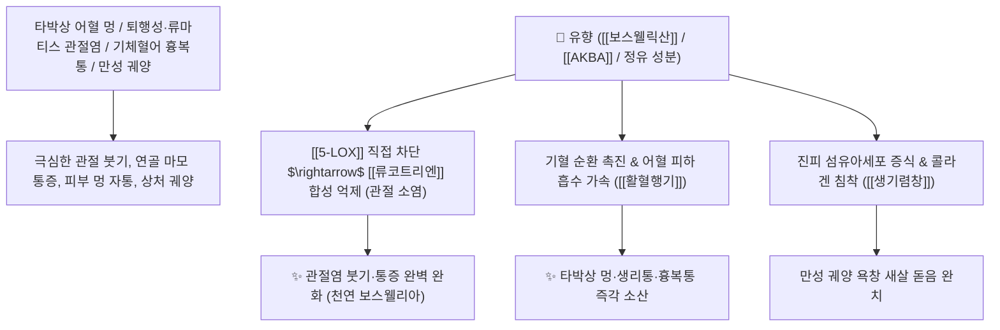

# 🌿 [[유향]] (乳香, Olibanum / 보스웰리아수지)

> **핵심 요약 (Key Summary)**:
> 감람나무과(*Burseraceae*) 유향나무(*Boswellia carterii*)의 줄기 껍질에 상처를 내어 채취한 천연 굳은 수지(보스웰리아)
> 펜타시클릭 트리테르펜산인 [[보스웰릭산]](Boswellic acid, AKBA)이 [[5-LOX]] 효소를 직접 차단하여 류코트리엔 생성을 억제하고 섬유아세포 증식을 촉진하여 활혈지통 및 생기렴창 작용 발휘
> 타박상 어혈 멍·류마티스 및 퇴행성 관절염 통증·기체혈어 흉복통·생리통 및 만성 피부 궤양(새살 돋게 함)을 치료하는 대표적인 [[활혈행기]](活血行氣)·[[소종지통]](消腫止痛)·[[생기렴창]](生肌斂瘡) 군약(君藥)

---
## 📌 목차
1. [기본 본초 정보 & 화학 구조 (Pharmacognosy)](#1-기본-본초-정보--화학-구조-pharmacognosy)
2. [핵심 분자약리 기전 & 보스웰릭산·5-LOX 억제·천연 관절소염 네트워크](#2-핵심-분자약리-기전--보스웰릭산5-lox-억제천연-관절소염-네트워크)
3. [해부생체역학 / 관절 활액막 기질 & 진피 섬유아세포 연계](#3-해부생체역학--관절-활액막-기질--진피-섬유아세포-연계)
4. [사상의학 및 임상 응용 (유향 vs 몰약 기혈 감별)](#4-사상의학-및-임상-응용-유향-vs-몰약-기혈-감별)
5. [고전 의학 및 배오 원리 (활락효령단 & 칠리산 배오)](#5-고전-의학-및-배오-원리-활락효령단--칠리산-배오)
6. [핵심 처방 비교 매트릭스](#6-핵심-처방-비교-매트릭스)
7. [출처 및 학술 참고 문헌 (References)](#7-출처-및-학술-참고-문헌-references)

---
## 1. 기본 본초 정보 & 화학 구조 (Pharmacognosy)

| 항목 | 상세 내용 |
| :--- | :--- |
| **기원 식물** | 감람나무과(Burseraceae) 카터유향나무 *Boswellia carterii* Birdw. 등의 수피에서 분비된 건조 수지 |
| **성미 (性味)** | 辛·苦, 溫 (향기롭고 씀) |
| **귀경 (歸經)** | 心·肝·脾經 (심경, 간경, 비경) - **기혈(氣血)을 동시에 뚫어 진통** |
| **효능 (Actions)** | [[활혈행기]](活血行氣), [[소종지통]](消腫止痛), [[생기렴창]](生肌斂瘡), [[소옹산결]](消癰散結) |
| **주요 성분** | • **트리테르펜산(보스웰리아 지표물질)**: [[보스웰릭산]] (Boswellic acid, $\alpha/\beta$-boswellic acid), [[AKBA]] (3-O-Acetyl-11-keto-$\beta$-boswellic acid, KP 규격 $\ge 1.0\%$)<br>• **정유 성분**: 피넨, 펠란드렌, 리모넨, 캄펜<br>• **수지 및 다당류**: 아라비노오스, 갈락토오스 |

> **[유래 및 본초학적 기전]**:
> * 나무껍질에서 눈물방울처럼 흘러내려 굳은 수지의 모양이 젖꼭지(乳頭)나 우유 방울을 닮아 '유향(乳香)'이라 불립니다. (동양과 서양을 아우르는 보스웰리아 Boswellia)
> * 기(氣)를 움직이고 피(血)를 돌려 통증을 멎게 하는 **"행기활혈(行氣活血)의 최고 진통제"**입니다.
> * 타박상 멍과 극심한 관절염 통증을 없애고, 아물지 않는 만성 궤양에 새살을 돋아나게 합니다(생기 生肌).

### 🔬 유향의 주요 트리테르펜 지표물질 화학 구조
```
     [ 올레아난 트리테르펜 골격 ]───( 11번 위치 케토기 + 3번 아세틸기 )  <-- AKBA
```
> **[구조적 특징 및 5-LOX 차단 기전]**: [[AKBA]]는 염증 유발 효소인 [[5-LOX]](5-Lipoxygenase)의 비산화-알로스테릭 부위에 직접 결합하여 관절 연골을 파괴하는 [[류코트리엔]] 생성을 강력히 차단합니다.

---
## 2. 핵심 분자약리 기전 & 보스웰릭산·5-LOX 억제·천연 관절소염 네트워크



### (1) 표적 활혈지통 및 관절 소염 작용
* **퇴행성 무릎 관절염 및 류마티스 통증 완치 ([[소종지통]] 消腫止痛)**:
  * 관절 활액막 부종을 가라앉히고 연골 콜라겐 분해를 억제하여 보행 통증을 치료합니다 ([[활락효령단]]).
* **타박상 어혈 멍 및 혈어 흉복통 해소 ([[활혈행기]] 活血行氣)**:
  * 외상으로 인한 피하 출혈 멍과 골절 통증, 기혈 울체성 생리통을 신속히 진통시킵니다.
* **만성 피부 궤양 및 욕창 수복 ([[생기렴창]] 生肌斂瘡)**:
  * 새살이 돋지 않고 진물이 흐르는 만성 궤양에 외용하여 피부 재생을 촉진합니다.

---
## 3. 해부생체역학 / 관절 활액막 기질 & 진피 섬유아세포 연계

* **관절 연골 기질 분해효소(MMP-3, MMP-13) 발현 억제**:
  * 연골 파괴를 차단하고 관절낭 내 윤활액의 질을 개선합니다.

---
## 4. 사상의학 및 임상 응용 (유향 vs 몰약 기혈 감별)

```
[🔍 통증 명약 짝꿍: 유향 vs 몰약 감별]
• [[유향]](乳香): 향기가 강하여 기(氣)를 움직이고 피를 돌림(行氣活血) $\rightarrow$ 통증과 멍울을 펴고 새살을 돋게 함
• [[몰약]](沒藥): 쓴맛이 강하여 혈(血)의 어혈을 직접 깨뜨림(散瘀消腫) $\rightarrow$ 단단한 멍울과 피멍 분쇄
• "유향은 기를 돌려 피를 통하게 하고, 몰약은 피를 부수어 흩어지게 하니(乳香行氣, 沒藥散血), 둘을 합치면 신묘하다"

[✅ 최적 적응증 (Sweet Spot)]
• 타박상 및 교통사고 후유증: 멍이 시퍼렇게 들고 뼈마디가 쑤실 때 ([[칠리산]])
• 만성 퇴행성 관절염 및 협착증 통증 ([[활락효령단]])
• 부스럼 멍울 및 욕창(외용 파골)
```

---
## 5. 고전 의학 및 배오 원리 (활락효령단 & 칠리산 배오)

### (1) 통증을 멎게 하는 불후의 명방: 활락효령단(活絡效靈丹)
* **활혈진통 천하제일 배오**:
  * [[유향]] + [[몰약]] + [[당귀]] + [[단삼]] $\rightarrow$ 온몸의 신경통과 관절염을 고치는 장석순의 명방 ([[활락효령단]])
  * [[유향]] + [[몰약]] + [[혈갈]] + [[삼칠]] $\rightarrow$ 타박 골절 최고의 구급방 ([[칠리산]])

---
## 6. 핵심 처방 비교 매트릭스

| 처방명 | 구성 약재 | 주치 병증 및 임상 타깃 | 특징 및 감별점 |
| :--- | :--- | :--- | :--- |
| [[활락효령단]] | [[당귀]], [[단삼]], [[유향]], [[몰약]] | **기혈 어체, 흉복통, 견비통, 좌골신경통, 타박 멍** | 기혈을 뚫어 진통시키는 대표방 |
| [[칠리산]] | [[혈갈]], [[유향]], [[몰약]], [[홍화]], [[주사]], [[사향]], [[빙편]] | **외상 타박, 골절 종통, 내외 출혈 멍, 삔 데** | 외상 정형외과의 제1선 구급산 |
| [[선방활명음]] | [[금은화]], [[유향]], [[몰약]], [[천산갑]], [[조각자]], [[방풍]] | **창양 옹저 초기, 붉게 부어오른 종기, 화농 직전** | 종기를 삭이고 새살을 돋게 함 |

---
## 7. 출처 및 학술 참고 문헌 (References)

1. **Siddiqui, M. Z. (2011)**. *Boswellia serrata*, a potential antiinflammatory agent: an overview. *Indian Journal of Pharmaceutical Sciences*, 73(3), 255-261.
   - **[연구 요약]**: 보스웰리아(유향)의 AKBA 성분이 5-LOX 억제를 통해 골관절염, 류마티스 및 염증성 장질환을 유의하게 완화함을 입증.
2. **대한민국약전(KP) 제12개정 (2022)**. 의약품각조 제2부: 유향 (Olibanum) 규격 기준.
   - **[공정서 규격]**: 건조물 기준 11-케토-$\beta$-보스웰릭산 및 AKBA 합계 1.0% 이상 함유 필수 규격 명시.
