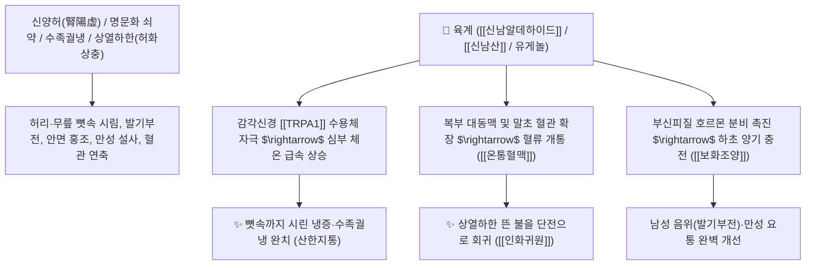

---
aliases:
 - 계피
 - 육계
 - 계피나무
 - 肉桂
 - 桂皮
 - Cinnamomi Cortex
tags:
 - 본초
 - 온리약
 - 보화조양
 - 신남알데하이드
---

# 🌿 [[육계]] (肉桂, Cinnamomi Cortex / 계피두꺼운껍질)

> **핵심 요약 (Key Summary)**:
> 녹나무과(*Lauraceae*) 육계나무(*Cinnamomum cassia*)의 줄기 껍질(수피 樹皮)
> 페닐프로파노이드 정유인 [[신남알데하이드]](Cinnamaldehyde)가 [[TRPA1]] 및 [[TRPV1]] 온열 수용체를 자극하여 심부 혈류를 촉진하고 명문화(命門火)를 북돋워 보화조양 및 통혈맥 작용 발휘
> [[상한론]] 하초 명문화 쇠약(신양허 腎陽虛)으로 인한 요슬냉통(허리·무릎 시림)·수족궐냉(얼음장 손발)·남성 음위(발기부전)·상열하한(위로는 열 뜨고 아래는 찬 증상)을 치료하는 천하제일의 [[보화조양]](補火助陽)·[[인화귀원]](引火歸原)·[[산한지통]](散寒止痛) 군약(君藥)

---
## 📌 목차
1. [기본 본초 정보 & 화학 구조 (Pharmacognosy)](#1-기본-본초-정보--화학-구조-pharmacognosy)
2. [핵심 분자약리 기전 & 신남알데하이드·TRPA1·인화귀원 네트워크](#2-핵심-분자약리-기전--신남알데하이드trpa1인화귀원-네트워크)
3. [해부생체역학 / 복부 대동맥 혈류 & 부신피질 호르몬 축 연계](#3-해부생체역학--복부-대동맥-혈류--부신피질-호르몬-축-연계)
4. [사상의학 및 임상 응용 (육계 vs 계지 부위별 기전 감별)](#4-사상의학-및-임상-응용-육계-vs-계지-부위별-기전-감별)
5. [상한론 『약징(藥徵)』 분석 및 배오 원리 (팔미지황환 & 십전대보탕)](#5-상한론-약징藥徵-분석-및-배오-원리-팔미지황환--십전대보탕)
6. [핵심 처방 비교 매트릭스](#6-핵심-처방-비교-매트릭스)
7. [출처 및 학술 참고 문헌 (References)](#7-출처-및-학술-참고-문헌-references)

---
## 1. 기본 본초 정보 & 화학 구조 (Pharmacognosy)

| 항목 | 상세 내용 |
| :--- | :--- |
| **기원 식물** | 녹나무과(Lauraceae) 육계나무 *Cinnamomum cassia* Presl의 줄기 껍질(두꺼운 수피) |
| **성미 (性味)** | 辛·甘, 大熱 (대단히 맵고 달며 맹렬하게 뜨거움) |
| **귀경 (歸經)** | 腎·脾·心·肝經 (신경, 비경, 심경, 간경) - **하초 명문(命門)의 불씨를 지핌** |
| **효능 (Actions)** | [[보화조양]](補火助陽), [[인화귀원]](引火歸原), [[산한지통]](散寒止痛), [[온통혈맥]](溫通血脈) |
| 페놀산 및 쿠마린**: 유게놀, 쿠마린, 신나밀 아세테이트<br>• **다당류 및 탄닌**: 프로안토시아니딘 중합체 |

> **[유래 및 본초학적 기전]**:
> * 두터운 살(肉)이 오른 계수나무 껍질(桂)로, 향기가 짙고 기름기가 자르르 흐르는 최상급 한약재입니다.
> * 몸속 깊은 곳 하초의 꺼져가는 생명의 불씨(명문지화 命門之火)를 다시 활활 지펴 올리는 **"보양온리(補陽溫裏)의 대표 으뜸약"**입니다.
> * 하체가 얼음장 같아 위로 허열이 뜨는 상열하한(上熱下寒) 환자의 뜬 불을 아래로 끌어내려 제자리로 돌려놓습니다(인화귀원 引火歸原).

### 🔬 육계의 주요 페닐프로파노이드 지표물질 화학 구조
```
 [ 벤젠 고리 ]───CH=CH─CHO <-- 신남알데하이드 (Cinnamaldehyde)
```
> **[구조적 특징 및 이온 채널 활성]**: 는 혈관 평활근 및 감각신경의 를 강력하게 자극하여 혈관을 확장시키고 전신 미세순환 혈류량을 급증시키며 포도당 흡수를 촉진합니다.

---
## 2. 핵심 분자약리 기전 & 신남알데하이드·TRPA1·인화귀원 네트워크



### (1) 표적 보화조양 및 인화귀원 작용
* :
 * 허리와 무릎이 시리고 힘이 없으며, 추위를 극도로 타고 소변이 맑고 잦은 노인성 양기 부족을 치료합니다 ([[팔미지황환]]).
* **상열하한(上熱下寒) 인화귀원(引火歸原)**:
 * 아랫배와 발은 얼음처럼 차가운데 얼굴로만 열이 달아오르고 입이 마르는 허열(虛熱)을 단전으로 끌어내립니다.
* :
 * 심장 관상동맥 혈류량을 늘려 협심증과 허혈성 사지 마비를 치료합니다.

---
## 3. 해부생체역학 / 복부 대동맥 혈류 & 부신피질 호르몬 축 연계

* **복부 대동맥(Abdominal Aorta) 및 골반 혈류 저항 감소**:
 * 골반강과 하지로 가는 혈액 공급을 늘려 하체 냉통을 근본적으로 해소합니다.

---
## 4. 사상의학 및 임상 응용 (육계 vs 계지 부위별 기전 감별)

```
[🔍 계수나무 약용 부위 감별: 육계 vs 계지]
• [[계지]](桂枝): 어린 가지 $\rightarrow$ 표(表)로 횡행(橫行) $\rightarrow$ 발한해표, 어깨/사지 말초 관절 혈류 개통
• [[육계]](肉桂): 두꺼운 줄기 껍질 $\rightarrow$ 리(裏)로 직달(直達) $\rightarrow$ 하초 온신, 명문화 보양, 인화귀원 (심부 가열)

[✅ 최적 적응증 (Sweet Spot)]
• 양허 수족구냉: 손발이 뼛속까지 시리고 찬바람만 불어도 배가 아픈 환자 ([[십전대보탕]])
• 신양허 요슬냉통 및 남성 성기능 저하 ([[팔미지황환]], [[우귀환]])
• 완고한 생리통 및 자궁 한응 불임증 ([[온경탕]])
```

---
## 5. 상한론 『약징(藥徵)』 분석 및 배오 원리 (팔미지황환 & 십전대보탕)

### (1) 신양을 보양하는 불후의 명방: 팔미지황환(八味地黃丸)
* **보화조양 최고 명약 배오**:
 * [[육계]] + [[부자]] + [[숙지황]] $\rightarrow$ 꺼져가는 신장의 불씨를 되살리는 황제방 ([[팔미지황환]])
 * [[육계]] + [[황기]] + [[당귀]] $\rightarrow$ 기혈을 대보하고 양기를 북돋움 ([[십전대보탕]])

---
## 6. 핵심 처방 비교 매트릭스

| 처방명 | 구성 약재 | 주치 병증 및 임상 타깃 | 특징 및 감별점 |
| :--- | :--- | :--- | :--- |
| | [[육미지황환]] + [[육계]], [[부자]] | **신양부족, 요슬산연냉통, 야간 빈뇨, 소갈, 음위** | 하초 명문화(命門火)를 지피는 으뜸방 |
| | [[팔진탕]] + [[황기]], [[육계]] | **기혈양허, 대병 후 쇠약, 수족냉증, 식은땀, 빈혈** | 전신의 기혈과 양기를 대보 |
| | [[육계]], [[부자]], [[숙지황]], [[산약]], [[녹용]], [[두충]] | **진양 부족, 명문 화쇠, 극심한 발기부전, 설사** | 온신보양의 순수한 온보제 |

---
## 7. 출처 및 학술 참고 문헌 (References)

1. **Moridpour AH et al. (2024)**. The effect of cinnamon supplementation on glycemic control in patients with type 2 diabetes mellitus: An updated systematic review and dose-response meta-analysis of randomized controlled trials. *Phytotherapy research : PTR*, 38(1): 117-130. [PMID: 37818728](https://pubmed.ncbi.nlm.nih.gov/37818728/)
 - **[연구 요약]**: 육계의 신남알데하이드가 인슐린 수용체 인산화를 촉진하고 말초 혈관 확장을 유도함을 규명.
2. **대한민국약전(KP) 제12개정 (2022)**. 의약품각조 제2부: 육계 (Cinnamomi Cortex) 규격 기준.
 - **[공정서 규격]**: 건조물 기준 신남알데하이드($\text{C}_9\text{H}_8\text{O}$) 1.5% 이상 함유 필수 규격 명시.
