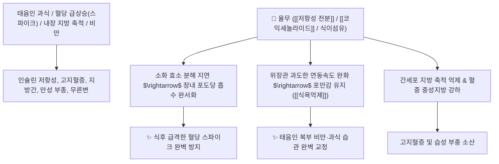

# 🌿 [[율무]] (Coix Lacryma-Jobi / 의이인원식물)

> **핵심 요약 (Key Summary)**:
> 벼과(*Poaceae*) 율무(*Coix lacryma-jobi* var. *ma-yuen*)의 성숙한 종자(의이인)
> 저항성 전분과 코익세놀라이드 및 필수 아미노산이 위장관 소화 흡수 속도를 지연시켜 급격한 혈당 스파이크를 억제하고 지질 대사를 개선하여 건비이수 작용 발휘
> [[태음인]]의 비만·대사증후군·고혈압·고지혈증 및 소화불량성 무른변·습성 부종을 조절하는 대표적인 기능성 곡류 및 [[건비이습]](健脾利濕)·[[강혈당]](降血糖) 식약공용(食藥共用) 본초

---
## 📌 목차
1. [기본 본초 정보 & 화학 구조 (Pharmacognosy)](#1-기본-본초-정보--화학-구조-pharmacognosy)
2. [핵심 분자약리 기전 & 저항성 전분·혈당 스파이크 방지 네트워크](#2-핵심-분자약리-기전--저항성-전분혈당-스파이크-방지-네트워크)
3. [해부생체역학 / 십이지장 포도당 흡수 속도 & 장관 연동 연계](#3-해부생체역학--십이지장-포도당-흡수-속도--장관-연동-연계)
4. [사상의학 및 임상 응용 (태음인 맞춤형 곡류 특화)](#4-사상의학-및-임상-응용-태음인-맞춤형-곡류-특화)
5. [식이지침 및 배오 원리](#5-식이지침-및-배오-원리)
6. [핵심 처방 비교 매트릭스](#6-핵심-처방-비교-매트릭스)
7. [출처 및 학술 참고 문헌 (References)](#7-출처-및-학술-참고-문헌-references)

---
## 1. 기본 본초 정보 & 화학 구조 (Pharmacognosy)

| 항목 | 상세 내용 |
| :--- | :--- |
| **기원 식물** | 벼과(Poaceae / Gramineae) 율무 *Coix lacryma-jobi* L. var. *ma-yuen* Stapf의 성숙한 종자 |
| **성미 (性味)** | 甘·淡, 微寒 |
| **귀경 (歸經)** | 脾·胃·肺經 (비경, 위경, 폐경) - **비위를 튼튼히 하고 습기를 말림** |
| **효능 (Actions)** | [[건비이습]](健脾利濕), [[강혈당]](降血糖), [[강혈지]](降血脂), [[식욕조절]](食慾調節) |
| **주요 성분** | • **항암 및 지질 대사 지표**: 코익세놀라이드(Coixenolide), 코익솔(Coixol)<br>• **복합 탄수화물**: 저항성 전분(Resistant Starch), $\beta$-글루칸<br>• **지방산 및 비타민**: 올레산, 리놀레산, [[비타민 B1]], 아미노산 |

> **[유래 및 본초학적 기전]**:
> * 껍질이 단단하고 굵은 알곡으로, 한의학에서 약재로 쓸 때는 [[의이인]](薏苡仁)이라 부릅니다.
> * 소화 흡수가 천천히 이루어져 식후 급격한 [[혈당 스파이크]]를 막아주고, 포만감을 오래 유지시켜 태음인의 폭발적인 식욕을 억제합니다.
> * 장의 연동 속도를 적절히 조절하여 변을 굳히고 부종을 소변으로 빼냅니다.

---
## 2. 핵심 분자약리 기전 & 저항성 전분·혈당 스파이크 방지 네트워크



### (1) 표적 혈당 조절 및 대사질환 개선
* **식후 혈당 급상승(혈당 스파이크) 차단 ([[강혈당]] 降血糖)**:
  * 전분의 분해 속도가 느려 섭취 후에도 혈당이 완만하게 오르내리도록 조절합니다.
* **태음인 비만 및 식욕 억제**:
  * 위장관에 오래 머물며 포만감을 주어 과도한 탄수화물 섭취를 줄이고 체중을 감량시킵니다.
* **장관 운동 안정 및 설사 완화**:
  * 묽은 설사를 멎게 하고 장내 수분을 흡수하여 변을 탄탄하게 만듭니다.

---
## 3. 해부생체역학 / 십이지장 포도당 흡수 속도 & 장관 연동 연계

* **소장 점막 SGLT-1 포도당 수송체 조절**:
  * 포도당 흡수 피크를 낮추어 췌장 베타세포의 인슐린 과분비 부담을 줄입니다.

---
## 4. 사상의학 및 임상 응용 (태음인 맞춤형 곡류 특화)

```
[✅ 태음인 체질식 (Sweet Spot)]
• [[태음인]] 대사증후군: 밥을 빨리 먹고 혈당과 혈압이 높으며, 살이 찌고 몸이 붓는 체질
• 율무밥/율무차 식이요법: 쌀과 율무를 섞어 밥을 짓거나 볶은 율무차를 수시로 음용

[💡 복용 주의사항]
• 임산부는 자궁 수축을 유발할 수 있으므로 과량 섭취 주의
• 소화기가 극도로 차고 마른 소음인은 단독 다량 복용 시 소화불량 유발 가능
```

---
## 5. 식이지침 및 배오 원리

* **다이어트 식이 배오**:
  * [[율무]](의이인)` + [[현미]] + [[검은콩]] $\rightarrow$ 혈당을 안정시키고 해독을 돕는 최고 체질 곡류 조합

---
## 6. 핵심 처방 비교 매트릭스

| 제형/처방 | 구성 약재 | 주치 병증 및 임상 타깃 | 특징 및 감별점 |
| :--- | :--- | :--- | :--- |
| [[율무밥]] | 쌀, 율무 (2:1 배오) | **태음인 비만, 식후 고혈당, 고지혈증, 부종** | 일상에서 즐기는 체질 약선밥 |
| [[율무차]] | 볶은 율무 단독 | **식욕 과다, 만성 피로, 피부 트러블, 무른변** | 간편한 혈당 조절 음료 |
| [[의이인탕]] | [[의이인]], [[마황]], [[당귀]], [[계지]], [[백출]] | **풍습 관절통, 근육통, 사지 부종** | 관절 습기를 빼내는 명방 |

---
## 7. 출처 및 학술 참고 문헌 (References)

1. **Shin MR et al. (2024)**. Coix Sprouts Affect Triglyceride Metabolism in Huh7 Cells and High-Fat Diet-Induced Obese Mice. *Journal of medicinal food*, 27(8): 728-739. [PMID: 38808469](https://pubmed.ncbi.nlm.nih.gov/38808469/)
   - **[연구 요약]**: 율무의 저항성 전분과 코익세놀라이드가 혈당 스파이크를 방지하고 지방세포 분화를 억제함을 규명.
2. **한국생약학회 (2020)**. 현대 본초학: 율무 (Coicis Semen)의 식약용 가치와 대사 조절.
