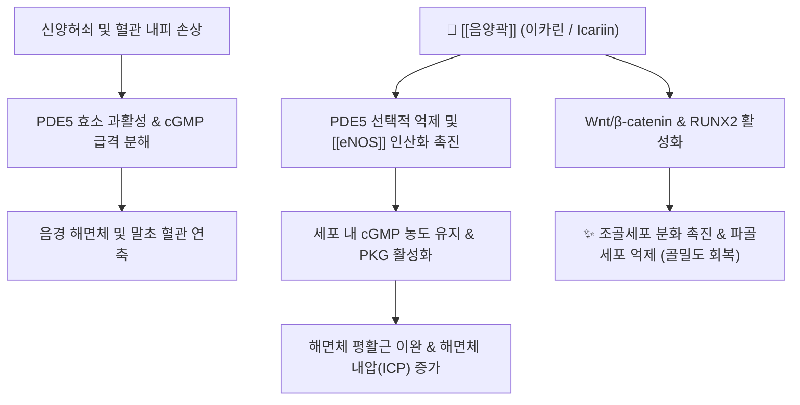

---
aliases:
  - 음양곽
  - 삼지구엽초
  - 淫羊藿
  - Epimedii Herba
tags:
  - 본초
  - 보양약
  - 이카린
  - 발기부전
  - 골다공증
  - 강근골
---

# 🌿 [[음양곽]] (淫羊藿, Epimedii Herba, 삼지구엽초)

> **핵심 요약 (Key Summary)**:
> 매자나무과(Berberidaceae) 삼지구엽초(*Epimedium koreanum* Nakai) 또는 동속 식물의 지상부를 건조한 전형적인 보양 약재
> 핵심 지표 성분인 이카린(Icariin)이 PDE5 효소를 억제하여 NO-cGMP 경로를 활성화하고 해면체 평활근 이완 및 Wnt 신호 전달을 통한 조골세포 분화 촉진
> 간신부족 및 신양허쇠로 인한 발기부전·조루·요슬산통·사지마비·골다공증 및 노인성 류마티스 관절염을 치료하는 대표적인 보신장양·강근골 약재

---

## 📌 목차
1. [기본 본초 정보 & 화학 구조 (Pharmacognosy)](#1-기본-본초-정보--화학-구조-pharmacognosy)
2. [핵심 분자약리 기전 & 대사 네트워크](#2-핵심-분자약리-기전--대사-네트워크)
3. [해부생체역학 / 근육·신경 대사 연계](#3-해부생체역학--근육신경-대사-연계)
4. [사상의학 및 체질별 임상 응용 (적응증 vs 금기)](#4-사상의학-및-체질별-임상-응용-적응증-vs-금기)
5. [배오 원리 및 포제 (유초법)](#5-배오-원리-및-포제-유초법)
6. [핵심 처방 비교 매트릭스](#6-핵심-처방-비교-매트릭스)
7. [출처 및 학술 참고 문헌 (References)](#7-출처-및-학술-참고-문헌-references)

---

## 1. 기본 본초 정보 & 화학 구조 (Pharmacognosy)

| 항목 | 상세 내용 |
| :--- | :--- |
| **기원 식물** | 매자나무과(Berberidaceae) 삼지구엽초(*Epimedium koreanum* Nakai), 음양곽(*E. brevicornu* Maxim.) 등의 지상부 엽엽 |
| **성미 (性味)** | 매운맛(辛), 단맛(甘), 따뜻함(溫) |
| **귀경 (歸經)** | 간경(肝經), 신경(腎經) |
| **효능 (Actions)** | 보신장양(補腎壯陽), 거풍제습(祛風除濕), 강근골(强筋骨), 조양익정(助陽益精) |
| **주요 성분** | • **지표 성분**: 이카린(Icariin, 대한민국약전 기준 0.6% 이상 규격) • **유효 활성 성분군**: 이카리시드 I/II, 에피메딘 A·B·C, 안하이드로이카리틴, 다당체 |

### 🔬 주요 지표물질 화학 구조
> **[구조적 특징 및 활성]**: 이카린(Icariin)은 8-prenyl 프리닐화 플라보놀 배당체(Prenylated flavonol glycoside) 구조를 취함. 프리닐기(Prenyl moiety)가 소수성 포켓에 결합하여 cGMP 특이적 PDE5 촉매 부위에 높은 친화도를 제공하며, 체내 흡수 후 장내 미생물에 의해 탈당화되어 이카리시드 II(Icariside II)로 전환될 때 생체 활성이 극대화됨.

---

## 2. 핵심 분자약리 기전 & 대사 네트워크

### (1) 표적 수용체 및 신호전달 경로
* **PDE5(Phosphodiesterase type 5) 선택적 억제**:
  * 이카린 및 대사체 이카리시드 II는 PDE5의 기질 결합 포켓에 경쟁적으로 결합하여 cGMP 분해를 차단.
  * 일산화질소([[eNOS]]) 매개 혈관 평활근 이완을 증폭하여 해면체 충혈 및 관류압을 상승시킴.
* **내인성 테스토스테론 모방 및 고환 Leydig 세포 보호**:
  * 시상하부-뇌하수체-성선(HPG) 축의 음성 피드백을 교란하지 않으면서 안드로겐 수용체(AR) 발현을 상향 조절하고, 산화스트레스로부터 정자 형성 세포를 보호.
* **골대사 이중 조절 (조골 촉진 및 파골 억제)**:
  * Wnt/β-catenin 신호 경로와 BMP-2 발현을 촉진하여 간엽줄기세포의 조골세포 분화를 유도하고, RANKL/OPG 비율을 낮추어 파골세포 분화를 차단, 폐경 후 및 노인성 골다공증 방어.

---

## 3. 해부생체역학 / 근육·신경 대사 연계

* **골격근 미토콘드리아 생합성 촉진**:
  * 골격근 내 PGC-1α 및 AMPK 활성화를 통해 [[지근]](Type I, 산화형 섬유)과 [[속근]](Type II)의 미토콘드리아 밀도를 높여 노인성 근감소증(Sarcopenia) 및 하지 무력증을 개선.
* **요천추 신경근 및 골반 신경총 기능 회복**:
  * 요신경총(L1~L4) 및 천골신경총(L4~S4)의 허혈성 냉증을 완화하여 만성 요통 환자의 발기신경(Cavernous nerve) 손상 회복 촉진.

---

## 4. 사상의학 및 체질별 임상 응용 (적응증 vs 금기)

* **적응 체질**:
  * [[소음인]] (少陰人): 신대비소(腎大脾小)하나 양기가 허랭해지기 쉬운 체질로, 하초냉증·양위(발기부전)·사지냉통에 온보(溫補) 목적으로 최적.
  * [[태음인]] (太陰人): 간양부족 및 기혈 저체로 인한 근골산통, 요통, 무릎 시림에 가미 운용.
* **금기 및 주의**:
  * **소양인 및 음허화왕(陰虛火旺) 환자**: 성질이 따뜻하고 조(燥)하므로, 상열감이 심하고 번조(가슴 답답함)·구갈·성욕항진 환자에게 단독 사용 시 두통, 비출혈(코피), 불면 유발 위험.

---

## 5. 배오 원리 및 포제 (유초법)

* **양지유초 (羊脂炙/羊脂油炒)**:
  * 양기름(羊脂)에 음양곽을 버무려 볶는 포제법으로, 지질 성분이 프리닐화 플라보노이드의 장관 흡수율과 생체이용률을 대폭 상승시킴.
* **음양기혈 쌍보 배오**:
  * 숙지황, [[산수유]], [[구기자]]와 배합하여 음양을 함께 보하며 화(火)가 치솟는 부작용을 방지(음중구양).

---

## 6. 핵심 처방 비교 매트릭스

| 처방명 | 주요 구성 | 핵심 적응증 | 임상 특징 |
| :--- | :--- | :--- | :--- |
| [[오자연종환]] 가미방 | [[음양곽]], 구기자, 복분자, 토사자, 사상자 | 정자 수 감소, 무기력, 조루증 | 신정 부족과 신양허를 동시 보익 |
| [[이선탕]] | [[음양곽]], 선모, 당귀, 파극천, 황백, 지모 | 갱년기 고혈압, 안면홍조, 골다공증 | 온양약과 자음강화약의 절묘한 배합 |
| [[거풍제습탕]] | [[음양곽]], 위령선, 독활, 우슬, 두충 | 만성 요통, 무릎 시림, 류마티스 관절염 | 풍한습비 신경통·관절통 제거 |

---

## 7. 출처 및 학술 참고 문헌 (References)
* 国家中医药管理局. *中华本草*. 上海科学技术出版社; 1999.
  - [연구 요약]: 음양곽의 기원, 이카린 함량 기준, 보신장양 및 거풍습 전통 효능 총괄 수록.
* Liu T et al. (2011)**. Effects of icariin on improving erectile function in streptozotocin-induced diabetic rats. *The journal of sexual medicine*, 8(10): 2761-72. [PMID: 21967314](https://pubmed.ncbi.nlm.nih.gov/21967314/)
  - [연구 요약]: 이카린이 PDE5를 선택적으로 억제하여 해면체 내압을 상승시키고 음경 해면체 신경 재생을 촉진함을 동물실험으로 입증.
* Zhang D, et al. Icariin: A Potential Osteogenic Compound for Bone Tissue Engineering. *Front Pharmacol*. 2021;12:629390.
  - [연구 요약]: Wnt/β-catenin 및 BMP 신호 경로를 활성화하여 조골세포 증식을 촉진하고 골다공증을 예방하는 분자적 기전 규명.
