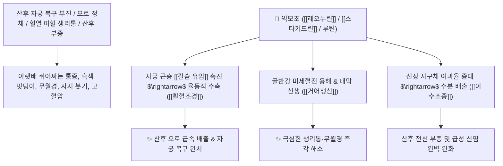

# 🌿 [[익모초]] (益母草, Leonuri Herba / 육모초)

> **핵심 요약 (Key Summary)**:
> 꿀풀과(*Lamiaceae*) 익모초(*Leonurus japonicus*)의 꽃 필 때 채취한 지상부 전초
> 구아니디노 알칼로이드인 [[레오누린]](Leonurine)과 [[스타키드린]](Stachydrine)이 자궁 평활근 율동적 수축을 유도하고 관상동맥 혈류를 개선하여 강력한 활혈조경 및 이수소종 작용 발휘
> 여성의 혈열(血熱) 어혈로 인한 월경불순·극심한 생리통(통경)·산후 자궁 복구 부진(오로 불하) 및 산후 전신 부종·급성 신염 혈뇨를 치료하는 부인과 최고의 [[활혈조경]](活血調經)·[[거어생신]](祛瘀生新)·[[이수소종]](利水消腫) 군약(君藥)

---
## 📌 목차
1. [기본 본초 정보 & 화학 구조 (Pharmacognosy)](#1-기본-본초-정보--화학-구조-pharmacognosy)
2. [핵심 분자약리 기전 & 레오누린·자궁 수축·미세순환 네트워크](#2-핵심-분자약리-기전--레오누린자궁-수축미세순환-네트워크)
3. [해부생체역학 / 자궁 근층(Myometrium) 수축 & 신장 사구체 연계](#3-해부생체역학--자궁-근층myometrium-수축--신장-사구체-연계)
4. [사상의학 및 임상 응용 (익모초 vs 애엽 한열 감별)](#4-사상의학-및-임상-응용-익모초-vs-애엽-한열-감별)
5. [고전 의학 및 배오 원리 (익모초고 & 당귀 배오)](#5-고전-의학-및-배오-원리-익모초고--당귀-배오)
6. [핵심 처방 비교 매트릭스](#6-핵심-처방-비교-매트릭스)
7. [출처 및 학술 참고 문헌 (References)](#7-출처-및-학술-참고-문헌-references)

---
## 1. 기본 본초 정보 & 화학 구조 (Pharmacognosy)

| 항목 | 상세 내용 |
| :--- | :--- |
| **기원 식물** | 꿀풀과(Labiatae / Lamiaceae) 익모초 *Leonurus japonicus* Houtt.의 개화기 지상부 전초 |
| **성미 (性味)** | 苦·辛, 微寒 |
| **귀경 (歸經)** | 心·肝·膀胱經 (심경, 간경, 방광경) - **혈분(血分)의 어혈과 수도(水道)를 통리** |
| **효능 (Actions)** | [[활혈조경]](活血調經), [[거어생신]](祛瘀生新), [[이수소종]](利水消腫), [[청열해독]](淸熱解毒) |
| **주요 성분** | • **구아니디노 알칼로이드(지표물질)**: [[레오누린]] (Leonurine, KP 규격 $\ge 0.050\%$), [[스타키드린]] (Stachydrine), 레오누리딘<br>• **디테르페노이드**: 레오누리드, 프리오니틴<br>• **플라보노이드**: 루틴, 아피게닌 배당체 |

> **[유래 및 본초학적 기전]**:
> * "어머니(母)와 여성의 모든 병에 이롭다(益)" 하여 '익모초(益母草)'라 불렸습니다. (효심 깊은 아이가 어머니의 산후 뱃병을 고치기 위해 찾아낸 약초 고사)
> * 한의학에서 **부인과 질환의 성약(婦科之聖藥)**으로, 묵은 핏덩이를 녹여내고 새 피를 생성시키며(거어생신 祛瘀生新), 산후 늘어진 자궁을 수축시킵니다.
> * 혈액 순환을 뚫으면서도 소변을 부드럽게 배출시켜 산후 부종과 신염 부종을 가라앉힙니다.

### 🔬 익모초의 주요 알칼로이드 지표물질 화학 구조
```
     [ 4-구아니디노부틸 4-하이드록시-3,5-디메톡시벤조에이트 ]  <-- 레오누린 (Leonurine)
```
> **[구조적 특징 및 자궁 수축 기전]**: [[레오누린]]은 자궁 근층의 옥시토신 수용체 감수성을 높이고 칼슘 유입을 촉진하여 자궁의 율동적인 수축과 오로 배출을 유도하며, 관상동맥 허혈을 보호합니다.

---
## 2. 핵심 분자약리 기전 & 레오누린·자궁 수축·미세순환 네트워크



### (1) 표적 활혈조경 및 자궁 수축 작용
* **산후 자궁 수축 촉진 및 오로 배출 ([[활혈조경]] 活血調經)**:
  * 분만 후 자궁이 제대로 수축하지 않아 출혈이 지속되고 핏덩이가 차 있는 상태를 치료합니다 ([[익모초고]]).
* **어혈성 생리통 및 무월경 완치 ([[거어생신]] 祛瘀生新)**:
  * 생리 피가 검붉고 덩어리가 지며 아랫배가 끊어질 듯 아픈 생리통을 맑게 통경시킵니다.
* **산후 전신 부종 및 급성 신염 치료 ([[이수소종]] 利水消腫)**:
  * 혈액순환 저하로 발생하는 산후 부종과 혈뇨를 신장 혈류를 촉진하여 소변으로 배출합니다.

---
## 3. 해부생체역학 / 자궁 근층(Myometrium) 수축 & 신장 사구체 연계

* **자궁 나선동맥(Spiral Artery) 지혈 및 복구**:
  * 자궁 근섬유를 조여주어 분만 후 과도한 출혈을 방지하고 골반강 울혈을 제거합니다.

---
## 4. 사상의학 및 임상 응용 (익모초 vs 애엽 한열 감별)

```
[🔍 부인과 2대 명약 한열(寒熱) 감별]
• [[익모초]](益母草): 성질이 미한(微寒, 차가움) $\rightarrow$ 혈열(血熱)로 피가 솟구치고 몸에 열이 나며 덩어리진 어혈 (열증 환자)
• [[애엽]](艾葉, 쑥): 성질이 온(溫, 따뜻함) $\rightarrow$ 허한(虛寒)으로 아랫배와 손발이 차고 하혈하는 냉증 (한증 환자)

[✅ 최적 적응증 (Sweet Spot)]
• 산후 조리 및 훗배앓이: 출산 후 오로가 시원치 않고 아랫배가 뭉쳐 아플 때 ([[익모초고]])
• 열성 생리통 및 생리불순
• 산후 얼굴과 다리가 붓는 부종 환자
```

---
## 5. 고전 의학 및 배오 원리 (익모초고 & 당귀 배오)

### (1) 부인과 최고의 보약: 익모초고(益母草膏)
* **활혈거어 최고 배오**:
  * [[익모초]] 단독 고농축 조청 $\rightarrow$ 산후 회복과 생리통을 치료하는 불후의 명방 ([[익모초고]])
  * [[익모초]] + [[당귀]] + [[천궁]] $\rightarrow$ 혈을 보하면서 어혈을 뚫어줌

---
## 6. 핵심 처방 비교 매트릭스

| 처방명 | 구성 약재 | 주치 병증 및 임상 타깃 | 특징 및 감별점 |
| :--- | :--- | :--- | :--- |
| [[익모초고]] | [[익모초]] 단독 고농축 달임 고 | **산후 악로불하, 훗배앓이, 월경부조, 산후 부종** | 산후 조리의 대표 전통 명방 |
| [[활혈산어탕]] | [[익모초]], [[당귀]], [[도인]], [[홍화]], [[천궁]], [[적작약]] | **골반강 어혈, 만성 자궁내막염, 무월경, 생리통** | 골반 어혈을 부수고 통경 |
| [[익모환]] | [[익모초]], [[향부자]], [[백작약]], [[당귀]] | **기체혈어, 생리불순, 유방 팽통, 산전산후 제병** | 기와 혈을 고르게 조율 |

---
## 7. 출처 및 학술 참고 문헌 (References)

1. **Lu H et al. (2023)**. Leonurine pretreatment protects the heart from myocardial ischemia-reperfusion injury. *Experimental biology and medicine (Maywood, N.J.)*, 248(18): 1566-1578. [PMID: 37873701](https://pubmed.ncbi.nlm.nih.gov/37873701/)
   - **[연구 요약]**: 익모초의 레오누린이 자궁 평활근 수축력을 유의하게 강화하고 심근 허혈 재관류 손상을 억제함을 규명.
2. **대한민국약전(KP) 제12개정 (2022)**. 의약품각조 제2부: 익모초 (Leonuri Herba) 규격 기준.
   - **[공정서 규격]**: 건조물 기준 레오누린($\text{C}_{14}\text{H}_{21}\text{N}_3\text{O}_5$) 0.050% 이상 함유 필수 규격 명시.
