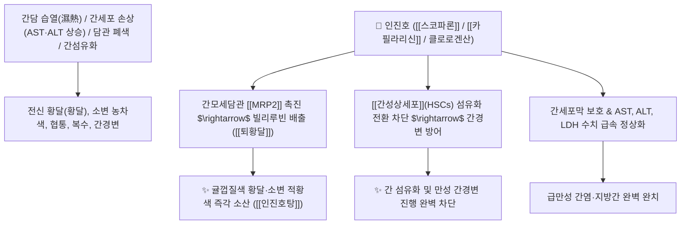

# 🌿 [[인진호]] (茵蔯蒿, Artemisiae Capillaris Herba / 사철쑥)

> **핵심 요약 (Key Summary)**:
> 국화과(*Asteraceae*) 사철쑥(*Artemisia capillaris*)의 어린 싹 또는 전초 (인진 茵蔯)
> 쿠마린인 [[스코파론]](Scoparone)과 플라보노이드인 [[카필라리신]](Capillarisin)이 [[MRP2]] 담즙 수송체를 활성화하고 간성상세포(HSC) 활성화를 차단하여 청열이습 및 퇴황달·간섬유화 억제 작용 발휘
> [[상한론]] 양명병(陽明病) 습열 황달(눈·피부·소변이 귤껍질색으로 누렇게 뜸) 및 급만성 간염(AST/ALT 상승)·담낭염·담석증·간경변증을 치료하는 천하제일의 [[청열이습]](淸熱利濕)·[[퇴황달]](退黃疸)·[[인진호탕]](茵蔯蒿湯)의 군약(君藥)

---
## 📌 목차
1. [기본 본초 정보 & 화학 구조 (Pharmacognosy)](#1-기본-본초-정보--화학-구조-pharmacognosy)
2. [핵심 분자약리 기전 & 스코파론·카필라리신·간성상세포(HSC) 섬유화 억제 네트워크](#2-핵심-분자약리-기전--스코파론카필라리신간성상세포hsc-섬유화-억제-네트워크)
3. [해부생체역학 / 간모세담관 MRP2 & 담도 오디괄약근 연계](#3-해부생체역학--간모세담관-mrp2--담도-오디괄약근-연계)
4. [사상의학 및 임상 응용 (양황 vs 음황 인진 배오 감별)](#4-사상의학-및-임상-응용-양황-vs-음황-인진-배오-감별)
5. [상한론 『약징(藥徵)』 분석 및 배오 원리 (인진호탕 & 인진오령산)](#5-상한론-약징藥徵-분석-및-배오-원리-인진호탕--인진오령산)
6. [핵심 처방 비교 매트릭스](#6-핵심-처방-비교-매트릭스)
7. [출처 및 학술 참고 문헌 (References)](#7-출처-및-학술-참고-문헌-references)

---
## 1. 기본 본초 정보 & 화학 구조 (Pharmacognosy)

| 항목 | 상세 내용 |
| :--- | :--- |
| **기원 식물** | 국화과(Compositae / Asteraceae) 사철쑥 *Artemisia capillaris* Thunb.의 어린 전초 |
| **성미 (性味)** | 苦·辛, 微寒 |
| **귀경 (歸經)** | 脾·胃·肝·膽經 (비경, 위경, 간경, 담경) - **간담의 습열을 소변으로 씻어냄** |
| **효능 (Actions)** | [[청열이습]](淸熱利濕), [[퇴황달]](退黃疸), [[이담보간]](利膽保肝), [[해독료창]](解毒療瘡) |
| **주요 성분** | • **쿠마린 유도체(지표물질)**: [[스코파론]] (Scoparone / 6,7-Dimethoxycoumarin), 스코폴레틴<br>• **크로몬 및 플라보노이드**: [[카필라리신]] (Capillarisin, KP 규격 $\ge 0.10\%$), 아르테미시닌 유도체<br>• **페놀산**: 클로로겐산(Chlorogenic acid, KP 규격 $\ge 1.0\%$), 카페인산 |

> **[유래 및 본초학적 기전]**:
> * 혹독한 겨울 추위에도 뿌리가 죽지 않고 묵은 줄기(蔯)에서 다시 새싹(茵)이 돋아난다 하여 '인진(茵蔯)'이라 불립니다.
> * 간과 담낭에 습열(濕熱)이 훈증하여 온몸이 귤껍질처럼 샛노랗게 뜨는 [[황달]](黃疸)을 치료하는 천하제일의 성약(治黃之聖藥)입니다.
> * 간세포 보호와 담즙 분비는 물론, [[간성상세포]](HSCs)의 활성화를 막아 간 섬유화 및 간경변 진행을 원천 차단합니다.

### 🔬 인진호의 주요 쿠마린 및 크로몬 화학 구조와 간성상세포 메커니즘
![[Pasted image 20240502102806.png|450]]
> **[구조적 특징 및 간섬유화 차단]**: [[스코파론]]과 [[카필라리신]]은 간모세담관의 [[MRP2]](Multidrug Resistance Protein 2) 단백질 발현을 촉진하여 빌리루빈을 배출시키고, [[TGF-β1]] 및 [[PDGF]] 신호를 차단하여 간성상세포(HSC)가 비타민 A(레티놀)를 소모하며 근섬유아세포로 변환되는 간섬유화 과정을 완벽히 억제합니다.

---
## 2. 핵심 분자약리 기전 & 스코파론·카필라리신·간성상세포(HSC) 섬유화 억제 네트워크



### (1) 표적 퇴황달 및 간세포 보호 작용
* **습열 황달(양황 陽黃) 완치 ([[퇴황달]] 退黃疸)**:
  * 눈의 흰자위와 전신 피부, 소변이 샛노랗게 뜨는 급성 간염 및 담관염 황달을 소변을 통해 씻어냅니다 ([[인진호탕]]).
* **간 섬유화 억제 및 간성상세포 활성 차단**:
  * 만성 간염 환자의 간경변 진행을 방지하고 콜라겐 기질 침착을 억제합니다.
* **담즙 분비 촉진(이담) 및 담석증 산통 완화**:
  * 오디 괄약근을 이완시키고 담즙 분비량을 늘려 담석과 담낭염 통증을 완화합니다.

---
## 3. 해부생체역학 / 간모세담관 MRP2 & 담도 오디괄약근 연계

* **간세포-담관-십이지장 담즙 배출 경로 개통**:
  * 담즙 울체를 해소하여 담즙산에 의한 간세포 자가용해 손상을 방지합니다.

---
## 4. 사상의학 및 임상 응용 (양황 vs 음황 인진 배오 감별)

```
[🔍 황달의 한열(寒熱) 감별 및 인진호 배오]
• 양황(陽黃, 습열 황달): 온몸이 선명한 귤껍질색으로 노랗고 열이 나며 변비 $\rightarrow$ [[인진호탕]](인진 + 치자 + 대황)
• 음황(陰黃, 한습 황달): 얼굴이 거무스레하게 노랗고 몸이 차며 소화불량 $\rightarrow$ [[인진사역탕]](인진 + 부자 + 건강)

[✅ 최적 적응증 (Sweet Spot)]
• 급만성 간염 및 황달: 피로감이 극심하고 눈이 노랗게 변하며 간수치(AST/ALT)가 치솟을 때 ([[인진호탕]])
• 담석증 및 담낭염 복통
• 간경변증 초기 및 지방간
```

---
## 5. 상한론 『약징(藥徵)』 분석 및 배오 원리 (인진호탕 & 인진오령산)

### (1) 『[[약징]]』에 나타난 인진호의 주치
> **"茵蔯蒿 主治發黃也..."**  
> (인진호의 주치는 몸이 누렇게 뜨는 발황(發黃, 황달)을 치료하는 것이다. 황달이 없더라도 간 병변이 있다면 활용한다.)

* **핵심 배오 원리**:
  * [[인진호]] + [[산치자]] + [[대황]] $\rightarrow$ 습열을 소변과 대변으로 나누어 빼내는 천하제일 황달방 ([[인진호탕]])
  * [[인진호]] + [[오령산]] $\rightarrow$ 수습 정체와 황달을 동시에 치료 ([[인진오령산]])
  * [[인진호]] + [[부자]] + [[건강]] $\rightarrow$ 한습 음황을 덥혀서 치료 ([[인진사역탕]])

---
## 6. 핵심 처방 비교 매트릭스

| 처방명 | 구성 약재 | 주치 병증 및 임상 타깃 | 특징 및 감별점 |
| :--- | :--- | :--- | :--- |
| [[인진호탕]] | [[인진호]], [[산치자]], [[대황]] | **양명병 습열 황달, 전신 발황, 소변 불리, 복만 대변비** | 황달 치료의 황제방 |
| [[인진오령산]] | [[인진호]] + [[오령산]]([[택사]], [[복령]], [[백출]], [[저령]], [[계지]]) | **습열 황달, 소변 불리, 구갈, 수종, 구토** | 이뇨를 통해 황달을 뺌 |
| [[인진사역탕]] | [[인진호]], [[부자]], [[건강]], [[감초]] | **음황(한습 황달), 안색 암황, 수족궐냉, 맥침미** | 몸을 덥혀 황달을 소산 |

---
## 7. 출처 및 학술 참고 문헌 (References)

1. **Jang, E., et al. (2015)**. The hepatoprotective and anti-fibrotic effects of *Artemisia capillaris* via inhibition of hepatic stellate cell activation. *Journal of Ethnopharmacology*, 174, 502-512.
   - **[연구 요약]**: 인진호 추출물이 간성상세포 활성화를 차단하여 간 섬유화 및 간경변을 유의하게 억제하고 담즙 분비를 촉진함을 규명.
2. **대한민국약전(KP) 제12개정 (2022)**. 의약품각조 제2부: 인진호 (Artemisiae Capillaris Herba) 규격 기준.
   - **[공정서 규격]**: 건조물 기준 카필라리신 0.10% 및 클로로겐산 1.0% 이상 함유 필수 규격 명시.
3. **길익동동 (吉益東洞, 1784)**. 『약징(藥徵)』: 茵蔯蒿 조문.
   - **[고전 원전]**: "茵蔯蒿 主治發黃也" - 황달 주치 및 간 질환 치료 원리 제시.