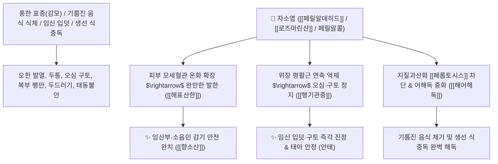

---
aliases:
  - 소엽
  - 자소엽
  - 蘇葉
  - 紫蘇葉
  - 차즈기
  - Perillae Folium
---
# 🌿 [[자소엽]] (紫蘇葉, Perillae Folium / 차즈기잎)


> **핵심 요약 (Key Summary)**:
> 꿀풀과(*Lamiaceae*) 차즈기(*Perilla frutescens* var. *acuta*)의 건조한 잎과 어린 가지
> 모노테르펜 정유인 [[페릴알데히드]](Perillaldehyde)와 [[로즈마린산]](Rosmarinic acid)이 페롭토시스(Ferroptosis, 지질과산화 세포사멸)를 차단하고 위장관 평활근 경련을 이완시켜 해표산한 및 행기안태 작용 발휘
> [[소음인]]의 풍한 감모·임산부 감기 및 위장관 한응(기름진 음식 소화불량·오심 구토·임신 입덧)·게나 생선 식중독(어해독)을 치료하는 대표적인 [[해표산한]](解表散寒)·[[행기관중]](行氣寬中)·[[행기안태]](行氣安胎)·[[해어해독]](解魚蟹毒) 군약(君藥)

---
## 📌 목차
1. [기본 본초 정보 & 화학 구조 (Pharmacognosy)](#1-기본-본초-정보--화학-구조-pharmacognosy)
2. [핵심 분자약리 기전 & 페릴알데히드·페롭토시스 억제·항산화 네트워크](#2-핵심-분자약리-기전--페릴알데히드페롭토시스-억제항산화-네트워크)
3. [해부생체역학 / 위점막 미세혈류 & 자궁 근층 안정화 연계](#3-해부생체역학--위점막-미세혈류--자궁-근층-안정화-연계)
4. [사상의학 및 임상 응용 (소음인 감기 vs 임산부 입덧·안태 특화)](#4-사상의학-및-임상-응용-소음인-감기-vs-임산부-입덧안태-특화)
5. [고전 의학 및 배오 원리 (향소산 & 궁소산 배오)](#5-고전-의학-및-배오-원리-향소산--궁소산-배오)
6. [핵심 처방 비교 매트릭스](#6-핵심-처방-비교-매트릭스)
7. [출처 및 학술 참고 문헌 (References)](#7-출처-및-학술-참고-문헌-references)

---
## 1. 기본 본초 정보 & 화학 구조 (Pharmacognosy)

| 항목 | 상세 내용 |
| :--- | :--- |
| **기원 식물** | 꿀풀과(Labiatae / Lamiaceae) 차즈기 *Perilla frutescens* Britton var. *acuta* Kudo 또는 주름소엽의 잎 및 어린 가지 |
| **성미 (性味)** | 辛, 溫 (향기롭고 따뜻함) |
| **귀경 (歸經)** | 肺·脾經 (폐경, 비경) - **폐의 체표 한사를 풀고 비위의 기운을 틔움** |
| **효능 (Actions)** | [[해표산한]](解表散寒), [[행기관중]](行氣寬中), [[행기안태]](行氣安胎), [[해어해독]](解魚蟹毒) |
| **주요 성분** | • **모노테르페노이드 정유(지표물질)**: [[페릴알데히드]] (Perillaldehyde, KP 규격 $\ge 0.10\%$), [[페릴알콜]] (Perillic alcohol), 리모넨<br>• **폴리페놀 및 항산화 페놀산**: [[로즈마린산]] (Rosmarinic acid), 루테올린, 아피게닌<br>• **비타민 및 미네랄**: [[비타민 K]], 나이아신, 칼륨, 철, 마그네슘 |

> **[유래 및 본초학적 기전]**:
> * 잎이 선명한 자주색(紫)을 띠며, 식중독이나 감기로 죽어가는 사람을 되살려낸다(蘇) 하여 '자소엽(紫蘇葉)'이라 불렸습니다.
> * 마황이나 계지보다 발한력이 부드럽고 온화하여 **임산부와 노약자, 소음인의 안전한 해열 발표약**으로 쓰입니다.
> * 깻잎과 유사한 향기로운 정유가 비위를 덥혀 구토와 입덧을 멎게 하고, **기름진 음식이나 게·물고기를 먹고 체한 식중독(魚蟹毒)**을 풀어줍니다.

### 🔬 자소엽의 주요 정유 지표물질 화학 구조 및 페롭토시스 기전
![[Pasted image 20240227143816.png|450]]
![[Pasted image 20240227143828.png|450]]
> **[구조적 특징 및 페롭토시스(Ferroptosis) 억제]**: [[로즈마린산]]과 [[페릴알데히드]]는 지질 과산화물 축적으로 인한 세포 사멸 경로인 **페롭토시스(Ferroptosis)**를 강력히 억제하여 기름진 음식 섭취 후 발생하는 장관 염증, 여드름, 소화불량을 개선합니다.  
> 🔗 [자소엽 항산화 기전 참고 아티클](https://evada.tistory.com/5909223)

---
## 2. 핵심 분자약리 기전 & 페릴알데히드·페롭토시스 억제·항산화 네트워크



### (1) 표적 해표산한 및 행기관중 작용
* **임산부 및 허약자 감기 치료 ([[해표산한]] 解表散寒)**:
  * 몸살 기운이 있고 으슬으슬 추우며 코가 막히는 감기를 태아 손상 없이 안전하게 치료합니다 ([[궁소산]]).
* **위장관 가스 팽만 및 오심 구토 해소 ([[행기관중]] 行氣寬中)**:
  * 명치가 답답하고 헛구역질이 나며 입맛이 없는 위장 장애를 상쾌한 향기로 틔워줍니다.
* **임신 입덧 진정 및 안태(行氣安胎)**:
  * 임신부의 위기(胃氣) 상역을 내려 구토를 멎게 하고 불안한 태기를 편안하게 가라앉힙니다.
* **생선·게 식중독 해독 ([[해어해독]] 解魚蟹毒)**:
  * 어패류 섭취 후 발생하는 복통, 설사, 알레르기 두드러기를 신속히 해독합니다.

---
## 3. 해부생체역학 / 위점막 미세혈류 & 자궁 근층 안정화 연계

* **위장관 점막 카하알 사이세포(ICC) 율동 정상화**:
  * 역류성 연동운동을 억제하고 순방향 소화 연동을 촉진합니다.

---
## 4. 사상의학 및 임상 응용 (소음인 감기 vs 임산부 입덧·안태 특화)

```
[✅ 체질별 적응증 (Sweet Spot)]
• [[소음인]] 울광증 초기 감기: 추위를 타고 머리가 아프며 소화가 잘 안 되는 감모 ([[향소산]])
• 임산부 감기 및 입덧: 기침과 열이 나거나, 헛구역질로 음식을 못 먹는 산모 ([[궁소산]])
• 기름진 음식 식체: 고기나 튀김을 먹고 속이 메스껍고 묽은 변을 볼 때
• 회나 게를 먹고 난 뒤의 복통 두드러기
```

---
## 5. 고전 의학 및 배오 원리 (향소산 & 궁소산 배오)

### (1) 부드러운 발표와 안태의 최고 명방
* **소음인 해표 최고 배오**:
  * [[자소엽]] + [[향부자]] + [[진피]] + [[감초]] $\rightarrow$ 기운을 순행시키고 감기를 푸는 불후의 명방 ([[향소산]])
  * [[자소엽]] + [[천궁]] + [[당귀]] + [[백출]] $\rightarrow$ 임산부 감기와 입덧을 치료하는 안태방 ([[궁소산]])

---
## 6. 핵심 처방 비교 매트릭스

| 처방명 | 구성 약재 | 주치 병증 및 임상 타깃 | 특징 및 감별점 |
| :--- | :--- | :--- | :--- |
| [[향소산]] | [[자소엽]], [[향부자]], [[진피]], [[창출]], [[감초]] | [[소음인]] **외감 풍한, 두통, 흉협 팽만, 식욕부진, 오심** | 기운을 틔우며 감기를 치료 |
| [[궁소산]] | [[천궁]], [[자소엽]], [[당귀]], [[백출]], [[진피]], [[감초]] | **임산부 감기, 발열 오한, 두통, 입덧, 태동불안** | 임신 중 가장 안전한 발표안태방 |
| [[삼소음]] | [[자소엽]], [[인삼]], [[반하]], [[전호]], [[갈근]], [[복령]] | **허약자·노인 풍한 감모, 기침 가래, 흉민 구토** | 기운을 보하며 가래와 감기 퇴치 |
| [[곽향정기산]](가미) | [[곽향]], [[자소엽]], [[백지]], [[대복피]], [[반하]] | 여름철 냉방병, 위장형 감기, 곽란 토사, 식중독 | 위장을 다스리고 한사를 몰아냄 |

---
## 7. 출처 및 학술 참고 문헌 (References)

1. **Ueda H et al. (2002)**. Luteolin as an anti-inflammatory and anti-allergic constituent of Perilla frutescens. *Biological & pharmaceutical bulletin*, 25(9): 1197-202. [PMID: 12230117](https://pubmed.ncbi.nlm.nih.gov/12230117/)
   - **[연구 요약]**: 자소엽의 로즈마린산 및 정유 성분이 지질 과산화 억제 및 항알레르기 활성을 나타냄을 규명.
2. **대한민국약전(KP) 제12개정 (2022)**. 의약품각조 제2부: 자소엽 (Perillae Folium) 규격 기준.
   - **[공정서 규격]**: 건조 잎 및 줄기의 성상, 순도시험 및 건조감량 12.0% 이하 기준 명시.
