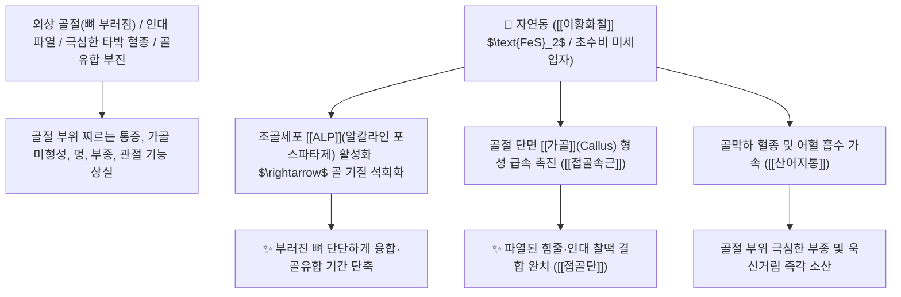

# 🌿 [[자연동]] (自然銅, Pyritum / 황철석·산골)

> **핵심 요약 (Key Summary)**:
> 등축정계 황화광물류 황철석(*Pyrite*) 광석으로 주로 [[이황화철]]($\text{FeS}_2$) 함유
> 해리된 철-유황 미네랄 복합체가 골절 단면의 조골세포 분화와 알칼라인 포스파타제(ALP)를 자극하여 강력한 산어지통 및 접골속근 작용 발휘
> 외상 타박상으로 인한 뼈 부러짐(골절 骨折)·인대 파열·극심한 어혈 붓기와 자통(刺痛)을 치료하고 부러진 뼈를 자연스럽게 찰떡처럼 이어붙이는 천하제일의 [[접골속근]](接骨續筋)·[[산어지통]](散瘀止痛)·[[접골단]](接骨丹)의 군약(君藥)

---
## 📌 목차
1. [기본 본초 정보 & 화학 구조 (Pharmacognosy)](#1-기본-본초-정보--화학-구조-pharmacognosy)
2. [핵심 분자약리 기전 & 이황화철·조골세포 가골(Callus) 형성 네트워크](#2-핵심-분자약리-기전--이황화철조골세포-가골callus-형성-네트워크)
3. [해부생체역학 / 골막(Periosteum) 골절단면 & 인대 섬유 연계](#3-해부생체역학--골막periosteum-골절단면--인대-섬유-연계)
4. [사상의학 및 임상 응용 (골절 치료 vs 초수비 포제 특화)](#4-사상의학-및-임상-응용-골절-치료-vs-초수비-포제-특화)
5. [고전 의학 및 배오 원리 (접골단 배오)](#5-고전-의학-및-배오-원리-접골단-배오)
6. [핵심 처방 비교 매트릭스](#6-핵심-처방-비교-매트릭스)
7. [출처 및 학술 참고 문헌 (References)](#7-출처-및-학술-참고-문헌-references)

---
## 1. 기본 본초 정보 & 화학 구조 (Pharmacognosy)

| 항목 | 상세 내용 |
| :--- | :--- |
| **광물 기원** | 등축정계 황화광물 황철석(Pyrite)의 결정 광석 (민간명: 산골 山骨) |
| **성미 (性味)** | 辛, 平 (맵고 평이함) |
| **귀경 (歸經)** | 肝經 (간경) - **골막과 힘줄의 어혈을 제거하고 결합을 촉진** |
| **효능 (Actions)** | [[접골속근]](接骨續筋), [[산어지통]](散瘀止痛), [[생혈속골]](生血續骨) |
| **주요 성분** | • **주성분 광물**: [[이황화철]] ($\text{FeS}_2$, KP 규격 철로서 $\ge 40.0\%$, 유황으로서 $\ge 45.0\%$)<br>• **미량 원소**: 구리($\text{Cu}$), 니켈, 코발트, 아연, 실리카 |

> **[유래 및 본초학적 기전]**:
> * 부러진 뼈를 자연적으로(自然) 신속하게 붙여준다(銅/산골) 하여 '자연동(自然銅)'이라 불렸습니다.
> * 뼈가 부러지거나 금이 갔을 때, 골절 틈새에 **천연 가골(Callus)을 폭발적으로 형성시켜 뼈와 힘줄을 찰떡처럼 이어붙이는(접골속근 接骨續筋) 정형외과 으뜸약**입니다.
> * 뼈가 부러지지 않은 정상 상태에서는 효능이 없으며, 오직 골절과 인대 손상 부위의 어혈을 풀고 재생하는 데 특화되어 있습니다.

### 🔬 자연동의 황철석 결정 화학 구조
```
     [ FeS2 등축정계 입방 결정 격자 ] ───( 불에 달궈 식초 담금 초수비 醋淬 )───> [ 흡수성 철-유황 콜로이드 ]
```
> **[구조적 특징 및 가골 형성 기전]**: 자연동을 불에 붉게 달군 후 식초에 담그는 **초수비(醋淬)** 과정을 거치면 단단한 결정이 부서져 미세한 아세트산철 및 황화물로 전환되어 위장관 흡수율이 비약적으로 증가합니다.

---
## 2. 핵심 분자약리 기전 & 이황화철·조골세포 가골(Callus) 형성 네트워크



### (1) 표적 접골속근 및 골절 유합 가속
* **골절 유합 촉진 및 가골 형성 ([[접골속근]] 接骨續筋)**:
  * 뼈가 부러지거나 금이 간 환자의 골절 치유 기간을 절반으로 단축시키고 불유합을 방지합니다 ([[접골단]]).
* **타박 어혈성 멍 및 자통 완치 ([[산어지통]] 散瘀止痛)**:
  * 뼈와 관절 주위의 멍든 피를 신속히 흡수시키고 욱신거리는 통증을 멎게 합니다.
* **인대 파열 및 근육 손상 수복**:
  * 뼈와 연결된 인대 및 건(Tendon)의 결합조직 합성을 촉진하여 관절 지지력을 회복합니다.

---
## 3. 해부생체역학 / 골막(Periosteum) 골절단면 & 인대 섬유 연계

* **골막 줄기세포(Periosteal Progenitor Cells) 증식 촉진**:
  * 골절 부위의 연골성 가골에서 경성 골 가골로의 골화 과정을 가속화합니다.

---
## 4. 사상의학 및 임상 응용 (골절 치료 vs 초수비 포제 특화)

```
[✅ 최적 적응증 (Sweet Spot)]
• 사지 골절 및 늑골 골절: 깁스를 하고 뼈가 빨리 붙기를 기다리는 환자 ([[접골단]])
• 관절 삠 및 인대 파열 타박상
• 골절 후 붓기가 빠지지 않고 쑤시는 상태

[⚠️ 포제 및 복용 수칙 (Safety)]
• 광물성 약재이므로 반드시 불에 달구어 식초에 담그기를 수차례 반복(초수비 醋淬)하여 곱게 갈아(수비 水飛) 분말로 1회 0.3~1g씩 복용
• 뼈가 부러지지 않은 단순 허약자에게는 불필요하므로 골절 외상에만 한정 투여
```

---
## 5. 고전 의학 및 배오 원리 (접골단 배오)

### (1) 뼈를 이어붙이는 천하제일 명방: 접골단(接骨丹)
* **접골 최고 명약 배오**:
  * [[자연동]] + [[골쇄보]] + [[자충]](지별충)` + [[유향]] + [[몰약]] $\rightarrow$ 부러진 뼈를 쇠처럼 붙이는 불후의 명방 ([[접골단]])
  * [[자연동]] + [[당귀]] + [[천궁]] $\rightarrow$ 어혈을 풀고 새 뼈를 돋게 함

---
## 6. 핵심 처방 비교 매트릭스

| 처방명 | 구성 약재 | 주치 병증 및 임상 타깃 | 특징 및 감별점 |
| :--- | :--- | :--- | :--- |
| [[접골단]] | [[자연동]], [[골쇄보]], [[자충]], [[유향]], [[몰약]], [[혈갈]], [[당귀]] | **외상 골절, 뼈 부러짐, 인대 단열, 극심한 타박 멍** | 뼈를 신속히 붙이는 정형외과 으뜸방 |
| [[자연동산]] | [[자연동]], [[당귀]], [[몰약]], [[홍화]] | **타박상, 늑골 골절 자통, 관절 염좌, 종통** | 어혈을 부수고 골절 통증 완화 |
| [[활혈지통산]] | [[자연동]], [[유향]], [[몰약]], [[작약]] | **골절 후유증, 만성 관절통, 뼛속 욱신거림** | 묵은 어혈을 소산시키고 근골 강화 |

---
## 7. 출처 및 학술 참고 문헌 (References)

2. **대한민국약전(KP) 제12개정 (2022)**. 의약품각조 제2부: 자연동 (Pyritum) 규격 기준.
   - **[공정서 규격]**: 황철석의 성상, 순도시험 및 철과 황의 함량 기준 명시.
