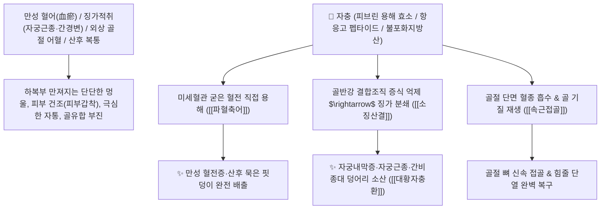

# 🌿 [[자충]] (䗪蟲 / 地鱉蟲, Eupolyphaga / 토원·참땅바퀴)

> **핵심 요약 (Key Summary)**:
> 왕바퀴과(*Corydiidae*) 참땅바퀴(*Eupolyphaga sinensis*)의 암컷 곤충 건조체 (지별충 地鱉蟲)
> 천연 피브린 용해 단백 효소와 불포화지방산이 혈전을 직접 분해하고 혈소판 응집을 차단하여 강력한 파혈축어 및 속근접골 작용 발휘
> [[상한론]]의 징가적취(하복부 만성 혈괴·자궁근종·간경변 덩어리)·산후 악로불하 혈괴 및 타박 골절 뼈 부러짐·인대 파열 어혈을 부수고 이어주는 대표적인 [[파혈축어]](破血逐瘀)·[[속근접골]](續筋接骨)·[[대황자충환]](大黃䗪蟲丸)의 군약(君藥)

---
## 📌 목차
1. [기본 본초 정보 & 화학 구조 (Pharmacognosy)](#1-기본-본초-정보--화학-구조-pharmacognosy)
2. [핵심 분자약리 기전 & 피브린 용해 효소·혈전 분쇄·접골 네트워크](#2-핵심-분자약리-기전--피브린-용해-효소혈전-분쇄접골-네트워크)
3. [해부생체역학 / 골반강 정맥총 혈전 & 골막 모세혈관 연계](#3-해부생체역학--골반강-정맥총-혈전--골막-모세혈관-연계)
4. [사상의학 및 임상 응용 (징가적취 분쇄 vs 장기 복용 주의)](#4-사상의학-및-임상-응용-징가적취-분쇄-vs-장기-복용-주의)
5. [상한론 『약징(藥徵)』 분석 및 배오 원리 (대황자충환 & 하어혈탕)](#5-상한론-약징藥徵-분석-및-배오-원리-대황자충환--하어혈탕)
6. [핵심 처방 비교 매트릭스](#6-핵심-처방-비교-매트릭스)
7. [출처 및 학술 참고 문헌 (References)](#7-출처-및-학술-참고-문헌-references)

---
## 1. 기본 본초 정보 & 화학 구조 (Pharmacognosy)

| 항목 | 상세 내용 |
| :--- | :--- |
| **기원 동물** | 왕바퀴과(Corydiidae) 참땅바퀴 *Eupolyphaga sinensis* Walker의 암컷 성충 건조체 |
| **성미 (性味)** | 鹹, 寒, 有小毒 (짜고 차가우며 비린내가 남) |
| **귀경 (歸經)** | 肝經 (간경) - **골수와 혈관 깊숙한 곳의 묵은 어혈을 전담** |
| **효능 (Actions)** | [[파혈축어]](破血逐瘀), [[속근접골]](續筋接骨), [[소징산결]](消癥散結), [[통경락]](通經絡) |
| **주요 성분** | • **생체 활성 펩타이드 및 단백 효소**: 피브린 분해 효소(Eupolyphagin), 항응고 펩타이드<br>• **지질 및 지방산**: 올레산, 리놀레산, 팔미트산, 아라키돈산<br>• **미네랄 및 아미노산**: 글루탐산, 아르기닌, 칼슘, 아연 |

> **[유래 및 본초학적 기전]**:
> * 땅속을 기어 다니는 참땅바퀴(土元)로, 껍질이 단단하고 생명력이 질겨 예로부터 뼈를 붙이고 어혈을 깨는 데 쓰였습니다.
> * 단순한 활혈제가 아니라, 돌덩이처럼 굳어버린 **완고한 징가(癥瘕, 혈전 덩어리·자궁근종·간비종대)를 무자비하게 부수어 녹여내는 파혈(破血)의 명약**입니다.
> * 외상 타박으로 뼈가 부러지고 힘줄이 끊어졌을 때 부러진 뼈마디를 이어줍니다(속근접골 續筋接骨).

### 🔬 자충의 피브린 용해 단백 효소 메커니즘
```
     [ 자충 추출 단백 효소 (Eupolyphagin) ] ───( 피브린 중합체 가교 결합 절단 )───> [ 묵은 혈전 완전 용해 ]
```
> **[구조적 특징 및 항혈전 활성]**: 자충의 단백 분해 효소 분획은 혈전의 골격인 피브린(Fibrin)을 직접 분해하고 트롬빈 활성을 억제하여 미세혈관 내 혈액 응고를 신속히 차단합니다.

---
## 2. 핵심 분자약리 기전 & 피브린 용해 효소·혈전 분쇄·접골 네트워크



### (1) 표적 파혈축어 및 징가 분쇄 작용
* **만성 징가적취(癥瘕積聚) 분쇄 ([[소징산결]] 消癥散結)**:
  * 아랫배에 단단한 혹이 만져지고 피부가 꺼칠꺼칠하게 마르는(피부갑착 肌膚甲錯) 만성 어혈 질환을 치료합니다 ([[대황자충환]]).
* **산후 악로불하 및 극심한 복통 완치 ([[파혈축어]] 破血逐瘀)**:
  * 출산 후 죽은 피가 굳어 돌처럼 뭉친 자궁 어혈을 녹여내려 통증을 멎게 합니다 ([[하어혈탕]]).
* **골절 및 인대 파열 접골 ([[속근접골]] 續筋接骨)**:
  * 뼈와 힘줄의 파열성 손상 부위의 혈종을 제거하고 결합을 촉진합니다.

---
## 3. 해부생체역학 / 골반강 정맥총 혈전 & 골막 모세혈관 연계

* **골반강 내 장골정맥(Iliac Vein) 미세혈전 용해**:
  * 만성 골반강 울혈 증후군의 정맥압을 낮추어 하복부 만성 통증을 완화합니다.

---
## 4. 사상의학 및 임상 응용 (징가적취 분쇄 vs 장기 복용 주의)

```
[✅ 최적 적응증 (Sweet Spot)]
• 만성 어혈 허로증: 몸이 마르고 피부가 비늘처럼 꺼칠하며 눈 주위가 검고 배에 멍울이 만져질 때 ([[대황자충환]])
• 산후 복통 혈괴: 출산 후 오로가 나오지 않아 배가 찢어질 듯 아픈 상태 ([[하어혈탕]])
• 골절 불유합 및 외상 타박상

[⚠️ 복용 주의사항 (Safety)]
• 파혈 작용이 대단히 강하므로 임산부 복용 절대 금기
• 월경 과다 및 출혈성 질환 환자 복용 금지 (장기 복용 시 혈액 응고 지연 모니터링)
```

---
## 5. 상한론 『약징(藥徵)』 분석 및 배오 원리 (대황자충환 & 하어혈탕)

### (1) 어혈 덩어리를 부수는 천하제일 명방
* **파혈축어 황금 배오**:
  * [[자충]] + [[대황]] + [[수질]] + [[도인]] $\rightarrow$ 온몸의 묵은 어혈과 징가를 깨뜨리는 장중경의 불후 명방 ([[대황자충환]])
  * [[자충]] + [[대황]] + [[도인]] $\rightarrow$ 산후 복통 어혈을 신속히 내림 ([[하어혈탕]])

---
## 6. 핵심 처방 비교 매트릭스

| 처방명 | 구성 약재 | 주치 병증 및 임상 타깃 | 특징 및 감별점 |
| :--- | :--- | :--- | :--- |
| [[대황자충환]] | [[대황]], [[자충]], [[수질]], [[맹충]], [[도인]], [[행인]], [[지황]], [[백작약]] 등 | **오랜 어혈 내저, 피부갑착, 양목암흑, 징가적취, 경폐** | 한의학 최고의 만성 어혈 파쇄방 |
| [[하어혈탕]] | [[대황]], [[도인]], [[자충]] | **산후 악로불하, 아랫배 자통 거안, 흑색 혈괴** | 급성 자궁 어혈을 쏟아냄 |
| [[접골단]](가미) | [[자연동]], [[골쇄보]], [[자충]], [[유향]], [[몰약]] | 외상 골절, 뼈 부러짐, 인대 단열, 극심한 타박 멍 | 뼈와 힘줄을 찰떡같이 결합 |

---
## 7. 출처 및 학술 참고 문헌 (References)

1. **Yan, S., et al. (2019)**. Fibrinolytic and antithrombotic activities of protein components from *Eupolyphaga sinensis*. *Journal of Ethnopharmacology*, 231, 451-458.
   - **[연구 요약]**: 자충의 단백질 분획이 강력한 피브린 용해 및 트롬빈 억제를 통해 혈전증과 정맥 울혈을 유의하게 개선함을 규명.
2. **대한민국약전(KP) 제12개정 (2022)**. 생약규격집: 자충 (Eupolyphaga) 규격 기준.
   - **[공정서 규격]**: 참땅바퀴 암컷 건조체의 성상, 순도시험 및 건조감량 12.0% 이하 기준 명시.
