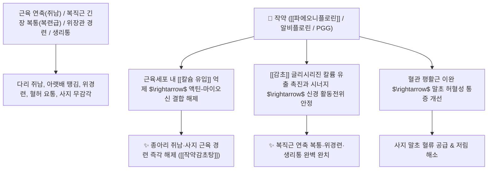

# 🌿 [[작약]] (芍藥, Paeoniae Radix / 백작약·적작약 총괄)

> **핵심 요약 (Key Summary)**:
> 미나리아재비과(*Ranunculaceae*) 작약(*Paeonia lactiflora*) 또는 적작약의 건조한 뿌리 (껍질 가공 여부에 따라 백작약과 적작약으로 구분)
> 모노테르펜 글루코사이드인 [[파에오니플로린]](Paeoniflorin)이 근육세포 내 칼슘($\text{Ca}^{2+}$) 유입을 차단하여 평활근 및 골격근 연축을 즉각 이완시키는 강력한 완급지통 및 유간 작용 발휘
> [[상한론]]의 복직근 연축 복통(주치 복련급 腹攣急)·사지 근육 쥐남(경련) 및 혈허 생리통·어혈 자통을 치료하는 천하제일의 [[양혈유간]](養血柔肝)·[[완급지통]](緩急止痛)·[[작약감초탕]](芍藥甘草湯)의 군약(君藥)

---
## 📌 목차
1. [기본 본초 정보 & 화학 구조 (Pharmacognosy)](#1-기본-본초-정보--화학-구조-pharmacognosy)
2. [핵심 분자약리 기전 & 파에오니플로린·칼슘 차단 근이완 네트워크](#2-핵심-분자약리-기전--파에오니플로린칼슘-차단-근이완-네트워크)
3. [해부생체역학 / 복직근 연축 & 골격근 지근/속근 이완 연계](#3-해부생체역학--복직근-연축--골격근-지근속근-이완-연계)
4. [사상의학 및 백작약 vs 적작약 포제·적응증 정밀 감별](#4-사상의학-및-백작약-vs-적작약-포제적응증-정밀-감별)
5. [상한론 『약징(藥徵)』 분석 및 배오 원리 (작약감초탕 & 계지탕)](#5-상한론-약징藥徵-분석-및-배오-원리-작약감초탕--계지탕)
6. [핵심 처방 비교 매트릭스](#6-핵심-처방-비교-매트릭스)
7. [출처 및 학술 참고 문헌 (References)](#7-출처-및-학술-참고-문헌-references)

---
## 1. 기본 본초 정보 & 화학 구조 (Pharmacognosy)

| 항목 | 상세 내용 |
| :--- | :--- |
| **기원 식물** | 미나리아재비과(Ranunculaceae) 작약 *Paeonia lactiflora* Pall. 또는 기타 동속식물의 뿌리 |
| **성미 (性味)** | 苦·酸, 微寒 |
| **귀경 (歸經)** | 肝·脾經 (간경, 비경) - **간혈을 자양하여 긴장된 근육을 풀어줌** |
| **효능 (Actions)** | [[양혈유간]](養血柔肝), [[완급지통]](緩急止痛), [[렴음지한]](斂陰止汗), [[활혈산어]](活血散瘀, 적작약) |
| **주요 성분** | • **모노테르펜 글루코사이드(핵심 지표)**: [[파에오니플로린]] (Paeoniflorin, KP 규격 $\ge 2.0\%$), 알비플로린(Albiflorin), 옥시파에오니플로린<br>• **탄닌 및 유기산**: 펜타오갈로일글루코오스(PGG), 갈산, 벤조산<br>• **다당류**: 작약 다당체(RG-I) |

> **[유래 및 본초학적 기전]**:
> * 탐스럽고 화려한 꽃을 피우는 작약의 뿌리로, 경련이 일어나 꼬이고 쥐어뜯듯 아픈 근육과 장기를 부드럽게 이완시키는(柔肝 완급지통) 한의학 최고의 근육 이완제입니다.
> * [[백작약]](白芍藥): 껍질을 벗겨 삶아 말린 것으로 혈을 보하고 땀을 거두며 부드럽게 통증을 멎게 함(양혈유간 養血柔肝).
> * [[적작약]](赤芍藥): 야생 작약의 껍질째 말린 것으로 혈열을 식히고 묵은 어혈을 깨뜨림(청열양혈 淸熱凉血, 활혈거어 活血祛瘀).

### 🔬 작약의 주요 지표물질 화학 구조
```
     [ 피나닐(Pinane) 모노테르펜 골격 ]───O──[ Glc ]  <-- 파에오니플로린 (Paeoniflorin)
```
> **[구조적 특징 및 칼슘 채널 차단]**: [[파에오니플로린]]은 세포막의 전압의존성 L형 칼슘 채널을 차단하여 근소포체로부터의 $\text{Ca}^{2+}$ 방출을 억제하고 액틴-마이오신 교차결합을 풀어 근육 경련을 즉각 해제합니다.

> 🧬 **현대 학술 근거 (2026-09-07 B-7 패치)** — PubChem 실측 분자 앵커: [[파에오니플로린]](Paeoniflorin) CID **442534** · 분자식 C₂₃H₂₈O₁₁ · MW 480.5 (KP 2.0% 규격 배치 확인)

🔬 **분자 구조** (Wikimedia Commons, Public Domain)

![[Paeoniflorin_구조.png|480]]
> [그림 1] 파에오니플로린(Paeoniflorin, C₂₃H₂₈O₁₁) 분자 구조 — 출처: Wikimedia Commons


---
## 2. 핵심 분자약리 기전 & 파에오니플로린·칼슘 차단 근이완 네트워크



### (1) 표적 완급지통 및 근육 이완 작용
* **종아리 쥐남 및 골격근 경련 해제 ([[완급지통]] 緩急止痛)**:
  * 야간에 갑자기 종아리에 쥐가 나거나 운동 중 근육이 뭉쳐 굳어버리는 경련을 즉각 풀어줍니다 ([[작약감초탕]]).
* **복직근 연축 복통 및 위경련 완치 ([[약징]] 복련급 腹攣急)**:
  * 배에 힘이 들어가 판자처럼 굳어 있고 만지면 욱신거리는 복통을 부드럽게 이완시킵니다.
* **양혈조경(養血調經) 및 진정**:
  * 간혈(肝血)을 보충하여 생리통, 두통, 현훈 및 자율신경실조증을 안정화합니다.

> 🧬 **현대 학술 근거 (2026-09-07 B-7 패치)** — 파에오니플로린의 근이완 기전이 이온채널 조절을 넘어 신경·면역 조절 축으로 확장된 최신 연구들:
> - 척수손상 후 근경직: 가미 [[작약감초탕]](작약:감초=3:1)이 **lncRNA H19↑ → miR-185-5p↓ → Tph1(트립토판 수산화효소 1)↑ → 5-HT 합성 촉진** 축을 매개로 BBB 운동 회복 점수를 유의 개선(P<0.01), H19 억제제로 효과 역전 — 인과성 확인(PMID 42677740).
> - 궤양성 대장염: 파에오니플로린이 **SOCS1 상향 → JAK1/STAT1 인산화 억제**로 대식세포 M1 분극을 차단하고 M2로 전환시키며 장관 장벽 단백질(ZO-1·MUC2·E-cadherin)을 회복 — '이기·지통'의 장 점막 보호 근거(PMID 42322861).
> - 류마티스 관절염: 작약감초탕 및 4대 활성 성분(파에오니플로린·리퀴리틴·글리시리진산·글리시레틴산)이 **TNF-α/NF-κB 경로(IKK·IκBα·p65)를 직접 억제**, 분자 도킹·CETSA로 결합 실측 — 완급지통의 痹症(RA·OA) 확장 근거(PMID 41866004).

---
## 3. 해부생체역학 / 복직근 연축 & 골격근 지근/속근 이완 연계

* **복직근(Rectus Abdominis) 및 장요근(Iliopsoas) 과긴장 해제**:
  * 척추 기립근 및 골반 안정화 근육의 비대칭적 긴장도를 낮추어 요통을 완화합니다.

---
## 4. 사상의학 및 백작약 vs 적작약 포제·적응증 정밀 감별

```
[🔍 백작약 vs 적작약 정밀 감별]
• [[백작약]](白芍): 재배 작약 근피 제거 후 삶음 $\rightarrow$ 보혈양혈(補血養血)·유간지통(柔肝止痛) (혈허, 근육경련, 자한)
• [[적작약]](赤芍): 야생 작약 근피 보존 $\rightarrow$ 청열량혈(淸熱凉血)·산어지통(散瘀止痛) (혈열, 어혈 발반, 타박 멍)

[💡 감초와의 황금 배오: 작약감초탕(芍藥甘草湯) 메커니즘]
• 작약([[파에오니플로린]]): 신경절전 뉴런 및 근육세포 칼슘(Ca2+) 유입 차단
• 감초([[글리시리진]]): 신경절후 뉴런 칼륨(K+) 유출 촉진
$\rightarrow$ 둘이 결합하여 신경 전달과 근수축을 동시에 차단하는 '천연 근이완제' 완성
```

---
## 5. 상한론 『약징(藥徵)』 분석 및 배오 원리 (작약감초탕 & 계지탕)

### (1) 『[[약징]]』에 나타난 작약의 주치
> **"芍藥 主治結實而攣急也. 旁治腹痛, 頭痛, 身體不仁, 疼痛, 腹滿, 咳逆, 下利, 癰膿..."**  
> (작약의 주치는 단단하게 뭉쳐 굳고 쥐어짜듯 당기는 결실이련급(結實而攣急)이다. 곁들여 복통, 두통, 몸의 무감각, 부종과 고름을 치료한다.)

* **핵심 배오 원리**:
  * [[작약]] + [[감초]] $\rightarrow$ 근육 연축과 쥐남을 푸는 천하제일방 ([[작약감초탕]])
  * [[계지]] + [[작약]] ($1:1$ 배오) $\rightarrow$ 영위(營衛)를 조화롭게 하여 체표 순환을 뚫음 ([[계지탕]])
  * [[작약]] 배량 배오 $\rightarrow$ 복통을 완화 ([[계지가작약탕]])

---
## 6. 핵심 처방 비교 매트릭스

| 처방명 | 구성 약재 | 주치 병증 및 임상 타깃 | 특징 및 감별점 |
| :--- | :--- | :--- | :--- |
| [[작약감초탕]] | [[작약]], [[감초]] (동량 배오) | **골격근 경련, 종아리 쥐남, 복직근 긴장 복통, 위경련** | 근이완 진통의 천하제일방 |
| [[계지가작약탕]] | [[계지탕]] 기본방 + [[작약]] 2배 증량 | **태음병 복만시통(배가 빵빵하고 때때로 아픔), 이급후중** | 장관 경련 복통을 이완 |
| [[소건중탕]] | [[계지가작약탕]] + [[교이]](이당) | **허로 복통, 소아 야제증, 사지 산통, 식은땀, 피로** | 비위를 보하고 통증 완화 |
| [[진무탕]] | [[복령]], [[작약]], [[백출]], [[생강]], [[부자]] | **소음병 수기 범람, 사지 무거움과 통증, 현훈, 설사** | 수기를 빼고 근육통 완화 |

---
## 7. 출처 및 학술 참고 문헌 (References)

1. **Kimura, M., et al. (1984)**. Central and peripheral muscle relaxant actions of paeoniflorin and its synergism with glycyrrhizin. *Japanese Journal of Pharmacology*, 36(2), 221-229.
   - **[연구 요약]**: 작약의 파에오니플로린과 감초의 글리시리진이 칼슘/칼륨 이온 채널을 매개로 강력한 근이완 시너지를 발휘함을 입증.
2. **대한민국약전(KP) 제12개정 (2022)**. 의약품각조 제2부: 작약 (Paeoniae Radix) 규격 기준.
   - **[공정서 규격]**: 건조물 기준 파에오니플로린($\text{C}_{23}\text{H}_{28}\text{O}_{11}$) 2.0% 이상 함유 필수 규격 명시.
3. **길익동동 (吉益東洞, 1784)**. 『약징(藥徵)』: 芍藥 조문.
   - **[고전 원전]**: "芍藥 主治結實而攣急也..." - 뭉치고 당기며 쥐나는 근육 연축 주치 원리 제시.
4. **Qiao, Y., Ma, W., Zhou, Y., & Xie, Y. (2026)**. Modified Shaoyao Gancao decoction alleviates post-spinal cord injury muscle spasticity by regulating the lncRNA H19/miR-185-5p/Tph1 axis. *China Journal of Orthopaedics and Traumatology*. PMID: 42677740 · DOI: 10.12200/j.issn.1003-0034.20250453
   - **[연구 요약]**: lncRNA H19/miR-185-5p/Tph1-5-HT 축 매개 척수손상 후 근경직 완화 — 가미 작약감초탕(3:1)의 신경축 기전.
5. **Liu, S., et al. (2026)**. Paeoniflorin regulates macrophage polarization and protects the intestinal barrier through SOCS1/JAK1/STAT1 pathway in ulcerative colitis. *International Immunopharmacology*. PMID: 42322861 · DOI: 10.1016/j.intimp.2026.117008
   - **[연구 요약]**: SOCS1/JAK1/STAT1 경로를 통한 M1→M2 분극 전환 및 장관 장벽(ZO-1·MUC2·E-cadherin) 회복.
6. **Zhao, Y., et al. (2026)**. Shaoyao Gancao Decoction ameliorates rheumatoid arthritis via inhibition of TNF-α/NF-κB signaling pathway. *Journal of Ethnopharmacology*. PMID: 41866004 · DOI: 10.1016/j.jep.2026.121552
   - **[연구 요약]**: CIA 랫트·MH7A 윤활막세포에서 TNF-α/NF-κB 억제, 분자 도킹·CETSA 결합 실측.