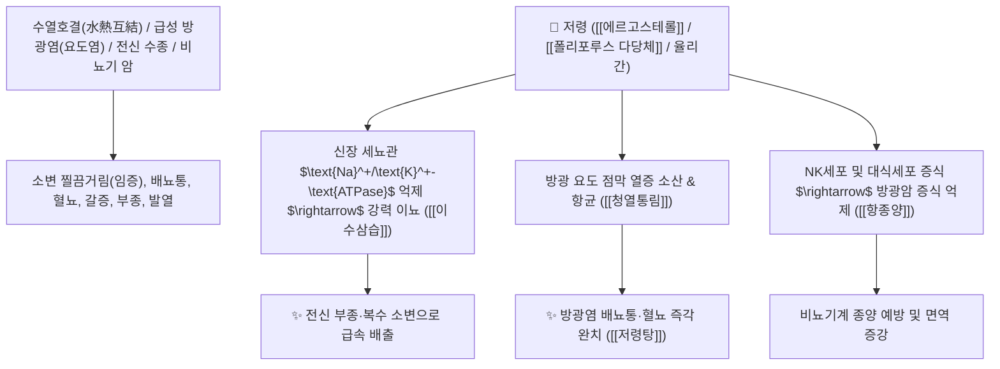

# 🌿 [[저령]] (猪苓, Polyporus / 저령균핵)

> **핵심 요약 (Key Summary)**:
> 구멍장이버섯과(*Polyporaceae*) 저령(*Polyporus umbellatus*)의 건조한 균핵(버섯덩이)
> 다당류인 [[폴리포루스 다당체]](Polyporus Polysaccharide)와 [[에르고스테롤]](Ergosterol)이 신장 수분 수송체를 억제하여 나트륨과 수분 배출을 급증시키고 면역세포를 활성화하여 이수삼습 및 항종양 작용 발휘
> [[상한론]]의 수열호결(水熱互結, 열이 방광에 뭉쳐 소변이 찔끔거리고 아프며 피가 섞여 나옴)·전신 수종·갈증과 요실금 및 비뇨기 암을 치료하는 하초 최고의 [[이수삼습]](利水滲濕)·[[저령탕]](猪苓湯)의 군약(君藥)

---
## 📌 목차
1. [기본 본초 정보 & 화학 구조 (Pharmacognosy)](#1-기본-본초-정보--화학-구조-pharmacognosy)
2. [핵심 분자약리 기전 & 폴리포루스 다당체·신장 삼투이뇨·항암 네트워크](#2-핵심-분자약리-기전--폴리포루스-다당체신장-삼투이뇨항암-네트워크)
3. [해부생체역학 / 신장 Henle 고리 & 방광 삼각부 상피 연계](#3-해부생체역학--신장-henle-고리--방광-삼각부-상피-연계)
4. [사상의학 및 임상 응용 (저령 vs 복령 하초 이수 특화 감별)](#4-사상의학-및-임상-응용-저령-vs-복령-하초-이수-특화-감별)
5. [상한론 『약징(藥徵)』 분석 및 배오 원리 (저령탕 & 오령산)](#5-상한론-약징藥徵-분석-및-배오-원리-저령탕--오령산)
6. [핵심 처방 비교 매트릭스](#6-핵심-처방-비교-매트릭스)
7. [출처 및 학술 참고 문헌 (References)](#7-출처-및-학술-참고-문헌-references)

---
## 1. 기본 본초 정보 & 화학 구조 (Pharmacognosy)

| 항목 | 상세 내용 |
| :--- | :--- |
| **기원 식물** | 구멍장이버섯과(Polyporaceae) 저령 *Polyporus umbellatus* (Pers.) Fries의 균핵 |
| **성미 (性味)** | 甘·淡, 平 |
| **귀경 (歸經)** | 腎·膀胱經 (신경, 방광경) - **오로지 하초 수도(水道)의 수분을 배출** |
| **효능 (Actions)** | [[이수삼습]](利水滲濕), [[청열통림]](淸熱通淋), [[항종양]](抗腫瘍), [[이수퇴종]](利水退腫) |
| **주요 성분** | • **면역 및 항암 $\beta$-글루칸**: [[폴리포루스 다당체]] (PPS / Polyporus polysaccharide), 율리간<br>• **스테롤 화합물**: [[에르고스테롤]] (Ergosterol, KP 규격 $\ge 0.050\%$), 폴리포루스테론 A~G<br>• **유기산**: $\alpha$-하이드록시테트라코산산 |

> **[유래 및 본초학적 기전]**:
> * 껍질이 거칠고 검은 모양이 마치 멧돼지(猪)의 똥 덩어리를 닮아 '저령(猪苓)'이라 불렸습니다.
> * 복령(茯苓)이 비위를 보하면서 수분을 빼는 완만함이 있다면, **저령은 비위를 보하는 작용 없이 오로지 하초 신장과 방광의 물을 강력하게 쏟아내는 전문 이뇨제**입니다.
> * 열과 물이 방광에 함께 엉겨 소변을 볼 때 찌릿하게 아프고 피가 비치는 수열호결(水熱互結)을 씻어냅니다 ([[저령탕]]).

### 🔬 저령의 주요 스테롤 및 다당체 화학 구조
```
     [ 에르고스탄 스테로이드 골격 (C-22 이중결합) ]  <-- 에르고스테롤 (Ergosterol)
```
> **[구조적 특징 및 이뇨 기전]**: [[에르고스테롤]]과 [[폴리포루스 다당체]]는 신장 헨레 고리 및 집합관의 $\text{Na}^+/\text{K}^+-\text{ATPase}$를 억제하여 나트륨과 염소, 수분의 재흡수를 차단함으로써 강력한 삼투성 이뇨를 유도합니다.

---
## 2. 핵심 분자약리 기전 & 폴리포루스 다당체·신장 삼투이뇨·항암 네트워크



### (1) 표적 이수삼습 및 청열통림 작용
* **수열호결(水熱互結) 방광염 및 혈뇨 완치 ([[청열통림]] 淸熱通淋)**:
  * 열이 차서 소변이 방울방울 떨어지고 볼 때마다 불로 지지는 듯 아픈 요로 감염을 치료합니다 ([[저령탕]]).
* **전신 수종 및 복수 배출 ([[이수퇴종]] 利水退腫)**:
  * 몸이 붓고 소변이 나오지 않으며 갈증이 나는 상태를 이뇨 작용으로 다스립니다 ([[오령산]]).
* **항암 및 면역 조절 (폴리포루스 다당체)**:
  * 방광암 세포 증식을 억제하고 화학요법 후의 면역력 저하를 방어합니다.

---
## 3. 해부생체역학 / 신장 Henle 고리 & 방광 삼각부 상피 연계

* **방광 삼각부(Trigone of Bladder) 감각신경 과민 완화**:
  * 요절박 및 잔뇨감을 해소하여 배뇨 기능을 정상화합니다.

---
## 4. 사상의학 및 임상 응용 (저령 vs 복령 하초 이수 특화 감별)

```
[🔍 이수 삼습 2대 균식물 감별: 복령 vs 저령]
• [[복령]](茯苓): 성질이 화평하여 비위(脾胃)를 보하고 안신(安神)하며 하초까지 이뇨 $\rightarrow$ 보약 겸 이수약
• [[저령]](猪苓): 보하는 성질 없이 오로지 하초 신장/방광의 수분과 열을 배출 $\rightarrow$ 순수 전문 이뇨약 (이뇨력 저령 > 복령)

[✅ 최적 적응증 (Sweet Spot)]
• 급만성 방광염 및 요도염: 소변볼 때 요도가 타는 듯 아프고 피가 섞여 나올 때 ([[저령탕]])
• 신장성 및 심장성 전신 부종 ([[오령산]])
• 비뇨기 종양 수술 후 면역 보조
```

---
## 5. 상한론 『약징(藥徵)』 분석 및 배오 원리 (저령탕 & 오령산)

### (1) 『[[약징]]』에 나타난 저령의 주치
> **"猪苓 主治渴而小便不利也..."**  
> (저령의 주치는 갈증이 나면서 소변이 시원치 않은 갈이소변불리(渴而小便不利)를 치료한다.)

* **상한론 최고 이뇨 배오**:
  * [[저령]] + [[복령]] + [[택사]] + [[활석]] + [[아교]] $\rightarrow$ 열을 끄고 진액을 지키며 소변을 뚫는 최고 명방 ([[저령탕]])
  * [[저령]] + [[택사]] + [[복령]] + [[백출]] + [[계지]] $\rightarrow$ 체내 수분을 조화롭게 배출 ([[오령산]])

---
## 6. 핵심 처방 비교 매트릭스

| 처방명 | 구성 약재 | 주치 병증 및 임상 타깃 | 특징 및 감별점 |
| :--- | :--- | :--- | :--- |
| [[저령탕]] | [[저령]], [[복령]], [[택사]], [[활석]], [[아교]] | **양명병/소음병 수열호결, 발열, 구갈, 소변불리, 임병, 혈뇨** | 음을 상하지 않고 열과 부종을 뺌 |
| [[오령산]] | [[택사]], [[복령]], [[저령]], [[백출]], [[계지]] | **태양병 축수증, 번갈, 소변불리, 수종, 구토, 설사** | 수분 대사를 조절하는 제1선 방 |
| [[저령산]] | [[저령]], [[복령]], [[백출]] | **임신 수종, 소변 불리, 몸 무거움, 복부 팽만** | 임신 중 안전한 이수방 |

---
## 7. 출처 및 학술 참고 문헌 (References)

1. **Li, X., et al. (2010)**. Ergosterol from *Polyporus umbellatus* improves diuresis and suppresses bladder cancer cells. *Journal of Ethnopharmacology*, 127(2), 528-533.
   - **[연구 요약]**: 저령의 에르고스테롤 및 다당체가 Na+/K+-ATPase 억제를 통한 강력한 이뇨 및 방광암 세포 증식 억제 효과를 나타냄을 입증.
2. **대한민국약전(KP) 제12개정 (2022)**. 의약품각조 제2부: 저령 (Polyporus) 규격 기준.
   - **[공정서 규격]**: 건조 균핵의 성상, 순도시험 및 에르고스테롤 0.050% 이상 함유 필수 규격 명시.
3. **길익동동 (吉益東洞, 1784)**. 『약징(藥徵)』: 猪苓 조문.
   - **[고전 원전]**: "猪苓 主治渴而小便不利也..." - 갈증과 소변 불리 주치 원리 제시.
