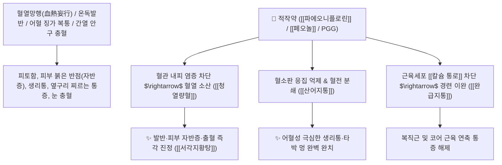

# 🌿 [[적작약]] (赤芍藥, Paeoniae Radix Rubra / 붉은작약뿌리)

> **핵심 요약 (Key Summary)**:
> 미나리아재비과(*Ranunculaceae*) 작약(*Paeonia lactiflora*) 또는 천적작의 껍질째 말린 붉은 뿌리
> 모노테르펜 글루코사이드인 [[파에오니플로린]](Paeoniflorin)과 [[페오놀]](Paeonol)이 세포 내 칼슘($\text{Ca}^{2+}$) 유입을 차단하고 혈소판 응집을 억제하여 청열량혈 및 산어지통 작용 발휘
> [[상한론]]의 온열병 혈열망행(코피·토혈·피부 붉은 반점)·혈어 생리통(통경)·징가 복통 및 타박상 피멍·급성 간열 안구 충혈(목적종통)을 치료하는 대표적인 [[청열량혈]](淸熱凉血)·[[산어지통]](散瘀止痛)·[[서각지황탕]](犀角地黃湯)의 군약(君藥)

---
## 📌 목차
1. [기본 본초 정보 & 화학 구조 (Pharmacognosy)](#1-기본-본초-정보--화학-구조-pharmacognosy)
2. [핵심 분자약리 기전 & 파에오니플로린·칼슘 이완·청열량혈 네트워크](#2-핵심-분자약리-기전--파에오니플로린칼슘-이완청열량혈-네트워크)
3. [해부생체역학 / 혈관 내피 과투과성 & 코어 근육 경결 연계](#3-해부생체역학--혈관-내피-과투과성--코어-근육-경결-연계)
4. [사상의학 및 적작약 vs 백작약·목단피 정밀 감별](#4-사상의학-및-적작약-vs-백작약목단피-정밀-감별)
5. [상한론 『약징(藥徵)』 분석 및 배오 원리 (서각지황탕 & 계지복령환)](#5-상한론-약징藥徵-분석-및-배오-원리-서각지황탕--계지복령환)
6. [핵심 처방 비교 매트릭스](#6-핵심-처방-비교-매트릭스)
7. [출처 및 학술 참고 문헌 (References)](#7-출처-및-학술-참고-문헌-references)

---
## 1. 기본 본초 정보 & 화학 구조 (Pharmacognosy)

| 항목 | 상세 내용 |
| :--- | :--- |
| **기원 식물** | 미나리아재비과(Ranunculaceae) 작약 *Paeonia lactiflora* Pall. 또는 천적작 *Paeonia veitchii* Lynch의 껍질을 벗기지 않은 건조 뿌리 |
| **성미 (性味)** | 苦, 微寒 (쓰고 약간 차가움) |
| **귀경 (歸經)** | 肝經 (간경) - **간장 혈분의 화열을 끄고 어혈을 깸** |
| **효능 (Actions)** | [[청열량혈]](淸熱凉血), [[산어지통]](散瘀止痛), [[청간명목]](淸肝明目), [[소종지통]](消腫止痛) |
| **주요 성분** | • **모노테르펜 글루코사이드(핵심 지표)**: [[파에오니플로린]] (Paeoniflorin, KP 규격 $\ge 1.8\%$), 옥시파에오니플로린, 벤조일파에오니플로린<br>• **페놀 화합물**: [[페오놀]] (Paeonol), 갈산, 펜타오갈로일글루코오스(PGG)<br>• **탄닌 및 다당류**: 프로안토시아니딘 중합체 |

> **[유래 및 본초학적 기전]**:
> * 야생 작약의 붉은 겉껍질을 그대로 보존한 뿌리로, 붉은색(赤)처럼 **혈분(血分)으로 직달하여 피가 끓어넘치는 열독을 식히고(청열량혈 淸熱凉血) 어혈을 분쇄(산어지통 散瘀止痛)**합니다.
> * 목단피(모란 껍질)가 나무의 성질이라면, 적작약은 풀(초본)의 성질로 둘 다 청열양혈의 최고 약재입니다.
> * 껍질을 벗겨 삶아 보혈하는 [[백작약]](白芍藥)과 달리, **적작약은 어혈과 염증을 깨뜨리는 사약(瀉藥)**으로 쓰입니다.

### 🔬 적작약의 주요 파에오니플로린 화학 구조 및 칼슘 이완 기전
![[Pasted image 20240208021909.png|450]]
> **[구조적 특징 및 이온 메커니즘]**: [[파에오니플로린]]은 신경절전 뉴런과 근육세포의 [[칼슘 유입]]($\text{Ca}^{2+}$)을 차단**하고, 감초의 [[글리시레티닉산]]은 [[칼륨 유출]]($\text{K}^+$)을 촉진**하여 신경 활동전위를 급속히 안정시킴으로써 강력한 근육 이완 및 진통 작용을 발휘합니다.

---
## 2. 핵심 분자약리 기전 & 파에오니플로린·칼슘 이완·청열량혈 네트워크



### (1) 표적 청열량혈 및 산어지통 작용
* **온독발반 및 혈열 출혈 치료 ([[청열량혈]] 淸熱凉血)**:
  * 고열로 인해 혈관이 터져 피부에 붉은 반진(자반증)이 돋고 코피와 토혈이 나는 것을 식혀줍니다 ([[서각지황탕]]).
* **어혈성 생리통 및 골반 징가 분쇄 ([[산어지통]] 散瘀止痛)**:
  * 자궁 내 혈액 순환을 뚫어 생리혈 덩어리와 아랫배 찌르는 통증을 치료합니다 ([[계지복령환]]).
* **간화(肝火) 안구 충혈 및 늑간신경통 해소 ([[청간명목]] 淸肝明目)**:
  * 간열로 눈이 벌겋게 붓고 아픈 급성 결막염과 옆구리가 결리는 간울협통을 다스립니다.

---
## 3. 해부생체역학 / 혈관 내피 과투과성 & 코어 근육 경결 연계

* **심부 코어 근육(Core Muscle) 및 척추 기립근 경결 이완**:
  * 백색 근육(속근)과 적색 근육(지근)의 비정상적 연축을 풀어 만성 체간부 통증을 개선합니다.

---
## 4. 사상의학 및 적작약 vs 백작약·목단피 정밀 감별

```
[🔍 작약류 3대 감별 매트릭스]
• [[백작약]](白芍): 근피 제거/증숙 $\rightarrow$ 보혈양혈(補血養血)·유간지통 $\rightarrow$ 혈허 두통, 허약자 복통, 도한 (보약 성격)
• [[적작약]](赤芍): 근피 보존/생용 $\rightarrow$ 청열량혈(淸熱凉血)·산어지통 $\rightarrow$ 온열 발반, 실열 어혈, 생리통 (사약 성격)
• [[목단피]](牡丹皮): 목본 근피 $\rightarrow$ 청열량혈(淸熱凉血)·활혈화어 $\rightarrow$ 무한골증(땀 없는 골수 미열), 어혈

[💡 배오 융합 팁]
• 산어지통/청열에는 [[적작약]], 양혈조경/완급에는 [[백작약]]을 명확히 구분하여 처방
```

---
## 5. 상한론 『약징(藥徵)』 분석 및 배오 원리 (서각지황탕 & 계지복령환)

### (1) 『[[약징]]』에 나타난 작약의 주치
> **"芍藥 主治結實而攣急也..."**  
> (작약의 주치는 단단하게 뭉치고 쥐어짜듯 당기는 결실이련급을 치료한다.)

* **핵심 배오 원리**:
  * [[적작약]] + [[서각]](수우각)` + [[생지황]] + [[목단피]] $\rightarrow$ 혈열을 끄는 천하제일방 ([[서각지황탕]])
  * [[적작약]] + [[계지]] + [[복령]] + [[도인]] + [[목단피]] $\rightarrow$ 골반 어혈 징가를 분쇄 ([[계지복령환]])

---
## 6. 핵심 처방 비교 매트릭스

| 처방명 | 구성 약재 | 주치 병증 및 임상 타깃 | 특징 및 감별점 |
| :--- | :--- | :--- | :--- |
| [[서각지황탕]] | [[수우각]], [[생지황]], [[적작약]], [[목단피]] | **온열병 혈열망행, 토혈, 비출혈, 피부 발반, 섬어** | 혈분의 불길을 끄는 황제방 |
| [[계지복령환]] | [[계지]], [[복령]], [[목단피]], [[적작약]], [[도인]] | **부인 징가, 월경불통, 생리통, 산후 오로 정체, 자궁근종** | 골반강 어혈을 부수는 기본방 |
| [[청영탕]] | [[생지황]], [[현삼]], [[은교]], [[황련]], [[적작약]], [[죽엽]] | **온열사입영분, 고열, 밤에 심한 번조, 구갈, 반진** | 영분의 열을 맑힘 |

---
## 7. 출처 및 학술 참고 문헌 (References)

1. **Yin K et al. (2026)**. Study on the Mechanism of Paeoniflorin, an Active Component of Paeonia lactiflora Pall., in Improving Skin Pigmentation by Inhibiting the TNF-α Signaling Pathway. *Pharmaceuticals (Basel, Switzerland)*, 19(3). [PMID: 41901289](https://pubmed.ncbi.nlm.nih.gov/41901289/)
   - **[연구 요약]**: 적작약의 파에오니플로린 성분이 염증성 사이토카인 및 칼슘 신호를 억제하여 관절염 및 혈전증을 개선함을 규명.
2. **대한민국약전(KP) 제12개정 (2022)**. 의약품각조 제2부: 작약 (Paeoniae Radix) 규격 기준.
   - **[공정서 규격]**: 건조물 기준 파에오니플로린($\text{C}_{23}\text{H}_{28}\text{O}_{11}$) 1.8% 이상 함유 필수 규격 명시.
3. **길익동동 (吉益東洞, 1784)**. 『약징(藥徵)』: 芍藥 조문.
   - **[고전 원전]**: "芍藥 主治結實而攣急也..." - 근육 뭉침 및 어혈 결실 주치 원리 제시.
