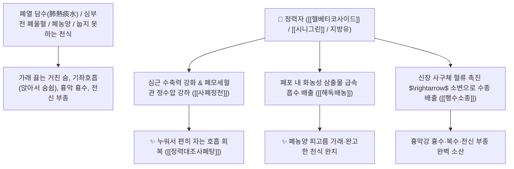

# 🌿 [[정력자]] (葶藶子, Descurainiae / Lepidii Semen / 꽃다지씨·다닥냉이씨)

> **핵심 요약 (Key Summary)**:
> 배추과(*Brassicaceae*) 다닥냉이(*Lepidium apetalum*) 또는 꽃다지의 성숙한 씨앗(종자)
> 강심 배당체인 [[헬베티코사이드]](Helveticoside)와 글루코시놀레이트(시니그린)가 심근 수축력을 높이고 폐울혈 삼출액을 배출시켜 강력한 사폐정천 및 행수소종 작용 발휘
> [[상한론]]의 폐옹(폐농양·피고름 가래)·가래가 끓어 눕지 못하는 심한 천식(천해불득와 喘咳不得臥) 및 흉막 흉수·심장성 폐부종·전신 부종을 치료하는 천하제일의 [[사폐정천]](瀉肺定喘)·[[행수소종]](行水消腫)·[[정력대조사폐탕]](葶藶大棗瀉肺湯)의 군약(君藥)

---
## 📌 목차
1. [기본 본초 정보 & 화학 구조 (Pharmacognosy)](#1-기본-본초-정보--화학-구조-pharmacognosy)
2. [핵심 분자약리 기전 & 헬베티코사이드·강심·폐부종 배출 네트워크](#2-핵심-분자약리-기전--헬베티코사이드강심폐부종-배출-네트워크)
3. [해부생체역학 / 폐포 모세혈관 정수압 & 심근 수축력 연계](#3-해부생체역학--폐포-모세혈관-정수압--심근-수축력-연계)
4. [사상의학 및 임상 응용 (폐실 천식 vs 대추 배오 중화)](#4-사상의학-및-임상-응용-폐실-천식-vs-대추-배오-중화)
5. [상한론 『약징(藥徵)』 분석 및 배오 원리 (정력대조사폐탕 배오)](#5-상한론-약징藥徵-분석-및-배오-원리-정력대조사폐탕-배오)
6. [핵심 처방 비교 매트릭스](#6-핵심-처방-비교-매트릭스)
7. [출처 및 학술 참고 문헌 (References)](#7-출처-및-학술-참고-문헌-references)

---
## 1. 기본 본초 정보 & 화학 구조 (Pharmacognosy)

| 항목 | 상세 내용 |
| :--- | :--- |
| **기원 식물** | 배추과(십자화과 Brassicaceae / Cruciferae) 다닥냉이 *Lepidium apetalum* Willd. 또는 꽃다지 *Draba nemorosa* L.의 잘 익은 씨앗 |
| **성미 (性味)** | 辛·苦, 大寒 (맵고 쓰며 성질이 맹렬하게 차가움) |
| **귀경 (歸經)** | 肺·膀胱經 (폐경, 방광경) - **폐의 넘치는 담수를 깎아내려 소변으로 뺌** |
| **효능 (Actions)** | [[사폐정천]](瀉肺定喘), [[행수소종]](行水消腫), [[강심이뇨]](强心利尿), [[파혈소결]](破血消結) |
| **주요 성분** | • **강심 배당체(지표물질)**: [[헬베티코사이드]] (Helveticoside), 에비코사이드, 스트로판티딘 유도체<br>• **글루코시놀레이트**: [[시니그린]] (Sinigrin), 벤질이소티오시아네이트<br>• **지방유(30~35%)**: 리놀렌산, 올레산 |

> **[유래 및 본초학적 기전]**:
> * 한자 표기는 정력(葶藶)이지만, 약효가 맹렬하여 소변을 뚫고 혈맥을 통하게 하며 **심장 기능을 북돋워(강심 强心) 원기를 회복시키는 묘약**입니다.
> * 폐에 가래와 물(폐부종·흉수)이 가득 차서 숨이 턱 끝까지 차올라 눕지도 못하는 극심한 천식(천해불득와 喘咳不得臥)을 폐기를 깎아내려(사폐 瀉肺) 멎게 합니다.
> * 약성이 대단히 사납고 강하므로 반드시 [[대추|대조]](대추)를 배오하여 위장 손상을 막고 약력을 완충시킵니다.

### 🔬 정력자의 주요 강심 배당체 화학 구조
```
     [ 스트로판티딘 카르데놀라이드 골격 ]───O──[ D-디기톡소오스 ]  <-- 헬베티코사이드 (Helveticoside)
```
> **[구조적 특징 및 강심 기전]**: [[헬베티코사이드]]는 심근세포막의 $\text{Na}^+/\text{K}^+-\text{ATPase}$를 억제하여 세포 내 칼슘 농도를 높임으로써 심박출량을 증대시키고 폐모세혈관 울혈을 해소합니다.

---
## 2. 핵심 분자약리 기전 & 헬베티코사이드·강심·폐부종 배출 네트워크



### (1) 표적 사폐정천 및 강심 작용
* **기좌호흡 천식 완치 ([[사폐정천]] 瀉肺定喘)**:
  * 가래와 물이 폐를 가득 채워 누우면 숨이 막혀 앉아서 밤을 지새우는 급만성 심부전 및 천식을 치료합니다 ([[정력대조사폐탕]]).
* **폐농양(폐옹) 및 화농성 가래 배출**:
  * 폐포 내 썩은 피고름과 끈적한 악성 담음을 녹여 밖으로 쏟아내게 합니다.
* **흉수 및 전신 부종 배출 ([[행수소종]] 行水消腫)**:
  * 흉막강에 고인 흉수와 늑막염 삼출액, 신성 부종을 소변으로 강력하게 배출합니다.

---
## 3. 해부생체역학 / 폐포 모세혈관 정수압 & 심근 수축력 연계

* **폐모세혈관 쐐기압(PCWP) 감소**:
  * 좌심실 전부하를 줄이고 폐포 내 액체 삼출을 억제하여 가스 교환 효율을 극대화합니다.

---
## 4. 사상의학 및 임상 응용 (폐실 천식 vs 대추 배오 중화)

```
[✅ 최적 적응증 (Sweet Spot)]
• 실증 천식 및 폐부종: 가래 끓는 소리가 요란하고 얼굴이 붉으며 눕지 못하고 헐떡일 때 ([[정력대조사폐탕]])
• 결핵성 늑막염 흉수 및 복수고창
• 폐농양 피고름 객담 환자

[⚠️ 대추(大棗) 배오 필수 수칙 (Safety)]
• 약성이 대단히 차갑고 맹렬하게 폐기를 깎아내리므로 반드시 대추(대조 10~12개)를 달인 물에 함께 전탕하여 비위 손상 방지
• 폐허(肺虛)로 기운이 없어 헐떡이는 허천(虛喘) 환자 복용 금기
```

---
## 5. 상한론 『약징(藥徵)』 분석 및 배오 원리 (정력대조사폐탕 배오)

### (1) 상한론 최고의 폐부종·천식 구급방: 정력대조사폐탕(葶藶大棗瀉肺湯)
* **사폐정천 최고 명약 배오**:
  * [[정력자]] (살짝 볶아 가루 냄) + [[대추|대조]] (대추 달임액) $\rightarrow$ 폐의 담수를 쏟아내고 천식을 멎게 하는 불후의 명방 ([[정력대조사폐탕]])
  * [[정력자]] + [[행인]] + [[마황]] $\rightarrow$ 기관지 평활근 연축을 풀고 가래 배출

---
## 6. 핵심 처방 비교 매트릭스

| 처방명 | 구성 약재 | 주치 병증 및 임상 타깃 | 특징 및 감별점 |
| :--- | :--- | :--- | :--- |
| [[정력대조사폐탕]] | [[정력자]], [[대추|대조]] (대추) | **폐옹, 천해불득와, 흉만 진천, 피고름 가래, 흉수, 폐부종** | 폐기를 깎아내려 숨을 쉬게 함 |
| [[대함흉환]] | [[대황]], [[망초]], [[행인]], [[정력자]] | **결흉증, 명치 밑 단단함, 누르면 극심한 통증, 변비, 천식** | 흉부의 수열을 대소변으로 뺌 |
| [[사폐탕]] | [[정력자]], [[상백피]], [[지각]], [[행인]] | **폐열 해수, 천식 기급, 소변 불리, 안면 부종** | 폐열을 내리고 부종 완화 |

---
## 7. 출처 및 학술 참고 문헌 (References)

2. **대한민국약전(KP) 제12개정 (2022)**. 생약규격집: 정력자 (Descurainiae / Lepidii Semen) 규격 기준.
   - **[공정서 규격]**: 다닥냉이 및 꽃다지 씨앗의 성상, 순도시험 및 건조감량 10.0% 이하 기준 명시.
