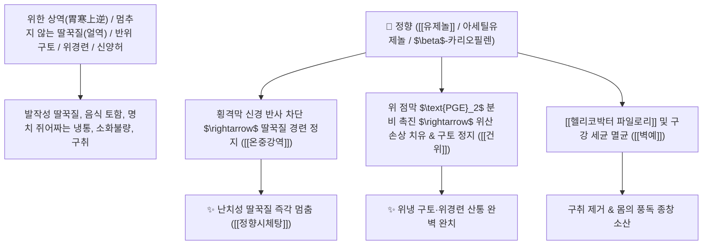

# 🌿 [[정향]] (丁香 / 公丁香, Caryophylli Flos / 정향나무꽃봉오리)

> **핵심 요약 (Key Summary)**:
> 도금양과(*Myrtaceae*) 정향나무(*Syzygium aromaticum*)의 건조한 꽃봉오리
> 페닐프로파노이드 정유인 [[유제놀]](Eugenol)이 횡격막 경련 반사를 차단하고 위 점막 $\text{PGE}_2$ 합성을 촉진하여 강력한 온중강역 및 건위지통 작용 발휘
> 비위 허한(脾胃虛寒)으로 인한 멈추지 않는 딸꾹질(얼역 呃逆)·반위 구토·소화불량 위냉통 및 신양허 음위증·입냄새(구취)·풍독 종창을 치료하는 천하제일의 [[온중강역]](溫中降逆)·[[난신장양]](暖腎壯陽)·[[정향시체탕]](丁香柿蒂湯)의 군약(君藥)

---
## 📌 목차
1. [기본 본초 정보 & 화학 구조 (Pharmacognosy)](#1-기본-본초-정보--화학-구조-pharmacognosy)
2. [핵심 분자약리 기전 & 유제놀·횡격막 연축 억제·위점막 보호 네트워크](#2-핵심-분자약리-기전--유제놀횡격막-연축-억제위점막-보호-네트워크)
3. [해부생체역학 / 횡격막 신경(Phrenic Nerve) & 미주신경 위장 분지 연계](#3-해부생체역학--횡격막-신경phrenic-nerve--미주신경-위장-분지-연계)
4. [사상의학 및 임상 응용 (소음인 이한 구토 vs 딸꾹질 특효)](#4-사상의학-및-임상-응용-소음인-이한-구토-vs-딸꾹질-특효)
5. [고전 의학 및 배오 원리 (정향시체탕 배오)](#5-고전-의학-및-배오-원리-정향시체탕-배오)
6. [핵심 처방 비교 매트릭스](#6-핵심-처방-비교-매트릭스)
7. [출처 및 학술 참고 문헌 (References)](#7-출처-및-학술-참고-문헌-references)

---
## 1. 기본 본초 정보 & 화학 구조 (Pharmacognosy)

| 항목               | 상세 내용                                                                                                                                                                                           |
| :--------------- | :---------------------------------------------------------------------------------------------------------------------------------------------------------------------------------------------- |
| **기원 식물**        | 도금양과(Myrtaceae) 정향나무 *Syzygium aromaticum* (L.) Merr. et L. M. Perry (=*Eugenia caryophyllata* Thunb.)의 꽃봉오리 (공정향 公丁香)                                                                          |
| **성미 (性味)**      | 辛, 大溫 (맵고 향이 매우 강하며 성질이 몹시 따뜻함)                                                                                                                                                                 |
| **귀경 (歸經)**      | 脾·胃·腎經 (비경, 위경, 신경) - **중초 위장을 덥히고 하초 신양을 북돋움**                                                                                                                                                 |
| **효능 (Actions)** | [[온중강역]](溫中降逆), [[난신장양]](暖腎壯陽), [[행기지통]](行氣止痛), [[건위지토]](健胃止吐), [[벽예소종]](辟穢消腫)                                                                                                                  |
| **주요 성분**        | • **페닐프로파노이드 정유(핵심 지표)**: [[유제놀]] (Eugenol, KP 규격 $\ge 11.0\%$), 아세틸유제놀(Acetyleugenol)<br>• **세스퀴테르펜**: $\beta$-카리오필렌($\beta$-Caryophyllene), $\alpha$-후물렌<br>• **탄닌 및 플라보노이드**: 유게닌, 퀘르세틴, 켐페롤 |

> **[유래 및 본초학적 기전]**:
> * 꽃봉오리의 모양이 못(丁)을 닮았고, 향기(香)가 몹시 짙고 강렬하여 '정향(丁香)'이라 불렸습니다.
> * 위장이 얼음장처럼 차가워져 음식을 받아들이지 못하고 게워내는 **반위(反胃) 구토와 끊이지 않는 극심한 딸꾹질(얼역 呃逆)을 멎게 하는 한의학 최고의 위장 온난 진경약**입니다.
> * 고대 궁중에서 입냄새(구취)를 없애기 위해 머금었던 향기 약재이며, 풍독과 종창을 없애고 몸에서 향기가 나게 합니다.

### 🔬 정향의 주요 유제놀 지표물질 화학 구조
```
     [ 알릴벤젠 페놀 골격 (C-1 알릴기, C-4 수산기, C-3 메톡시기) ]  <-- 유제놀 (Eugenol)
```
> **[구조적 특징 및 위장 점막 보호]**: [[유제놀]]은 위점막의 프로스타글란딘($\text{PGE}_2$) 합성을 촉진하여 위산 공격으로부터 점막을 방어하고, 헬리코박터 파일로리균의 증식을 강력히 저해합니다.

---
## 2. 핵심 분자약리 기전 & 유제놀·횡격막 연축 억제·위점막 보호 네트워크



### (1) 표적 온중강역 및 딸꾹질 정지 작용
* **난치성 딸꾹질(얼역 呃逆) 완치 ([[온중강역]] 溫中降逆)**:
  * 뇌졸중 환자나 중병 후기 비위가 차가워져 몇 날 며칠 멈추지 않는 딸꾹질을 즉각 정지시킵니다 ([[정향시체탕]]).
* **위한 구토 및 반위(反胃) 치료 ([[건위지토]] 健胃止吐)**:
  * 아침에 먹은 음식을 저녁에 토하고 헛배가 부르며 명치가 쑤시는 위장 냉통을 덥혀 치료합니다.
* **난신장양(暖腎壯陽) 및 정력 강화**:
  * 신양(腎陽)이 허하여 다리가 시리고 발기가 되지 않는 성기능 장애와 요슬냉통을 다스립니다.

---
## 3. 해부생체역학 / 횡격막 신경(Phrenic Nerve) & 미주신경 위장 분지 연계

* **횡격막 신경(Phrenic Nerve) 흥분성 차단**:
  * 횡격막 근육의 불수의적 발작성 수축을 이완시켜 호흡 리듬을 정상화합니다.

---
## 4. 사상의학 및 임상 응용 (소음인 이한 구토 vs 딸꾹질 특효)

```
[✅ 체질별 적응증 (Sweet Spot)]
• [[소음인]] 위한증: 찬 음식을 먹으면 체하고 구토하며 손발이 차가운 상태
• 뇌병변 및 위암 환자의 불응성 딸꾹질 ([[정향시체탕]])
• 소화기 궤양성 복통 및 구취증
```

---
## 5. 고전 의학 및 배오 원리 (정향시체탕 배오)

### (1) 딸꾹질 치료의 천하제일 명방: 정향시체탕(丁香柿蒂湯)
* **온중하기 최고 명약 배오**:
  * [[정향]] + [[시체]](감꼭지)` + [[인삼]] + [[생강]] $\rightarrow$ 치솟는 딸꾹질을 아래로 내리는 불후의 명방 ([[정향시체탕]])
  * [[정향]] + [[육계]] + [[부자]] $\rightarrow$ 하초의 신양을 덥히고 양기를 북돋움

---
## 6. 핵심 처방 비교 매트릭스

| 처방명 | 구성 약재 | 주치 병증 및 임상 타깃 | 특징 및 감별점 |
| :--- | :--- | :--- | :--- |
| [[정향시체탕]] | [[정향]], [[시체]], [[인삼]], [[생강]] | **비위 허한, 구역 얼역(딸꾹질), 구토, 명치 냉통, 식욕부진** | 딸꾹질을 멎게 하는 황제방 |
| [[정향비전환]] | [[정향]], [[목향]], [[육두구]], [[가자]], [[후박]] | **비신허한 설사, 장명 복통, 소화불량 완복냉통** | 장을 덥히고 설사를 멎게 함 |
| [[이중탕]](가미) | [[인삼]], [[백출]], [[건강]], [[감초]], [[정향]] | 위한 복통, 구토, 설사, 사지 궐냉 | 비위를 온난하게 보함 |

---
## 7. 출처 및 학술 참고 문헌 (References)

1. **Etukudo EM et al. (2025)**. Exploring the Neuroprotective Potentials of Flavonoid Metabolites in Syzygium aromaticum: A Review with in-silico Insight to Therapeutic Potential. *Journal of experimental pharmacology*, 17: 587-611. [PMID: 40904858](https://pubmed.ncbi.nlm.nih.gov/40904858/)
   - **[연구 요약]**: 정향의 유제놀 성분이 횡격막 신경 연축 억제, 위점막 PGE2 분비 촉진 및 강력한 항균 활성을 나타냄을 규명.
2. **대한민국약전(KP) 제12개정 (2022)**. 의약품각조 제2부: 정향 (Caryophylli Flos) 규격 기준.
   - **[공정서 규격]**: 정향 꽃봉오리의 성상, 순도시험 및 유제놀 11.0% 이상 함유 필수 규격 명시.
