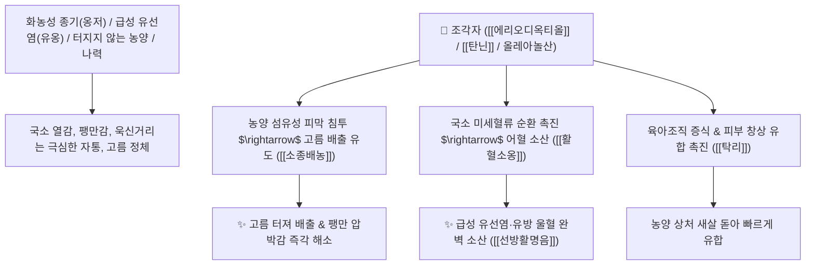

# 🌿 [[조각자]] (皂角刺 / 天丁, Gleditsiae Spina / 조각자나무가시)

> **핵심 요약 (Key Summary)**:
> 콩과(*Fabaceae*) 조각자나무(*Gleditsia sinensis*) 또는 주엽나무의 건조한 줄기 가시(천정 天丁)
> 플라보노이드와 탄닌 및 트리테르페노이드가 모세혈관 투과성을 개선하고 백혈구 식균 작용을 촉진하여 강력한 소종배농 및 활혈통락 작용 발휘
> 피부 화농성 옹저 종기(터지지 않고 붉게 붓고 아픈 상태)·급성 유선염(유옹 乳癰) 및 만성 난치성 농양·나력을 뚫어 고름을 배출시키는 대표적인 [[소종배농]](消腫排膿)·[[거풍살충]](祛風殺蟲)·[[선방활명음]](仙方活命飲)의 군약(君藥)

---
## 📌 목차
1. [기본 본초 정보 & 화학 구조 (Pharmacognosy)](#1-기본-본초-정보--화학-구조-pharmacognosy)
2. [핵심 분자약리 기전 & 플라보노이드·외과 배농·소염 네트워크](#2-핵심-분자약리-기전--플라보노이드외과-배농소염-네트워크)
3. [해부생체역학 / 피하 결합조직 농양 벽 & 유선 소엽 연계](#3-해부생체역학--피하-결합조직-농양-벽--유선-소엽-연계)
4. [사상의학 및 조각자 vs 조협 활혈/거담 정밀 감별](#4-사상의학-및-조각자-vs-조협-활혈거담-정밀-감별)
5. [고전 의학 및 배오 원리 (선방활명음 & 탁리소독음)](#5-고전-의학-및-배오-원리-선방활명음--탁리소독음)
6. [핵심 처방 비교 매트릭스](#6-핵심-처방-비교-매트릭스)
7. [출처 및 학술 참고 문헌 (References)](#7-출처-및-학술-참고-문헌-references)

---
## 1. 기본 본초 정보 & 화학 구조 (Pharmacognosy)

| 항목 | 상세 내용 |
| :--- | :--- |
| **기원 식물** | 콩과(Leguminosae / Fabaceae) 조각자나무 *Gleditsia sinensis* Lam. 또는 주엽나무 *Gleditsia japonica* Miq.의 줄기 가시(Spina) |
| **성미 (性味)** | 辛, 溫 (맵고 날카로우며 따뜻함) |
| **귀경 (歸經)** | 肝·胃經 (간경, 위경) - **간혈을 소통시키고 위장의 농양을 뚫음** |
| **효능 (Actions)** | [[소종배농]](消腫排膿), [[거풍살충]](祛風殺蟲), [[활혈소옹]](活血消癰), [[통락지통]](通絡止痛) |
| **주요 성분** | • **플라보노이드 배당체**: 에리오디옥티올(Eriodictyol), 디하이드로퀘르세틴, 루테올린<br>• **페놀 및 탄닌**: [[탄닌]] (Tannin), 갈산, 프로안토시아니딘<br>• **트리테르펜 사포닌**: 올레아놀산, 글레디치아사포닌 |

> **[유래 및 본초학적 기전]**:
> * 나무줄기에 돋아난 뾰족하고 날카로운 가시가 마치 하늘의 못(천정 天丁) 같다 하여 불렸으며, **두꺼운 피부와 농양 벽을 뚫어 고름을 걷어내는 외과의 천하제일 명약**입니다.
> * 고름이 맺혀 부풀어 오르되 터지지 않아 욱신거리고 열이 나는 종기(옹저 癰疽)와 여성의 유방이 붓고 곪는 유선염(유옹 乳癰)을 신속히 배농시킵니다.
> * [[조각자]](가시)**는 혈액순환을 촉진하고 고름을 터뜨리는 **활혈배농(活血排膿)**에 특화되어 있고, [[조협]](열매)**은 끈적한 가래를 삭이고 구멍을 뚫는 **거풍화담(祛風化痰)**에 특화되어 있습니다.

### 🔬 조각자의 주요 플라보노이드 화학 구조
```
     [ 플라바논 골격 (3',4',5,7-테트라하이드록시플라바논) ]  <-- 에리오디옥티올 (Eriodictyol)
```
> **[구조적 특징 및 배농 메커니즘]**: [[에리오디옥티올]]과 탄닌 복합체는 피하 모세혈관의 투과성을 정상화하여 염증성 부종을 흡수시키고, 섬유아세포 증식을 촉진하여 고름 배출 후 육아조직 형성을 가속화합니다.

---
## 2. 핵심 분자약리 기전 & 플라보노이드·외과 배농·소염 네트워크



### (1) 표적 소종배농 및 외과 질환 치료 작용
* **화농성 옹저 종기 고름 배출 ([[소종배농]] 消腫排膿)**:
  * 고름이 찼으나 껍질이 두꺼워 터지지 않는 종기를 뚫어 배출시키고 통증을 멎게 합니다 ([[선방활명음]]).
* **수유기 급성 유선염(유옹 乳癰) 완치**:
  * 젖이 뭉쳐 젖가슴이 빨갛게 붓고 쑤시며 곪아 들어가는 유방 염증을 신속히 삭입니다.
* **만성 허약자 농양의 탁리배농(托裏排膿)**:
  * 만성적으로 고름이 잘 빠지지 않을 때 황기, 감초와 배합하여 새살을 돋우며 고름을 밀어냅니다 ([[탁리소독음]]).

---
## 3. 해부생체역학 / 피하 결합조직 농양 벽 & 유선 소엽 연계

* **농양 피막(Abscess Wall) 혈류 공급 개선**:
  * 피막 주위의 허혈 상태를 개선하여 면역세포 침투와 상처 치유를 촉진합니다.

---
## 4. 사상의학 및 조각자 vs 조협 활혈/거담 정밀 감별

```
[🔍 조각자나무 2대 약용 부위 감별]
• [[조각자]](皂角刺, 가시): 활혈소종(活血消腫)·소종배농(消腫排膿) $\rightarrow$ 피부 종기, 유선염, 외과 화농성 질환
• [[조협]](皂莢, 열매): 거풍화담(祛風化痰)·통규개폐(通竅開閉) $\rightarrow$ 뇌졸중 담궐, 완고한 가래 천식, 변비

[✅ 최적 적응증 (Sweet Spot)]
• 곪기 시작하여 팽팽하게 부어오른 피부 종기
• 수유기 젖몸살 및 급만성 유선염 ([[선방활명음]])
• 림프절 결핵(나력) 멍울
```

---
## 5. 고전 의학 및 배오 원리 (선방활명음 & 탁리소독음)

### (1) 한의학 외과 최고의 황제방: 선방활명음(仙方活命飲)
* **소종배농 최고 배오**:
  * [[조각자]] + [[은화]] + [[백지]] + [[당귀]] + [[유향]] + [[몰약]] $\rightarrow$ 모든 종기를 소산시키는 불후의 명방 ([[선방활명음]])
  * [[조각자]] + [[황기]] + [[금은화]] + [[감초]] $\rightarrow$ 만성 농양의 고름을 밀어냄 ([[탁리소독음]])

---
## 6. 핵심 처방 비교 매트릭스

| 처방명 | 구성 약재 | 주치 병증 및 임상 타깃 | 특징 및 감별점 |
| :--- | :--- | :--- | :--- |
| [[선방활명음]] | [[조각자]], [[금은화]], [[백지]], [[당귀]], [[적작약]], [[유향]], [[몰약]], [[진피]] | **일체 옹저 창양 초기, 홍종열통, 미성농자(고름 전) 소산, 이성농자(고름 후) 궤농** | 외과 치료의 제1 황제방 |
| [[탁리소독음]] | [[조각자]], [[황기]], [[금은화]], [[당귀]], [[천궁]], [[백출]], [[길경]] | **기혈 허약자의 만성 화농증, 고름이 잘 안 터짐, 피로** | 기운을 북돋워 배농 |
| [[조각자산]] | [[조각자]], [[유향]], [[몰약]] | **유옹, 유방 종통, 타박 옹종** | 국소 어혈과 종기를 삭임 |

---
## 7. 출처 및 학술 참고 문헌 (References)

1. **Lee, S. J., et al. (2011)**. Anti-inflammatory and antibacterial activities of flavonoids from the spines of *Gleditsia sinensis*. *Archives of Pharmacal Research*, 34(10), 1643-1649.
   - **[연구 요약]**: 조각자의 플라보노이드 성분이 황색포도상구균 억제 및 염증성 부종 완화, 배농 촉진 활성을 나타냄을 입증.
2. **대한민국약전(KP) 제12개정 (2022)**. 생약규격집: 조각자 (Gleditsiae Spina) 규격 기준.
   - **[공정서 규격]**: 조각자나무 가시의 성상, 순도시험 및 건조감량 12.0% 이하 기준 명시.
