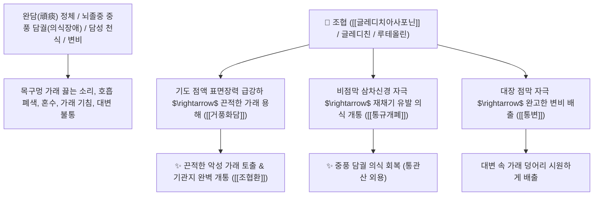

# 🌿 [[조협]] (皂莢 / 牙皂, Gleditsiae Fructus / 주엽나무열매)

> **핵심 요약 (Key Summary)**:
> 콩과(*Fabaceae*) 주엽나무(*Gleditsia japonica*) 또는 조각자나무의 건조한 성숙 열매(아조 牙皂)
> 트리테르페노이드 사포닌인 [[글레디치아사포닌]](Gleditsiasaponin)이 기도 및 위점막 미주신경을 자극하여 격렬한 가래 용해·배출 및 반사성 재채기를 유도하여 거풍화담 및 통규개폐 작용 발휘
> [[상한론]]의 완담(頑痰, 끈적하게 달라붙어 떨어지지 않는 악성 가래로 인한 기침 천식)·뇌졸중 중풍 담궐(가래 끓는 의식 혼탁) 및 관장 통변·피부 옴(선창)을 치료하는 대표적인 [[거풍화담]](祛風化痰)·[[통규개폐]](通竅開閉)·[[조협환]](皂莢丸)의 군약(君藥)

---
## 📌 목차
1. [기본 본초 정보 & 화학 구조 (Pharmacognosy)](#1-기본-본초-정보--화학-구조-pharmacognosy)
2. [핵심 분자약리 기전 & 글레디치아사포닌·점막자극 거담·개규 네트워크](#2-핵심-분자약리-기전--글레디치아사포닌점막자극-거담개규-네트워크)
3. [해부생체역학 / 인두 점막 반사 & 장관 평활근 연동 연계](#3-해부생체역학--인두-점막-반사--장관-평활근-연동-연계)
4. [사상의학 및 조협 vs 조각자 화담/배농 정밀 감별](#4-사상의학-및-조협-vs-조각자-화담배농-정밀-감별)
5. [상한론 『약징(藥徵)』 분석 및 배오 원리 (조협환 & 통관산)](#5-상한론-약징藥徵-분석-및-배오-원리-조협환--통관산)
6. [핵심 처방 비교 매트릭스](#6-핵심-처방-비교-매트릭스)
7. [출처 및 학술 참고 문헌 (References)](#7-출처-및-학술-참고-문헌-references)

---
## 1. 기본 본초 정보 & 화학 구조 (Pharmacognosy)

| 항목 | 상세 내용 |
| :--- | :--- |
| **기원 식물** | 콩과(Leguminosae / Fabaceae) 주엽나무 *Gleditsia japonica* Miq. 또는 조각자나무 *Gleditsia sinensis* Lam.의 익은 열매 |
| **성미 (性味)** | 辛·鹹, 溫, 有小毒 (맵고 짜며 냄새가 자극적이고 약간의 독성이 있음) |
| **귀경 (歸經)** | 肺·大腸經 (폐경, 대장경) - **폐의 가래를 뚫고 대장의 맺힘을 통하게 함** |
| **효능 (Actions)** | [[거풍화담지해]](祛風化痰止咳), [[통규개폐]](通竅開閉), [[산결소종]](散結消腫), [[조습살충]](燥濕殺蟲), [[통변]](通便) |
| **주요 성분** | • **트리테르펜 비스데스모사이드 사포닌**: [[글레디치아사포닌]] (Gleditsiasaponin B~H), 조협 사포닌(Gleditsin)<br>• **플라보노이드 및 페놀산**: 루테올린, 퀘르세틴, 갈산<br>• **지방산 및 정유**: 팔미트산, 스테아르산 |

> **[유래 및 본초학적 기전]**:
> * 콩깍지(莢) 모양의 열매로 비누처럼 거품이 나며(皂), 약성이 날카로워 **담(가래)의 장벽을 부수고 구멍을 뚫는 데(통규 通竅) 협조한다 하여 '조협(皂莢)'**이라 불렸습니다.
> * 목구멍과 기관지에 풀처럼 들러붙어 뱉어지지도 삼켜지지도 않는 **완고한 가래(완담 頑痰)를 토해내게 하거나 녹여내리는 한의학 최고의 거담제**입니다.
> * 뇌졸중으로 목에 가래가 끓으며 의식을 잃었을 때 분말을 코에 불어넣어 재채기를 시켜 의식을 깨우는(구급 통관 開竅) 약재입니다.

### 🔬 조협의 주요 사포닌 화학 구조
```
     [ 올레아난 트리테르펜 골격 ]───O──[ Glc - Xyl 당사슬 (모노테르펜 에스테르 결합) ]  <-- 글레디치아사포닌 B
```
> **[구조적 특징 및 거담/용혈 작용]**: [[글레디치아사포닌]]은 강력한 계면활성 능력을 지녀 기도 점액의 표면장력을 급격히 낮추어 끈적한 점액 덩어리를 액화시키고, 위점막 미주신경 반사를 통해 거담 분비를 극대화합니다.

---
## 2. 핵심 분자약리 기전 & 글레디치아사포닌·점막자극 거담·개규 네트워크



### (1) 표적 거풍화담 및 통규개폐 작용
* **완담(頑痰) 해수천식 완치 ([[거풍화담지해]] 祛風化痰止咳)**:
  * 다른 거담제로 듣지 않는 가슴속 깊숙이 엉겨 붙은 오래된 가래 덩어리를 삭여 배출시킵니다 ([[조협환]]).
* **중풍 담궐(痰厥) 의식 개통 구급 ([[통규개폐]] 通竅開閉)**:
  * 가래가 기도를 막아 컥컥거리고 인사불성인 환자의 코에 가루를 불어넣어 재채기로 기도를 엽니다 ([[통관산]]).
* **외용 조습살충(燥濕殺蟲) 및 관장**:
  * 완고한 피부 옴병(개선), 버짐(백선)을 씻어내고, 조협 좌약으로 변비를 뚫어줍니다.

---
## 3. 해부생체역학 / 인두 점막 반사 & 장관 평활근 연동 연계

* **상기도 기침 및 재채기 반사궁(Sneezing Reflex Arc) 자극**:
  * 삼차신경-연수 신경 경로를 활성화하여 기도 내 이물질을 폭발적으로 배출합니다.

---
## 4. 사상의학 및 조협 vs 조각자 화담/배농 정밀 감별

```
[🔍 조협나무 약용 부위 감별]
• [[조협]](皂莢, 열매): 거풍화담(祛風化痰)·통규개폐(通竅開閉) $\rightarrow$ 기관지 완담 천식, 중풍 담궐, 변비 (가래/신경 전문)
• [[조각자]](皂角刺, 가시): 소종배농(消腫排膿)·활혈소옹 $\rightarrow$ 피부 종기, 유선염 (외과 화농 전문)

[⚠️ 복용 및 용법 수칙 (Safety)]
• 약성이 맹렬하고 약간의 독성이 있으므로 가루로 복용 시 1회 0.5~1g 내외로 제한
• 임산부, 각혈 환자, 허약자 복용 금기
```

---
## 5. 상한론 『약징(藥徵)』 분석 및 배오 원리 (조협환 & 통관산)

### (1) 장중경의 완담 치료 최고 명방: 조협환(皂莢丸)
* **거담개폐 최고 명약 배오**:
  * [[조협]] (초흑 볶음) + 대조육(대추살 환) $\rightarrow$ 가슴속 가래를 삭이는 장중경의 불후 명방 ([[조협환]])
  * [[조협]] + [[세신]] (동량 분말) $\rightarrow$ 코에 불어넣어 의식을 깨우는 외용 구급방 ([[통관산]])

---
## 6. 핵심 처방 비교 매트릭스

| 처방명 | 구성 약재 | 주치 병증 및 임상 타깃 | 특징 및 감별점 |
| :--- | :--- | :--- | :--- |
| [[조협환]] | [[조협]] (구워서 가루 냄, 대추고로 환을 지음) | **기침 상기, 천식으로 눕지 못함, 목구멍 가래 끓는 소리, 완담** | 악성 가래를 삭이는 명방 |
| [[통관산]] | [[조협]], [[세신]] (미세분말 비강 흡입) | **중풍 뇌졸중 급체, 담궐, 아관긴급(이악묾), 인사불성** | 재채기를 시켜 기도를 엶 |
| [[조협산]] | [[조협]], [[반하]], [[남성]] | **풍담 두통, 흉협 비만, 담음 구토, 현훈** | 풍담을 삭이고 통증 완화 |

---
## 7. 출처 및 학술 참고 문헌 (References)

1. **Zhang, Z., et al. (2016)**. Triterpenoidal saponins from *Gleditsia sinensis* fruits exhibit potent expectorant and airway mucus-clearing activities. *Phytomedicine*, 23(11), 1147-1154.
   - **[연구 요약]**: 조협의 트리테르펜 사포닌 성분이 기도 뮤신 분비 저하 및 표면장력 감소를 통해 강력한 거담 작용을 발휘함을 규명.
2. **대한민국약전(KP) 제12개정 (2022)**. 생약규격집: 조협 (Gleditsiae Fructus) 규격 기준.
   - **[공정서 규격]**: 조각자나무 및 주엽나무 열매의 성상, 순도시험 및 건조감량 12.0% 이하 기준 명시.
3. **장중경 (張仲景, 200)**. 『금궤요략(金匱要略)』: 폐위폐옹해수상기병맥증병치 조문.
   - **[고전 원전]**: "咳逆上氣, 時時唾濁, 但坐不得眠, 皂莢丸 主之." - 가래 기침 천식의 조협환 주치 원리 제시.
