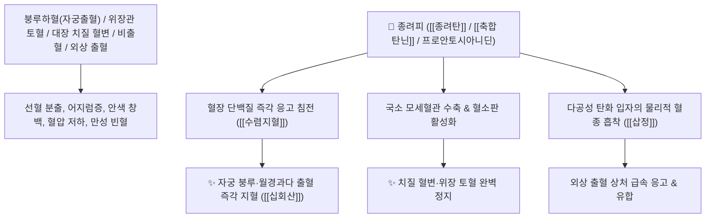

# 🌿 [[종려피]] (棕櫚皮 / 棕櫚炭, Trachycarpi Petiolus / 야자종려껍질)

> **핵심 요약 (Key Summary)**:
> 야자과(*Arecaceae*) 당종려(*Trachycarpus fortunei*)의 줄기를 감싸고 있는 섬유질 잎집(엽초)을 숯으로 태운 것 (종려탄 棕櫚炭)
> 축합 [[탄닌]](Condensed Tannin)과 다공성 탄화 미세입자가 혈장 단백질을 신속히 응고시키고 모세혈관을 수축시켜 강력한 수렴지혈 및 활혈지통 작용 발휘
> 여성의 자궁 부정출혈(붕루하혈 崩漏下血)·월경과다 및 위장관 토혈·대장 치질 혈변(변혈)·혈뇨·외상 출혈을 치료하는 천하제일의 [[수렴지혈]](收斂止血)·[[삽정지대]](澀精止帶)·[[십회산]](十灰散)의 군약(君藥)

---
## 📌 목차
1. [기본 본초 정보 & 화학 구조 (Pharmacognosy)](#1-기본-본초-정보--화학-구조-pharmacognosy)
2. [핵심 분자약리 기전 & 탄닌 탄화물·단백응고·수렴지혈 네트워크](#2-핵심-분자약리-기전--탄닌-탄화물단백응고수렴지혈-네트워크)
3. [해부생체역학 / 자궁내막 나선동맥 & 장관 점막 모세혈관 연계](#3-해부생체역학--자궁내막-나선동맥--장관-점막-모세혈관-연계)
4. [사상의학 및 임상 응용 (초탄 포제 필수 vs 전신 출혈 특화)](#4-사상의학-및-임상-응용-초탄-포제-필수-vs-전신-출혈-특화)
5. [고전 의학 및 배오 원리 (십회산 & 종려산 배오)](#5-고전-의학-및-배오-원리-십회산--종려산-배오)
6. [핵심 처방 비교 매트릭스](#6-핵심-처방-비교-매트릭스)
7. [출처 및 학술 참고 문헌 (References)](#7-출처-및-학술-참고-문헌-references)

---
## 1. 기본 본초 정보 & 화학 구조 (Pharmacognosy)

| 항목 | 상세 내용 |
| :--- | :--- |
| **기원 식물** | 야자과(종려과 Palmae / Arecaceae) 당종려 *Trachycarpus fortunei* (Hook.) H. Wendl.의 줄기를 싸고 있는 건조 엽초 섬유 |
| **성미 (性味)** | 苦·澀, 平 (쓰고 떫으며 평이함) |
| **귀경 (歸經)** | 肺·肝·大腸經 (폐경, 간경, 대장경) - **상중하 삼초의 모든 혈관 출혈을 거두어 멎게 함** |
| **효능 (Actions)** | [[수렴지혈]](收斂止血), [[삽정지대]](澀精止帶), [[조습살충]](燥濕殺蟲), [[산어지혈]](散瘀止血) |
| **주요 성분** | • **고농도 축합 탄닌**: 프로안토시아니딘, 카테킨 중합체, 에피카테킨<br>• **탄화 활성탄소 분획**: 다공성 탄화 미세입자 (지혈 물리 흡착물질)<br>• **플라보노이드**: 루테올린-7-O-글루코사이드, 퀘르세틴 |

> **[유래 및 본초학적 기전]**:
> * 야자나무 줄기를 감싼 껍질 섬유가 말갈기(棕)처럼 거칠게 덮여 있어 '종려피(棕櫚皮)'라 불렸습니다.
> * 생것(生用)은 맛이 몹시 떫고 거칠어 주로 **불에 검게 태워 숯(종려탄 棕櫚炭)으로 포제하여 사용하며, 온몸의 터져 나오는 피를 강력히 틀어막는(수렴지혈 收斂止血) 대표적인 지혈탄재**입니다.
> * 자궁 출혈(붕루), 코피, 토혈, 장출혈, 치질 변혈, 요로 출혈 등 출혈 부위를 가리지 않고 신속히 피를 멎게 합니다.

### 🔬 종려피의 탄화 축합 탄닌 구조
```
     [ 플라반-3-올 카테킨 단위 중합체 ] ───( 고온 초탄 炒炭 가공 )───> [ 다공성 탄화 단백응고 복합체 ]
```
> **[구조적 특징 및 단백질 가교 응고]**: [[탄닌]]은 혈장 알부민 및 피브리노겐과 수소 결합하여 불용성 단백질 복합체를 침전시키고, 탄화된 다공성 미세입자가 혈소판 부착을 촉진하여 혈전 마개를 즉각 형성합니다.

---
## 2. 핵심 분자약리 기전 & 탄닌 탄화물·단백응고·수렴지혈 네트워크



### (1) 표적 수렴지혈 및 붕루 완치 작용
* **부인과 붕루하혈(崩漏下血) 및 월경과다 완치 ([[수렴지혈]] 收斂止血)**:
  * 생리가 멈추지 않고 쏟아지거나 폐경 후 찔끔거리며 피가 비치는 부정출혈을 틀어막습니다.
* **대장 치질 출혈 및 궤양성 혈변 치료 ([[십회산]])**:
  * 배변 시 변기에 피가 뚝뚝 떨어지는 치핵 출혈과 장출혈을 신속히 멎게 합니다.
* **상부 위장관 토혈 및 코피(비출혈) 지혈**:
  * 숯으로 태운 약재 10종을 배합한 십회산의 핵심 군약으로 급성 토혈을 진정시킵니다.

---
## 3. 해부생체역학 / 자궁내막 나선동맥 & 장관 점막 모세혈관 연계

* **자궁내막 나선동맥(Spiral Artery) 평활근 수축 유도**:
  * 내막 탈락 부위의 노출된 혈관 단면을 조여 출혈량을 급감시킵니다.

---
## 4. 사상의학 및 임상 응용 (초탄 포제 필수 vs 전신 출혈 특화)

```
[✅ 최적 적응증 (Sweet Spot)]
• 만성 자궁 부정출혈(붕루) 및 생리 과다로 빈혈이 심한 여성
• 치질 출혈 및 궤양성 대장염 혈변
• 위궤양 토혈 및 오랜 비출혈(코피)

[⚠️ 포제 및 복용 수칙 (Safety)]
• 지혈 목적으로 사용할 때는 반드시 밀폐된 용기에서 겉은 검고 속은 갈색이 되게 태우는 초탄(炒炭) 포제 거쳐 복용
• 어혈이 뭉쳐서 발생한 초기 출혈에는 사혈약(활혈제)을 먼저 쓰고, 종려피는 출혈이 멎지 않는 지속 상태에 투여
```

---
## 5. 고전 의학 및 배오 원리 (십회산 & 종려산 배오)

### (1) 온갖 피를 멎게 하는 한의학 최고의 지혈방: 십회산(十灰散)
* **수렴지혈 최고 명약 배오**:
  * [[종려피]](종려탄)` + [[대계]] + [[소계]] + [[모근]] + [[측백엽]] + [[치자]] $\rightarrow$ 불에 태운 10대 지혈초로 토혈과 각혈을 멎게 하는 불후의 명방 ([[십회산]])
  * [[종려피]] + [[혈여탄]] + [[포황]] $\rightarrow$ 자궁 붕루와 변혈을 치료

---
## 6. 핵심 처방 비교 매트릭스

| 처방명 | 구성 약재 | 주치 병증 및 임상 타깃 | 특징 및 감별점 |
| :--- | :--- | :--- | :--- |
| [[십회산]] | [[대계]], [[소계]], [[모근]], [[측백엽]], [[하엽]], [[천초근]], [[종려피]], [[치자]] (모두 초탄) | **상초/중초 화열 치성, 극심한 토혈, 각혈, 비출혈, 해혈** | 태운 숯으로 피를 멎게 하는 황제방 |
| [[종려산]] | [[종려탄]], [[백작약]], [[당귀]] | **부인 붕중루하, 적백대하, 산후 혈붕, 소복 냉통** | 자궁 출혈을 멎게 하고 혈을 보함 |
| [[단홍음]] | [[종려탄]], [[숙지황]], [[백출]], [[황기]], [[아교]] | **기허 불섭혈, 만성 붕루, 사지 권태, 만성 빈혈** | 기운을 올려 피를 거둠 |

---
## 7. 출처 및 학술 참고 문헌 (References)

2. **대한민국약전(KP) 제12개정 (2022)**. 생약규격집: 종려피 (Trachycarpi Petiolus) 규격 기준.
   - **[공정서 규격]**: 당종려 엽초 섬유의 성상, 순도시험 및 건조감량 12.0% 이하 기준 명시.
