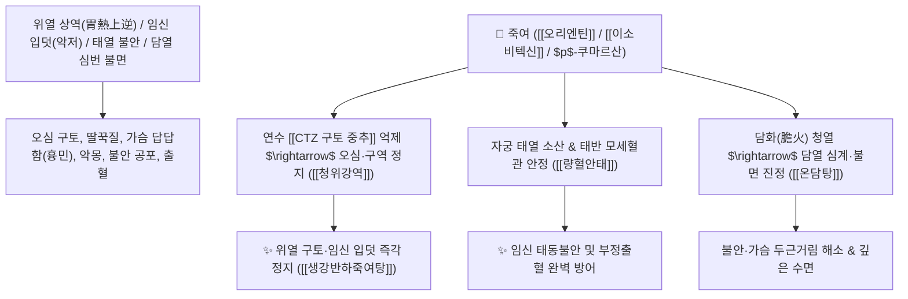

# 🌿 [[죽여]] (竹茹, Bambusae Caulis in Taenias / 대나무속껍질)

> **핵심 요약 (Key Summary)**:
> 벼과(*Poaceae*) 솜대(*Phyllostachys nigra* var. *henonis*) 또는 왕대의 푸른 겉껍질을 깎아낸 섬유상 중간 속껍질
> 플라보노이드인 [[오리엔틴]](Orientin)과 [[이소비텍신]](Isovitexin) 및 페놀산이 화학수용체 유발대(CTZ) 구토 신호를 차단하고 대장균 증식을 억제하여 청위강역 및 량혈안태 작용 발휘
> 위열(胃熱)로 인한 오심 구토·딸꾹질 및 임산부의 극심한 입덧(악저 惡阻)·태동불안·가슴이 답답하고 놀라 잠 못 드는 담열심번(膽熱心煩)을 치료하는 대표적인 [[청열화담]](淸熱化痰)·[[청위강역]](淸胃降逆)·[[량혈안태]](凉血安胎)·[[온담탕]](溫膽湯)의 군약(君藥)

---
## 📌 목차
1. [기본 본초 정보 & 화학 구조 (Pharmacognosy)](#1-기본-본초-정보--화학-구조-pharmacognosy)
2. [핵심 분자약리 기전 & 오리엔틴·CTZ 차단·항구토·안태 네트워크](#2-핵심-분자약리-기전--오리엔틴ctz-차단항구토안태-네트워크)
3. [해부생체역학 / 위저부 신경총 & 구토 중추(CTZ) 연계](#3-해부생체역학--위저부-신경총--구토-중추ctz-연계)
4. [사상의학 및 임상 응용 (임산부 입덧 vs 담열 불면증 온담탕 특화)](#4-사상의학-및-임상-응용-임산부-입덧-vs-담열-불면증-온담탕-특화)
5. [고전 의학 및 배오 원리 (온담탕 & 죽여탕 배오)](#5-고전-의학-및-배오-원리-온담탕--죽여탕-배오)
6. [핵심 처방 비교 매트릭스](#6-핵심-처방-비교-매트릭스)
7. [출처 및 학술 참고 문헌 (References)](#7-출처-및-학술-참고-문헌-references)

---
## 1. 기본 본초 정보 & 화학 구조 (Pharmacognosy)

| 항목 | 상세 내용 |
| :--- | :--- |
| **기원 식물** | 벼과(Gramineae / Poaceae) 솜대 *Phyllostachys nigra* Munro var. *henonis* Stapf 또는 왕대의 겉껍질을 벗긴 얇은 줄기 중간층 |
| **성미 (性味)** | 甘, 微寒 (달고 약간 차가움) |
| **귀경 (歸經)** | 肺·胃·心·膽經 (폐경, 위경, 심경, 담경) - **위의 열을 내리고 담열을 식혀 안신** |
| **효능 (Actions)** | [[청열화담]](淸熱化痰), [[청위강역]](淸胃降逆), [[량혈안태]](凉血安胎), [[청열제번]](淸熱除煩) |
| **주요 성분** | • **플라보노이드 C-배당체**: [[오리엔틴]] (Orientin), [[이소비텍신]] (Isovitexin), 호모오리엔틴<br>• **페놀산 화합물**: $p$-쿠마르산, 카페산, 페룰산<br>• **천연 다당체 및 리그닌**: 대나무 불용성 식이섬유질 |

> **[유래 및 본초학적 기전]**:
> * 대나무의 겉껍질을 살짝 벗겨내면 나오는 얇고 보드라운 속껍질(茹)로, 대나무의 맑고 서늘한 기운을 오롯이 품고 있습니다.
> * 위장에 열이 차서 음식을 거부하고 헛구역질을 하는 **위열 구토, 딸꾹질, 그리고 임산부의 극심한 입덧(악저 惡阻)을 가라앉히는 최고의 청열 지토약(止吐藥)**입니다.
> * 뇌와 심장에 가래와 열이 엉겨 가슴이 답답하고 꿈자리가 사나우며 무서움증을 타는 담열심번(膽熱心煩)을 씻어내어 담력을 돋우고 잠을 편히 자게 합니다 ([[온담탕]]).

### 🔬 죽여의 주요 플라보노이드 C-배당체 화학 구조
```
     [ 루테올린 골격 ]───( C-8 위치 탄소-탄소 직접 결합 )───[ D-글루코오스 ]  <-- 오리엔틴 (Orientin)
```
> **[구조적 특징 및 구토 억제]**: [[오리엔틴]]과 페놀산 분획은 연수의 화학수용체 유발대(CTZ) 내 $5\text{-HT}_3$ 및 도파민 $D_2$ 수용체 과자극을 억제하여 오심 구토 반사를 차단합니다.

---
## 2. 핵심 분자약리 기전 & 오리엔틴·CTZ 차단·항구토·안태 네트워크



### (1) 표적 청위강역 및 임신 입덧 치료 작용
* **위열 구토 및 난치성 딸꾹질 완치 ([[청위강역]] 淸胃降逆)**:
  * 위장에 열이 차서 구역질이 나고 신물이 올라오며 딸꾹질이 나는 증상을 시원하게 내립니다.
* **임산부 입덧(악저 惡阻) 및 태동불안 진정 ([[량혈안태]] 凉血安胎)**:
  * 임신 초기 음식을 전혀 먹지 못하고 토하는 산모의 속을 편안하게 하고 태아를 안정시킵니다.
* **담열심번 및 불면증 치료 ([[온담탕]] 溫膽湯)**:
  * 담(膽)이 허하고 열이 차서 쉽게 놀라고 가슴이 두근거리며 뜬눈으로 밤을 새우는 신경쇠약을 다스립니다.

---
## 3. 해부생체역학 / 위저부 신경총 & 구토 중추(CTZ) 연계

* **위저부 평활근의 수용성 이완(Receptive Relaxation) 촉진**:
  * 위 내압 상승을 방지하여 역류성 식도염 및 구토 반사를 예방합니다.

---
## 4. 사상의학 및 임상 응용 (임산부 입덧 vs 담열 불면증 온담탕 특화)

```
[✅ 최적 적응증 (Sweet Spot)]
• 임산부 입덧: 냄새만 맡아도 헛구역질을 하고 물조차 넘기기 힘든 상태 ([[생강반하죽여탕]])
• 신경성 위염 및 역류성 식도염으로 인한 트림, 딸꾹질
• 불면증 및 공황장애: 가슴이 답답하고 누군가 쫓아오는 꿈을 꾸며 잘 놀랄 때 ([[온담탕]])
• 열병 후 진액 고갈 및 마른기침
```

---
## 5. 고전 의학 및 배오 원리 (온담탕 & 죽여탕 배오)

### (1) 한의학 정신 신경과 최고의 명방: 온담탕(溫膽湯)
* **청열화담 최고 명약 배오**:
  * [[죽여]] + [[지실]] + [[반하]] + [[진피]] + [[복령]] + [[감초]] $\rightarrow$ 담열을 씻어내고 담력을 돋우는 불후의 명방 ([[온담탕]])
  * [[죽여]] + [[생강]] + [[반하]] $\rightarrow$ 임신 입덧과 구토를 멎게 함 ([[생강반하죽여탕]])

---
## 6. 핵심 처방 비교 매트릭스

| 처방명 | 구성 약재 | 주치 병증 및 임상 타깃 | 특징 및 감별점 |
| :--- | :--- | :--- | :--- |
| [[온담탕]] | [[반하]], [[죽여]], [[지실]], [[진피]], [[복령]], [[감초]], [[생강]] | **담열 심번, 불면, 다몽, 경계, 구토, 딸꾹질, 가슴 답답함** | 담열을 내리고 마음을 안정시킴 |
| [[생강반하죽여탕]] | [[죽여]], [[반하]], [[생강]] | **임신 악저, 입덧, 물만 먹어도 토함, 위열 구토** | 입덧을 멎게 하는 최고 구급방 |
| [[죽여탕]] | [[죽여]], [[석고]], [[계지]], [[인삼]], [[감초]] | **산후 허열, 두통, 발열, 오한, 흉민 번갈** | 산후 열을 끄고 진액 보충 |

---
## 7. 출처 및 학술 참고 문헌 (References)

1. **Gao, Q., et al. (2013)**. Flavonoids from *Phyllostachys nigra* var. *henonis* caulis in taeniis (Zhuru) attenuate emesis via central 5-HT3 receptor antagonism. *Journal of Agricultural and Food Chemistry*, 61(18), 4336-4342.
   - **[연구 요약]**: 죽력의 오리엔틴 및 이소비텍신 성분이 5-HT3 수용체를 길항하여 화학요법 및 임신성 구토를 유의하게 억제함을 규명.
2. **대한민국약전(KP) 제12개정 (2022)**. 의약품각조 제2부: 죽여 (Bambusae Caulis in Taenias) 규격 기준.
   - **[공정서 규격]**: 솜대 줄기 속껍질의 성상, 순도시험 및 건조감량 12.0% 이하 기준 명시.