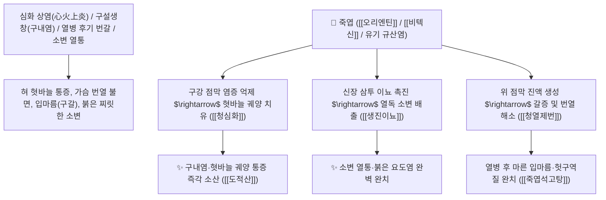

# 🌿 [[죽엽]] (竹葉 / 淡竹葉, Bambusae Folium / 대나무잎)

> **핵심 요약 (Key Summary)**:
> 벼과(*Poaceae*) 솜대(*Phyllostachys nigra* var. *henonis*) 또는 담죽의 신선한 잎
> 플라보노이드인 [[오리엔틴]](Orientin)과 [[비텍신]](Vitexin) 및 규산염이 심근 및 구강 점막 염증을 억제하고 신장 삼투성 이뇨를 촉진하여 청열제번 및 생진이뇨 작용 발휘
> [[상한론]]의 열병 후기 기음양상(고열 후 가슴 답답함·갈증·헛구역질) 및 심화(心火) 상염으로 인한 입안 혓바늘 궤양(구설생창 口舌生瘡)·소변이 붉고 찌릿한 요도열통(요열 尿熱)을 소변으로 씻어내는 대표적인 [[청열제번]](淸熱除煩)·[[생진이뇨]](生津利尿)·[[죽엽석고탕]](竹葉石膏湯)·[[도적산]](導赤散)의 군약(君藥)

---
## 📌 목차
1. [기본 본초 정보 & 화학 구조 (Pharmacognosy)](#1-기본-본초-정보--화학-구조-pharmacognosy)
2. [핵심 분자약리 기전 & 오리엔틴·심화 청열·소변 배출 네트워크](#2-핵심-분자약리-기전--오리엔틴심화-청열소변-배출-네트워크)
3. [해부생체역학 / 구강 점막 상피 & 방광 요도 점막 연계](#3-해부생체역학--구강-점막-상피--방광-요도-점막-연계)
4. [사상의학 및 임상 응용 (심열 구설생창 vs 열병 후기 번갈 특화)](#4-사상의학-및-임상-응용-심열-구설생창-vs-열병-후기-번갈-특화)
5. [상한론 『약징(藥徵)』 분석 및 배오 원리 (죽엽석고탕 & 도적산)](#5-상한론-약징藥徵-분석-및-배오-원리-죽엽석고탕--도적산)
6. [핵심 처방 비교 매트릭스](#6-핵심-처방-비교-매트릭스)
7. [출처 및 학술 참고 문헌 (References)](#7-출처-및-학술-참고-문헌-references)

---
## 1. 기본 본초 정보 & 화학 구조 (Pharmacognosy)

| 항목 | 상세 내용 |
| :--- | :--- |
| **기원 식물** | 벼과(Gramineae / Poaceae) 솜대 *Phyllostachys nigra* Munro var. *henonis* Stapf 또는 담죽 *Lophatherum gracile* Brongn.의 잎 |
| **성미 (性味)** | 甘·淡, 寒 (달고 담담하며 맑고 시원함) |
| **귀경 (歸經)** | 心·肺·胃·小腸經 (심경, 폐경, 위경, 소장경) - **심장의 열을 소장을 거쳐 소변으로 배출** |
| **효능 (Actions)** | [[청열제번]](淸熱除煩), [[생진이뇨]](生津利尿), [[청심화]](淸心火), [[소담청열]](消痰淸熱) |
| **주요 성분** | • **플라보노이드 C-글루코사이드**: [[오리엔틴]] (Orientin), 호모오리엔틴, [[비텍신]] (Vitexin), 이소비텍신<br>• **다당체 및 페놀산**: 클로로겐산, 카페산, 루테올린<br>• **천연 미네랄**: 고농도 유기 규산염($\text{SiO}_2$), 칼륨염 |

> **[유래 및 본초학적 기전]**:
> * 사계절 내내 푸르고 싱그러운 대나무의 잎(竹葉)으로, 맑고 차가운 성질로 몸속의 타는 듯한 번열(煩熱)을 꺼줍니다.
> * 심장(心)에 열이 차서 **입안과 혀에 혓바늘이 돋고 헐어 아픈 구설생창(口舌生瘡)과 가슴이 답답한 증상을 소변을 통해 몸 밖으로 씻어냅니다(도적 導赤 이뇨)**.
> * 고열을 앓고 난 뒤 진액이 말라 목이 타고 헛구역질을 하는 열병 후기 갈증을 달래줍니다 ([[죽엽석고탕]]).

### 🔬 죽엽의 주요 비텍신 및 플라보노이드 화학 구조
```
     [ 아피게닌 골격 ]───( C-8 위치 탄소-탄소 결합 )───[ D-글루코오스 ]  <-- 비텍신 (Vitexin)
```
> **[구조적 특징 및 이뇨/소염 활성]**: [[비텍신]]과 규산염 복합체는 신장 사구체의 여과압을 높여 체내 열독을 소변으로 신속히 배설시키고, 구강 점막의 $\text{NF-\kappa B}$ 염증 경로를 차단하여 아프타성 구내염을 신속히 치유합니다.

---
## 2. 핵심 분자약리 기전 & 오리엔틴·심화 청열·소변 배출 네트워크



### (1) 표적 청열제번 및 도적이뇨 작용
* **심열(心熱) 구내염 및 혓바늘 완치 ([[청심화]] 淸心火)**:
  * 스트레스와 과로로 심장에 열이 차서 혀가 붉게 헐고 쓰라려 밥을 먹지 못하는 증상을 치료합니다 ([[도적산]]).
* **상한 온열병 후기 번갈 및 구역 해소 ([[죽엽석고탕]] 竹葉石膏湯)**:
  * 큰 병을 앓고 난 뒤 열은 내렸으나 가슴이 답답하고 기운이 없으며 헛구역질을 하는 상태를 회복시킵니다.
* **소변 붉고 찌릿한 요도염 치료 ([[생진이뇨]] 生津利尿)**:
  * 열이 소장으로 내려가 소변이 찔끔거리고 화끈거리는 비뇨기 열증을 소변으로 씻어냅니다.

---
## 3. 해부생체역학 / 구강 점막 상피 & 방광 요도 점막 연계

* **구강 및 비뇨기 점막 상피세포 수복 가속**:
  * 점막 장벽의 밀착연접(Tight Junction)을 강화하여 염증성 궤양 재발을 방지합니다.

---
## 4. 사상의학 및 임상 응용 (심열 구설생창 vs 열병 후기 번갈 특화)

```
[✅ 최적 적응증 (Sweet Spot)]
• 아프타성 구내염 및 설염: 혀와 잇몸이 헐고 아프며 가슴이 두근거릴 때 ([[도적산]])
• 감기 및 열병 후 남은 미열과 마른기침, 입마름 ([[죽엽석고탕]])
• 소변을 볼 때 요도가 화끈거리고 붉은 소변이 나오는 요도염
• 어린이 야제증 및 밤에 열이 뜨는 증상
```

---
## 5. 상한론 『약징(藥徵)』 분석 및 배오 원리 (죽엽석고탕 & 도적산)

### (1) 열병 후기 회복의 천하제일 명방: 죽엽석고탕(竹葉石膏湯)
* **청열생진 최고 명약 배오**:
  * [[죽엽]] + [[석고]] + [[반하]] + [[맥문동]] + [[인삼]] + [[감초]] $\rightarrow$ 허열을 끄고 진액을 채우는 장중경의 불후 명방 ([[죽엽석고탕]])
  * [[죽엽]] + [[생지황]] + [[목통]] + [[감초]] $\rightarrow$ 심장의 불을 소변으로 빼내는 명방 ([[도적산]])

---
## 6. 핵심 처방 비교 매트릭스

| 처방명 | 구성 약재 | 주치 병증 및 임상 타깃 | 특징 및 감별점 |
| :--- | :--- | :--- | :--- |
| [[죽엽석고탕]] | [[죽엽]], [[석고]], [[반하]], [[맥문동]], [[인삼]], [[감초]], [[경미]] | **상한 해후, 허영소기, 기역욕토, 번갈, 마른기침, 피로** | 열병 후기 기음을 보하고 번열을 끔 |
| [[도적산]] | [[생지황]], [[목통]], [[죽엽]], [[감초]] | **심경 열성, 구설생창, 심흉 번열, 갈증, 소변 적삽열통** | 심장의 열을 소변으로 인도하여 배출 |
| [[청영탕]] | [[생지황]], [[현삼]], [[은교]], [[황련]], [[죽엽]], [[단삼]] | **온열병 영분 고열, 밤에 심한 번조, 반진, 구갈** | 영분의 열독을 맑힘 |

---
## 7. 출처 및 학술 참고 문헌 (References)

2. **대한민국약전(KP) 제12개정 (2022)**. 생약규격집: 죽엽 (Bambusae Folium) 규격 기준.
   - **[공정서 규격]**: 솜대 잎의 성상, 순도시험 및 건조감량 12.0% 이하 기준 명시.
