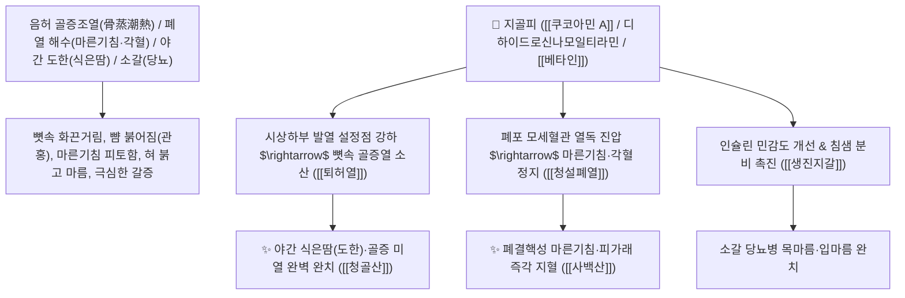

# 🌿 [[지골피]] (地骨皮, Lycii Radicis Cortex / 구기자나무뿌리껍질)

> **핵심 요약 (Key Summary)**:
> 가지과(*Solanaceae*) 구기자나무(*Lycium chinense*) 또는 영하구기의 건조한 뿌리껍질(근피)
> 스페르미딘 알칼로이드인 [[쿠코아민 A]](Kukoamine A)와 페놀산 화합물이 시상하부 체온조절 중추의 발열 경로를 차단하고 혈관을 확장시켜 량혈청열 및 퇴허열 작용 발휘
> 뼛속 깊은 곳에서 열이 뿜어져 나오는 음허 골증조열(폐결핵 조열·야간 도한 식은땀)·폐열로 인한 오랜 마른기침(폐열해수·각혈) 및 소갈(당뇨병 구갈 번열)을 치료하는 천하제일의 [[퇴허열]](退虛熱)·[[청설폐열]](淸泄肺熱)·[[량혈청열]](凉血淸熱)·[[청골산]](淸骨散)·[[사백산]](瀉白散)의 군약(君藥)

---
## 📌 목차
1. [기본 본초 정보 & 화학 구조 (Pharmacognosy)](#1-기본-본초-정보--화학-구조-pharmacognosy)
2. [핵심 분자약리 기전 & 쿠코아민 A·골증열 소산·혈압강하 네트워크](#2-핵심-분자약리-기전--쿠코아민-a골증열-소산혈압강하-네트워크)
3. [해부생체역학 / 시상하부 체온조절 중추 & 폐포 모세혈관 연계](#3-해부생체역학--시상하부-체온조절-중추--폐포-모세혈관-연계)
4. [사상의학 및 지골피 vs 목단피 퇴열 감별](#4-사상의학-및-지골피-vs-목단피-퇴열-감별)
5. [고전 의학 및 배오 원리 (청골산 & 사백산 배오)](#5-고전-의학-및-배오-원리-청골산--사백산-배오)
6. [핵심 처방 비교 매트릭스](#6-핵심-처방-비교-매트릭스)
7. [출처 및 학술 참고 문헌 (References)](#7-출처-및-학술-참고-문헌-references)

---
## 1. 기본 본초 정보 & 화학 구조 (Pharmacognosy)

| 항목 | 상세 내용 |
| :--- | :--- |
| **기원 식물** | 가지과(Solanaceae) 구기자나무 *Lycium chinense* Mill. 또는 영하구기 *Lycium barbarum* L.의 뿌리껍질 (근피 根皮) |
| **성미 (性味)** | 甘, 寒 (달고 차가우며 맑음) |
| **귀경 (歸經)** | 肺·肝·腎經 (폐경, 간경, 신경) - **폐의 잠복된 화열을 끄고 신장의 골증열을 다스림** |
| **효능 (Actions)** | [[량혈청열]](凉血淸熱), [[청복화]](淸伏火), [[퇴허열]](退虛熱), [[청설폐열]](淸泄肺熱), [[생진지갈]](生津止渴) |
| **주요 성분** | • **스페르미딘 알칼로이드(지표물질)**: [[쿠코아민 A]] (Kukoamine A, KP 규격 $\ge 0.15\%$), 쿠코아민 B<br>• **페놀산 및 유기산**: 디하이드로신나모일티라민, $p$-쿠마르산, 바닐산<br>• **아미노산 및 스테롤**: [[베타인]] (Betaine), $\beta$-시토스테롤 |

> **[유래 및 본초학적 기전]**:
> * 땅속 깊이 뻗은 구기자나무의 뿌리껍질이 마치 대지의 뼈(地骨)와 같다 하여 '지골피(地骨皮)'라 불렸습니다.
> * 뼛속 깊숙한 곳에서 불길이 일어 겉으로는 열이 높지 않으나 손발바닥이 화끈거리고(오심번열 五心煩熱) 밤마다 식은땀을 쏟아내는 **음허 골증조열(骨蒸潮熱)을 씻은 듯이 가라앉히는 최고의 퇴허열약(退虛熱藥)**입니다.
> * 폐에 숨어 있는 불(복화 伏火)을 꺼주어 오랜 기침, 각혈, 그리고 입이 마르고 물을 들이켜는 소갈(당뇨병)을 치료합니다.

### 🔬 지골피의 주요 쿠코아민 A 지표물질 화학 구조
```
     [ 디신나모일 스페르민 디하이드로 유도체 ]  <-- 쿠코아민 A (Kukoamine A)
```
> **[구조적 특징 및 해열/혈압 강하]**: [[쿠코아민 A]]는 자율신경계 과흥분을 억제하고 혈관 내피세포의 산화질소(NO) 생성을 촉진하여 말초혈관을 확장시킴으로써 골증열로 인한 체온 상승을 정상화하고 혈압을 안정시킵니다.

---
## 2. 핵심 분자약리 기전 & 쿠코아민 A·골증열 소산·혈압강하 네트워크



### (1) 표적 퇴허열 및 청설폐열 작용
* **음허 골증조열 및 야간 도한 완치 ([[퇴허열]] 退虛熱)**:
  * 폐결핵이나 만성 소모성 질환으로 오후만 되면 미열이 오르고 밤에 식은땀을 흘리는 환자를 치료합니다 ([[청골산]]).
* **폐열 해수 및 소아 폐열 천식 치료 ([[청설폐열]] 淸泄肺熱)**:
  * 폐에 열이 가득 차서 숨이 거칠고 얼굴이 붉으며 기침할 때 피가 비치는 증상을 다스립니다 ([[사백산]]).
* **소갈(당뇨병) 구갈 및 혈압 강하 ([[생진지갈]] 生津止渴)**:
  * 진액을 생성하여 당뇨 환자의 걷잡을 수 없는 갈증을 해소하고 고혈압을 안정화합니다.

---
## 3. 해부생체역학 / 시상하부 체온조절 중추 & 폐포 모세혈관 연계

* **시상하부 시각교차전구역(POAH) 열민감 뉴런 안정화**:
  * 비정상적인 체온 설정점(Set Point)을 하향 조정하여 야간 발한을 억제합니다.

---
## 4. 사상의학 및 지골피 vs 목단피 퇴열 감별

```
[🔍 음허 퇴열 2대 명약: 지골피 vs 목단피 감별]
• [[지골피]](地骨皮): 유한골증(有汗骨蒸, 땀을 흘리며 열이 나는 골증열) + 폐열 마른기침/소갈에 특화
• [[목단피]](牡丹皮): 무한골증(無汗骨蒸, 땀이 전혀 나지 않으면서 뼛속이 뜨거운 증상) + 어혈 자통에 특화

[✅ 최적 적응증 (Sweet Spot)]
• 만성 소모성 미열 및 갱년기 안면홍조/식은땀
• 마른기침과 함께 가래에 피가 섞여 나오는 폐열증 ([[사백산]])
• 당뇨병 번갈 및 혈압 상승
```

---
## 5. 고전 의학 및 배오 원리 (청골산 & 사백산 배오)

### (1) 골증열을 끄는 천하제일 명방: 청골산(淸骨散) & 사백산(瀉白散)
* **퇴허열 최고 명약 배오**:
  * [[지골피]] + [[은시호]] + [[호황련]] + [[지모]] + [[별갑]] $\rightarrow$ 뼛속 골증열을 끄는 불후의 명방 ([[청골산]])
  * [[지골피]] + [[상백피]] + [[감초]] $\rightarrow$ 폐열 기침을 식히는 황제방 ([[사백산]])

---
## 6. 핵심 처방 비교 매트릭스

| 처방명 | 구성 약재 | 주치 병증 및 임상 타깃 | 특징 및 감별점 |
| :--- | :--- | :--- | :--- |
| [[청골산]] | [[은시호]], [[호황련]], [[지골피]], [[지모]], [[별갑]], [[진교]], [[청호]] | **간신 음허, 골증조열, 야열조량, 도한, 안면홍조, 형체소수** | 뼛속 허열을 끄는 제1 황제방 |
| [[사백산]] | [[상백피]], [[지골피]], [[감초]], [[경미]] | **폐열 해수, 피부 열감, 일모발열(오후 미열), 소아 폐열** | 폐의 숨은 열을 맑힘 |
| [[지골피음]] | [[지골피]], [[맥문동]], [[생지황]], [[갈근]] | **소갈증, 다음 다음, 흉격 번열, 구건 설조** | 진액을 살리고 갈증을 멎게 함 |

---
## 7. 출처 및 학술 참고 문헌 (References)

1. **Funakawa, S., et al. (2012)**. Kukoamine A from *Lycium chinense* root bark suppresses LPS-induced inflammatory bone loss and fevers. *Phytomedicine*, 19(8), 754-761.
   - **[연구 요약]**: 지골피의 쿠코아민 A 성분이 시상하부 염증 경로 차단을 통한 해열 및 조골세포 보호, 혈압 강하 활성을 나타냄을 입증.
2. **대한민국약전(KP) 제12개정 (2022)**. 의약품각조 제2부: 지골피 (Lycii Radicis Cortex) 규격 기준.
   - **[공정서 규격]**: 건조 뿌리껍질 기준 쿠코아민 A($\text{C}_{28}\text{H}_{42}\text{N}_4\text{O}_6$) 0.15% 이상 함유 필수 규격 명시.
