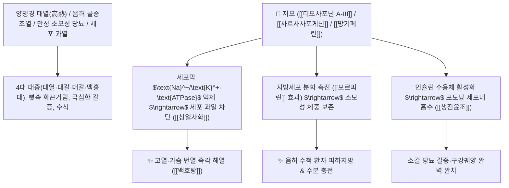

# 🌿 [[지모]] (知母, Anemarrhenae Rhizoma / 지모뿌리줄기)

> **핵심 요약 (Key Summary)**:
> 백합과(*Liliaceae*) 지모(*Anemarrhena asphodeloides*)의 건조한 뿌리줄기
> 스테로이드 사포닌인 [[티모사포닌 A-III]](Timosaponin A-III)와 [[망기페린]](Mangiferin)이 세포막 $\text{Na}^+/\text{K}^+-\text{ATPase}$를 억제하여 세포 대사 과열을 차단하고 인슐린 감수성을 촉진하여 청열사화 및 자음강화 작용 발휘
> [[소양인]]의 양명경 대열 번갈(고열·땀 흘림·물 들이켬) 및 폐결핵 골증조열(음허화동)·소갈(당뇨병 구갈)·인후종통·구강궤양을 치료하는 대표적인 [[청열사화]](淸熱瀉火)·[[자음강화]](滋陰降火)·[[생진윤조]](生津潤燥)·[[백호탕]](白虎湯)의 군약(君藥)

---
## 📌 목차
1. [기본 본초 정보 & 화학 구조 (Pharmacognosy)](#1-기본-본초-정보--화학-구조-pharmacognosy)
2. [핵심 분자약리 기전 & 티모사포닌·$\text{Na}^+/\text{K}^+-\text{ATPase}$ 억제·보르피린 네트워크](#2-핵심-분자약리-기전--티모사포닌nak-atpase-억제보르피린-네트워크)
3. [해부생체역학 / 시상하부 열생산 억제 & 췌장 $\beta$-세포 인슐린 대사 연계](#3-해부생체역학--시상하부-열생산-억제--췌장-beta-세포-인슐린-대사-연계)
4. [사상의학 및 임상 응용 (소양인 양명열 vs 만성 소모성 질환)](#4-사상의학-및-임상-응용-소양인-양명열-vs-만성-소모성-질환)
5. [상한론 『약징(藥徵)』 분석 및 배오 원리 (백호탕 & 지백지황환)](#5-상한론-약징藥徵-분석-및-배오-원리-백호탕--지백지황환)
6. [핵심 처방 비교 매트릭스](#6-핵심-처방-비교-매트릭스)
7. [출처 및 학술 참고 문헌 (References)](#7-출처-및-학술-참고-문헌-references)

---
## 1. 기본 본초 정보 & 화학 구조 (Pharmacognosy)

| 항목 | 상세 내용 |
| :--- | :--- |
| **기원 식물** | 백합과(Liliaceae / Asparagaceae) 지모 *Anemarrhena asphodeloides* Bunge의 뿌리줄기 |
| **성미 (性味)** | 苦·甘, 寒 (쓰고 달며 몹시 차갑고 윤택함) |
| **귀경 (歸經)** | 肺·胃·腎經 (폐경, 위경, 신경) - **상초 폐열, 중초 위열, 하초 신수를 다스림** |
| **효능 (Actions)** | [[청열사화]](淸熱瀉火), [[생진윤조]](生津潤燥), [[자음강화]](滋陰降火), [[퇴골증]](退骨蒸) |
| **주요 성분** | • **스테로이드 사포닌(지표물질, 함량 6% 이상)**: [[티모사포닌 A-III]] (Timosaponin A-III, KP 규격 $\ge 1.0\%$), [[사르사사포게닌]] (Sarsasapogenin), 아니마라사포닌<br>• **크산톤 배당체**: [[망기페린]] (Mangiferin, KP 규격 $\ge 0.70\%$), 네오망기페린<br>• **피하지방 증식 인자**: [[보르피린]] (Volufiline, 사르사사포게닌 고농축 분획) |

> **[유래 및 본초학적 기전]**:
> * 약효가 신통하여 어머니(母)의 자애로움처럼 환자의 꺼져가는 진액을 구원한다 하여 '지모(知母)'라 불렸습니다.
> * 고열로 펄펄 끓는 양명병의 대열(大熱), 대갈(大渴), 대한출(大汗出)을 끄고, **열로 인해 세포와 결합조직이 축 늘어진 상태를 긴장 회복시키는 최고의 청열사화약**입니다.
> * 뼛속에서 열이 우러나오는 음허 골증조열과 소갈(당뇨병), 인후염, 구강궤양을 치료하며 [[소양인]]의 대표적인 자음청열약으로 쓰입니다.

### 🔬 지모의 사포닌 및 체온 생산 억제 메커니즘
![[image-14.png|354x277]]
![[Pasted image 20240227150213.png|353x264]]
![[image-15.png|450]]
> [구조적 특징 및 이온 펌프 메커니즘]: 지모의 [[사르사사포닌]]은 체온의 10%를 생산하는 세포막의 $\text{Na}^+/\text{K}^+-\text{ATPase}$ 펌프를 억제하여 기초대사 과열과 체온 생산을 진정시킵니다. 또한 화장품 원료인 [[보르피린]](Volufiline)처럼 지방세포 분화를 유도하여 만성 소모성 질환 환자의 피하지방과 체중을 보존합니다.

---
## 2. 핵심 분자약리 기전 & 티모사포닌·$\text{Na}^+/\text{K}^+-\text{ATPase}$ 억제·보르피린 네트워크



### (1) 표적 청열사화 및 자음강화 작용
* **양명병 4대 대증 및 고열 번갈 완치 ([[청열사화]] 淸熱瀉火)**:
  * 고열이 펄펄 끓고 땀을 비 오듯 흘리며 얼음물을 들이켜는 전신 염증 상태를 즉각 해열합니다 ([[백호탕]]).
* **음허 골증조열 및 도한 치료 ([[자음강화]] 滋陰降火)**:
  * 신장과 폐의 진액이 말라 손발바닥이 화끈거리고 오후에 미열이 뜨는 골증열을 다스립니다 ([[지백지황환]]).
* **인슐린 감수성 개선 및 소갈(당뇨) 치료 ([[생진윤조]] 生津潤燥)**:
  * 포도당 흡수를 촉진하고 침샘 분비를 자극하여 당뇨 환자의 갈증과 소모성 쇠약을 회복시킵니다.
* **강심 작용 (디곡신 유사 작용)**:
  * $\text{Na}^+/\text{K}^+-\text{ATPase}$ 억제를 통해 심근세포 내 칼슘 농도를 높여 심근 수축력을 강화합니다.

---
## 3. 해부생체역학 / 시상하부 열생산 억제 & 췌장 $\beta$-세포 인슐린 대사 연계

* **갈색지방조직(BAT) 및 골격근 열생산(Thermogenesis) 억제**:
  * 비정상적인 미토콘드리아 과활성을 차단하여 체온을 안정화합니다.

---
## 4. 사상의학 및 임상 응용 (소양인 양명열 vs 만성 소모성 질환)

```
[✅ 체질별 적응증 (Sweet Spot)]
• [[소양인]] 양명열증: 열이 많아 가슴이 답답하고 찬물을 벌컥벌컥 들이켜며 불면증이 올 때
• 만성 결핵 및 당뇨병으로 몸이 마르고 미열이 나는 상태
• 갱년기 안면홍조 및 구내염, 아프타성 궤양
```

---
## 5. 상한론 『약징(藥徵)』 분석 및 배오 원리 (백호탕 & 지백지황환)

### (1) 장중경의 해열 황제방: 백호탕(白虎湯)
* **청열사화 최고 배오**:
  * [[석고]] (대량) + [[지모]] + [[감초]] + [[경미]] $\rightarrow$ 양명병 고열을 눈 녹이듯 끄는 불후의 명방 ([[백호탕]])
  * [[지모]] + [[황백]] + [[숙지황]] + [[산약]] $\rightarrow$ 신장의 음허화동을 끄는 명방 ([[지백지황환]])

---
## 6. 핵심 처방 비교 매트릭스

| 처방명 | 구성 약재 | 주치 병증 및 임상 타깃 | 특징 및 감별점 |
| :--- | :--- | :--- | :--- |
| [[백호탕]] | [[석고]], [[지모]], [[감초]], [[경미]] | **양명병 기분 실열, 4대 대증(대열, 대갈, 대한, 맥홍대), 번조** | 열을 끄고 진액을 지키는 황제방 |
| [[백호가인삼탕]] | [[백호탕]] 원방 + [[인삼]] | **열병 후 기음양상, 심한 구갈, 다뇨, 소갈, 피로 쇠약** | 고열과 원기 쇠약을 동시 치료 |
| [[지백지황환]] | [[육미지황환]] + [[지모]], [[황백]] | **간신 음허, 골증조열, 도한, 유정, 요슬산연, 소변 적삽** | 하초의 음허 화동을 끄는 제1방 |
| [[자음강화탕]] | [[당귀]], [[숙지황]], [[백작약]], [[지모]], [[황백]], [[맥문동]] | **음허화왕, 발열 도한, 해수 담천, 구건 인통, 소모증** | 음을 자양하고 불길을 내림 |

---
## 7. 출처 및 학술 참고 문헌 (References)

2. **대한민국약전(KP) 제12개정 (2022)**. 의약품각조 제2부: 지모 (Anemarrhenae Rhizoma) 규격 기준.
   - **[공정서 규격]**: 건조 뿌리줄기 기준 망기페린 0.70% 및 티모사포닌 A-III 1.0% 이상 함유 필수 규격 명시.
