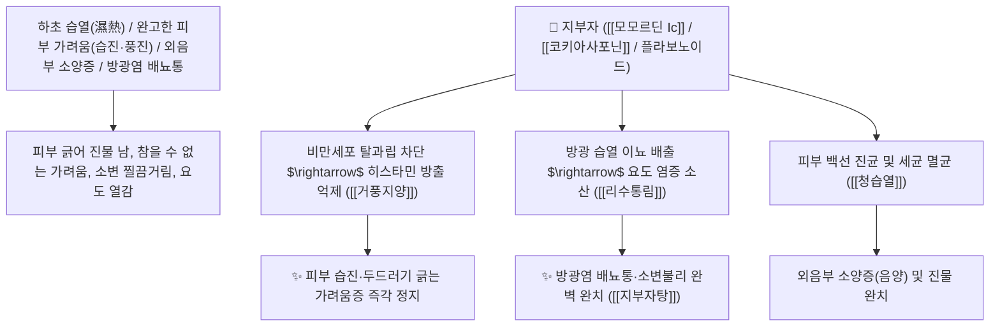

# 🌿 [[지부자]] (地膚子, Kochiae Fructus / 댑싸리씨앗)

> **핵심 요약 (Key Summary)**:
> 명아주과(*Chenopodiaceae*) 댑싸리(*Kochia scoparia*)의 건조한 성숙 열매(종자)
> 올레아난 사포닌인 [[모모르딘 Ic]](Momordin Ic)와 [[코키아사포닌]](Kochiasaponin)이 비만세포 히스타민 분비를 강력 차단하고 신장 삼투 이뇨를 촉진하여 청열이습 및 거풍지양 작용 발휘
> 하초 습열(濕熱)로 인한 방광염 요도통(소변이 찔끔거리고 아픔) 및 피부 풍진 두드러기·습진·외음부 극심한 가려움증(음양 陰痒)을 씻어내는 천하제일의 [[청습열]](淸濕熱)·[[리수통림]](利水通淋)·[[거풍지양]](祛風止痒)·[[지부자탕]](地膚子湯)의 군약(君藥)

---
## 📌 목차
1. [기본 본초 정보 & 화학 구조 (Pharmacognosy)](#1-기본-본초-정보--화학-구조-pharmacognosy)
2. [핵심 분자약리 기전 & 모모르딘·항히스타민·가려움증 진정 네트워크](#2-핵심-분자약리-기전--모모르딘항히스타민가려움증-진정-네트워크)
3. [해부생체역학 / 피부 표피 감각신경 C-섬유 & 요도 괄약근 연계](#3-해부생체역학--피부-표피-감각신경-c-섬유--요도-괄약근-연계)
4. [사상의학 및 임상 응용 (피부 소양증 vs 방광염 이수 특화)](#4-사상의학-및-임상-응용-피부-소양증-vs-방광염-이수-특화)
5. [고전 의학 및 배오 원리 (지부자탕 & 소풍산 가미)](#5-고전-의학-및-배오-원리-지부자탕--소풍산-가미)
6. [핵심 처방 비교 매트릭스](#6-핵심-처방-비교-매트릭스)
7. [출처 및 학술 참고 문헌 (References)](#7-출처-및-학술-참고-문헌-references)

---
## 1. 기본 본초 정보 & 화학 구조 (Pharmacognosy)

| 항목 | 상세 내용 |
| :--- | :--- |
| **기원 식물** | 명아주과(Chenopodiaceae / Amaranthaceae) 댑싸리 *Kochia scoparia* (L.) Schrad. (=*Bassia scoparia*)의 익은 열매 |
| **성미 (性味)** | 辛·苦, 寒 (맵고 쓰며 맑고 차가움) |
| **귀경 (歸經)** | 膀胱經 (방광경) - **방광의 습열을 씻어내고 피부 체표로 주행** |
| **효능 (Actions)** | [[청습열]](淸濕熱), [[리수통림]](利水通淋), [[거풍지양]](祛風止痒), [[청간명목]](淸肝明目) |
| **주요 성분** | • **올레아난 트리테르펜 사포닌(핵심 지표)**: [[모모르딘 Ic]] (Momordin Ic, KP 규격 $\ge 1.8\%$), 코키아사포닌(Kochiasaponin I~IV)<br>• **플라보노이드 배당체**: 이소퀘르시트린, 루틴, 아피게닌<br>• **지방산 및 스테롤**: 올레산, 리놀레산, $\beta$-시토스테롤 |

> **[유래 및 본초학적 기전]**:
> * 댑싸리가 대지(地)의 피부(膚)처럼 땅을 덮고 자라며, 피부의 모든 질환을 고친다 하여 '지부자(地膚子)'라 불렸습니다.
> * 하초에 차오른 **습열(濕熱)을 소변으로 시원하게 빼내어 방광염과 배뇨통을 치료하고, 피부 표면의 극심한 가려움증(피부 소양증, 알레르기 두드러기, 외음부 가려움)을 멎게 하는 외과/피부과의 으뜸 명약**입니다.

### 🔬 지부자의 주요 모모르딘 사포닌 화학 구조
```
     [ 올레아놀산 아글리콘 골격 ]───O──[ 3-O-$\beta$-D-글루쿠로노피라노사이드 ]  <-- 모모르딘 Ic (Momordin Ic)
```
> **[구조적 특징 및 항알레르기 활성]**: [[모모르딘 Ic]]는 비만세포의 $\text{IgE}$ 매개 탈과립을 차단하여 히스타민 및 류코트리엔 분비를 억제함으로써 피부 신경말단의 가려움 전달 신호를 즉각 차단합니다.

---
## 2. 핵심 분자약리 기전 & 모모르딘·항히스타민·가려움증 진정 네트워크



### (1) 표적 거풍지양 및 리수통림 작용
* **완고한 피부 가려움증 및 습진 완치 ([[거풍지양]] 祛風止痒)**:
  * 알레르기 두드러기, 아토피, 접촉성 피부염으로 피가 날 때까지 긁는 가려움을 가라앉힙니다 ([[소풍산]] 가미).
* **외음부 소양증(음양 陰痒) 및 질염 치료**:
  * 습열이 하초로 몰려 생식기 주변이 가렵고 진물이 나는 증상을 내복 및 외용 전탕 세정으로 치료합니다.
* **급만성 방광염 및 요도염 완치 ([[리수통림]] 利水通淋)**:
  * 소변이 붉고 찌릿하게 아픈 임병(淋病)을 이뇨 작용으로 씻어냅니다.

---
## 3. 해부생체역학 / 피부 표피 감각신경 C-섬유 & 요도 괄약근 연계

* **표피 무수신경 C-섬유 과흥분 차단**:
  * 가려움증 수용체(Mrgprs)를 안정화하여 긁는 악순환(Itch-Scratch Cycle)을 차단합니다.

---
## 4. 사상의학 및 임상 응용 (피부 소양증 vs 방광염 이수 특화)

```
[✅ 최적 적응증 (Sweet Spot)]
• 온몸이 가려운 급만성 두드러기 및 노인성 피부 소양증
• 여성 질염 및 남성 사타구니 습진(완선) 가려움증
• 소변볼 때 찌릿하게 아프고 잔뇨감이 심한 방광염 ([[지부자탕]])
```

---
## 5. 고전 의학 및 배오 원리 (지부자탕 & 소풍산 가미)

### (1) 피부 가려움과 방광염을 씻어내는 최고 명방
* **거풍지양 최고 배오**:
  * [[지부자]] + [[백선피]] + [[사상자]] + [[고삼]] $\rightarrow$ 피부 가려움과 외음부 습진을 씻어내는 외용/내복 명방
  * [[지부자]] + [[지모]] + [[황백]] + [[복령]] $\rightarrow$ 방광염과 소변 불리를 치료 ([[지부자탕]])

---
## 6. 핵심 처방 비교 매트릭스

| 처방명 | 구성 약재 | 주치 병증 및 임상 타깃 | 특징 및 감별점 |
| :--- | :--- | :--- | :--- |
| [[지부자탕]] | [[지부자]], [[지모]], [[황백]], [[복령]], [[돼지방광]] | **하초 습열, 방광염, 소변 불리, 배뇨통, 요열, 임병** | 방광의 습열을 씻어냄 |
| [[소풍산]](가미) | [[형개]], [[방풍]], [[고삼]], [[지부자]], [[백선피]] | 풍열습진, 피부 소양증, 팽진 두드러기, 진물 궤양 | 피부 가려움증 치료의 제1방 |
| [[지부자산]] | [[지부자]], [[사상자]], [[백반]] (외용 전탕 세정제) | **외음부 소양증(음양), 사타구니 습진, 백선, 옴병** | 환부를 씻어 가려움을 정지 |

---
## 7. 출처 및 학술 참고 문헌 (References)

1. **Matsuda, H., et al. (1997)**. Anti-allergic and anti-pruritic effects of momordin Ic and saponins from the fruit of *Kochia scoparia*. *Biological and Pharmaceutical Bulletin*, 20(10), 1088-1091.
   - **[연구 요약]**: 지부자의 모모르딘 Ic 성분이 비만세포 히스타민 분비 및 Substance P 매개 긁기 행동을 유의하게 억제함을 규명.
2. **대한민국약전(KP) 제12개정 (2022)**. 의약품각조 제2부: 지부자 (Kochiae Fructus) 규격 기준.
   - **[공정서 규격]**: 건조 열매 기준 모모르딘 Ic($\text{C}_{41}\text{H}_{64}\text{O}_{13}$) 1.8% 이상 함유 필수 규격 명시.
