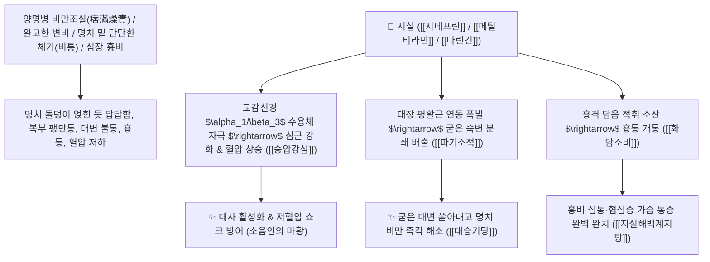

# 🌿 [[지실]] (枳實, Aurantii Fructus Immaturus / 어린탱자열매)

> **핵심 요약 (Key Summary)**:
> 운향과(*Rutaceae*) 탱자나무(*Poncirus trifoliata*) 또는 광귤나무의 5~6월 채취한 건조한 어린 열매
> 아드레날린 수용체 효능 알칼로이드인 [[시네프린]](Synephrine)과 [[메틸티라민]](N-Methyltyramine) 및 [[나린긴]](Naringin)이 위장관 평활근 연동운동을 폭발적으로 촉진하고 혈압을 상승시켜 파기소적 및 화담소비 작용 발휘
> [[상한론]]의 양명병 조열 비만조실(痞滿燥實, 명치 밑이 돌처럼 굳고 꽉 막혀 대변을 못 봄)·흉비 심통(심근경색 흉통) 및 위장관 무력증·소화불량 적취를 깨뜨리는 천하제일의 [[파기소적]](破氣消積)·[[화담소비]](化痰消痞)·[[대승기탕]](大承氣湯)의 군약(君藥)

---
## 📌 목차
1. [기본 본초 정보 & 화학 구조 (Pharmacognosy)](#1-기본-본초-정보--화학-구조-pharmacognosy)
2. [핵심 분자약리 기전 & 시네프린·메틸티라민·파기소적·장관 수축 네트워크](#2-핵심-분자약리-기전--시네프린메틸티라민파기소적장관-수축-네트워크)
3. [해부생체역학 / 유문괄약근 긴장도 & 대장 평활근 연동 연계](#3-해부생체역학--유문괄약근-긴장도--대장-평활근-연동-연계)
4. [사상의학 및 지실 vs 지각·후박 정밀 감별 (소음인의 마황)](#4-사상의학-및-지실-vs-지각후박-정밀-감별-소음인의-마황)
5. [상한론 『약징(藥徵)』 분석 및 배오 원리 (대승기탕 & 사역산)](#5-상한론-약징藥徵-분석-및-배오-원리-대승기탕--사역산)
6. [핵심 처방 비교 매트릭스](#6-핵심-처방-비교-매트릭스)
7. [출처 및 학술 참고 문헌 (References)](#7-출처-및-학술-참고-문헌-references)

---
## 1. 기본 본초 정보 & 화학 구조 (Pharmacognosy)

| 항목 | 상세 내용 |
| :--- | :--- |
| **기원 식물** | 운향과(Rutaceae) 탱자나무 *Poncirus trifoliata* Rafin. 또는 광귤나무 *Citrus aurantium* L.의 덜 익은 어린 열매 |
| **성미 (性味)** | 苦·辛·酸, 微寒 (몹시 쓰고 매우며 시고 약간 차가움) |
| **귀경 (歸經)** | 脾·胃·大腸經 (비경, 위경, 대장경) - **명치 밑과 대장에 뭉친 단단한 체기를 사납게 부숨** |
| **효능 (Actions)** | [[파기소적]](破氣消積), [[화담소비]](化痰消痞), [[사하통변]](瀉下通便), [[승압강심]](昇壓强心) |
| **주요 성분** | • **아민 알칼로이드(교감신경 부스터)**: [[시네프린]] (Synephrine, KP 규격 $\ge 0.30\%$), [[메틸티라민]] (N-Methyltyramine)<br>• **플라보노이드 배당체**: [[나린긴]] (Naringin), [[네오헤스페리딘]] (Neohesperidin), 폰시린(Poncirin)<br>• **모노테르펜 정유**: 리모넨, 피넨 |

> **[유래 및 본초학적 기전]**:
> * 덜 자란 어린 탱자 열매(實)로, 기운이 옹골차고 맹렬하여 **'기를 깨뜨리고 쌓인 적취를 부수는(파기소적 破氣消積)' 한의학 최강의 파기약(破氣藥)**입니다.
> * 체기가 굳어 명치 밑이 돌덩이처럼 답답하고 누르면 아픈 비만(痞滿)과 변비를 뚫어내며, **임상에서 '소음인의 마황'이라 불릴 정도로 대사를 끌어올리는 강력한 부스터 역할**을 합니다.
> * **지실(한성 寒性, 습열 소산)** vs **후박(온성 溫性, 한습 소산)**의 절묘한 배오로 소화기 적취를 완벽히 타파합니다.

### 🔬 지실의 주요 시네프린 및 페네틸아민 구조
```
     [ 4-하이드록시페네틸아민 골격 (C-$\beta$ 수산기, N-메틸기) ]  <-- 시네프린 (Synephrine)
```
> **[구조적 특징 및 교감신경 효능]**: [[시네프린]]과 [[메틸티라민]]은 $\alpha_1$ 및 $\beta_3$ 아드레날린 수용체를 직접 자극하여 혈관을 수축시켜 혈압을 지지하고, 심근 수축력을 높이며, 위장관 평활근의 배출 연동운동을 폭발적으로 증대시킵니다.

---
## 2. 핵심 분자약리 기전 & 시네프린·메틸티라민·파기소적·장관 수축 네트워크



### (1) 표적 파기소적 및 비만(痞滿) 타파 작용
* **양명병 실열 변비 및 복부 비만 완치 ([[파기소적]] 破氣消積)**:
  * 명치와 아랫배가 팽팽하게 불러오고 손도 못 대게 아픈 완고한 숙변과 식체를 쏟아냅니다 ([[대승기탕]]).
* **사역산(四逆散)의 간기울결 및 사지 궐냉 해소**:
  * 기운이 막혀 손발이 차가워지는 양울(陽鬱) 상태에서 기기를 열어 혈액순환을 회복시킵니다.
* **협심증 및 흉비(胸痺) 심통 치료 ([[지실해백계지탕]])**:
  * 가슴에 담음이 맺혀 숨이 차고 쥐어짜듯 아픈 관상동맥 질환의 흉통을 뚫어줍니다.

---
## 3. 해부생체역학 / 유문괄약근 긴장도 & 대장 평활근 연동 연계

* **위 유문부 및 회맹판(Ileocecal Valve) 개폐 리듬 정상화**:
  * 정체된 위 내용물과 장내 가스를 하부 장관으로 신속히 이동시킵니다.

---
## 4. 사상의학 및 지실 vs 지각·후박 정밀 감별 (소음인의 마황)

```
[🔍 지실 vs 지각 vs 후박 정밀 감별]
• [[지실]](枳實, 어린 열매): 寒性, 파기소적(破氣消積) $\rightarrow$ 명치 밑 단단한 적취, 실열 변비 (파괴력 최강)
• [[지각]](枳殼, 성숙 열매): 微寒, 이기관중(理氣寬中) $\rightarrow$ 가슴 답답함, 헛배 부름, 위하수 (온화한 행기)
• [[후박]](厚朴, 나무껍질): 溫性, 조습화담(燥濕化痰) $\rightarrow$ 배가 차서 가스가 차고 끓는 한습 복만

[💡 임상 팁: 소음인의 마황]
• 소음인은 마황을 쓰기 어려우므로, [[지실]]을 대사를 깨우고 부종과 체기를 부수는 부스터로 적극 활용
```

---
## 5. 상한론 『약징(藥徵)』 분석 및 배오 원리 (대승기탕 & 사역산)

### (1) 『[[약징]]』에 나타난 지실의 주치
> **"枳實 主治結實, 毒害, 腹痛也. 旁治胸痺, 痞滿, 煩渴, 咳逆, 嘔吐..."**  
> (지실의 주치는 단단하게 뭉치고 굳은 결실(結實)과 독해, 복통을 치료한다.)

* **상한론 최고 배오**:
  * [[지실]] + [[후박]] + [[대황]] + [[망초]] $\rightarrow$ 양명병 열결 변비를 부수는 황제방 ([[대승기탕]])
  * [[지실]] + [[시호]] + [[백작약]] + [[감초]] $\rightarrow$ 기운을 틔워 손발 찬 것을 치료 ([[사역산]])

---
## 6. 핵심 처방 비교 매트릭스

| 처방명 | 구성 약재 | 주치 병증 및 임상 타깃 | 특징 및 감별점 |
| :--- | :--- | :--- | :--- |
| [[대승기탕]] | [[대황]], [[망초]], [[지실]], [[후박]] | **양명병 조열, 4대 증상(비, 만, 조, 실), 헛소리(섬어), 고열 변비** | 적취와 숙변을 부수는 최고 사하방 |
| [[사역산]] | [[시호]], [[지실]], [[백작약]], [[감초]] | **소음병 양울궐역(사지 궐냉), 흉협 고만, 복통, 설사** | 간기를 틔워 말초 순환을 개통 |
| [[지실해백계지탕]] | [[지실]], [[해백]], [[계지]], [[후박]], [[과루실]] | **흉비 심통, 가슴 답답함, 숨참, 등까지 뻗치는 통증** | 흉부 담음을 뚫는 협심증 명방 |
| [[지실소비환]] | [[지실]], [[후박]], [[황련]], [[반하]], [[백출]], [[복령]] | **음식 식체, 완복 비만, 소화불량, 트림, 식욕부진** | 소화를 돕고 명치 답답함을 삭임 |

---
## 7. 출처 및 학술 참고 문헌 (References)

1. **Song, D. K., et al. (2001)**. Pharmacological mechanisms of synephrine from *Citrus aurantium* (Aurantii Fructus Immaturus) on gastrointestinal motility and blood pressure. *Life Sciences*, 69(9), 1079-1087.
   - **[연구 요약]**: 지실의 시네프린 성분이 아드레날린 수용체를 통해 장관 연동운동 촉진 및 혈압 지지 작용을 발휘함을 규명.
2. **대한민국약전(KP) 제12개정 (2022)**. 의약품각조 제2부: 지실 (Aurantii Fructus Immaturus) 규격 기준.
   - **[공정서 규격]**: 시네프린($\text{C}_9\text{H}_{13}\text{NO}_2$) 0.30% 이상 함유 필수 규격 명시.
3. **길익동동 (吉益東洞, 1784)**. 『약징(藥徵)』: 枳實 조문.
   - **[고전 원전]**: "枳實 主治結實, 毒害, 腹痛也..." - 단단한 결실 적취 주치 원리 제시.