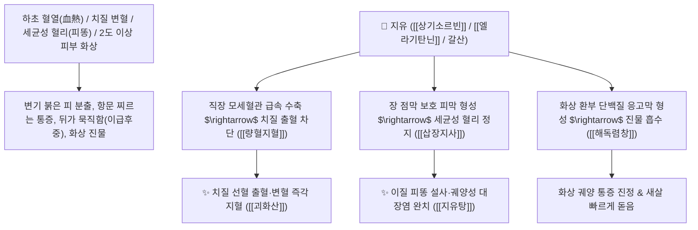

# 🌿 [[지유]] (地楡 / 地楡炭, Sanguisorbae Radix / 오이풀뿌리)

> **핵심 요약 (Key Summary)**:
> 장미과(*Rosaceae*) 오이풀(*Sanguisorba officinalis*)의 건조한 뿌리 (지유탄 地楡炭)
> 고농도 엘라기탄닌인 [[상기소르빈]]과 [[갈산]](Gallic acid) 및 트리테르펜 사포닌이 국소 모세혈관을 급속 수축시키고 단백질 보호막을 형성하여 강력한 량혈지혈 및 해독렴창 작용 발휘
> 하초 혈열(血熱)로 인한 대장 치질 출혈(변혈·선혈 뚝뚝 떨어짐)·세균성 혈리(피똥 설사)·자궁 부정출혈(붕루) 및 2도 이상 피부 화상(탕상) 진물 궤양을 치료하는 천하제일의 [[량혈지혈]](凉血止血)·[[해독렴창]](解毒斂瘡)·[[괴화산]](槐花散)·[[지유탕]](地楡湯)의 군약(君藥)

---
## 📌 목차
1. [기본 본초 정보 & 화학 구조 (Pharmacognosy)](#1-기본-본초-정보--화학-구조-pharmacognosy)
2. [핵심 분자약리 기전 & 상기소르빈·모세혈관 수축·화상 렴창 네트워크](#2-핵심-분자약리-기전--상기소르빈모세혈관-수축화상-렴창-네트워크)
3. [해부생체역학 / 직장 정맥총 혈류 & 표피 기저막 수복 연계](#3-해부생체역학--직장-정맥총-혈류--표피-기저막-수복-연계)
4. [사상의학 및 임상 응용 (치질 하혈 vs 화상 외용 특화)](#4-사상의학-및-임상-응용-치질-하혈-vs-화상-외용-특화)
5. [고전 의학 및 배오 원리 (지유탕 & 괴화산)](#5-고전-의학-및-배오-원리-지유탕--괴화산)
6. [핵심 처방 비교 매트릭스](#6-핵심-처방-비교-매트릭스)
7. [출처 및 학술 참고 문헌 (References)](#7-출처-및-학술-참고-문헌-references)

---
## 1. 기본 본초 정보 & 화학 구조 (Pharmacognosy)

| 항목 | 상세 내용 |
| :--- | :--- |
| **기원 식물** | 장미과(Rosaceae) 오이풀 *Sanguisorba officinalis* L. 또는 장엽지유의 뿌리 |
| **성미 (性味)** | 苦·酸·澀, 微寒 (쓰고 시며 떫고 서늘함) |
| **귀경 (歸經)** | 肝·大腸經 (간경, 대장경) - **하초 대장과 자궁의 혈열을 식히고 피를 멎게 함** |
| **효능 (Actions)** | [[량혈지혈]](凉血止血), [[해독렴창]](解毒斂瘡), [[삽장지사]](澀腸止瀉), [[청열수렴]](淸熱收斂) |
| **주요 성분** | • **트리테르펜 사포닌**: [[상기소르빈]] (Sanguisorbin A~E), 지유 사포닌 I, II, 지유글리코사이드<br>• **가수분해형 탄닌(함량 15~20%)**: 상귀인(Sanguin H-1~H-11), 갈산(Gallic acid), 엘라그산<br>• **플라보노이드**: 퀘르세틴, 켐페롤 |

> **[유래 및 본초학적 기전]**:
> * 잎에서 상큼한 오이 냄새가 나며, 대지(地)의 상처를 치료하는 느릅나무(楡)처럼 **땅에서 긁혀 피가 나거나 하초에서 피가 쏟아질 때 사용하는 지혈 명약**입니다.
> * 특히 **하초(대장, 직장, 항문, 자궁)의 뜨거운 혈열(血熱)을 식혀 치질 출혈과 피똥을 동반한 이질 설사를 틀어막는 데 특화**되어 있습니다.
> * 불이나 뜨거운 물에 덴 **화상(燙傷) 환부에 바르면 즉각 통증을 멎게 하고 새살을 돋게 하는(해독렴창 解毒斂瘡)** 외과 명약입니다.

### 🔬 지유의 주요 탄닌 및 사포닌 화학 구조
```
     [ 우르산 트리테르펜 골격 ]───O──[ 3-O-글루코피라노사이드 ]  <-- 상기소르빈 B (Sanguisorbin B)
```
> **[구조적 특징 및 지혈/상처 수복]**: 지유의 고농도 [[엘라기탄닌]]과 사포닌 복합체는 손상된 혈관 내피의 트롬복산 합성을 촉진하여 모세혈관을 급속 수축시키고, 궤양 표면에 불용성 단백질 보호막을 형성하여 세균 침투를 완벽히 차단합니다.

---
## 2. 핵심 분자약리 기전 & 상기소르빈·모세혈관 수축·화상 렴창 네트워크



### (1) 표적 량혈지혈 및 화상 상처 치유 작용
* **대장 치질 출혈 및 선혈변 완치 ([[량혈지혈]] 凉血止血)**:
  * 배변 시 항문에서 피가 뿜어져 나오거나 변기에 뚝뚝 떨어지는 치핵 출혈을 신속히 멎게 합니다 ([[괴화산]]).
* **세균성 이질 및 궤양성 대장염 혈변 치료 ([[삽장지사]] 澀腸止瀉)**:
  * 장관에 염증과 궤양이 생겨 피고름 섞인 설사를 쏟아내고 배가 아픈 증상을 치료합니다.
* **피부 화상(탕상 燙傷) 및 궤양 창상 수복 ([[해독렴창]] 解毒斂瘡)**:
  * 지유 분말을 참기름에 개어 바르면 화상 부위의 진물이 마르고 흉터 없이 새살이 돋아납니다.

---
## 3. 해부생체역학 / 직장 정맥총 혈류 & 표피 기저막 수복 연계

* **치핵 정맥총(Hemorrhoidal Venous Plexus) 울혈 완화**:
  * 혈관 평활근 긴장도를 회복시켜 치핵 탈출과 점막 파열을 예방합니다.

---
## 4. 사상의학 및 임상 응용 (치질 하혈 vs 화상 외용 특화)

```
[✅ 최적 적응증 (Sweet Spot)]
• 치질 출혈 및 항문 찢어짐(치열)으로 인한 선홍색 출혈
• 급만성 세균성 이질 및 궤양성 대장염의 혈변 ([[지유탕]])
• 피부 화상(2도 화상 진물 및 궤양 외용 도포)
• 여성 자궁 부정출혈(붕루) 및 월경과다

[⚠️ 사용 주의사항 (Safety)]
• 하초가 차가워서 생기는 허한성 만성 설사 환자에게는 투여 금기
```

---
## 5. 고전 의학 및 배오 원리 (지유탕 & 괴화산)

### (1) 하초 출혈 치료의 천하제일 명방: 괴화산(槐花散) & 지유탕(地楡湯)
* **하초 량혈지혈 최고 배오**:
  * [[지유]] + [[괴화]] + [[측백엽]] + [[형개탄]] $\rightarrow$ 치질 출혈을 멎게 하는 불후의 명방 ([[괴화산]])
  * [[지유]] + [[황련]] + [[적작약]] + [[아교]] $\rightarrow$ 혈리 피똥 설사를 치료 ([[지유탕]])

---
## 6. 핵심 처방 비교 매트릭스

| 처방명 | 구성 약재 | 주치 병증 및 임상 타깃 | 특징 및 감별점 |
| :--- | :--- | :--- | :--- |
| [[괴화산]](가미) | [[괴화]], [[측백엽]], [[형개]], [[지각]], [[지유]] | 장풍 장독, 치질 하혈, 변혈 선홍색, 항문 종통 | 대장 출혈을 멎게 하는 제1방 |
| [[지유탕]] | [[지유]], [[황련]], [[적작약]], [[당귀]], [[아교]], [[감초]] | **열리 하혈, 피고름 대변, 복통, 이급후중, 산후 붕루** | 열을 끄고 혈변을 멎게 함 |
| [[지유산]] | [[지유]] (단독 미세분말 참기름 조제) | **탕화상, 피부 화상, 수포 진물, 외상 궤양** | 외용 화상 치료의 으뜸 연고 |

---
## 7. 출처 및 학술 참고 문헌 (References)

2. **대한민국약전(KP) 제12개정 (2022)**. 의약품각조 제2부: 지유 (Sanguisorbae Radix) 규격 기준.
   - **[공정서 규격]**: 오이풀 뿌리의 성상, 순도시험 및 건조감량 12.0% 이하 기준 명시.
