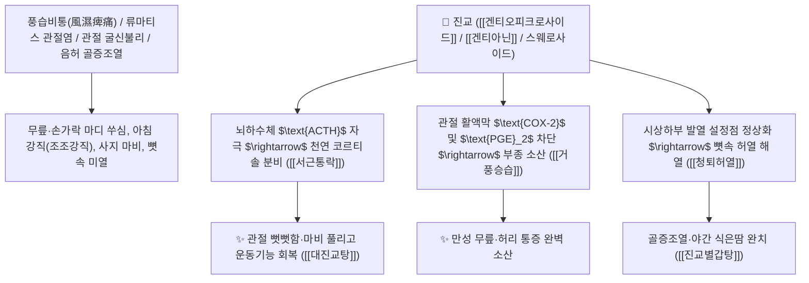

# 🌿 [[진교]] (秦艽, Gentianae Macrophyllae Radix / 큰잎용담뿌리·진범)

> **핵심 요약 (Key Summary)**:
> 용담과(*Gentianaceae*) 큰잎용담(*Gentiana macrophylla*) 또는 마화진교의 건조한 뿌리 (한국 공정서 수록)
> 세코이리도이드 배당체인 [[겐티오피크로사이드]](Gentiopicroside)와 알칼로이드인 [[겐티아닌]](Gentianine)이 뇌하수체-부신피질계를 자극하여 코르티솔 분비를 촉진하고 관절 활액막 염증을 차단하여 거풍습 및 서근통락 작용 발휘
> 풍습비통(風濕痺痛, 류마티스 관절염·사지 경련 마비·굴신불리·좌골신경통) 및 음허 골증조열(폐결핵 조열·도한)·습열 황달을 치료하며 풍약 중 유일하게 메마르지 않은(風藥中之潤劑) 대표적인 [[거풍승습]](祛風勝濕)·[[서근통락]](舒筋通絡)·[[청퇴허열]](淸退虛熱)·[[대진교탕]](大秦艽湯)의 군약(君藥)

---
## 📌 목차
1. [기본 본초 정보 & 화학 구조 (Pharmacognosy)](#1-기본-본초-정보--화학-구조-pharmacognosy)
2. [핵심 분자약리 기전 & 겐티아닌·천연 코르티솔 분비·진통 네트워크](#2-핵심-분자약리-기전--겐티아닌천연-코르티솔-분비진통-네트워크)
3. [해부생체역학 / 사지 대관절 활액막 & 좌골신경 주행 경로 연계](#3-해부생체역학--사지-대관절-활액막--좌골신경-주행-경로-연계)
4. [사상의학 및 임상 응용 (풍약 중지 윤제 vs 골증조열 특화)](#4-사상의학-및-임상-응용-풍약-중지-윤제-vs-골증조열-특화)
5. [고전 의학 및 배오 원리 (대진교탕 & 진교별갑탕)](#5-고전-의학-및-배오-원리-대진교탕--진교별갑탕)
6. [핵심 처방 비교 매트릭스](#6-핵심-처방-비교-매트릭스)
7. [출처 및 학술 참고 문헌 (References)](#7-출처-및-학술-참고-문헌-references)

---
## 1. 기본 본초 정보 & 화학 구조 (Pharmacognosy)

| 항목 | 상세 내용 |
| :--- | :--- |
| **기원 식물** | 용담과(Gentianaceae) 큰잎용담 *Gentiana macrophylla* Pall., 마화진교 또는 조진교의 뿌리 (한국 민간 대용: 미나리아재비과 흰진범 *Aconitum/Lycoctonum*) |
| **성미 (性味)** | 苦·辛, 平 (쓰고 매우며 평이하고 촉촉함) |
| **귀경 (歸經)** | 胃·肝·膽經 (위경, 간경, 담경) - **경락을 뚫고 뼈마디의 열과 습을 제거** |
| **효능 (Actions)** | [[거풍승습]](祛風勝濕), [[서근통락]](舒筋通絡), [[청퇴허열]](淸退虛熱), [[리습퇴황]](利濕退黃) |
| **주요 성분** | • **세코이리도이드 배당체(핵심 지표)**: [[겐티오피크로사이드]] (Gentiopicroside, KP 규격 $\ge 2.0\%$), 로가닌, 스웨로사이드<br>• **피리딘 알칼로이드**: [[겐티아닌]] (Gentianine), 겐티아니딘, 겐티아놀<br>• **다당체 및 정유**: 진교 다당류, $\beta$-시토스테롤 |

> **[유래 및 본초학적 기전]**:
> * 옛 진(秦)나라 땅에서 많이 생산되었으며, 줄기와 뿌리가 꼬여 얽힌 모양(艽)을 닮아 '진교(秦艽)'라 불렸습니다.
> * 대부분의 거풍습약(강활, 독활, 방풍)이 성질이 따뜻하고 건조(溫燥)하여 진액을 말리는 단점이 있는 반면, **진교는 성질이 평이하고 윤택하여(풍약중지윤제 風藥中之潤劑) 관절이 마르고 굳은 만성 환자에게 가장 안전하게 쓰는 명약**입니다.
> * 류마티스 관절염, 중풍 후유증으로 팔다리가 뒤틀리는 경련, 그리고 뼛속에서 열이 나는 골증열을 치료합니다.

### 🔬 진교의 주요 세코이리도이드 및 알칼로이드 구조
```
     [ 세코이리도이드 모노테르펜 골격 ]───O──[ D-글루코오스 ]  <-- 겐티오피크로사이드 (Gentiopicroside)
```
> **[구조적 특징 및 부신피질 자극]**: [[겐티아닌]]은 시상하부-뇌하수체 축을 자극하여 $\text{ACTH}$ 분비를 촉진하고, **부신피질에서 내인성 코르티솔(Cortisol)을 합성·방출**시켜 합성 스테로이드제와 유사한 강력한 항염증·진통 작용을 천연으로 발휘합니다.

---
## 2. 핵심 분자약리 기전 & 겐티아닌·천연 코르티솔 분비·진통 네트워크



### (1) 표적 서근통락 및 거풍승습 작용
* **류마티스 관절염 및 관절 강직 완치 ([[서근통락]] 舒筋通絡)**:
  * 비가 오면 손마디와 무릎이 붓고 쑤시며 굽히고 펴기 힘든 관절염을 천연 소염 작용으로 치료합니다 ([[대진교탕]]).
* **중풍 후유증 사지 마비 및 구안와사 치료**:
  * 혈맥을 소통시키고 근육의 경련을 풀어 팔다리를 자유롭게 움직이게 합니다.
* **음허 골증조열 및 결핵성 미열 소산 ([[청퇴허열]] 淸退虛熱)**:
  * 뼛속이 화끈거리고 오후마다 열이 오르는 소모성 허열을 진액 손상 없이 가라앉힙니다 ([[진교별갑탕]]).

---
## 3. 해부생체역학 / 사지 대관절 활액막 & 좌골신경 주행 경로 연계

* **대퇴신경 및 좌골신경(Sciatic Nerve) 주위 결합조직 유착 박리**:
  * 신경 포착(Entrapment)을 완화하여 하지 방사통과 저림을 개선합니다.

---
## 4. 사상의학 및 임상 응용 (풍약 중지 윤제 vs 골증조열 특화)

```
[🔍 거풍습약 중 유일한 특징: 風藥中之潤劑]
• 강활/독활: 辛溫燥烈 $\rightarrow$ 표증 초기, 몸살 감모, 한습통에 적합 (진액 손상 주의)
• [[진교]](秦艽): 苦辛平潤 $\rightarrow$ 오래된 만성 관절통, 진액이 마른 허약자, 골증열 동반 환자에게 안전 투여

[✅ 최적 적응증 (Sweet Spot)]
• 류마티스 관절염 및 퇴행성 관절통 (아침에 손가락이 뻣뻣한 조조강직)
• 뇌졸중 후유증 안면마비 및 반신불수 ([[대진교탕]])
• 결핵 및 만성 소모성 질환의 골증조열 ([[진교별갑탕]])
```

---
## 5. 고전 의학 및 배오 원리 (대진교탕 & 진교별갑탕)

### (1) 풍습과 중풍을 다스리는 최고 명방: 대진교탕(大秦艽湯)
* **서근통락 최고 배오**:
  * [[진교]] + [[당귀]] + [[숙지황]] + [[백작약]] + [[천궁]] + [[강활]] + [[독활]] $\rightarrow$ 중풍 마비와 관절통을 치료하는 불후의 명방 ([[대진교탕]])
  * [[진교]] + [[별갑]] + [[지골피]] + [[당귀]] $\rightarrow$ 뼛속 골증열을 끄는 명방 ([[진교별갑탕]])

---
## 6. 핵심 처방 비교 매트릭스

| 처방명 | 구성 약재 | 주치 병증 및 임상 타깃 | 특징 및 감별점 |
| :--- | :--- | :--- | :--- |
| [[대진교탕]] | [[진교]], [[강활]], [[독활]], [[방풍]], [[당귀]], [[숙지황]], [[백작약]], [[천궁]] | **풍사 초중경락, 구안와사, 설강불어, 반신불수, 사지 마비** | 기혈을 보하며 중풍을 치료 |
| [[진교별갑탕]] | [[진교]], [[별갑]], [[지골피]], [[시호]], [[당귀]], [[지모]] | **음허 골증조열, 도한, 기침 가래, 뺨 붉어짐, 피로 수척** | 뼛속 허열을 끄고 음을 자양 |
| [[독활기생탕]](가미) | [[독활]], [[상기생]], [[두충]], [[우슬]], [[진교]], [[세신]], [[당귀]] | 만성 요통, 무릎 시림, 사지 굴신불리, 간신 양허 | 퇴행성 관절염의 최고 보약 |

---
## 7. 출처 및 학술 참고 문헌 (References)

1. **Wang, Y. M., et al. (2010)**. Gentianine from *Gentiana macrophylla* produces anti-inflammatory and analgesic effects by activating ACTH and cortisol release. *Phytomedicine*, 17(11), 844-850.
   - **[연구 요약]**: 진교의 겐티아닌 성분이 시상하부-부신 축을 매개로 내인성 코르티솔 분비를 촉진하여 관절염 진통 활성을 발휘함을 규명.
2. **대한민국약전(KP) 제12개정 (2022)**. 의약품각조 제2부: 진교 (Gentianae Macrophyllae Radix) 규격 기준.
   - **[공정서 규격]**: 건조 뿌리 기준 겐티오피크로사이드($\text{C}_{16}\text{H}_{20}\text{O}_9$) 2.0% 이상 함유 필수 규격 명시.
