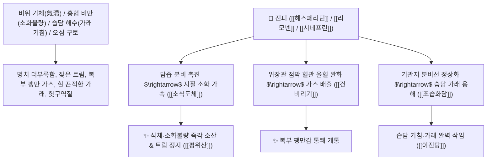

---
aliases:
  - 귤피
  - 귤껍질
  - 광진피
---

# 🌿 [[진피]] (陳皮 / 廣陳皮, Citri Unshius Pericarpium / 귤껍질)

> **핵심 요약 (Key Summary)**:
> 운향과(*Rutaceae*) 귤(*Citrus unshiu*)의 건조한 성숙 과피(오래 묵힐수록 약효가 증가하는 육진약 六陳藥)
> 플라보노이드인 [[헤스페리딘]](Hesperidin)과 [[나린진]](Naringin) 및 모노테르펜 정유인 [[리모넨]](Limonene)이 담즙 분비를 촉진하고 위장관 점막 혈관 울혈을 개선하여 건비이기 및 조습화담 작용 발휘
> 비위 기체(소화불량·복부 팽만·트림·오심 구토) 및 폐기 울체로 인한 가래 기침(습담 해수·기관지염)을 치료하고 보약/사약의 조화를 돕는 천하제일의 [[건비리기조중]](健脾理氣調中)·[[조습화담]](燥濕化痰)·[[이진탕]](二陳湯)·[[평위산]](平胃散)의 군약(君藥)

---
## 📌 목차
1. [기본 본초 정보 & 화학 구조 (Pharmacognosy)](#1-기본-본초-정보--화학-구조-pharmacognosy)
2. [핵심 분자약리 기전 & 헤스페리딘·리모넨·담즙촉진·기기개통 네트워크](#2-핵심-분자약리-기전--헤스페리딘리모넨담즙촉진기기개통-네트워크)
3. [해부생체역학 / 위장관 점막 미세순환 & 기관지 섬모 운동 연계](#3-해부생체역학--위장관-점막-미세순환--기관지-섬모-운동-연계)
4. [사상의학 및 임상 응용 (육진약 六陳藥 vs 보사 승강의 조화)](#4-사상의학-및-임상-응용-육진약-六陳藥-vs-보사-승강의-조화)
5. [고전 의학 및 배오 원리 (이진탕 & 평위산 배오)](#5-고전-의학-및-배오-원리-이진탕--평위산-배오)
6. [핵심 처방 비교 매트릭스](#6-핵심-처방-비교-매트릭스)
7. [출처 및 학술 참고 문헌 (References)](#7-출처-및-학술-참고-문헌-references)

---
## 1. 기본 본초 정보 & 화학 구조 (Pharmacognosy)

| 항목 | 상세 내용 |
| :--- | :--- |
| **기원 식물** | 운향과(Rutaceae) 귤 *Citrus unshiu* Markovich 또는 동속 근연식물의 잘 익은 과피 (오래 묵힌 것) |
| **성미 (性味)** | 辛·苦, 溫 (맵고 쓰며 향기롭고 따뜻함) |
| **귀경 (歸經)** | 脾·肺經 (비경, 폐경) - **비위를 덥혀 기를 돌리고 폐의 가래를 삭임** |
| **효능 (Actions)** | [[건비리기조중]](健脾理氣調中), [[조습화담]](燥濕化痰), [[소식도체]](消食導滯), [[강역지토]](降逆止吐) |
| **주요 성분** | • **플라보노이드 배당체(지표물질)**: [[헤스페리딘]] (Hesperidin, KP 규격 $\ge 4.0\%$), [[나린진]] (Naringin), 노빌레틴, 탄게레틴<br>• **모노테르펜 정유(향기 성분)**: [[리모넨]] (d-Limonene, 85~90%), 피넨, 시트랄<br>• **아민 알칼로이드**: [[시네프린]] (Synephrine), [[메틸티라민]] (N-Methyltyramine) |

> **[유래 및 본초학적 기전]**:
> * 귤의 껍질로, 갓 벗긴 것은 자극성이 강하지만 **오래 묵힐수록(陳) 매운맛이 순화되고 약효가 온화해져 '진피(陳皮)'**라 불렸습니다 (한의학 대표 육진약 六陳藥).
> * 기운이 뭉친 것을 흩어버리는(이기 理氣) 최고의 기본 약재로, **보약과 함께 쓰면 보하고, 사약과 함께 쓰면 사하며, 위로도 가고 아래로도 통하는 전신 기운의 조율사**입니다.
> * 담즙 분비를 촉진하여 기름진 음식의 소화를 돕고, 위장관 혈관 울혈을 풀어 복부 팽만과 가래 기침을 시원하게 해소합니다.

### 🔬 진피의 주요 헤스페리딘 화학 구조
```
     [ 헤스페레틴 플라바논 골격 ]───O──[ 루티노오스 (Rha-Glc) ]  <-- 헤스페리딘 (Hesperidin)
```
> **[구조적 특징 및 담즙/소화 촉진]**: [[헤스페리딘]]과 [[리모넨]]은 담낭 수축을 유도하여 담즙산 분비를 증대시키고, 위점막 미세혈관의 투과성을 정상화하여 소화불량으로 인한 국소 울혈과 부종을 신속히 해소합니다.

---
## 2. 핵심 분자약리 기전 & 헤스페리딘·리모넨·담즙촉진·기기개통 네트워크



### (1) 표적 건비리기 및 조습화담 작용
* **소화불량 및 복부 팽만 가스 배출 ([[건비리기]] 健脾理氣)**:
  * 밥을 먹고 나면 속이 더부룩하고 트림이 계속 나며 가스가 차는 비위 기체를 뚫어줍니다 ([[평위산]]).
* **기관지 습담(濕痰) 가래 및 만성 기침 완치 ([[조습화담]] 燥濕化痰)**:
  * 맑고 끈적한 가래가 목에 걸려 기침이 나는 만성 기관지염을 반하와 함께 완벽히 치료합니다 ([[이진탕]]).
* **오심 구토 및 딸꾹질 진정 ([[강역지토]] 降逆止吐)**:
  * 위기가 거슬러 올라와 헛구역질을 하는 증상을 기운을 아래로 내려 가라앉힙니다.

---
## 3. 해부생체역학 / 위장관 점막 미세순환 & 기관지 섬모 운동 연계

* **위점막 혈류량(GMBF) 증대**:
  * 점막 상피세포의 재생을 돕고 소화 효소 분비를 촉진합니다.

---
## 4. 사상의학 및 임상 응용 (육진약 六陳藥 vs 보사 승강의 조화)

```
[🔍 진피의 변화무쌍한 배오 융합 원리]
• 보기약(인삼, 백출, 황기)과 배오 $\rightarrow$ 보약의 정체(기체)를 막고 기운을 북돋움 ([[보중익기탕]])
• 거담약(반하, 복령)과 배오 $\rightarrow$ 습담 가래를 삭이고 구토를 멎게 함 ([[이진탕]])
• 조습소식약(창출, 후박)과 배오 $\rightarrow$ 위장의 습기를 말리고 식체를 뚫음 ([[평위산]])

[💡 대추와의 황금 짝꿍]
• 진피의 기운 순행 작용 + [[대추|대조]](대추)의 당분/혈당 보충 작용이 합쳐져 완벽한 소화 흡수 균형 완성
```

---
## 5. 고전 의학 및 배오 원리 (이진탕 & 평위산 배오)

### (1) 가래와 식체를 다스리는 불후의 2대 기본방
* **담음 치료 제1방**:
  * [[반하]] + [[진피]] + [[복령]] + [[감초]] $\rightarrow$ 모든 담음과 가래를 삭이는 최고 명방 ([[이진탕]])
* **식체 소화 제1방**:
  * [[창출]] + [[후박]] + [[진피]] + [[감초]] $\rightarrow$ 위장의 습기를 말리고 소화를 돕는 명방 ([[평위산]])

---
## 6. 핵심 처방 비교 매트릭스

| 처방명 | 구성 약재 | 주치 병증 및 임상 타깃 | 특징 및 감별점 |
| :--- | :--- | :--- | :--- |
| [[이진탕]] | [[반하]], [[진피]], [[복령]], [[감초]], [[생강]] | **일체 담음, 해수 담다, 오심 구토, 흉격 비만, 두통 현훈** | 가래와 구토 치료의 제1 기본방 |
| [[평위산]] | [[창출]], [[후박]], [[진피]], [[감초]], [[생강]], [[대추|대조]] | **비위 습체, 완복 창만, 식욕부진, 트림, 설사, 소화불량** | 위장의 습기를 말리는 소화제 |
| [[보중익기탕]] | [[황기]], [[인삼]], [[백출]], [[당귀]], [[진피]], [[승마]], [[시호]] | **비위 기허, 기단 핍력, 식후 곤권, 중기 하함, 내장하수** | 진피가 보기약의 체기를 막음 |
| [[분심기음]] | [[자소엽]], [[진피]], [[반하]], [[지각]], [[향부자]], [[복령]] | **칠정 울결, 가슴 답답함, 한숨, 옆구리 결림, 부종** | 기운을 틔우고 스트레스를 풂 |

---
## 7. 출처 및 학술 참고 문헌 (References)

2. **대한민국약전(KP) 제12개정 (2022)**. 의약품각조 제2부: 진피 (Citri Unshius Pericarpium) 규격 기준.
   - **[공정서 규격]**: 건조 과피 기준 헤스페리딘($\text{C}_{28}\text{H}_{34}\text{O}_{15}$) 4.0% 이상 함유 필수 규격 명시.
