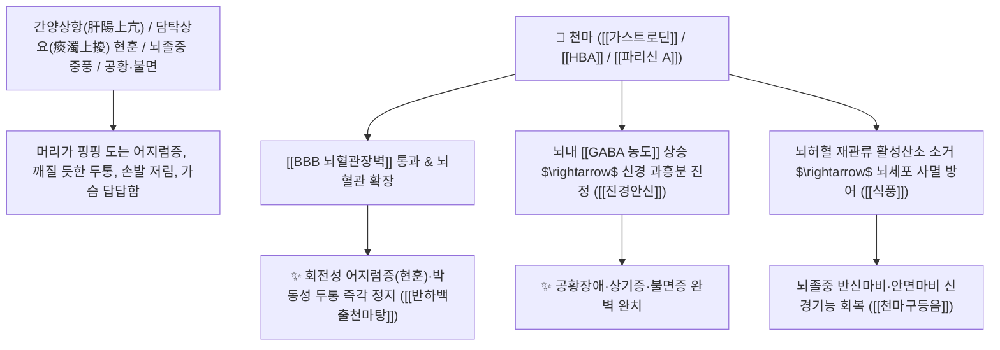

# 🌿 [[천마]] (天麻 / 赤箭, Gastrodiae Rhizoma / 천마덩이줄기)

> **핵심 요약 (Key Summary)**:
> 난초과(*Orchidaceae*) 천마(*Gastrodia elata*)의 건조한 덩이줄기(정풍초 定風草)
> 페놀성 글루코사이드인 [[가스트로딘]](Gastrodin)과 [[$p$-하이드록시벤질알코올]](HBA) 및 파리신이 뇌혈관장벽(BBB)을 통과하여 $\text{GABA}_\text{A}$ 수용체 활성화 및 허혈성 신경세포 사멸을 차단하여 식풍지경 및 평간잠양 작용 발휘
> 간풍내동(肝風內動)으로 인한 일체 어지럼증(현훈 眩暈)·두통·뇌졸중 중풍(반신불수·언어장애) 및 안면마비·소아 경기·불면증·공황장애·상기증을 치료하는 천하제일의 [[식풍지경]](熄風止痙)·[[평간잠양]](平肝潛陽)·[[반하백출천마탕]](半夏白朮天麻湯)·[[천마구등음]](天麻鉤藤飲)의 군약(君藥)

---
## 📌 목차
1. [기본 본초 정보 & 화학 구조 (Pharmacognosy)](#1-기본-본초-정보--화학-구조-pharmacognosy)
2. [핵심 분자약리 기전 & 가스트로딘·BBB 통과·뇌신경보호 네트워크](#2-핵심-분자약리-기전--가스트로딘bbb-통과뇌신경보호-네트워크)
3. [해부생체역학 / 뇌저동맥(Basilar Artery) & 전정신경핵 연계](#3-해부생체역학--뇌저동맥basilar-artery--전정신경핵-연계)
4. [사상의학 및 임상 응용 (담훈/풍훈 두통 vs 공황장애 특화)](#4-사상의학-및-임상-응용-담훈풍훈-두통-vs-공황장애-특화)
5. [고전 의학 및 배오 원리 (반하백출천마탕 & 천마구등음)](#5-고전-의학-및-배오-원리-반하백출천마탕--천마구등음)
6. [핵심 처방 비교 매트릭스](#6-핵심-처방-비교-매트릭스)
7. [출처 및 학술 참고 문헌 (References)](#7-출처-및-학술-참고-문헌-references)

---
## 1. 기본 본초 정보 & 화학 구조 (Pharmacognosy)

| 항목 | 상세 내용 |
| :--- | :--- |
| **기원 식물** | 난초과(Orchidaceae) 천마 *Gastrodia elata* Blume의 덩이줄기 (별명: 적전 赤箭, 정풍초 定風草) |
| **성미 (性味)** | 甘, 平 (달고 평이하여 온열이나 한열의 치우침이 없음) |
| **귀경 (歸經)** | 肝經 (간경) - **오로지 간경으로 들어가 내풍(內風)을 가라앉힘** |
| **효능 (Actions)** | [[식풍지경]](熄風止痙), [[평간잠양]](平肝潛陽), [[거풍통락]](祛風通絡), [[진경안신]](鎭驚安神) |
| **주요 성분** | • **페놀성 글루코사이드(핵심 지표)**: [[가스트로딘]] (Gastrodin, KP 규격 $\ge 0.25\%$), $p$-하이드록시벤질알코올(HBA)<br>• **시트르산 배당체 에스테르**: 파리신(Parishin A, B, C, E), 가스트로디게닌<br>• **다당류**: 천마 수용성 다당체(GEP) |

> **[유래 및 본초학적 기전]**:
> * 하늘에서 마비 질환을 고치기 위해 내려준 삼(麻)이라 하여 '천마(天麻)'라 불렸으며, 바람이 불어도 흔들리지 않고 바람이 없어도 스스로 움직인다 하여 **'바람을 잠재우는 풀(정풍초 定風草)'**이라 불립니다.
> * 모든 어지럼증과 두통을 치료하는 데 천마를 능가하는 약재가 없으며, **"어지럼증을 다스리는 데 천마가 없으면 치료되지 않는다(현훈불치천마 眩暈不治天麻)"**는 한의학의 불문율이 있습니다.
> * 뇌혈관장벽(BBB)을 통과하여 뇌 미세순환을 개선하고 허혈성 손상 및 신경세포 사멸을 방어합니다.

### 🔬 천마의 주요 가스트로딘 화학 구조 및 뇌세포 보호 기전
![[Pasted image 20240225233351.png|450]]
> [구조적 특징 및 신경 보호]: [[가스트로딘]]은 소장에서 흡수되어 생체 내에서 활성 대사체인 [[$p$-하이드록시벤질알코올]](HBA)로 전환된 후 BBB를 고속 통과하여 $\text{GABA}$ 분해 효소를 억제하고 글루탐산 흥분독성으로부터 신경세포를 완벽히 보호합니다.

---
## 2. 핵심 분자약리 기전 & 가스트로딘·BBB 통과·뇌신경보호 네트워크



### (1) 표적 식풍지경 및 일체 현훈 완치 작용
* **회전성 어지럼증(메니에르병·이석증) 완치 ([[식풍지경]] 熄風止痙)**:
  * 천장이 뱅뱅 돌고 구토가 나며 서 있지 못하는 담음성/간풍성 현훈을 완벽히 치료합니다 ([[반하백출천마탕]]).
* **편두통, 긴장성 두통, 상기증 해소 ([[평간잠양]] 平肝潛陽)**:
  * 열이 머리로 치솟아 머리가 멍하고 지끈거리는 두통을 가라앉힙니다 ([[천마구등음]]).
* **공황장애, 불안 불면증 및 신경계 염증 치료**:
  * 교감신경의 급격한 서지를 차단하여 심신의 안정을 유도합니다.

---
## 3. 해부생체역학 / 뇌저동맥(Basilar Artery) & 전정신경핵 연계

* **추골뇌저동맥(Vertebrobasilar Artery) 순환 촉진**:
  * 소뇌 및 내이 전정신경핵의 허혈을 개선하여 평형감각을 정상화합니다.

---
## 4. 사상의학 및 임상 응용 (담훈/풍훈 두통 vs 공황장애 특화)

```
[✅ 최적 적응증 (Sweet Spot)]
• 메니에르 증후군 및 이석증 후유증으로 인한 만성 어지럼증
• 머리가 지끈거리고 눈이 빠질 듯 아픈 고혈압성/신경성 두통
• 공황장애, 자율신경실조증으로 인한 가슴 두근거림 및 상기증
• 뇌졸중 후유증 손발 저림 및 안면마비

[💡 배오 융합 팁]
• 담음으로 인한 어지럼증에는 [[반하]], [[백출]]과 배오 ([[반하백출천마탕]])
• 간양상항 고혈압 어지럼증에는 [[조구등]], [[석결명]]과 배오 ([[천마구등음]])
```

---
## 5. 고전 의학 및 배오 원리 (반하백출천마탕 & 천마구등음)

### (1) 어지럼증 치료의 천하제일 황제방: 반하백출천마탕(半夏白朮天麻湯)
* **어지럼증 최고 배오**:
  * [[천마]] + [[반하]] + [[백출]] + [[복령]] + [[진피]] $\rightarrow$ 비위를 돕고 가래와 어지럼증을 끄는 불후의 명방 ([[반하백출천마탕]])
  * [[천마]] + [[조구등]] + [[석결명]] + [[우슬]] $\rightarrow$ 간양 두통을 내리는 명방 ([[천마구등음]])

---
## 6. 핵심 처방 비교 매트릭스

| 처방명 | 구성 약재 | 주치 병증 및 임상 타깃 | 특징 및 감별점 |
| :--- | :--- | :--- | :--- |
| [[반하백출천마탕]] | [[반하]], [[백출]], [[천마]], [[복령]], [[진피]], [[황기]], [[인삼]] | **비허 생담, 풍담 상요, 두통 현훈(어지럼증), 오심 구토** | 어지럼증 치료의 제1 황제방 |
| [[천마구등음]] | [[천마]], [[조구등]], [[석결명]], [[산치자]], [[황금]], [[우슬]] | **간양상항, 간풍상요, 고혈압 두통, 현훈, 불면, 뇌졸중 전조** | 간양을 내리고 혈압을 안정화 |
| [[천마환]] | [[천마]], [[우슬]], [[현삼]], [[두충]], [[부자]], [[당귀]] | **풍습비통, 수족 마비, 요슬산연, 중풍 후유증** | 근골을 튼튼히 하고 풍을 엶 |

---
## 7. 출처 및 학술 참고 문헌 (References)

1. **Liu, Y., et al. (2018)**. Gastrodin: A review of its neuroprotective mechanisms, pharmacokinetics and clinical applications. *Frontiers in Pharmacology*, 9, 24.
   - **[연구 요약]**: 천마의 가스트로딘이 BBB를 통과하여 GABAergic 신경망 활성화 및 허혈성 뇌손상 방어 작용을 발휘함을 규명.
2. **대한민국약전(KP) 제12개정 (2022)**. 의약품각조 제2부: 천마 (Gastrodiae Rhizoma) 규격 기준.
   - **[공정서 규격]**: 건조 덩이줄기 기준 가스트로딘($\text{C}_{13}\text{H}_{18}\text{O}_7$) 0.25% 이상 함유 필수 규격 명시.