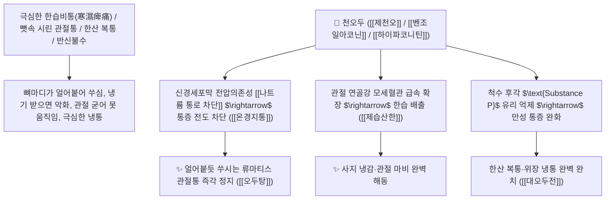

# 🌿 [[천오두]] (川烏頭 / 製川烏, Aconiti Radix / 오두어미뿌리)

> **핵심 요약 (Key Summary)**:
> 미나리아재비과(*Ranunculaceae*) 오두(*Aconitum carmichaeli*)의 건조한 모근(어미뿌리, 포제 가공한 제천오 製川烏)
> 디테르페노이드 알칼로이드인 [[아코니틴]](Aconitine)과 메사코니틴이 전압의존성 나트륨 통로를 차단하고 척수 통각 전달을 억제하여 극렬한 제습산한 및 온경지통 작용 발휘
> [[상한론]]의 한습비통(寒濕痺痛, 뼈마디가 얼어붙듯 시리고 쑤시는 관절통·류마티스)·심복 냉통(위장 한산 복통)·풍한 두통 및 반신불수를 치료하는 천하제일의 [[제습산한]](除濕散寒)·[[온경지통]](溫經止痛)·[[오두탕]](烏頭湯)의 군약(君藥)

---
## 📌 목차
1. [기본 본초 정보 & 화학 구조 (Pharmacognosy)](#1-기본-본초-정보--화학-구조-pharmacognosy)
2. [핵심 분자약리 기전 & 아코니틴·나트륨채널 차단·초강력 진통 네트워크](#2-핵심-분자약리-기전--아코니틴나트륨채널-차단초강력-진통-네트워크)
3. [해부생체역학 / 척수 후각 통각 신경절 & 관절 연골 미세순환 연계](#3-해부생체역학--척수-후각-통각-신경절--관절-연골-미세순환-연계)
4. [사상의학 및 천오두 vs 초오 vs 부자 3대 오두류 정밀 감별](#4-사상의학-및-천오두-vs-초오-vs-부자-3대-오두류-정밀-감별)
5. [상한론 『약징(藥徵)』 분석 및 배오 원리 (오두탕 & 오두계지탕)](#5-상한론-약징藥徵-분석-및-배오-원리-오두탕--오두계지탕)
6. [핵심 처방 비교 매트릭스](#6-핵심-처방-비교-매트릭스)
7. [출처 및 학술 참고 문헌 (References)](#7-출처-및-학술-참고-문헌-references)

---
## 1. 기본 본초 정보 & 화학 구조 (Pharmacognosy)

| 항목 | 상세 내용 |
| :--- | :--- |
| **기원 식물** | 미나리아재비과(Ranunculaceae) 오두 *Aconitum carmichaeli* Debx.의 건조한 모근(어미뿌리, 제천오 製川烏) |
| **성미 (性味)** | 辛·苦, 熱, 有大毒 (몹시 맵고 쓰며 성질이 뜨겁고 맹렬한 독성이 있음) |
| **귀경 (歸經)** | 心·肝·脾·腎經 (심경, 간경, 비경, 신경) - **경락의 한습을 쫓고 뼛속 냉기를 온난화** |
| **효능 (Actions)** | [[제습산한]](除濕散寒), [[온경지통]](溫經止痛), [[거풍통비]](祛風通痺), [[산한소적]](散寒消積) |
| **주요 성분** | • **디에스테르 디테르펜 알칼로이드(독성/약리 지표)**: [[아코니틴]] (Aconitine), 메사코니틴(Mesaconitine), 하이파코니틴<br>• **모노에스테르 알칼로이드(포제 후 저독성 물질)**: 벤조일아코닌(Benzoylaconine), 벤조일메사코닌<br>• **강심 성분**: 히게나민(Higenamine), 코리난틴 |

> **[유래 및 본초학적 기전]**:
> * 뿌리의 모양이 검은 까마귀 머리(烏頭)를 닮았으며, 사천성에서 주로 재배되어 '천오두(川烏頭)'라 불렸습니다.
> * 자식 뿌리인 [[부자]](附子)가 하초의 명문화(命門火)를 보하는 회양약이라면, 어미 뿌리인 [[천오두]](川烏)는 뼛속 깊이 파고든 차가운 한습(寒濕)을 몰아내고 관절통을 멎게 하는 온경지통(溫經止痛)의 최고봉입니다.
> * 맹독성 아코니틴을 함유하므로 **반드시 물에 푹 삶거나 고온 증숙하는 포제(製川烏, 선전 1~2시간 필수)를 거쳐 저독성 벤조일아코닌으로 가수분해**하여 안전하게 복용합니다.

### 🔬 천오두의 아코니틴 가수분해 포제 화학 반응
```
     [ 디에스테르 알칼로이드: 아코니틴 (맹독성) ] ───( 장시간 고온 전탕 가수분해 )───> [ 모노에스테르: 벤조일아코닌 (저독성 진통) ]
```
> **[구조적 특징 및 탈아세틸화 메커니즘]**: 장시간 전탕 시 C-8 위치의 아세틸기가 떨어져 나가면서 독성은 $1/100 \sim 1/1000$로 격감하고, 척수 후각 신경절의 통증 신호 차단 효능은 온전히 보존됩니다.

---
## 2. 핵심 분자약리 기전 & 아코니틴·나트륨채널 차단·초강력 진통 네트워크



### (1) 표적 제습산한 및 온경지통 작용
* **극심한 류마티스 관절염 및 한습비통 완치 ([[오두탕]] 烏頭湯)**:
  * 찬바람이나 에어컨 바람을 맞으면 무릎과 허리가 끊어질 듯 쑤시는 만성 관절염을 치료합니다.
* **위장관 한산(寒疝) 복통 및 심복 냉통 치료 ([[대오두전]])**:
  * 뱃속이 얼음장처럼 차가워 쥐어짜듯 아프고 손발이 싸늘해지는 냉통을 덥혀줍니다.
* **중풍 반신불수 및 풍한성 두통 해소**:
  * 혈맥을 덥혀 굳은 근육과 신경을 풀고 통증을 다스립니다.

---
## 3. 해부생체역학 / 척수 후각 통각 신경절 & 관절 연골 미세순환 연계

* **척수 후각 $\text{C}$-섬유 통각 수용체 차단**:
  * 만성 난치성 신경병증성 통증 전달을 억제하여 진통 역치를 비약적으로 상승시킵니다.

---
## 4. 사상의학 및 천오두 vs 초오 vs 부자 3대 오두류 정밀 감별

```
[🔍 오두속(Aconitum) 3대 명약 정밀 감별 매트릭스]
• [[부자]](附子, 자근): 回陽救逆·補命門火 $\rightarrow$ 하초 명문화 보양, 심부전, 양기 고갈 (보약 성격)
• [[천오두]](川烏, 재배 모근): 除濕散寒·溫經止痛 $\rightarrow$ 만성 관절염, 한습비통, 반신불수 (온경 진통 전문)
• [[초오]](草烏, 야생 덩이뿌리): 搜風勝濕·散寒止痛 $\rightarrow$ 통증 억제력 최강, 약성이 몹시 사나움 (극렬 완고 자통)

[⚠️ 전탕 및 복용 절대 안전 수칙 (Safety)]
• 반드시 1~2시간 이상 먼저 오래 끓이는 선전(先煎)을 시행하여 입안 혀 마비감이 전혀 없음을 확인 후 복용
• 임산부 복용 절대 금기, [[반하]], [[과루인]], [[패모]], [[백급]], [[백렴]]과 배합 금기(십팔반 十八反)
```

---
## 5. 상한론 『약징(藥徵)』 분석 및 배오 원리 (오두탕 & 오두계지탕)

### (1) 관절통 치료의 천하제일 황제방: 오두탕(烏頭湯)
* **온경지통 최고 배오**:
  * [[천오두]](오두)` + [[마황]] + [[황기]] + [[백작약]] + [[감초]] + 꿀(봉밀) $\rightarrow$ 뼛속 한습을 뽑아내는 장중경의 불후 명방 ([[오두탕]])
  * [[오두]] + [[계지탕]] $\rightarrow$ 속의 한산 복통을 덥혀 멎게 함 ([[오두계지탕]])

---
## 6. 핵심 처방 비교 매트릭스

| 처방명 | 구성 약재 | 주치 병증 및 임상 타깃 | 특징 및 감별점 |
| :--- | :--- | :--- | :--- |
| [[오두탕]] | [[천오두]](오두), [[마황]], [[황기]], [[백작약]], [[감초]], [[봉밀]] | **역절풍, 관절 동통 불가굴신, 뼛속 시림, 한습비통** | 관절염을 덥혀 치료하는 제1방 |
| [[오두계지탕]] | [[계지탕]] + [[오두전]](오두+봉밀) | **한산 복통, 배가 쥐어짜듯 아픔, 수족 궐냉, 오한** | 복부의 극심한 냉통을 해소 |
| [[대오두전]] | [[오두]], [[백작약]], [[황기]], [[감초]], [[봉밀]] | **심복 냉통, 아랫배 땡김, 구토, 설사, 궐냉** | 중초와 하초를 온난화 |

---
## 7. 출처 및 학술 참고 문헌 (References)

1. **Singhuber, J., et al. (2009)**. *Aconitum* in traditional Chinese medicine: A valuable drug or an unpredictable risk?. *Journal of Ethnopharmacology*, 126(1), 18-30. [PMID: 19651200](https://pubmed.ncbi.nlm.nih.gov/19651200/)
   - **[연구 요약]**: 천오두의 아코니틴 성분이 전탕 포제 시 탈아세틸화되어 안전한 진통·항염증 활성체로 전환되는 약동학적 기전을 총괄 규명.
2. **대한민국약전(KP) 제12개정 (2022)**. 의약품각조 제2부: 천오 (Aconiti Radix) 및 제천오 규격 기준.
   - **[공정서 규격]**: 오두 모근의 성상, 순도시험 및 디에스테르 알칼로이드 함량 제한 기준 명시.
3. **장중경 (張仲景, 200)**. 『금궤요략(金匱要略)』: 중풍역절병맥증병치 조문.
   - **[고전 원전]**: "病歷節不可屈伸, 疼痛, 烏頭湯 主之." - 류마티스 관절통의 오두탕 주치 원리 제시.
