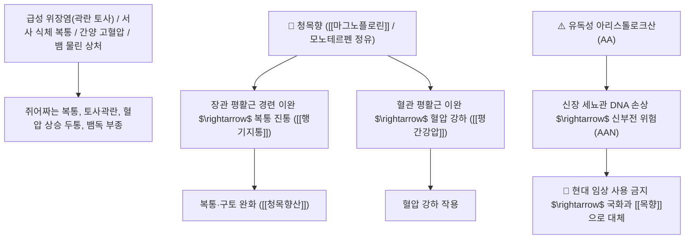

# 🌿 [[청목향]] (靑木香 / 馬兜鈴根, Aristolochiae Radix / 쥐방울덩굴뿌리)

> **핵심 요약 (Key Summary)**:
> 쥐방울덩굴과(*Aristolochiaceae*) 쥐방울덩굴(*Aristolochia debilis*)의 건조한 뿌리(마두령근 馬兜鈴根)
> 정유 성분 및 페난트렌계 화합물이 혈압을 내리고 장관 평활근 연축을 억제하여 행기지통 및 해독소종 작용을 발휘하나 유독성 [[아리스톨로크산]](Aristolochic acid)을 함유하여 현대 공정서상 사용 제한/금지
> 과거 한의학에서 서사(暑邪) 감염으로 인한 급성 위장염(곽란 토사)·열독 종기(옹저)·사교상(뱀에 물린 상처)·혈압 상승을 치료하던 대표적인 [[행기지통]](行氣止痛)·[[해독소종]](解毒消腫)·[[청열조습]](淸熱燥濕)·[[청목향산]](靑木香散)의 군약(君藥)

---
## 📌 목차
1. [기본 본초 정보 & 화학 구조 (Pharmacognosy)](#1-기본-본초-정보--화학-구조-pharmacognosy)
2. [핵심 분자약리 기전 & 아리스톨로크산 신독성 경고 및 평활근 이완](#2-핵심-분자약리-기전--아리스톨로크산-신독성-경고-및-평활근-이완)
3. [해부생체역학 / 신장 세뇨관 상피세포(AAN) & 위장관 평활근 연계](#3-해부생체역학--신장-세뇨관-상피세포aan--위장관-평활근-연계)
4. [사상의학 및 임상 안전성 가이드 (신독성 AAN vs 대체 약재)](#4-사상의학-및-임상-안전성-가이드-신독성-aan-vs-대체-약재)
5. [고전 의학 및 배오 원리 (청목향산 & 벽온단)](#5-고전-의학-및-배오-원리-청목향산--벽온단)
6. [핵심 처방 비교 매트릭스](#6-핵심-처방-비교-매트릭스)
7. [출처 및 학술 참고 문헌 (References)](#7-출처-및-학술-참고-문헌-references)

---
## 1. 기본 본초 정보 & 화학 구조 (Pharmacognosy)

| 항목 | 상세 내용 |
| :--- | :--- |
| **기원 식물** | 쥐방울덩굴과(Aristolochiaceae) 쥐방울덩굴 *Aristolochia debilis* Sieb. et Zucc.의 뿌리 (마두령의 뿌리) |
| **성미 (性味)** | 辛·苦, 寒 (맵고 쓰며 성질이 차갑고 강렬한 방향성을 지님) |
| **귀경 (歸經)** | 肝·胃·大腸經 (간경, 위경, 대장경) - **간위의 기체를 풀고 장관의 열독을 해소** |
| **효능 (Actions)** | [[행기지통]](行氣止痛), [[해독소종]](解毒消腫), [[청열조습]](淸熱燥濕), [[평간강압]](平肝降壓) |
| **주요 성분** | • **신독성 페난트렌계 화합물(안전성 주의)**: [[아리스톨로크산]] (Aristolochic acid I, II), 데비리스산<br>• **아포르핀 알칼로이드**: 마그노플로린(Magnoflorine), 아리스톨로킨<br>• **모노테르펜 정유**: 리모넨, 보르네올, $\beta$-카리오필렌 |

> **[유래 및 본초학적 기전]**:
> * 국화과의 목향(木香)처럼 기운을 뚫어주는 강렬한 향기가 나고 푸른빛을 띤다 하여 '청목향(靑木香)'이라 불렸습니다.
> * 고전 한의학에서는 여름철 더위 먹고 체하여 토하고 설사하는 곽란(霍亂) 복통과 열독 종기, 고혈압을 다스리는 명약으로 쓰였습니다.
> * [현대 의학적 경고]: 청목향에 함유된 [[아리스톨로크산]](AA)은 신장 세뇨관 상피세포에 돌연변이를 일으켜 신부전(아리스톨로크산 신증 AAN)을 유발하므로 현재 한국 및 전 세계적으로 약용 사용이 금지/제한된 품목입니다. (임상에서는 안전한 국화과 목향이나 향부자로 전량 대체)

### 🔬 청목향의 아리스톨로크산 화학 구조 및 DNA 부가체 형성
```
     [ 니트로페난트렌 카르복실산 골격 ]  <-- 아리스톨로크산 I (Aristolochic Acid I, AAI)
```
> **[구조적 특징 및 신독성 기전]**: 아리스톨로크산의 니트로기는 생체 내에서 활성화되어 $\text{dA-AAI}$ DNA 부가체를 형성함으로써 $\text{p53}$ 종양 억제 유전자의 돌연변이 및 신장 간질의 비가역적 섬유화를 초래합니다.

---
## 2. 핵심 분자약리 기전 & 아리스톨로크산 신독성 경고 및 평활근 이완



### (1) 고전 한의학적 효능 및 현대 안전성
* **서열(暑熱) 위장염 복통 치료 ([[행기지통]] 行氣止痛)**:
  * 장관 평활근 경련을 풀어 급성 복통과 구토를 멎게 합니다 ([[청목향산]]).
* **혈압 강하 및 해독 소종 ([[해독소종]] 解毒消腫)**:
  * 혈관을 확장시켜 혈압을 낮추고 뱀에 물린 상처나 종기를 해독합니다.
* **현대 임상 안전성 가이드**:
  * 아리스톨로크산 신독성으로 인해 내복용 처방에서 배제하며, 기운을 뚫는 효능은 안전한 [[목향]], [[향부자]]를 사용합니다.

---
## 3. 해부생체역학 / 신장 세뇨관 상피세포(AAN) & 위장관 평활근 연계

* **신장 근위세뇨관 상피세포(PTC) 독성 모니터링**:
  * 유전독성 신증을 방지하기 위해 쥐방울과 식물의 약용을 전면 차단합니다.

---
## 4. 사상의학 및 임상 안전성 가이드 (신독성 AAN vs 대체 약재)

```
[🚨 현대 임상 안전성 절대 수칙]
• 쥐방울덩굴과(Aristolochiaceae) 본초(청목향, 광방기, 관목통, 마두령)는 아리스톨로크산 함유로 전면 사용 금지
• 대용 처방 수칙:
  - 기체 복통: 국화과 [[목향]](Aucklandiae Radix), [[향부자]]
  - 수종 관절통: 방기과 [[분방기]](Stephaniae Radix)
  - 이뇨통림: 으름덩굴과 [[목통]](Akebiae Caulis)
```

---
## 5. 고전 의학 및 배오 원리 (청목향산 & 벽온단)

### (1) 고전의 행기 및 해독 명방
* **위장 산통 고전 배오**:
  * [[청목향]] + [[침향]] + [[단향]] + [[정향]] $\rightarrow$ 급성 위통을 멎게 함 ([[청목향산]])

---
## 6. 핵심 처방 비교 매트릭스

| 처방명 | 구성 약재 | 주치 병증 및 임상 타깃 | 특징 및 안전성 |
| :--- | :--- | :--- | :--- |
| [[청목향산]] | [[청목향]], [[침향]], [[단향]], [[목향]] | **서월 곽란, 완복 창통, 오심 구토, 설사** | 고전 위통방 (현대 목향으로 대체) |
| [[벽온단]] | [[청목향]], [[웅황]], [[창출]], [[강활]] | **온역 전염병 예방, 사기 퇴치, 서사 해독** | 고전 전염병 방제 |

---
## 7. 출처 및 학술 참고 문헌 (References)

1. **Debelle, F. D., et al. (2008)**. Aristolochic acid nephropathy: A worldwide problem. *Kidney International*, 74(2), 158-169.
   - **[연구 요약]**: 청목향 등 쥐방울과 식물의 아리스톨로크산이 비가역적 신장 간질 섬유화 및 요로상피암을 유발함을 총괄 규명.
2. **식품의약품안전처 (KFDA) 의약품 안전성 속보 (2005)**. 아리스톨로크산 함유 한약재(청목향, 마두령 등) 사용 및 유통 전면 금지 조치.
   - **[공정서 규격]**: 아리스톨로크산 신독성 안전성 경고 및 수거 폐기 가이드라인.
