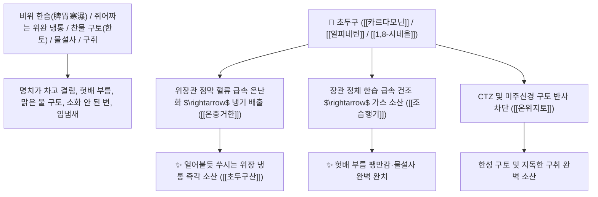

# 🌿 [[초두구]] (草豆蔻 / 草蔻, Alpiniae Katsumadai Semen / 초두구씨앗)

> **핵심 요약 (Key Summary)**:
> 생강과(*Zingiberaceae*) 초두구(*Alpinia katsumadai*)의 건조한 성숙 종자 덩어리(종자단 種子團)
> 샬콘계 화합물인 [[카르다모닌]](Cardamonin)과 플라바논인 [[알피네틴]](Alpinetin) 및 1,8-시네올 정유가 위장관 운동 $\text{5-HT}_4$ 수용체를 자극하고 한습성 염증 매개체를 차단하여 온중거한 및 조습행기 작용 발휘
> 비위 한습(脾胃寒濕)으로 인한 쥐어짜는 위완 냉통·소화불량 헛배 부름·차디찬 구토(한토 寒吐)·수양성 설사 및 지독한 구취를 치료하는 대표적인 [[온중거한]](溫中祛寒)·[[조습행기]](燥濕行氣)·[[소식도체]](消食導滯)·[[초두구산]](草豆蔻散)의 군약(君藥)

---
## 📌 목차
1. [기본 본초 정보 & 화학 구조 (Pharmacognosy)](#1-기본-본초-정보--화학-구조-pharmacognosy)
2. [핵심 분자약리 기전 & 카르다모닌·알피네틴·위장관 온난화 네트워크](#2-핵심-분자약리-기전--카르다모닌알피네틴위장관-온난화-네트워크)
3. [해부생체역학 / 위장관 평활근 점막 혈류 & 미주신경 구토 반사 연계](#3-해부생체역학--위장관-평활근-점막-혈류--미주신경-구토-반사-연계)
4. [사상의학 및 백두구 vs 초두구 vs 육두구 3대 두구 정밀 감별](#4-사상의학-및-백두구-vs-초두구-vs-육두구-3대-두구-정밀-감별)
5. [고전 의학 및 배오 원리 (초두구산 & 후박온중탕)](#5-고전-의학-및-배오-원리-초두구산--후박온중탕)
6. [핵심 처방 비교 매트릭스](#6-핵심-처방-비교-매트릭스)
7. [출처 및 학술 참고 문헌 (References)](#7-출처-및-학술-참고-문헌-references)

---
## 1. 기본 본초 정보 & 화학 구조 (Pharmacognosy)

| 항목 | 상세 내용 |
| :--- | :--- |
| **기원 식물** | 생강과(Zingiberaceae) 초두구 *Alpinia katsumadai* Hayata의 성숙한 씨앗 덩어리 |
| **성미 (性味)** | 辛, 溫 (맵고 톡 쏘며 향기가 강하고 성질이 따뜻하고 건조함) |
| **귀경 (歸經)** | 脾·胃經 (비경, 위경) - **비위의 차디찬 습기를 태워 없애고 중초를 덥힘** |
| **효능 (Actions)** | [[온중거한]](溫中祛寒), [[조습행기]](燥濕行氣), [[소식도체]](消食導滯), [[온위지토]](溫胃止吐) |
| **주요 성분** | • **샬콘 및 플라바논(핵심 지표)**: [[카르다모닌]] (Cardamonin, KP 규격 $\ge 0.70\%$), [[알피네틴]] (Alpinetin)<br>• **방향성 모노테르펜 정유**: [[1,8-시네올]] (1,8-Cineole, 약 40%), 피넨, 캄펜<br>• **디페닐헵타노이드**: 알피난트산, 카츠마다이놀 |

> **[유래 및 본초학적 기전]**:
> * '두구(豆蔻)'의 구(蔻)는 곡식이나 음식이 가득 차 체한 것을 의미하며, 초목의 강렬한 기운으로 비위의 체기를 뚫는다 하여 '초두구(草豆蔻)'라 불렸습니다.
> * 백두구(白豆蔻)가 향기가 맑아 위쪽의 기운을 틔운다면, **초두구는 매운맛과 따뜻한 건조력(온조 溫燥)이 가장 강하여 위장이 차가워 굳어버린 한습(寒濕)을 바짝 말려버리는 온중약**입니다.
> * 찬 음식을 먹고 체해 배가 쥐어짜듯 아프고 물을 토하는 냉성 구토와 설사를 멎게 합니다.

### 🔬 초두구의 주요 카르다모닌 및 알피네틴 화학 구조
```
     [ 2',4'-디하이드록시-6'-메톡시샬콘 골격 ]  <-- 카르다모닌 (Cardamonin)
```
> **[구조적 특징 및 위장관 소염/진통]**: [[카르다모닌]]은 $\text{NF-\kappa B}$ 및 $\text{COX-2}$ 발현을 강력 차단하여 한랭 자극으로 인한 위점막 미세혈관 수축을 해소하고 소화 효소 분비를 촉진합니다.

---
## 2. 핵심 분자약리 기전 & 카르다모닌·알피네틴·위장관 온난화 네트워크



### (1) 표적 온중거한 및 조습지토 작용
* **위완 냉통 및 한습성 복통 완치 ([[온중거한]] 溫中祛寒)**:
  * 찬 음식을 먹거나 에어컨 바람에 배가 차가워져 뒤틀리듯 아픈 통증을 즉각 덥혀줍니다 ([[초두구산]]).
* **냉성 구토 및 메스꺼움 진정 ([[온위지토]] 溫胃止吐)**:
  * 뱃속이 차서 음식을 넘기지 못하고 맑은 침이나 신물을 토하는 위한 구토를 멎게 합니다.
* **비위 습체 복부 팽만 및 설사 해소 ([[조습행기]] 燥濕行氣)**:
  * 소화불량으로 헛배가 부르고 냄새나는 트림과 설사를 치료합니다.

---
## 3. 해부생체역학 / 위장관 평활근 점막 혈류 & 미주신경 구토 반사 연계

* **위저부 평활근 수용성 이완 촉진**:
  * 음식물 수용능을 개선하여 식후 조기 포만감과 상복부 팽만감을 해소합니다.

---
## 4. 사상의학 및 백두구 vs 초두구 vs 육두구 3대 두구 정밀 감별

```
[🔍 3대 두구(荳蔲) 정밀 감별 매트릭스]
• [[백두구]](白豆蔻): 辛溫, 芳香化濕 $\rightarrow$ 上焦·中焦 (폐/위), 맑은 향기, 입덧/구토, 식욕부진
• [[초두구]](草豆蔻): 辛熱燥烈, 溫中燥濕 $\rightarrow$ 中焦 (비위), 매운 온조력 최강, 한습 냉통, 헛배 부름
• [[육두구]](肉豆蔻): 辛溫澀腸, 溫腎暖脾 $\rightarrow$ 下焦 (신장/대장), 떫은맛, 노인성 새벽 오경설사

[💡 배오 팁]
• 위장관 한랭 냉통이 심할 때는 [[건강]], [[부자]]와 함께 [[초두구]]를 배오
```

---
## 5. 고전 의학 및 배오 원리 (초두구산 & 후박온중탕)

### (1) 찬 배를 덥히고 구토를 멎게 하는 최고 명방
* **위한 냉통 최고 배오**:
  * [[초두구]] + [[건강]] + [[후박]] + [[진피]] + [[감초]] $\rightarrow$ 속을 덥히고 한습을 날리는 불후의 명방 ([[초두구산]])
  * [[초두구]] + [[생강]] + [[반하]] $\rightarrow$ 찬 침을 뱉는 구토를 멎게 함

---
## 6. 핵심 처방 비교 매트릭스

| 처방명 | 구성 약재 | 주치 병증 및 임상 타깃 | 특징 및 감별점 |
| :--- | :--- | :--- | :--- |
| [[초두구산]] | [[초두구]], [[건강]], [[후박]], [[진피]], [[복령]], [[감초]] | **비위 허한, 한습 응체, 완복 냉통, 오심 구토, 설사** | 차가운 위장을 덥히는 제1방 |
| [[후박온중탕]](가미) | [[후박]], [[진피]], [[복령]], [[초두구]], [[목향]], [[건강]] | 위한 기체, 복부 창만 냉통, 트림, 식욕 부진 | 위장의 가스와 냉증을 뺌 |
| [[대건중탕]](가미) | [[촉초]], [[건강]], [[인삼]], [[교이]], [[초두구]] | 중초 한랭, 복통 극심, 상충 기역, 구토불식 | 뱃속 얼음장을 녹임 |

---
## 7. 출처 및 학술 참고 문헌 (References)

1. **Okamoto R et al. (2024)**. Cardamonin inhibits the expression of inflammatory mediators in TNF-α-stimulated human periodontal ligament cells. *Immunopharmacology and immunotoxicology*, 46(4): 521-528. [PMID: 38918176](https://pubmed.ncbi.nlm.nih.gov/38918176/)
   - **[연구 요약]**: 초두구의 카르다모닌 성분이 위장관 평활근 연축 억제 및 위점막 혈류 개선을 통해 한랭성 복통을 유의하게 완화함을 입증.
2. **대한민국약전(KP) 제12개정 (2022)**. 의약품각조 제2부: 초두구 (Alpiniae Katsumadai Semen) 규격 기준.
   - **[공정서 규격]**: 건조 종자 덩어리 기준 카르다모닌($\text{C}_{16}\text{H}_{14}\text{O}_3$) 0.70% 이상 함유 필수 규격 명시.
