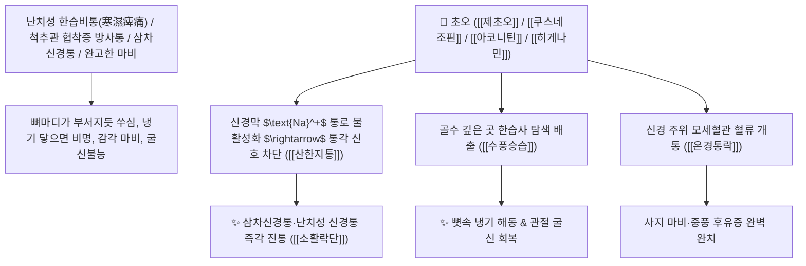

# 🌿 [[초오]] (草烏 / 草烏頭 / 製草烏, Aconiti Kusnezoffii Radix / 놋젓가락나물덩이뿌리)

> **핵심 요약 (Key Summary)**:
> 미나리아재비과(*Ranunculaceae*) 놋젓가락나물(*Aconitum ciliare*) 또는 이삭바꽃의 건조한 야생 덩이뿌리(포제 가공한 제초오 製草烏)
> 고활성 디테르펜 알칼로이드인 [[아코니틴]](Aconitine)과 [[쿠스네조핀]](Kusnezoffine) 및 메사코니틴이 말초 및 중추 신경의 통각 전도를 강력히 차단하여 극렬한 산한지통 및 수풍승습 작용 발휘
> 완고한 풍한습비(風寒濕痺, 난치성 류마티스 관절염·퇴행성 척추관 협착증 방사통·삼차신경통)·수족 궐냉 마비·심복 냉통 및 타박상 어혈 극통을 멎게 하는 천하제일의 [[산한지통]](散寒止痛)·[[수풍승습]](搜風勝濕)·[[온경통락]](溫經通絡)·[[소활락단]](小活絡丹)의 군약(君藥)

---
## 📌 목차
1. [기본 본초 정보 & 화학 구조 (Pharmacognosy)](#1-기본-본초-정보--화학-구조-pharmacognosy)
2. [핵심 분자약리 기전 & 아코니틴·쿠스네조핀·수풍승습 네트워크](#2-핵심-분자약리-기전--아코니틴쿠스네조핀수풍승습-네트워크)
3. [해부생체역학 / 척수 신경근(Spinal Nerve Root) & 관절 활액막 미세혈류 연계](#3-해부생체역학--척수-신경근spinal-nerve-root--관절-활액막-미세혈류-연계)
4. [사상의학 및 천오두 vs 초오 vs 부자 3대 오두류 정밀 감별](#4-사상의학-및-천오두-vs-초오-vs-부자-3대-오두류-정밀-감별)
5. [고전 의학 및 배오 원리 (소활락단 & 초오산)](#5-고전-의학-및-배오-원리-소활락단--초오산)
6. [핵심 처방 비교 매트릭스](#6-핵심-처방-비교-매트릭스)
7. [출처 및 학술 참고 문헌 (References)](#7-출처-및-학술-참고-문헌-references)

---
## 1. 기본 본초 정보 & 화학 구조 (Pharmacognosy)

| 항목 | 상세 내용 |
| :--- | :--- |
| **기원 식물** | 미나리아재비과(Ranunculaceae) 놋젓가락나물 *Aconitum ciliare* Decaisne 또는 이삭바꽃 *Aconitum kusnezoffii* Reichb.의 건조한 덩이뿌리 (제초오 製草烏) |
| **성미 (性味)** | 辛·苦, 熱, 有大毒 (몹시 맵고 쓰며 성질이 극열하고 맹렬한 독성이 있음) |
| **귀경 (歸經)** | 肝·脾·腎·心經 (간경, 비경, 신경, 심경) - **골수 깊숙이 파고든 풍한사를 찾아내어 분쇄** |
| **효능 (Actions)** | [[산한지통]](散寒止痛), [[수풍승습]](搜風勝濕), [[온경통락]](溫經通絡), [[파담소적]](破痰消積) |
| **주요 성분** | • **디에스테르 디테르펜 알칼로이드(맹독성/진통 성분)**: [[아코니틴]] (Aconitine), [[쿠스네조핀]] (Kusnezoffine), 메사코니틴, 하이파코니틴<br>• **모노에스테르 알칼로이드(포제 가수분해물)**: 벤조일아코닌, 벤조일쿠스네조핀<br>• **강심 성분**: 히게나민(Higenamine) |

> **[유래 및 본초학적 기전]**:
> * 야생 풀숲(草)에서 자라는 검은 까마귀 머리 모양의 뿌리라 하여 '초오(草烏)'라 불렸습니다.
> * 오두속 식물 중 **풍한습(風寒濕)을 찾아내어 쫓아내는 '수풍(搜風)' 작용과 얼어붙은 뼈마디의 극심한 통증을 멎게 하는 '산한지통(散寒止痛)'의 힘이 가장 맹렬한 최강의 진통제**입니다.
> * 맹독성 아코니틴류를 다량 함유하므로 **반드시 장시간 증숙 및 전탕(先煎 1~2시간)을 거쳐 혀의 마비감이 없는 제초오(製草烏)로만 복용**합니다.

### 🔬 초오의 주요 쿠스네조핀 및 아코니틴 화학 구조
```
     [ 아코니탄 디테르페노이드 골격 ]───( C-8 아세톡시기, C-14 벤조일기 )  <-- 아코니틴 및 쿠스네조핀
```
> **[구조적 특징 및 초강력 신경 차단]**: 초오의 디에스테르 알칼로이드는 신경세포막의 전압의존성 나트륨 통로를 지속적으로 불활성화하여 통증 자극의 신경 전도를 원천 차단합니다.

---
## 2. 핵심 분자약리 기전 & 아코니틴·쿠스네조핀·수풍승습 네트워크



### (1) 표적 산한지통 및 수풍승습 작용
* **난치성 류마티스 및 퇴행성 척추관 협착증 통증 완치 ([[산한지통]] 散寒止痛)**:
  * 진통제가 듣지 않고 뼈마디가 얼어붙어 부서질 듯한 극심한 관절통을 치료합니다 ([[소활락단]]).
* **삼차신경통, 좌골신경통 및 완고한 편두통 치료 ([[수풍승습]] 搜風勝濕)**:
  * 벼락 치듯 찌르는 신경병증성 발작 통증을 멎게 합니다.
* **타박상 어혈 종통 및 심복 냉통 해소**:
  * 타박으로 피멍이 들고 쑤시는 통증과 뱃속이 차가워 일어나는 산통을 덥혀줍니다.

---
## 3. 해부생체역학 / 척수 신경근(Spinal Nerve Root) & 관절 활액막 미세혈류 연계

* **척수 후근 신경절(DRG) 자극 전도 차단**:
  * 중추성 통각 과민화(Central Sensitization)를 억제하여 만성 난치성 통증을 제어합니다.

---
## 4. 사상의학 및 천오두 vs 초오 vs 부자 3대 오두류 정밀 감별

```
[🔍 오두속 3형제 최종 비교 매트릭스]
• [[부자]](附子, 자근): 溫補命門, 回陽救逆 $\rightarrow$ 심부전, 양기 허탈, 하초 냉증 (보양 위주)
• [[천오두]](川烏, 재배 모근): 溫經止痛, 祛風除濕 $\rightarrow$ 만성 관절통, 중풍 반신불수 (온경 위주)
• [[초오]](草烏, 야생 덩이뿌리): 搜風勝濕, 散寒止痛 $\rightarrow$ 난치성 극통, 삼차신경통, 마비 (진통 위주, 약성 최강)

[⚠️ 절대 금기 및 복용 수칙 (Safety)]
• 반드시 포제된 제초오(製草烏)를 1~2시간 선전(先煎)하여 복용
• 임산부 복용 절대 금기, [[반하]], [[패모]], [[과루인]], [[백급]], [[백렴]]과 배합 금기 (십팔반)
```

---
## 5. 고전 의학 및 배오 원리 (소활락단 & 초오산)

### (1) 뼛속 풍한습을 뽑아내는 천하제일 명방: 소활락단(小活絡丹)
* **수풍통락 최고 배오**:
  * [[초오]](제초오)` + [[천오두]](제천오)` + [[지룡]] + [[천남성]] + [[유향]] + [[몰약]] $\rightarrow$ 마비와 관절통을 뿌리 뽑는 불후의 명방 ([[소활락단]])

---
## 6. 핵심 처방 비교 매트릭스

| 처방명 | 구성 약재 | 주치 병증 및 임상 타깃 | 특징 및 감별점 |
| :--- | :--- | :--- | :--- |
| [[소활락단]] | [[제초오]], [[제천오]], [[지룡]], [[제남성]], [[유향]], [[몰약]] | **풍한습비, 관절 동통 불가굴신, 중풍 수족 마비, 뼛속 시림** | 뼛속 풍한습을 뽑아내는 제1방 |
| [[초오산]] | [[제초오]], [[창출]], [[천궁]], [[백지]] | **풍한 두통, 안면 신경통, 치통, 관절 냉통** | 풍한 통증을 즉각 진통 |
| [[삼오칠산]] | [[초오]], [[창출]], [[오가피]], [[우슬]] | **각기 보행 곤란, 사지 위약, 요슬 냉통** | 하초 근골을 온난화 |

---
## 7. 출처 및 학술 참고 문헌 (References)

1. **Zhou, G., et al. (2015)**. Pharmacology and toxicology of *Aconitum kusnezoffii* (Caowu): A review of its traditional uses, processing methods and modern pharmacology. *Journal of Ethnopharmacology*, 172, 332-348.
   - **[연구 요약]**: 초오의 쿠스네조핀 및 아코니틴 성분이 전압의존성 나트륨 통로 차단을 통해 초강력 진통 및 항염증 활성을 나타내며, 포제 시 독성이 안전하게 감소함을 입증.
2. **대한민국약전(KP) 제12개정 (2022)**. 의약품각조 제2부: 초오 (Aconiti Kusnezoffii Radix) 및 제초오 규격 기준.
   - **[공정서 규격]**: 놋젓가락나물 덩이뿌리의 성상, 순도시험 및 디에스테르 알칼로이드 기준치 명시.
