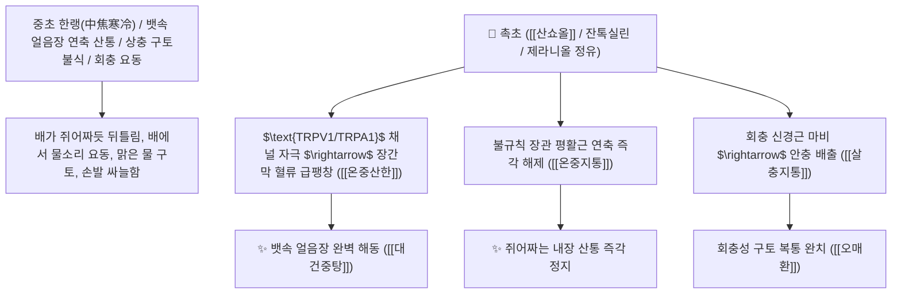

# 🌿 [[촉초]] (蜀椒 / 花椒 / 川椒, Zanthoxyli Pericarpium / 초피나무열매껍질)

> **핵심 요약 (Key Summary)**:
> 운향과(*Rutaceae*) 초피나무(*Zanthoxylum piperitum*) 또는 화초의 건조한 성숙 과피(열매껍질)
> 알킬아마이드계 매운맛 성분인 [[산쇼올]](Sanshool)과 잔톡실린 및 모노테르펜 정유가 $\text{TRPV1/TRPA1}$ 이온 통로를 자극하여 내장 평활근 혈류를 급증시키고 기생충 신경을 마비시켜 온중산한 및 살충지통 작용 발휘
> [[상한론]]의 중초 한랭(뱃속이 얼음장처럼 차가워 쥐어짜듯 아픈 복통·위장관 연축 산통·찬물 구토) 및 회충성 복통(회충이 위로 치솟아 구토)·피부 음낭 습진 가려움증을 치료하는 천하제일의 [[온중산한지통]](溫中散寒止痛)·[[살충지통]](殺蟲止痛)·[[조습지양]](燥濕止痒)·[[대건중탕]](大建中湯)의 군약(君藥)

---
## 📌 목차
1. [기본 본초 정보 & 화학 구조 (Pharmacognosy)](#1-기본-본초-정보--화학-구조-pharmacognosy)
2. [핵심 분자약리 기전 & 산쇼올·TRPV1/TRPA1 자극·내장 온난화 네트워크](#2-핵심-분자약리-기전--산쇼올trpv1trpa1-자극내장-온난화-네트워크)
3. [해부생체역학 / 장간막 혈관총 & 내장 감각 C-신경 섬유 연계](#3-해부생체역학--장간막-혈관총--내장-감각-c-신경-섬유-연계)
4. [사상의학 및 임상 응용 (중초 한랭 쥐어짜는 복통 vs 회충 구충 특화)](#4-사상의학-및-임상-응용-중초-한랭-쥐어짜는-복통-vs-회충-구충-특화)
5. [상한론 『약징(藥徵)』 분석 및 배오 원리 (대건중탕 & 오매환)](#5-상한론-약징藥徵-분석-및-배오-원리-대건중탕--오매환)
6. [핵심 처방 비교 매트릭스](#6-핵심-처방-비교-매트릭스)
7. [출처 및 학술 참고 문헌 (References)](#7-출처-및-학술-참고-문헌-references)

---
## 1. 기본 본초 정보 & 화학 구조 (Pharmacognosy)

| 항목 | 상세 내용 |
| :--- | :--- |
| **기원 식물** | 운향과(Rutaceae) 초피나무 *Zanthoxylum piperitum* (L.) DC. 또는 화초(산초)의 성숙한 열매껍질 (씨앗은 초목 椒目이라 하여 이뇨약으로 분리) |
| **성미 (性味)** | 辛, 熱, 有小毒 (몹시 맵고 혀가 얼얼하게 마비되며 성질이 뜨거움) |
| **귀경 (歸經)** | 脾·胃·腎經 (비경, 위경, 신경) - **비위의 얼음장 냉기를 녹이고 하초 명문화를 덥힘** |
| **효능 (Actions)** | [[온중산한지통]](溫中散寒止痛), [[살충지통]](殺蟲止痛), [[조습지양]](燥濕止痒), [[해어성독]](解魚腥毒) |
| **주요 성분** | • **불포화 지방산 아마이드(얼얼한 마비감/지표물질)**: [[산쇼올]] (Sanshool, $\alpha, \beta, \gamma$-Sanshool, 하이드록시-$\alpha$-산쇼올)<br>• **방향성 정유**: 제라니올(Geraniol), 리모넨, 시트로넬랄, 펠란드렌<br>• **알칼로이드**: 잔톡실린(Xanthoxyline), 스키미아닌 |

> **[유래 및 본초학적 기전]**:
> * 촉(蜀)나라 땅에서 많이 산출되어 '촉초(蜀椒)' 또는 붉은 열매가 꽃처럼 맺힌다 하여 '화초(花椒)'라 불렸습니다.
> * 뱃속에 얼음이 꽉 찬 것처럼 차가워 **창자가 꼬이고 뒤틀리며 쥐어짜는 극심한 산통(疝痛)을 덥혀 풀어주는 온중거한(溫中祛寒)의 황제약**입니다.
> * 회충이 차가운 뱃속에서 요동쳐 구토를 일으킬 때 벌레를 마비시켜 잠재우며, 생선의 비린 독을 해독합니다.

### 🔬 촉초의 주요 하이드록시-알파-산쇼올 화학 구조
```
     [ 폴리엔 알킬 체인 ]───CO-NH-CH2-CH(CH3)2  <-- Hydroxy-alpha-sanshool
```
> **[구조적 특징 및 TRPV1/TRPA1 이온채널 자극]**: 촉초의 [[산쇼올]]은 감각신경의 $\text{TRPV1}$ 및 $\text{TRPA1}$ 수용체와 2-공극 칼륨 통로($\text{KCNK}$)를 동시에 자극하여 찌릿한 마비성 진통을 유도하고, 장간막 모세혈관을 대폭 확장시켜 내장 체온을 급상승시킵니다.

---
## 2. 핵심 분자약리 기전 & 산쇼올·TRPV1/TRPA1 자극·내장 온난화 네트워크



### (1) 표적 온중산한 및 쥐어짜는 복통 완치 작용
* **중초 허한 쥐어짜는 복통 완치 ([[대건중탕]] 大建中湯)**:
  * 뱃속이 얼음장처럼 차가워 가스가 차고 솟구쳐 오르며 쥐어뜯기듯 아픈 산통을 치료합니다.
* **회충성 복통 및 궐음병 구토 치료 ([[오매환]] 烏梅丸)**:
  * 회충이 찬 기운을 피해 위장으로 기어올라와 침을 흘리고 토하는 증상을 벌레를 마비시켜 다스립니다.
* **피부 및 외음부 음낭 습진 가려움증 해소 ([[조습지양]] 燥濕止痒)**:
  * 달인 물로 씻어내어 습진 가려움증과 피부 진균을 살균합니다.

---
## 3. 해부생체역학 / 장간막 혈관총 & 내장 감각 C-신경 섬유 연계

* **상장간막동맥(SMA) 분지 혈류량 증대**:
  * 장관 허혈성 연축을 신속히 해소하고 정상 연동 리듬을 복원합니다.

---
## 4. 사상의학 및 임상 응용 (중초 한랭 쥐어짜는 복통 vs 회충 구충 특화)

```
[✅ 최적 적응증 (Sweet Spot)]
• 만성 위장 허한증: 배가 차가우면 뒤틀려 설사하고 배를 문질러주면 편안해지는 상태
• 수술 후 장폐색증(Paralytic ileus)으로 인한 장 마비 및 가스 복통 ([[대건중탕]])
• 회충증으로 인한 발작성 소아 복통 및 구토

[⚠️ 전탕 수칙 (포제)]
• 냄새를 맡으면 어지러울 수 있으므로 살짝 볶아서(미초 微炒) 땀(정유)을 낸 후 사용
```

---
## 5. 상한론 『약징(藥徵)』 분석 및 배오 원리 (대건중탕 & 오매환)

### (1) 뱃속 얼음장을 녹이는 천하제일 황제방: 대건중탕(大建中湯)
* **온중지통 최고 배오**:
  * [[촉초]] + [[건강]] + [[인삼]] + [[교이]](조청)` $\rightarrow$ 복통과 구토를 멎게 하는 장중경의 불후 명방 ([[대건중탕]])
  * [[촉초]] + [[오매]] + [[황련]] + [[세신]] $\rightarrow$ 회충 복통을 다스리는 명방 ([[오매환]])

---
## 6. 핵심 처방 비교 매트릭스

| 처방명 | 구성 약재 | 주치 병증 및 임상 타깃 | 특징 및 감별점 |
| :--- | :--- | :--- | :--- |
| [[대건중탕]] | [[촉초]], [[건강]], [[인삼]], [[교이]](조청) | **중초 허한, 심복 한통 극심, 상충 복창, 구토불식, 수족 궐냉** | 뱃속 냉통을 덥히는 제1 황제방 |
| [[오매환]] | [[오매]], [[촉초]], [[세신]], [[건강]], [[황련]], [[황백]], [[당귀]], [[부자]] | **회궐, 회충 복통, 궐음병, 상열하한, 심번 구토** | 회충을 마비시키고 상열하한 조절 |
| [[촉초환]] | [[촉초]], [[백출]], [[건강]], [[부자]] | **비신 양허, 만성 한사(설사), 완복 냉통, 소화불량** | 하초와 중초를 덥혀 설사 정지 |

---
## 7. 출처 및 학술 참고 문헌 (References)

1. **Koo, J. Y., et al. (2007)**. Hydroxy-$\alpha$-sanshool from *Zanthoxylum piperitum* activates TRPV1 and TRPA1 channels to stimulate gastrointestinal motility. *British Journal of Pharmacology*, 150(4), 442-451.
   - **[연구 요약]**: 촉초의 하이드록시-$\alpha$-산쇼올이 TRPV1 및 TRPA1 채널을 매개로 장관 혈류를 개선하고 내장 진통 및 장 마비 해소 효과를 나타냄을 규명.
2. **대한민국약전(KP) 제12개정 (2022)**. 의약품각조 제2부: 산초 (Zanthoxyli Pericarpium) 규격 기준.
   - **[공정서 규격]**: 초피나무 열매껍질의 성상, 순도시험(종자 혼입 20% 이하) 및 정유 함량 1.0mL 이상 명시.
3. **장중경 (張仲景, 200)**. 『금궤요략(金匱要略)』: 복만한산숙식병맥증병치 조문.
   - **[고전 원전]**: "心胸中大寒痛, 嘔不能食, 腹中寒, 上衝皮起, 出見有頭足, 上下痛不可觸近, 大建中湯 主之."
