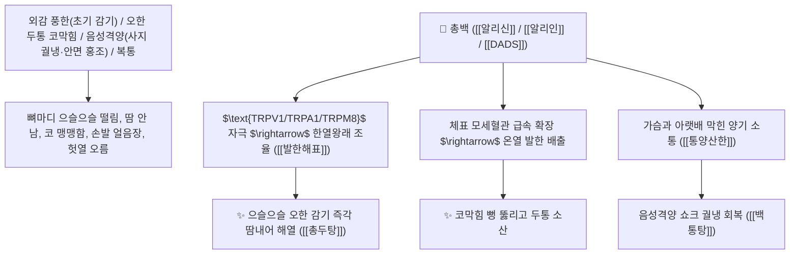

# 🌿 [[총백]] (蔥白, Allii Fistulosi Bulbus / 파밑뿌리)

> **핵심 요약 (Key Summary)**:
> 백합과(*Amaryllidaceae*) 파(*Allium fistulosum*)의 건조하거나 신선한 비늘줄기(흰 밑동)
> 유기황 화합물인 [[알리인]](Alliin)과 [[알리신]](Allicin) 및 디알릴 다이설파이드(DADS)가 $\text{TRPV1/TRPA1}$ 및 $\text{TRPM8}$ 온도 수용체를 교차 자극하여 체표 말초 혈관을 확장시키고 발한해표 및 통양산한 작용 발휘
> [[상한론]]의 풍한 감모(오한 발열·두통 코막힘) 및 음성격양(陰盛格陽, 사지 궐냉·설사·얼굴만 붉어짐)·하복부 냉통 소변불통을 뚫어주는 천하제일의 [[발한해표]](發汗解表)·[[통양산한]](通陽散寒)·[[백통탕]](白通湯)·[[총두탕]](蔥豉湯)의 군약(君藥)

---
## 📌 목차
1. [기본 본초 정보 & 화학 구조 (Pharmacognosy)](#1-기본-본초-정보--화학-구조-pharmacognosy)
2. [핵심 분자약리 기전 & 알리신·온도 수용체 자극·통양 발한 네트워크](#2-핵심-분자약리-기전--알리신온도-수용체-자극통양-발한-네트워크)
3. [해부생체역학 / 체표 모세혈관망 & 한선(땀샘) 확장 연계](#3-해부생체역학--체표-모세혈관망--한선땀샘-확장-연계)
4. [사상의학 및 소음인 초기 감기 vs 음성격양 구급 특화](#4-사상의학-및-소음인-초기-감기-vs-음성격양-구급-특화)
5. [상한론 『약징(藥徵)』 분석 및 배오 원리 (백통탕 & 총두탕)](#5-상한론-약징藥徵-분석-및-배오-원리-백통탕--총두탕)
6. [핵심 처방 비교 매트릭스](#6-핵심-처방-비교-매트릭스)
7. [출처 및 학술 참고 문헌 (References)](#7-출처-및-학술-참고-문헌-references)

---
## 1. 기본 본초 정보 & 화학 구조 (Pharmacognosy)

| 항목 | 상세 내용 |
| :--- | :--- |
| **기원 식물** | 백합과(Liliaceae / Amaryllidaceae) 파 *Allium fistulosum* L.의 신선하거나 건조한 흰색 비늘줄기 밑동 |
| **성미 (性味)** | 辛, 溫 (맵고 알싸하며 성질이 따뜻하고 기운을 맹렬히 통하게 함) |
| **귀경 (歸經)** | 肺·胃經 (폐경, 위경) - **체표의 한사를 땀으로 날리고 중초의 막힌 양기를 틔움** |
| **효능 (Actions)** | [[발한해표]](發汗解表), [[통양산한]](通陽散寒), [[구충해독]](驅蟲解毒), [[리기통락]](理氣通絡) |
| **주요 성분** | • **유기황 화합물(지표물질)**: [[알리신]] (Allicin), [[알리인]] (Alliin), 디알릴 다이설파이드(DADS), 디알릴 트라이설파이드<br>• **비타민 및 미네랄**: 비타민 C, 비타민 B1, 칼륨, 셀레늄<br>• **정유 성분**: 파 정유(휘발성 유기산) |

> **[유래 및 본초학적 기전]**:
> * 파(蔥)의 하얀 밑동(白) 부분으로, 옛날부터 초기 감기와 막힌 기운을 뚫는 밥상의 최고 상비약으로 쓰였습니다.
> * 밖으로는 땀구멍을 열어 찬바람 감기(풍한 감모)를 땀으로 흩어 날리고, **안으로는 뼛속까지 음기(陰氣)가 차올라 겉으로만 헛열이 뜨는 음성격양(陰盛格陽)의 위급한 상태에서 양기를 아래위로 소통시키는(통양 通陽) 기사회생의 명약**입니다.
> * 콩발효약인 담두시(豆豉)와 짝을 이루어 감기 초기에 땀을 내는 총두탕(蔥豉湯)으로 애용됩니다.

### 🔬 총백의 알리인 분해 알리신 생성 및 온도 감각 수용체 기전
![[Pasted image 20250218211312.jpg|450]]
> **[구조적 특징 및 온도 수용체 자극]**: 파를 찧을 때 효소 알리나아제(Alliinase)에 의해 생성된 [[알리신]]은 **$17^\circ\text{C}$ 이하의 냉각 수용체([[TRPM8]])와 $42^\circ\text{C}$ 이상의 온열 수용체([[TRPV1]]/[[TRPA1]])를 동시에 자극**하여 체온 조절 중추의 한열 감각을 교정하고 체표 혈관을 대폭 확장시켜 발한을 유도합니다.

---
## 2. 핵심 분자약리 기전 & 알리신·온도 수용체 자극·통양 발한 네트워크



### (1) 표적 발한해표 및 통양산한 작용
* **초기 풍한 감기 및 코막힘 두통 완치 ([[총두탕]] 蔥豉湯)**:
  * 으슬으슬 춥고 땀이 나지 않으며 코가 막히고 머리가 띵한 초기 감기를 땀을 내어 날려버립니다.
* **음성격양(陰盛格陽) 사지 궐냉 쇼크 구급 ([[백통탕]] 白通湯)**:
  * 하초가 차가워 물설사를 하고 손발이 얼음장인데 얼굴만 벌겋게 열이 뜨는 위급한 허열을 양기를 뚫어 치료합니다.
* **하복부 한랭 복통 및 소변 불통 해소**:
  * 아랫배가 차서 소변이 찔끔거리고 아픈 증상을 덥혀 뚫어줍니다.

---
## 3. 해부생체역학 / 체표 모세혈관망 & 한선(땀샘) 확장 연계

* **진피층 동정맥 문합(AVA) 개방**:
  * 피부 혈류량을 순간적으로 3~5배 증가시켜 한선의 발한 효율을 극대화합니다.

---
## 4. 사상의학 및 소음인 초기 감기 vs 음성격양 구급 특화

```
[✅ 최적 적응증 (Sweet Spot)]
• 소음인의 초기 몸살 감기: 오한, 무한, 두통, 비색 ([[총두탕]])
• 소화기 허한으로 인한 급성 한성 설사 및 복통
• 족소음신경 양기 고갈로 인한 음성격양증 ([[백통탕]])

[💡 전탕 및 조리 수칙]
• 휘발성 유기황 정유 성분이 날아가지 않도록 오래 달이지 않고 후하(後下)하거나 살짝 끓여 복용
```

---
## 5. 상한론 『약징(藥徵)』 분석 및 배오 원리 (백통탕 & 총두탕)

### (1) 양기를 통하게 하는 천하제일 구급방: 백통탕(白通湯)
* **통양구급 최고 배오**:
  * [[총백]] + [[부자]] + [[건강]] $\rightarrow$ 상하로 끊어진 양기를 이어주는 장중경의 불후 구급방 ([[백통탕]])
  * [[총백]] + [[담두시]] $\rightarrow$ 초기 감기를 땀내어 푸는 명방 ([[총두탕]])

---
## 6. 핵심 처방 비교 매트릭스

| 처방명 | 구성 약재 | 주치 병증 및 임상 타깃 | 특징 및 감별점 |
| :--- | :--- | :--- | :--- |
| [[백통탕]] | [[총백]], [[건강]], [[생부자]] | **소음병 음성격양, 하리 청곡, 맥미욕절, 수족 궐역, 면적** | 상하 양기를 통하게 하는 구급방 |
| [[총두탕]] | [[총백]], [[담두시]] | **외감 풍한 초기, 오한 발열, 두통, 무한, 비색** | 땀을 내어 초기 감기를 날림 |
| [[총백칠미음]] | [[총백]], [[갈근]], [[신선생강]], [[맥문동]], [[생지황]], [[담두시]] | **혈허 외감 감모, 산후 발열, 오한 두통, 허약자 감기** | 진액을 보하며 땀을 냄 |

---
## 7. 출처 및 학술 참고 문헌 (References)

2. **대한민국약전(KP) 제12개정 (2022)**. 생약규격집: 총백 (Allii Fistulosi Bulbus) 규격 기준.
   - **[공정서 규격]**: 파 비늘줄기의 성상, 순도시험 및 건조감량 기준 명시.
3. **장중경 (張仲景, 200)**. 『상한론(傷寒論)』: 소음병편 백통탕 조문.
   - **[고전 원전]**: "少陰病, 下利, 白通湯 主之. 內熱外寒, 脈微弱者, 白通加猪膽汁湯 主之."
