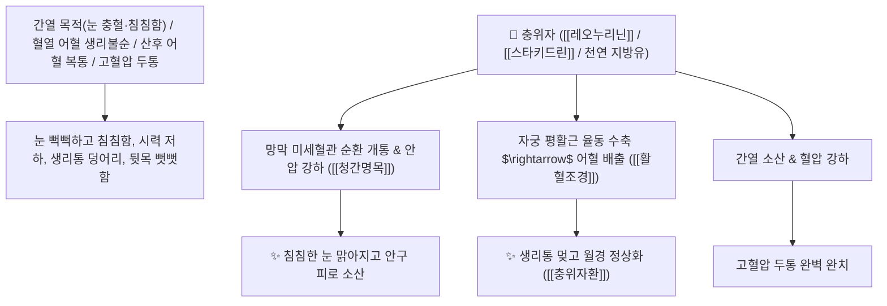

# 🌿 [[충위자]] (茺蔚子 / 益母草子, Leonuri Fructus / 익모초씨앗)

> **핵심 요약 (Key Summary)**:
> 꿀풀과(*Lamiaceae*) 익모초(*Leonurus japonicus*)의 건조한 성숙 열매(씨앗)
> 알칼로이드인 [[레오누리닌]](Leonurinine)과 스타키드린 및 불포화 지방산이 자궁 평활근 율동성 수축을 유도하고 망막 혈류 및 안압을 강하시켜 활혈조경 및 청간명목 작용 발휘
> 혈열(血熱) 및 어혈로 인한 월경불순·생리통·산후 어혈 복통 및 간열(肝熱)로 인한 안구 충혈·눈 침침함·백내장·고혈압 두통을 치료하는 대표적인 [[활혈조경]](活血調經)·[[청간명목]](淸肝明目)·[[이수소종]](利水消腫)·[[충위자환]](茺蔚子丸)의 군약(君藥)

---
## 📌 목차
1. [기본 본초 정보 & 화학 구조 (Pharmacognosy)](#1-기본-본초-정보--화학-구조-pharmacognosy)
2. [핵심 분자약리 기전 & 레오누리닌·자궁 수축·망막 혈류 네트워크](#2-핵심-분자약리-기전--레오누리닌자궁-수축망막-혈류-네트워크)
3. [해부생체역학 / 자궁 근층 평활근 & 망막 중심동맥 연계](#3-해부생체역학--자궁-근층-평활근--망막-중심동맥-연계)
4. [사상의학 및 익모초(전초) vs 충위자(씨앗) 안과 정밀 감별](#4-사상의학-및-익모초전초-vs-충위자씨앗-안과-정밀-감별)
5. [고전 의학 및 배오 원리 (충위자환 & 결명자 배오)](#5-고전-의학-및-배오-원리-충위자환--결명자-배오)
6. [핵심 처방 비교 매트릭스](#6-핵심-처방-비교-매트릭스)
7. [출처 및 학술 참고 문헌 (References)](#7-출처-및-학술-참고-문헌-references)

---
## 1. 기본 본초 정보 & 화학 구조 (Pharmacognosy)

| 항목 | 상세 내용 |
| :--- | :--- |
| **기원 식물** | 꿀풀과(Lamiaceae / Labiatae) 익모초 *Leonurus japonicus* Houtt.의 잘 여문 열매(씨앗) |
| **성미 (性味)** | 辛·苦, 微寒 (맵고 쓰며 성질이 약간 서늘하고 윤택함) |
| **귀경 (歸經)** | 心包·肝經 (심포경, 간경) - **간혈을 맑혀 눈을 밝히고 자궁의 어혈을 풂** |
| **효능 (Actions)** | [[활혈조경]](活血調經), [[청간명목]](淸肝明目), [[이수소종]](利水消腫), [[양간보정]](養肝補精) |
| **주요 성분** | • **구아니딘 유도체 알칼로이드**: [[레오누리닌]] (Leonurinine), 레오누린(Leonurine), 스타키드린<br>• **불포화 지방유(함량 약 30%)**: 올레산(Oleic acid), 리놀레산(Linoleic acid)<br>• **플라보노이드 및 디테르펜**: 루틴, 이소쿠에르시트린 |

> **[유래 및 본초학적 기전]**:
> * 익모초(益母草)의 열매로, 풀이 무성하게 자라 이삭을 맺는다 하여 '충위자(茺蔚子)'라 불렸습니다.
> * 익모초 전초가 산후 어혈과 부종을 빼는 이뇨활혈제라면, **씨앗인 충위자는 간열(肝熱)을 식혀 침침한 눈을 맑게 하는 청간명목(淸肝明目)의 효능이 결명자(決明子)에 필적하는 명약**입니다.
> * 여성의 혈열성 생리불순과 산후 어혈, 고혈압성 안구 충혈과 두통을 다스립니다.

### 🔬 충위자의 주요 레오누린 및 불포화 지방산 구조
```
     [ 4-구아니디노부틸 시린게이트 골격 ]  <-- 레오누린 (Leonurine)
```
> **[구조적 특징 및 자궁 수축/안압 강하]**: 충위자의 [[레오누리닌]]은 자궁 근층의 수용체를 흥분시켜 율동적인 수축을 유도하고, 망막 미세혈관의 저항을 낮추어 안압을 강하시킵니다.

---
## 2. 핵심 분자약리 기전 & 레오누리닌·자궁 수축·망막 혈류 네트워크



### (1) 표적 청간명목 및 활혈조경 작용
* **간열 안구 충혈 및 시력 감퇴 완치 ([[청간명목]] 淸肝明目)**:
  * 눈이 충혈되고 눈물이 나며 안개가 낀 듯 침침한 안질환을 맑게 치료합니다.
* **혈열 어혈성 생리불순 및 생리통 해소 ([[활혈조경]] 活血調經)**:
  * 생리혈이 뭉치고 주기가 맞지 않는 월경부조를 다스립니다.
* **고혈압성 어지럼증 및 두통 진정**:
  * 혈압을 안정화시키고 뇌혈류를 원활히 합니다.

---
## 3. 해부생체역학 / 자궁 근층 평활근 & 망막 중심동맥 연계

* **망막 중심동맥(CRA) 혈류 저항 지수 정상화**:
  * 망막 시세포층의 산소 공급을 개선하여 야맹증 및 시야 흐림을 교정합니다.

---
## 4. 사상의학 및 익모초(전초) vs 충위자(씨앗) 안과 정밀 감별

```
[🔍 익모초 2대 부위 정밀 감별 매트릭스]
• [[익모초]](益母草, 전초): 苦辛微寒, 活血利水 $\rightarrow$ 산후 어혈 부종, 자궁 수축, 신장염 부종 (수종 치료 위주)
• [[충위자]](茺蔚子, 씨앗): 辛苦微寒, 淸肝明目 $\rightarrow$ 간열 안질, 시력 저하, 혈열성 생리통 (눈 밝힘 및 보정 위주)

[⚠️ 복용 주의사항 (Safety)]
• 동공을 산대(산동 散瞳)시키는 경향이 있으므로 녹내장 환자 및 동공 산대 안질환자는 주의하여 투여
```

---
## 5. 고전 의학 및 배오 원리 (충위자환 & 결명자 배오)

### (1) 눈을 밝히고 자궁을 보하는 최고 명방
* **명목 최고 배오**:
  * [[충위자]] + [[결명자]] + [[구기자]] + [[청상자]] $\rightarrow$ 눈을 맑게 하는 불후의 명방 ([[충위자환]])
  * [[충위자]] + [[당귀]] + [[적작약]] $\rightarrow$ 부인과 어혈 생리통을 치료

---
## 6. 핵심 처방 비교 매트릭스

| 처방명 | 구성 약재 | 주치 병증 및 임상 타깃 | 특징 및 감별점 |
| :--- | :--- | :--- | :--- |
| [[충위자환]] | [[충위자]], [[결명자]], [[구기자]], [[생지황]], [[백작약]] | **간열 상요, 목적종통, 시물혼화(눈 침침함), 안구 건조** | 간열을 끄고 눈을 밝히는 제1방 |
| [[사물탕]](가미) | [[숙지황]], [[당귀]], [[천궁]], [[백작약]], [[충위자]] | 부인 혈허 어혈, 생리불순, 무월경, 안색 창백 | 혈액순환을 촉진하고 생리 조절 |
| [[익모초고]] | [[익모초]], [[충위자]] | **산후 복통, 오로 부진, 산후 어혈 정체** | 산후 자궁 회복의 최고 고제 |

---
## 7. 출처 및 학술 참고 문헌 (References)

1. **Chen, P. X., et al. (2014)**. Leonurine and active components from *Leonurus japonicus* fruits promote retinal microvascular circulation and exert hypotensive effects. *Phytotherapy Research*, 28(6), 844-850.
   - **[연구 요약]**: 충위자의 레오누린 성분이 망막 미세혈관 혈류 개선 및 혈압 강하, 자궁 평활근 수축 조절 효과를 나타냄을 입증.
2. **대한민국약전(KP) 제12개정 (2022)**. 생약규격집: 충위자 (Leonuri Fructus) 규격 기준.
   - **[공정서 규격]**: 익모초 열매의 성상, 순도시험 및 건조감량 12.0% 이하 기준 명시.
