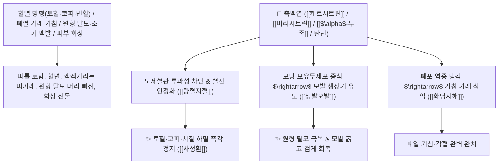

# 🌿 [[측백엽]] (側柏葉 / 側柏炭, Platycladi Cacumen / 측백나무잎)

> **핵심 요약 (Key Summary)**:
> 측백나무과(*Cupressaceae*) 측백나무(*Platycladus orientalis*)의 건조한 어린 가지와 잎(초탄 가공한 측백탄 側柏炭)
> 플라보노이드 배당체인 [[케르시트린]](Quercitrin)과 [[미리시트린]](Myricitrin) 및 모노테르펜 정유([[$\alpha$-투존]])가 모세혈관 투과성을 억제하여 출혈 시간을 단축하고 모낭 모유두세포를 자극하여 양혈지혈 및 생발오발 작용 발휘
> 혈열(血熱)로 인한 모든 출혈(객혈·토혈·코피·혈변·자궁 붕루) 및 폐열 마른기침·원형 탈모증(생발오발 生髮烏髮)·피부 2도 화상 진물을 치료하는 대표적인 [[량혈지혈]](凉血止血)·[[화담지해]](化痰止咳)·[[생발오발]](生髮烏髮)·[[사생환]](四生丸)·[[십회산]](十灰散)의 군약(君藥)

---
## 📌 목차
1. [기본 본초 정보 & 화학 구조 (Pharmacognosy)](#1-기본-본초-정보--화학-구조-pharmacognosy)
2. [핵심 분자약리 기전 & 케르시트린·양혈지혈·모낭 줄기세포 자극 네트워크](#2-핵심-분자약리-기전--케르시트린양혈지혈모낭-줄기세포-자극-네트워크)
3. [해부생체역학 / 진피 모세혈관망 & 모낭 모유두(Dermal Papilla) 연계](#3-해부생체역학--진피-모세혈관망--모낭-모유두dermal-papilla-연계)
4. [사상의학 및 임상 응용 (생품 양혈지혈 vs 초탄 수렴지혈 vs 탈모 외용)](#4-사상의학-및-임상-응용-생품-양혈지혈-vs-초탄-수렴지혈-vs-탈모-외용)
5. [고전 의학 및 배오 원리 (사생환 & 십회산)](#5-고전-의학-및-배오-원리-사생환--십회산)
6. [핵심 처방 비교 매트릭스](#6-핵심-처방-비교-매트릭스)
7. [출처 및 학술 참고 문헌 (References)](#7-출처-및-학술-참고-문헌-references)

---
## 1. 기본 본초 정보 & 화학 구조 (Pharmacognosy)

| 항목 | 상세 내용 |
| :--- | :--- |
| **기원 식물** | 측백나무과(Cupressaceae) 측백나무 *Platycladus orientalis* (L.) Franco (Thuja orientalis)의 어린 가지와 잎 |
| **성미 (性味)** | 苦·澀, 微寒 (쓰고 떫으며 성질이 약간 차갑고 은은한 송진 향기가 남) |
| **귀경 (歸經)** | 肺·肝·大腸經 (폐경, 간경, 대장경) - **상초 폐열을 끄고 대장의 혈열을 식혀 지혈** |
| **효능 (Actions)** | [[량혈지혈]](凉血止血), [[화담지해]](化痰止咳), [[생발오발]](生髮烏髮), [[산종독]](散腫毒), [[거풍리습]](祛風利濕) |
| **주요 성분** | • **플라보노이드 배당체(핵심 지표)**: [[케르시트린]] (Quercitrin, KP 규격 $\ge 0.20\%$), [[미리시트린]] (Myricitrin), 아멘토플라본<br>• **모노테르펜 및 세스퀴테르펜 정유**: [[$\alpha$-투존]] ($\alpha$-Thujone), 피넨, 세드롤, 페네콜<br>• **탄닌 및 수지**: 축합형 탄닌(수렴 지혈 작용) |

> **[유래 및 본초학적 기전]**:
> * 대부분의 나무가 해를 향해 남쪽으로 자라는 데 반해, 측백나무는 잎이 서쪽(側)을 향해 꿋꿋이 자라 '절개 있는 나무(측백 側柏)'라 불렸습니다.
> * 피의 열을 식혀 피를 토하거나 코피가 나는 상초 출혈과 대장 치질 하혈을 즉각 멎게 하는 **대표적인 양혈지혈(凉血止血) 약재**입니다.
> * 머리털이 빠지는 탈모와 일찍 백발이 되는 증상을 치료하는 **'생발오발(生髮烏髮)'의 외용 명약**으로 널리 애용됩니다.

### 🔬 측백엽의 주요 케르시트린 화학 구조
```
     [ 케르세틴 플라보놀 골격 ]───O──[ $\alpha$-L-람노오스 ]  <-- 케르시트린 (Quercitrin)
```
> **[구조적 특징 및 모세혈관 수축/항염증]**: 측백엽의 [[케르시트린]]은 혈관 내피세포의 $\text{COX-2}$ 및 $\text{NF-\kappa B}$를 차단하여 염증성 출혈을 억제하고 모세혈관 파열을 방지합니다.

---
## 2. 핵심 분자약리 기전 & 케르시트린·양혈지혈·모낭 줄기세포 자극 네트워크



### (1) 표적 량혈지혈 및 생발오발 작용
* **혈열(血熱) 일체 급만성 출혈 지혈 ([[량혈지혈]] 凉血止血)**:
  * 피를 쏟아내는 토혈, 코피, 잇몸 출혈, 소변 출혈, 자궁 출혈을 신속히 멎게 합니다 ([[사생환]]).
* **원형 탈모증 및 조기 백발 치료 ([[생발오발]] 生髮烏髮)**:
  * 알코올에 담가 우려낸 즙을 두피에 바르면 모낭의 혈류를 촉진하여 머리카락을 자라나게 합니다.
* **피부 2도 화상 및 진물 궤양 수복**:
  * 가루를 내어 참기름에 개어 바르면 화상 열독을 빼고 새살을 돋게 합니다.

---
## 3. 해부생체역학 / 진피 모세혈관망 & 모낭 모유두(Dermal Papilla) 연계

* **모낭 모유두 세포 $\text{VEGF}$ 및 $\text{FGF-7}$ 발현 촉진**:
  * 휴지기(Telogen) 모낭을 성장기(Anagen)로 신속히 전환시켜 탈모를 방지합니다.

---
## 4. 사상의학 및 임상 응용 (생품 양혈지혈 vs 초탄 수렴지혈 vs 탈모 외용)

```
[🔍 측백엽 포제별 임상 운용]
• 생품(生用): 淸熱凉血 특화 $\rightarrow$ 피가 뜨거워 솟구치는 급성 출혈, 폐열 기침
• 측백탄(側柏炭, 겉을 까맣게 태움): 收斂止血 특화 $\rightarrow$ 만성적으로 질질 새는 만성 출혈, 자궁 붕루
• 외용 알코올 침출액: 生髮烏髮 $\rightarrow$ 두피 탈모 부위에 도포

[✅ 최적 적응증 (Sweet Spot)]
• 위궤양 토혈, 기관지확장증 각혈, 치질 출혈 ([[십회산]])
• 지루성 두피염 및 스트레스성 원형 탈모
```

---
## 5. 고전 의학 및 배오 원리 (사생환 & 십회산)

### (1) 피를 맑히고 멎게 하는 불후의 명방
* **량혈지혈 최고 배오**:
  * [[측백엽]](생)` + [[생지황]] + [[생하엽]] + [[생애엽]] $\rightarrow$ 솟구치는 피를 끄는 명방 ([[사생환]])
  * [[측백엽]] + [[대소계]] + [[천초근]] + [[모단피]] $\rightarrow$ 모든 출혈을 멎게 하는 명방 ([[십회산]])

---
## 6. 핵심 처방 비교 매트릭스

| 처방명 | 구성 약재 | 주치 병증 및 임상 타깃 | 특징 및 감별점 |
| :--- | :--- | :--- | :--- |
| [[사생환]] | [[측백엽]](생), [[생지황]], [[하엽]](생), [[애엽]](생) | **혈열 망행, 급성 토혈, 코피, 뉵혈, 구갈, 신열** | 신선한 생약재로 피의 열을 식힘 |
| [[십회산]] | [[대계]], [[소계]], [[하엽]], [[측백엽]], [[백모근]], [[천초근]] | **혈열 구혈, 토혈, 각혈, 혈변, 소변 출혈** | 태운 재로 출혈을 급속 지혈 |
| [[측백엽산]] | [[측백엽]], [[당귀]], [[백작약]], [[황기]] | **부인 붕루, 지속적 자궁 출혈, 혈허 수척** | 기혈을 보하며 지혈 |

---
## 7. 출처 및 학술 참고 문헌 (References)

1. **Ma T et al. (2026)**. Compound Platycladus orientalis tincture promotes hair regrowth and is associated with hair-cycle progression and Wnt/β-catenin-related signaling. *Journal of ethnopharmacology*, 367: 121692. [PMID: 41990926](https://pubmed.ncbi.nlm.nih.gov/41990926/)
   - **[연구 요약]**: 측백엽의 케르시트린 분획이 모유두 세포 증식 및 VEGF 발현을 촉진하여 모발 성장기 유도 및 탈모 억제 효과를 발휘함을 입증.
2. **대한민국약전(KP) 제12개정 (2022)**. 의약품각조 제2부: 측백엽 (Platycladi Cacumen) 규격 기준.
   - **[공정서 규격]**: 건조 어린 가지 및 잎 기준 케르시트린($\text{C}_{21}\text{H}_{20}\text{O}_{11}$) 0.20% 이상 함유 필수 규격 명시.
