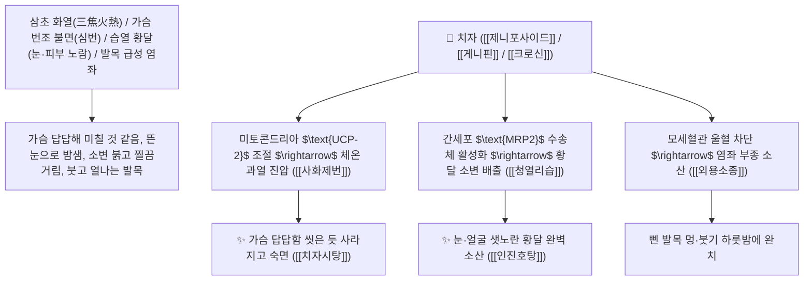

# 🌿 [[치자]] (梔子 / 山梔子, Gardeniae Fructus / 치자나무열매)

> **핵심 요약 (Key Summary)**:
> 꼭두서니과(*Rubiaceae*) 치자나무(*Gardenia jasminoides*)의 건조한 성숙 열매(산치자 山梔子, 볶은 초치자 焦梔子)
> 이리도이드 배당체인 [[제니포사이드]](Geniposide)와 아글리콘 [[게니핀]](Genipin) 및 카로티노이드 [[크로신]](Crocin)이 미토콘드리아 $\text{UCP-2}$를 억제하고 빌리루빈 수송체 $\text{MRP2}$를 활성화하여 사화제번 및 청열리습 작용 발휘
> [[상한론]]의 삼초 실열(가슴이 답답해 잠 못 드는 심번 불면·치자시탕)·습열 황달(인진호탕)·간화 안구 충혈 및 토혈·코피·외용 발목 염좌 타박 멍을 치료하는 천하제일의 [[사화제번]](瀉火除煩)·[[청열리습]](淸熱利濕)·[[량혈해독]](凉血解毒)·[[치자시탕]](梔子豉湯)·[[인진호탕]](茵蔯蒿湯)의 군약(君藥)

---
## 📌 목차
1. [기본 본초 정보 & 화학 구조 (Pharmacognosy)](#1-기본-본초-정보--화학-구조-pharmacognosy)
2. [핵심 분자약리 기전 & 게니핀·UCP-2 조절·빌리루빈 배설 네트워크](#2-핵심-분자약리-기전--게니핀ucp-2-조절빌리루빈-배설-네트워크)
3. [해부생체역학 / 미토콘드리아 전자전달계 & 간 담관 모세혈관 연계](#3-해부생체역학--미토콘드리아-전자전달계--간-담관-모세혈관-연계)
4. [사상의학 및 치자 삼초 사화 vs 소변 배열 특화](#4-사상의학-및-치자-삼초-사화-vs-소변-배열-특화)
5. [상한론 『약징(藥徵)』 분석 및 배오 원리 (치자시탕 & 인진호탕)](#5-상한론-약징藥徵-분석-및-배오-원리-치자시탕--인진호탕)
6. [핵심 처방 비교 매트릭스](#6-핵심-처방-비교-매트릭스)
7. [출처 및 학술 참고 문헌 (References)](#7-출처-및-학술-참고-문헌-references)

---
## 1. 기본 본초 정보 & 화학 구조 (Pharmacognosy)

| 항목 | 상세 내용 |
| :--- | :--- |
| **기원 식물** | 꼭두서니과(Rubiaceae) 치자나무 *Gardenia jasminoides* Ellis의 잘 익은 열매 (산치자 山梔子, 볶은 초치자 焦梔子) |
| **성미 (性味)** | 苦, 大寒 (쓰고 몹시 차가우며 붉은 노란색 천연 색소를 함유함) |
| **귀경 (歸經)** | 心·肺·三焦·肝·膽經 (심경, 폐경, 삼초경, 간경, 담경) - **삼초(三焦)의 모든 불을 꺼서 소변으로 뺌** |
| **효능 (Actions)** | [[사화제번]](瀉火除煩), [[청열리습]](淸熱利濕), [[량혈해독]](凉血解毒), [[외용소종지통]](外用消腫止痛) |
| **주요 성분** | • **이리도이드 배당체(핵심 지표)**: [[제니포사이드]] (Geniposide, KP 규격 $\ge 3.0\%$), 가르데노사이드<br>• **활성 아글리콘**: [[게니핀]] (Genipin, 미토콘드리아 UCP2 억제 및 이담 작용)<br>• **카로티노이드 수용성 황색소**: [[크로신]] (Crocin, 항산화 및 뇌신경 보호), 크로세틴 |

> **[유래 및 본초학적 기전]**:
> * 열매 모양이 옛날 술잔(巵)을 닮아 '치자(梔子)'라 불렸습니다.
> * 삼초(三焦)의 맹렬한 불길을 잡아 소변을 통해 몸 밖으로 완전히 빼내어 **가슴이 터질 듯 답답해 잠을 못 자고 이리저리 뒤척이는 심번(心煩)을 가라앉히는 사화제번(瀉火除煩)의 황제약**입니다.
> * 황달(黃疸)을 씻어내고, 가루 내어 밀가루/계란흰자에 개어 삔 발목(염좌)에 붙이면 멍과 열감이 하룻밤 사이에 빠집니다.

### 🔬 치자의 주요 게니핀 화학 구조 및 UCP-2/미토콘드리아 열 발생 조절
![[체온-20240920074456786.png|450]]
```
     [ 사이클로펜타노피란 이리도이드 골격 ]───COOCH3  <-- 게니핀 (Genipin)
```
> [구조적 특징 및 UCP-2/빌리루빈 배설 메커니즘]: 장내 세균에 의해 제니포사이드에서 유리된 [[게니핀(Genipin)]]은 미토콘드리아의 탈커플링 단백질인 [[UCP-2]](Uncoupling Protein-2)를 억제하여 세포의 열 손실을 방지하고 인슐린 분비를 촉진하며, 간세포의 담즙산 비의존성 이담 작용과 빌리루빈 수송체(MRP2)를 활성화하여 혈중 빌리루빈을 신속히 제거합니다.

---
## 2. 핵심 분자약리 기전 & 게니핀·UCP-2 조절·빌리루빈 배설 네트워크



### (1) 표적 사화제번 및 습열 황달 완치 작용
* **가슴 번조 및 극심한 불면증 완치 ([[치자시탕]] 梔子豉湯)**:
  * 열병 후 가슴이 답답하고 불안하여 침대에서 뒹굴며 잠들지 못하는 심번을 치료합니다.
* **급성 간염 및 습열 황달 해소 ([[인진호탕]] 茵蔯蒿湯)**:
  * 간세포의 담즙 울체를 뚫어 온몸이 귤껍질처럼 노랗게 변한 황달을 치료합니다.
* **발목 염좌 및 타박상 외용 급속 소종**:
  * 치자 가루를 환부에 도포하여 모세혈관 파열과 피멍, 국소 열감을 가라앉힙니다.

---
## 3. 해부생체역학 / 미토콘드리아 전자전달계 & 간 담관 모세혈관 연계

* **간세포 모세담관막 $\text{MRP2}$ 발현 증대**:
  * 결합형 빌리루빈의 담즙 배출 속도를 촉진하여 고빌리루빈혈증을 신속히 교정합니다.

---
## 4. 사상의학 및 치자 삼초 사화 vs 소변 배열 특화

```
[🔍 치자의 삼초(三焦) 사화 포제별 운용]
• 생치자(生梔子): 苦寒, 瀉火利濕 $\rightarrow$ 상초 심열(가슴 번조), 간담 습열 황달
• 초치자(焦梔子, 노랗게 볶음): 苦平, 凉血止血 $\rightarrow$ 중초/하초 혈열 출혈(토혈, 혈뇨, 붕루)
• 치자탄(梔子炭, 까맣게 태움): 止血收斂 $\rightarrow$ 만성 흑변, 자궁 출혈

[⚠️ 복용 주의사항 (Safety)]
• 대변이 무르고 소화력이 약한 비위 허한 환자는 설사를 유발할 수 있으므로 신중 투여
```

---
## 5. 상한론 『약징(藥徵)』 분석 및 배오 원리 (치자시탕 & 인진호탕)

### (1) 가슴의 불과 황달을 끄는 천하제일 2대 황제방
* **사화제번 최고 배오**:
  * [[치자]] + [[향시]](담두시)` $\rightarrow$ 가슴의 열을 끄고 불면증을 다스리는 불후 명방 ([[치자시탕]])
* **습열황달 최고 배오**:
  * [[인진호]] + [[치자]] + [[대황]] $\rightarrow$ 황달을 소변으로 씻어내는 최고 명방 ([[인진호탕]])

---
## 6. 핵심 처방 비교 매트릭스

| 처방명 | 구성 약재 | 주치 병증 및 임상 타깃 | 특징 및 감별점 |
| :--- | :--- | :--- | :--- |
| [[치자시탕]] | [[치자]], [[향시]](담두시) | **발한 토하 후 허번 불면, 심중 오뇌, 가슴 답답함** | 가슴의 불을 끄는 제1 황제방 |
| [[인진호탕]] | [[인진호]], [[치자]], [[대황]] | **양명병 습열 황달, 신황 여귤자색, 소변 불리, 복만** | 황달을 소변과 대변으로 배출 |
| [[황련해독탕]] | [[황련]], [[황금]], [[황백]], [[치자]] | **삼초 실열, 고열 섬어, 심번 불면, 구설생창, 토혈** | 온몸의 화열을 끄는 대표방 |

---
## 7. 출처 및 학술 참고 문헌 (References)

1. **Zhang, C. Y., et al. (2006)**. Genipin inhibits UCP2-mediated proton leak and promotes insulin secretion in pancreatic islet cells. *Cell Metabolism*, 3(6), 417-427. [PMID: 16753577](https://pubmed.ncbi.nlm.nih.gov/16753577/)
   - **[연구 요약]**: 치자의 게니핀 성분이 미토콘드리아 UCP2 탈커플링을 차단하고 세포 에너지 대사 및 담즙 배설을 조절함을 규명.
2. **대한민국약전(KP) 제12개정 (2022)**. 의약품각조 제2부: 치자 (Gardeniae Fructus) 규격 기준.
   - **[공정서 규격]**: 건조 열매 기준 제니포사이드($\text{C}_{17}\text{H}_{24}\text{O}_{10}$) 3.0% 이상 함유 필수 규격 명시.
3. **장중경 (張仲景, 200)**. 『상한론(傷寒論)』: 태양병편 치자시탕 조문.
   - **[고전 원전]**: "發汗吐下後, 虛煩不得眠, 若劇者, 必反覆顚倒, 心中懊憹, 梔子豉湯 主之."
