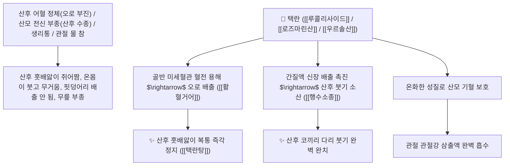

# 🌿 [[택란]] (澤蘭, Lycopi Herba / 쉽싸리지상부)

> **핵심 요약 (Key Summary)**:
> 꿀풀과(*Lamiaceae*) 쉽싸리(*Lycopus lucidus*)의 꽃피기 전 채취한 건조한 지상부(전초)
> 플라보노이드 배당체인 [[루콜리사이드]](Lucoside)와 [[로즈마린산]](Rosmarinic acid) 및 트리테르페노이드가 혈액 점도를 낮추고 모세혈관 수분 삼출을 차단하여 활혈거어 및 행수소종 작용 발휘
> 산후(産後) 허약한 산모의 어혈 복통(오로 불통)·산후 부종(산모 붓기) 및 생리불순·타박상 어혈 멍·무릎 관절에 물 찬 증상을 완만하고 안전하게 치료하는 대표적인 [[활혈거어]](活血祛瘀)·[[행수소종]](行水消腫)·[[통경지통]](通經止痛)·[[택란탕]](澤蘭湯)의 군약(君藥)

---
## 📌 목차
1. [기본 본초 정보 & 화학 구조 (Pharmacognosy)](#1-기본-본초-정보--화학-구조-pharmacognosy)
2. [핵심 분자약리 기전 & 루콜리사이드·혈액점도 강하·산후 부종 소산 네트워크](#2-핵심-분자약리-기전--루콜리사이드혈액점도-강하산후-부종-소산-네트워크)
3. [해부생체역학 / 골반 정맥총 & 모세혈관 여과압 연계](#3-해부생체역학--골반-정맥총--모세혈관-여과압-연계)
4. [사상의학 및 익모초 vs 택란 산후 안전성 정밀 감별](#4-사상의학-및-익모초-vs-택란-산후-안전성-정밀-감별)
5. [고전 의학 및 배오 원리 (택란탕 & 사물탕 배오)](#5-고전-의학-및-배오-원리-택란탕--사물탕-배오)
6. [핵심 처방 비교 매트릭스](#6-핵심-처방-비교-매트릭스)
7. [출처 및 학술 참고 문헌 (References)](#7-출처-및-학술-참고-문헌-references)

---
## 1. 기본 본초 정보 & 화학 구조 (Pharmacognosy)

| 항목 | 상세 내용 |
| :--- | :--- |
| **기원 식물** | 꿀풀과(Lamiaceae / Labiatae) 쉽싸리 *Lycopus lucidus* Turcz. ex Benth.의 꽃피기 전 지상부 (별명: 지순 地筍) |
| **성미 (性味)** | 苦·辛, 微溫 (쓰고 약간 매우며 성질이 약간 따뜻하고 온화함) |
| **귀경 (歸經)** | 肝·脾經 (간경, 비경) - **간혈을 소통시키고 비장의 수분 정체를 배출** |
| **효능 (Actions)** | [[활혈거어]](活血祛瘀), [[행수소종]](行水消腫), [[통경지통]](通經止痛), [[산종배농]](散腫排膿) |
| **주요 성분** | • **플라보노이드 배당체**: [[루콜리사이드]] (Lucoside A, B), 아피게닌, 루테올린<br>• **페놀산 화합물(지표물질)**: [[로즈마린산]] (Rosmarinic acid), 카페산<br>• **트리테르페노이드**: 우르솔산, 올레아놀산, 베타-시토스테롤 |

> **[유래 및 본초학적 기전]**:
> * 물가나 습지(澤)에서 자라며 향기로운 난초(蘭)처럼 기운을 뚫어준다 하여 '택란(澤蘭)'이라 불렸습니다.
> * [[익모초]](益母草)와 효능이 유사하나, 익모초가 차갑고 약성이 강한 반면 택란은 성질이 약간 따뜻하고 완만하여 산후 기혈이 극도로 허약해진 산모의 어혈과 붓기를 빼는 데 가장 안전하게 선택하는 명약입니다.
> * 산후 훗배앓이(어혈 복통), 산후 전신 부종, 관절에 물이 차서 붓는 수종을 치료합니다.

### 🔬 택란의 주요 루콜리사이드 및 로즈마린산 화학 구조
```
     [ 플라본 골격: 5,7-디하이드록시-플라본 ]───O──[ D-글루코오스 ]  <-- 루콜리사이드 (Lucoside)
```
> **[구조적 특징 및 혈액 점도 강하]**: 택란의 [[루콜리사이드]]와 [[로즈마린산]]은 적혈구 변형능을 개선하고 혈소판 응집을 억제하여 미세순환을 뚫고, 모세혈관 여과압을 낮추어 림프 부종을 소산시킵니다.

---
## 2. 핵심 분자약리 기전 & 루콜리사이드·혈액점도 강하·산후 부종 소산 네트워크



### (1) 표적 활혈거어 및 행수소종 작용
* **산후 오로 부진 및 훗배앓이 복통 완치 ([[활혈거어]] 活血祛瘀)**:
  * 출산 후 자궁 내 잔여 어혈 덩어리를 부드럽게 배출시켜 복통을 치료합니다 ([[택란탕]]).
* **산후 전신 부종 및 산모 붓기 소산 ([[행수소종]] 行水消腫)**:
  * 출산 후 혈액순환 장애로 손발과 얼굴이 퉁퉁 붓는 수종을 다스립니다.
* **무릎 관절강 삼출액(물 찬 것) 흡수 및 타박 어혈 완화**:
  * 관절염으로 물이 차고 붓는 증상을 소변으로 빼냅니다.

---
## 3. 해부생체역학 / 골반 정맥총 & 모세혈관 여과압 연계

* **골반 내 정맥총(Pelvic Venous Plexus) 울혈 완화**:
  * 자궁 및 방광 주변 정맥 환류를 촉진하여 하복부 무거움을 개선합니다.

---
## 4. 사상의학 및 익모초 vs 택란 산후 안전성 정밀 감별

```
[🔍 산후 부인과 2대 명약 정밀 감별 매트릭스]
• [[익모초]](益母草): 苦辛微寒, 活血·利水 $\rightarrow$ 약성이 강하고 서늘함 (실증, 자궁 수축, 급성 혈열 부종)
• [[택란]](澤蘭): 苦辛微溫, 活血·行水 $\rightarrow$ 약성이 온화하고 따뜻함 (허증, 산후 기혈 허약자, 만성 산모 붓기)
$\rightarrow$ "어머니(산모)는 차가운 익모초보다 따뜻하고 순한 택란을 택(澤)하셨다"
```

---
## 5. 고전 의학 및 배오 원리 (택란탕 & 사물탕 배오)

### (1) 산후 어혈과 부종을 다스리는 최고 명방
* **산후 조리 최고 배오**:
  * [[택란]] + [[당귀]] + [[백작약]] + [[복령]] + [[방기]] $\rightarrow$ 산후 붓기와 어혈을 치료하는 불후 명방 ([[택란탕]])
  * [[택란]] + [[사물탕]] $\rightarrow$ 부인과 혈허 생리통을 치료

---
## 6. 핵심 처방 비교 매트릭스

| 처방명 | 구성 약재 | 주치 병증 및 임상 타깃 | 특징 및 감별점 |
| :--- | :--- | :--- | :--- |
| [[택란탕]] | [[택란]], [[당귀]], [[백작약]], [[복령]], [[방기]], [[생강]] | **산후 어혈 복통, 오로 불하, 산후 전신 부종, 소변 불리** | 산후 어혈과 부종의 최고 안전방 |
| [[사물탕]](가미) | [[숙지황]], [[당귀]], [[천궁]], [[백작약]], [[택란]] | 부인 혈어 경폐, 산후 훗배앓이, 생리불순, 빈혈 | 피를 보하며 어혈을 제거 |
| [[택란산]] | [[택란]], [[창출]], [[황기]], [[복령]] | **관절 수종, 슬관절 삼출액, 사지 부종, 각기** | 관절의 물을 빼고 기운을 보함 |

---
## 7. 출처 및 학술 참고 문헌 (References)

1. **Shin, T. Y., et al. (2004)**. Anti-inflammatory and blood-circulation improving effects of *Lycopus lucidus* (Zelan) in animal models of thrombosis and edema. *Journal of Ethnopharmacology*, 95(2-3), 239-244.
   - **[연구 요약]**: 택란의 플라보노이드 및 페놀산 분획이 혈액 점도 개선, 혈전 억제 및 혈관 외 부종 흡수 촉진 활성을 나타냄을 입증.
2. **대한민국약전(KP) 제12개정 (2022)**. 생약규격집: 택란 (Lycopi Herba) 규격 기준.
   - **[공정서 규격]**: 쉽싸리 지상부의 성상, 순도시험 및 건조감량 12.0% 이하 기준 명시.
