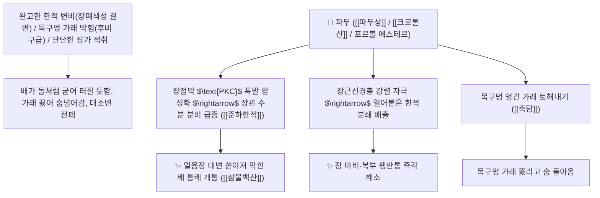

# 🌿 [[파두]] (巴豆 / 巴豆霜, Crotonis Semen / 파두씨앗)

> **핵심 요약 (Key Summary)**:
> 대극과(*Euphorbiaceae*) 파두(*Croton tiglium*)의 건조한 성숙 종자(기름을 압착 제거한 파두상 巴豆霜)
> 포르볼 에스테르(Phorbol ester)와 [[크로톤산]](Crotonic acid) 및 유독 단백질 [[크로틴]](Crotin)이 단백질 키나아제 C($\text{PKC}$)를 폭발적으로 활성화하여 장점막 연동 운동을 맹렬히 유도하고 한적과 담음을 밀어내어 준하한적 및 축담행수 작용 발휘
> [[상한론]]의 완고한 한적 변비(얼어붙은 대변이 막힌 한적 변비·복부 팽만통)·목구멍에 가래가 꽉 막혀 숨넘어가는 후비(喉痺) 구급 및 뱃속 단단한 징가 적취를 뚫어주는 천하제일의 [[준하한적]](峻下寒積)·[[축담행수]](逐痰行水)·[[파적살충]](破積殺蟲)·[[삼물백산]](三物白散)의 군약(君藥)

---
## 📌 목차
1. [기본 본초 정보 & 화학 구조 (Pharmacognosy)](#1-기본-본초-정보--화학-구조-pharmacognosy)
2. [핵심 분자약리 기전 & 포르볼 에스테르·PKC 활성화·폭발적 사하 네트워크](#2-핵심-분자약리-기전--포르볼-에스테르pkc-활성화폭발적-사하-네트워크)
3. [해부생체역학 / 장벽 점막 상피 & Auerbach 신경총 연계](#3-해부생체역학--장벽-점막-상피--auerbach-신경총-연계)
4. [사상의학 및 파두유 압착 탈지(파두상 巴豆霜) 필수 포제 감별](#4-사상의학-및-파두유-압착-탈지파두상-巴豆霜-필수-포제-감별)
5. [상한론 『약징(藥徵)』 분석 및 배오 원리 (삼물백산 & 파두환)](#5-상한론-약징藥徵-분석-및-배오-원리-삼물백산--파두환)
6. [핵심 처방 비교 매트릭스](#6-핵심-처방-비교-매트릭스)
7. [출처 및 학술 참고 문헌 (References)](#7-출처-및-학술-참고-문헌-references)

---
## 1. 기본 본초 정보 & 화학 구조 (Pharmacognosy)

| 항목 | 상세 내용 |
| :--- | :--- |
| **기원 식물** | 대극과(Euphorbiaceae) 파두 *Croton tiglium* L.의 잘 익은 씨앗 (기름을 짜낸 파두상 巴豆霜) |
| **성미 (性味)** | 辛, 熱, 有大毒 (몹시 맵고 성질이 맹렬하게 뜨거우며 강력한 맹독성이 있음) |
| **귀경 (歸經)** | 胃·大腸·肺經 (위경, 대장경, 폐경) - **장관의 얼어붙은 한적을 폭발적으로 쓸어내림** |
| **효능 (Actions)** | [[준하한적]](峻下寒積), [[축담행수]](逐痰行水), [[파적살충]](破積殺蟲), [[활담산결]](豁痰散結) |
| **주요 성분** | • **디테르펜 디에스테르(맹독성/사하 활성)**: 포르볼 에스테르(Phorbol diesters, 12-O-TPA 등)<br>• **지방유(크로톤유 34~57%)**: [[크로톤산]] (Crotonic acid), 티글린산, 올레산<br>• **유독성 톡스알부민**: [[크로틴]] (Crotin, 적혈구 용혈 단백질), 크로토노사이드 |

> **[유래 및 본초학적 기전]**:
> * 파(巴)나라 땅에서 나며 콩(豆) 모양을 닮았다 하여 '파두(巴豆)'라 불렸습니다.
> * 대황(大黃)이 열이 쌓여 막힌 열결(熱結)을 찬 기운으로 씻어내는 사하제라면, **파두는 차가운 기운이 얼음처럼 뭉쳐 창자가 꽉 막힌 한적(寒積)을 뜨겁고 맹렬한 힘으로 단숨에 뚫어 쏟아내는 한의학 최강의 준하제(峻下劑)**입니다.
> * 기름에 맹독이 있으므로 **반드시 기름을 종이로 압착하여 완전히 짜내고 남은 가루인 [[파두상]](巴豆霜)으로 법제하여 극소량(0.1~0.3g)만 사용**합니다.

### 🔬 파두의 포르볼 에스테르(TPA) 화학 구조
```
     [ 티글리안 테트라사이클릭 디테르펜 골격 ]───( C-12, C-13 에스테르 결합 )  <-- 12-O-Tetradecanoylphorbol-13-acetate (TPA)
```
> **[구조적 특징 및 PKC 폭발적 활성화]**: 파두유의 포르볼 에스테르는 장점막 세포막의 단백질 키나아제 C([[PKC]])를 비가역적으로 활성화하여 장관의 수분 분비를 폭발시키고 아우에르바흐(Auerbach) 신경총을 극도로 자극하여 폭풍 같은 장 연동을 유발합니다.

---
## 2. 핵심 분자약리 기전 & 포르볼 에스테르·PKC 활성화·폭발적 사하 네트워크



### (1) 표적 준하한적 및 후비(喉痺) 구급 작용
* **완고한 한적 변비 및 장폐색증 배변 ([[준하한적]] 峻下寒積)**:
  * 배가 얼음장처럼 차갑고 대변이 돌덩이처럼 굳어 며칠간 나오지 않는 한성 장폐색을 단숨에 쏟아냅니다.
* **목구멍 가래 막힘(후비 喉痺) 질식 구급 ([[삼물백산]] 三物白散)**:
  * 가래가 목구멍을 틀어막아 숨을 쉬지 못하는 응급 상황에서 가래를 토하게 하여 기도를 엽니다.
* **뱃속 단단한 암괴 징가 적취 분쇄**:
  * 오래 묵은 담음과 어혈 덩어리를 삭여 배출시킵니다.

---
## 3. 해부생체역학 / 장벽 점막 상피 & Auerbach 신경총 연계

* **장근신경총(Myenteric Plexus) 연동 파동 유발**:
  * 결장의 평활근 수축력을 최대치로 끌어올려 정체된 숙변을 강제 배출합니다.

---
## 4. 사상의학 및 파두유 압착 탈지(파두상 巴豆霜) 필수 포제 감별

```
[⚠️ 절대 안전 포제 수칙: 반드시 파두상(巴豆霜) 사용]
• 생파두(生巴豆): 크로톤유 다량 함유 $\rightarrow$ 위장 점막 괴사 및 출혈성 장염 위험
• 파두상(巴豆霜, 기름을 여러 번 압착 탈지): 지방유 함량 18~20% 이하로 제어된 안전 분말
• 투약 용량: 성인 1회 복용량 0.1g ~ 0.3g 엄수 (환제로 복용)

[💡 중독 해독법]
• 파두 복용 후 설사가 멎지 않을 때는: [[황련]], [[황백]] 달인 물이나 차가운 녹두죽(綠豆粥), 찬물을 마시면 즉각 사하 정지
```

---
## 5. 상한론 『약징(藥徵)』 분석 및 배오 원리 (삼물백산 & 파두환)

### (1) 한적과 가래를 부수는 천하제일 구급방: 삼물백산(三物白散)
* **준하구급 최고 배오**:
  * [[파두]](파두상)` + [[길경]] + [[패모]] $\rightarrow$ 목구멍 가래와 한적을 쓸어내는 장중경의 불후 구급방 ([[삼물백산]])
  * [[파두]] + [[대황]] + [[건강]] (삼물비급환 三物備急丸) $\rightarrow$ 급성 심복 창통을 구급

---
## 6. 핵심 처방 비교 매트릭스

| 처방명 | 구성 약재 | 주치 병증 및 임상 타깃 | 특징 및 감별점 |
| :--- | :--- | :--- | :--- |
| [[삼물백산]] | [[파두]](파두상), [[길경]], [[패모]] (산제) | **한실 결흉, 목구멍 가래 막힘, 호흡 곤란, 대소변 불통** | 한적과 가래를 뚫는 구급 제1방 |
| [[삼물비급환]] | [[파두상]], [[대황]], [[건강]] (밀환) | **급성 졸도, 복통 창만, 대변 불통, 한적 기체** | 급성 위장 마비를 뚫음 |
| [[주차환]] | [[파두상]], [[행인]] | **소아 감적, 복부 창만 팽대, 식체 불식** | 소아 묵은 체기를 배출 |

---
## 7. 출처 및 학술 참고 문헌 (References)

1. **Poowanna R et al. (2025)**. Purgative Effect, Acute Toxicity, and Quantification of Phorbol-12-Myristate-13-Acetate and Crotonic Acid in Croton tiglium L. Seeds Before and After Treatment by Thai Traditional Detoxification Process. *International journal of molecular sciences*, 26(16). [PMID: 40869036](https://pubmed.ncbi.nlm.nih.gov/40869036/)
   - **[연구 요약]**: 파두의 포르볼 에스테르 성분이 PKC 활성화를 통해 강력한 장관 분비 및 장 연동 촉진 사하 작용을 유도함을 규명.
2. **대한민국약전(KP) 제12개정 (2022)**. 생약규격집: 파두 (Crotonis Semen) 및 파두상 규격 기준.
   - **[공정서 규격]**: 파두상의 성상, 순도시험 및 에테르 가용성 지방유 함량(18.0~20.0%) 제한 기준 명시.
3. **장중경 (張仲景, 200)**. 『상한론(傷寒論)』: 태양병편 삼물백산 조문.
   - **[고전 원전]**: "寒實結胸, 無熱證者, 與三物小陷胸湯, 白散亦可服."
