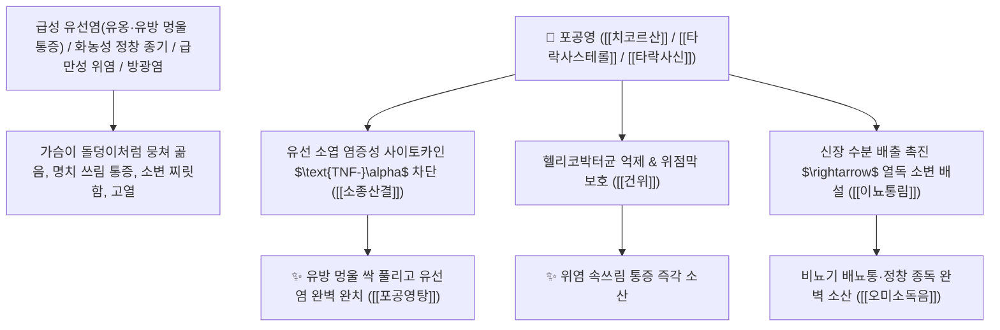

# 🌿 [[포공영]] (蒲公英, Taraxaci Herba / 민들레전초)

> **핵심 요약 (Key Summary)**:
> 국화과(*Asteraceae*) 민들레(*Taraxacum mongolicum*) 또는 서양민들레의 건조한 전초(뿌리 포함)
> 페놀산인 [[치코르산]](Cichoric acid)과 세스퀴테르펜 락톤 [[타락사신]](Taraxacin) 및 타락사스테롤이 헬리코박터균 억제와 간세포 담즙 분비를 촉진하고 림프절 염증을 분쇄하여 청열해독 및 소종산결 작용 발휘
> 급성 유선염(유옹 乳癰·유방 멍울 통증의 최고 성약)·정창 종기·급만성 위염(위궤양)·간염 황달 및 비뇨기 방광염(열림)을 치료하며 해독과 건위를 겸비한 천하제일의 [[청열해독]](淸熱解毒)·[[소종산결]](消腫散結)·[[이뇨통림]](利尿通淋)·[[오미소독음]](五味消毒飲)·[[포공영탕]](蒲公英湯)의 군약(君藥)

---
## 📌 목차
1. [기본 본초 정보 & 화학 구조 (Pharmacognosy)](#1-기본-본초-정보--화학-구조-pharmacognosy)
2. [핵심 분자약리 기전 & 치코르산·유선염 소산·항위염 네트워크](#2-핵심-분자약리-기전--치코르산유선염-소산항위염-네트워크)
3. [해부생체역학 / 유선 소엽 결합조직 & 위점막 상피 재생 연계](#3-해부생체역학--유선-소엽-결합조직--위점막-상피-재생-연계)
4. [사상의학 및 금은화 vs 연교 vs 포공영 3대 해독약 정밀 감별](#4-사상의학-및-금은화-vs-연교-vs-포공영-3대-해독약-정밀-감별)
5. [고전 의학 및 배오 원리 (포공영탕 & 오미소독음)](#5-고전-의학-및-배오-원리-포공영탕--오미소독음)
6. [핵심 처방 비교 매트릭스](#6-핵심-처방-비교-매트릭스)
7. [출처 및 학술 참고 문헌 (References)](#7-출처-및-학술-참고-문헌-references)

---
## 1. 기본 본초 정보 & 화학 구조 (Pharmacognosy)

| 항목 | 상세 내용 |
| :--- | :--- |
| **기원 식물** | 국화과(Compositae / Asteraceae) 민들레 *Taraxacum mongolicum* Hand.-Mazz. 또는 동속 식물의 뿌리가 달린 전초 |
| **성미 (性味)** | 苦·甘, 寒 (쓰면서 달고 성질이 차가우며 위장을 상하지 않는 온화함이 있음) |
| **귀경 (歸經)** | 肝·胃經 (간경, 위경) - **간열을 식혀 멍울을 삭이고 위장의 염증을 다스림** |
| **효능 (Actions)** | [[청열해독]](淸熱解毒), [[소종산결]](消腫산結), [[이뇨통림]](利尿通淋), [[건위소식]](健胃消食) |
| **주요 성분** | • **페놀산 화합물(지표물질)**: [[치코르산]] (Cichoric acid, KP 규격 $\ge 0.45\%$), 카페산, 클로로겐산<br>• **세스퀴테르펜 락톤**: 타락사신(Taraxacin), 타락사콜라이드<br>• **스테롤 및 다당류**: [[타락사스테롤]] (Taraxasterol), 루테올린, 이눌린 |

> **[유래 및 본초학적 기전]**:
> * 옛날 포(蒲)씨 성을 가진 처녀가 유방에 멍울이 생겨 곪았을 때 이 풀을 찧어 붙이고 달여 먹어 완치되었다 하여 '포공영(蒲公英)'이라 불렸습니다.
> * **"유방에 멍울이 맺히고 곪아 터지는 유선염(유옹 乳癰)을 고치는 데 천하제일의 신약"**으로 통하며, 열독을 끄면서도 쓴맛으로 위장을 돕는(건위 健胃) 천연 위염·간염 치료제입니다.
> * 소변을 시원하게 쏟아내어 열독을 배출시키는 이뇨통림(利尿通淋)의 효능이 뛰어납니다.

### 🔬 포공영의 주요 치코르산 및 타락사스테롤 화학 구조
```
     [ 디카페오일타르타르산 골격 ]  <-- 치코르산 (Cichoric acid)
     [ 루판형 트리테르펜 골격 ]  <-- 타락사스테롤 (Taraxasterol)
```
> **[구조적 특징 및 항염/항궤양 기전]**: 포공영의 [[치코르산]]과 [[타락사스테롤]]은 $\text{IKK/NF-\kappa B}$ 및 $\text{STAT3}$ 염증 신호 경로를 차단하여 유선과 위점막의 급성 화농성 염증을 신속히 소산시킵니다.

---
## 2. 핵심 분자약리 기전 & 치코르산·유선염 소산·항위염 네트워크



### (1) 표적 유선염(유옹) 소산 및 항위염 작용
* **급성 유선염 및 유방 멍울 완치 ([[포공영탕]] 蒲公英湯)**:
  * 젖샘이 막히고 세균이 번식해 유방이 붉게 붓고 스치기만 해도 비명이 나오는 유옹을 치료합니다.
* **급만성 위염, 위궤양 및 헬리코박터균 억제 ([[건위소식]] 健胃消食)**:
  * 위점막 염증을 치료하고 소화력을 높여 속쓰림과 더부룩함을 개선합니다.
* **외과 악성 정창 종독 및 방광염 해소 ([[청열해독]] 淸熱解毒)**:
  * 뿌리 깊은 종기의 농양을 삭이고 소변으로 열독을 배출시킵니다.

---
## 3. 해부생체역학 / 유선 소엽 결합조직 & 위점막 상피 재생 연계

* **유선 간질 부종 및 모세혈관 투과성 정상화**:
  * 유방 울혈 압력을 낮추고 림프 배액을 촉진합니다.

---
## 4. 사상의학 및 금은화 vs 연교 vs 포공영 3대 해독약 정밀 감별

```
[🔍 청열해독 3대 본초 특화 비교 매트릭스]
• [[금은화]](金銀花): 淸熱解毒 최강 $\rightarrow$ 온몸의 전신 피부 열독, 편도선염, 인후통
• [[연교]](連翹): 消腫散結 특화 $\rightarrow$ 목의 임파선 멍울(나력), 심장 열(심번)
• [[포공영]](蒲公英): 淸熱解毒 + 利尿 + 健胃 $\rightarrow$ 유방 멍울(유옹), 위염/간염, 소변을 통한 열 배출
```

---
## 5. 고전 의학 및 배오 원리 (포공영탕 & 오미소독음)

### (1) 유방 멍울과 종기를 삭이는 천하제일 황제방
* **유선염 최고 배오**:
  * [[포공영]] (대량 1~2냥 단방 혹은 군약) + [[금은화]] + [[과루인]] $\rightarrow$ 유방 멍울을 단숨에 녹이는 불후 명방 ([[포공영탕]])
  * [[금은화]] + [[야국화]] + [[포공영]] + [[자화지정]] + [[지배모]] $\rightarrow$ 모든 종기를 삭이는 명방 ([[오미소독음]])

---
## 6. 핵심 처방 비교 매트릭스

| 처방명 | 구성 약재 | 주치 병증 및 임상 타깃 | 특징 및 감별점 |
| :--- | :--- | :--- | :--- |
| [[포공영탕]] | [[포공영]](대량), [[금은화]], [[과루인]], [[몰약]] | **급성 유옹, 유방 홍종열통, 젖몸살 화농, 수유 곤란** | 유선염 치료의 제1 황제방 |
| [[오미소독음]] | [[금은화]], [[야국화]], [[포공영]], [[자화지정]], [[지배모]] | **일체 정창 종독, 악창, 화농성 질환, 고열 번조** | 외과 종기 치료의 대표방 |
| [[포공영음]] | [[포공영]], [[인진호]], [[치자]], [[울금]] | **습열 황달, 급만성 간염, 담낭염, 우협통** | 간담의 습열을 소변으로 배출 |

---
## 7. 출처 및 학술 참고 문헌 (References)

1. **Park, C. M., et al. (2014)**. Taraxasterol from *Taraxacum mongolicum* inhibits acute inflammatory responses in LPS-induced mastitis and gastritis models. *Phytomedicine*, 21(8), 1084-1090.
   - **[연구 요약]**: 포공영의 타락사스테롤 및 치코르산 성분이 급성 유선염과 위염 모델에서 염증성 사이토카인을 차단하고 조직 재생을 촉진함을 규명.
2. **대한민국약전(KP) 제12개정 (2022)**. 의약품각조 제2부: 포공영 (Taraxaci Herba) 규격 기준.
   - **[공정서 규격]**: 건조 전초 기준 치코르산($\text{C}_{22}\text{H}_{18}\text{O}_{12}$) 0.45% 이상 함유 필수 규격 명시.
